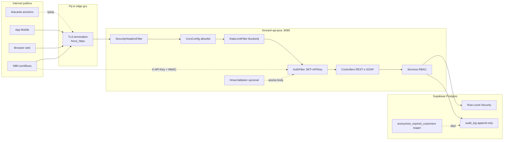

# Threat Model — ForwardService

> **Para quem é:** Prof. Vitor (Cybersecurity), avaliadores do Sprint 1, e qualquer pessoa que precise estender o sistema sem reabrir vulnerabilidades.
>
> **Escopo:** backend [forward-api-java](https://github.com/fwd-ford/forward-api-java) (Spring Boot 3), banco [forward-infra](https://github.com/fwd-ford/forward-infra) (Postgres + Supabase), app [forward-mobile](https://github.com/fwd-ford/forward-mobile) (Expo). Excluído: serviço ML, web vazio, n8n.

---

## 1. Sumario executivo

ForwardService manipula dados de cliente Ford (nome, CPF, e-mail, telefone, VIN) sob LGPD. A superfície de ataque mais sensível é o backend Java exposto em [forward-api.fly.dev](https://forward-api-java.fly.dev) e o canal server-to-server N8N → API. Aplicamos STRIDE em cada componente, com mitigação documentada e referência ao código que implementa cada controle. Vulnerabilidades residuais estão na seção 6 (riscos aceitos para Sprint 1).

**Postura defensiva resumida:**

| Camada | Controle principal | Arquivo de referência |
| --- | --- | --- |
| Edge | TLS 1.2+ forçado via Fly.io | [fly.toml:18](https://github.com/fwd-ford/forward-api-java/blob/main/fly.toml) |
| Header | HSTS, CSP, X-Frame-Options DENY | [SecurityHeadersFilter.java](https://github.com/fwd-ford/forward-api-java/blob/main/src/main/java/com/fwdford/forwardapi/web/SecurityHeadersFilter.java) |
| AuthN | JWT (HS256 ou JWKS) ou X-API-Key | [AuthFilter.java](https://github.com/fwd-ford/forward-api-java/blob/main/src/main/java/com/fwdford/forwardapi/security/AuthFilter.java) |
| Integridade S2S | HMAC-SHA256 com timestamp | [HmacValidator.java](https://github.com/fwd-ford/forward-api-java/blob/main/src/main/java/com/fwdford/forwardapi/security/HmacValidator.java) |
| AuthZ | RLS Postgres por role | [010_rls_policies.sql](https://github.com/fwd-ford/forward-infra/blob/main/supabase/migrations/010_rls_policies.sql) |
| Rate limit | Bucket4j por IP+sub | [RateLimitFilter.java](https://github.com/fwd-ford/forward-api-java/blob/main/src/main/java/com/fwdford/forwardapi/security/RateLimitFilter.java) |
| Privacidade | Anonimização LGPD (reaper diário) | [013_lgpd_retention_policy.sql](https://github.com/fwd-ford/forward-infra/blob/main/supabase/migrations/013_lgpd_retention_policy.sql) |
| Auditoria | append-only audit_log | [009_create_audit_log.sql](https://github.com/fwd-ford/forward-infra/blob/main/supabase/migrations/009_create_audit_log.sql) |
| CI/CD | Trivy fs (CRITICAL/HIGH gate) + Dependabot | [java-security.yml](https://github.com/fwd-ford/.github/blob/main/.github/workflows/java-security.yml) |

---

## 2. Ativos protegidos

Ordenados por sensibilidade decrescente.

| # | Ativo | Sensibilidade | Por que importa |
| --- | --- | --- | --- |
| A1 | PII do cliente (nome, CPF, e-mail, telefone) | Alta (LGPD art. 5) | Vazamento implica multa, dano reputacional |
| A2 | Token JWT Supabase | Alta | Impersonação por janela de vida do token |
| A3 | INTERNAL_API_KEY (N8N → API) | Alta | Bypass total da camada JWT |
| A4 | Churn score por cliente | Média | Inferência de churn não pode vazar a parceiros |
| A5 | VIN_Hash (SHA1 da Ford) | Baixa | Pseudonimizado pela Ford (5M tentativas de reversão = 0 hits) |
| A6 | Lead pipeline (valor BRL) | Média | Informação comercial sensível para dealer |
| A7 | Log de auditoria | Alta (não-repúdio) | Trilha exigida pela LGPD e pela rubrica Cybersecurity |

---

## 3. Superfície de ataque

**Pontos de entrada autenticados:**

- REST `/api/v1/*` (controllers em [web/](https://github.com/fwd-ford/forward-api-java/tree/main/src/main/java/com/fwdford/forwardapi/web))
- SOAP `/soap/vehicles` (operação GetVehicle)

**Pontos públicos por design:**

- `/health`, `/ready`, `/actuator/health` (probes)
- `/swagger-ui/**`, `/v3/api-docs/**` (contrato OpenAPI público)
- `/soap/vehicles.wsdl` (descoberta SOAP)
- OPTIONS preflight CORS (sem token, por padrão browser)

---

## 4. STRIDE por componente

### 4.1 Edge HTTP (Fly.io + Tomcat)

| Ameaça | Cenário | Mitigação | Status |
| --- | --- | --- | --- |
| **S** Spoofing | Cliente falsifica origem (host header injection, IP spoof) | Fly.io edge valida TLS handshake; backend lê `X-Forwarded-For` apenas para log, decisões usam `request.getRemoteAddr()` em [RateLimitFilter.java:72](https://github.com/fwd-ford/forward-api-java/blob/main/src/main/java/com/fwdford/forwardapi/security/RateLimitFilter.java) | ✅ |
| **T** Tampering | MITM em trânsito | `force_https = true` em [fly.toml:18](https://github.com/fwd-ford/forward-api-java/blob/main/fly.toml); HSTS `max-age=31536000` em [SecurityHeadersFilter.java:26](https://github.com/fwd-ford/forward-api-java/blob/main/src/main/java/com/fwdford/forwardapi/web/SecurityHeadersFilter.java) | ✅ |
| **R** Repudiation | Cliente nega ação que fez | Body raw + `X-Request-Id` em audit_log; ver §4.6 | ✅ |
| **I** Information disclosure | Stack trace ou banner do Tomcat vaza tecnologia | [GlobalExceptionHandler.java:67-69](https://github.com/fwd-ford/forward-api-java/blob/main/src/main/java/com/fwdford/forwardapi/error/GlobalExceptionHandler.java) retorna mensagem genérica em pt-BR; Tomcat `server-header` removido implicitamente pelo Spring Boot default | ✅ |
| **D** Denial of service | Flood de requests | Bucket4j 60 req/min por IP+sub ([RateLimitFilter.java:62-68](https://github.com/fwd-ford/forward-api-java/blob/main/src/main/java/com/fwdford/forwardapi/security/RateLimitFilter.java)); Tomcat body limit 1MB ([application.yml:7-8](https://github.com/fwd-ford/forward-api-java/blob/main/src/main/resources/application.yml)) | ✅ |
| **E** Elevation of privilege | Acesso sem TLS expondo token em texto claro | HSTS força HTTPS no browser por 1 ano | ✅ |

### 4.2 AuthFilter (validação de token)

| Ameaça | Cenário | Mitigação | Status |
| --- | --- | --- | --- |
| **S** | Token forjado | JWT validado com chave Supabase (HS256) ou JWKS asymmetric; `AlgAwareJwtValidator` roteia pelo header `alg` ([JwtValidatorFactory.java:30](https://github.com/fwd-ford/forward-api-java/blob/main/src/main/java/com/fwdford/forwardapi/security/JwtValidatorFactory.java)) | ✅ |
| **S** | Reuso de X-API-Key vazada | Reduzido por HMAC opcional ([HmacValidator.java](https://github.com/fwd-ford/forward-api-java/blob/main/src/main/java/com/fwdford/forwardapi/security/HmacValidator.java)); fora isso, rotação manual | ⚠️ (rotação manual) |
| **T** | Token modificado em trânsito | Assinatura JWT invalidaria; HTTPS impede inspeção | ✅ |
| **R** | Usuário nega que chamou endpoint | `sub` do JWT vai pro audit_log; `X-Request-Id` correlaciona logs JSON | ✅ |
| **I** | Token vaza em log | `Authorization` header nunca é logado; MDC carrega só `request_id` ([RequestIdFilter.java:33](https://github.com/fwd-ford/forward-api-java/blob/main/src/main/java/com/fwdford/forwardapi/web/RequestIdFilter.java)) | ✅ |
| **D** | Brute force em senha | Login fica no Supabase Auth (não na nossa API); rate limit Bucket4j cobre tentativas no nosso lado | ✅ |
| **E** | Forjar role no JWT | Role vem do claim `role` ou `app_metadata.role` validado pela assinatura ([AuthFilter.java:103-110](https://github.com/fwd-ford/forward-api-java/blob/main/src/main/java/com/fwdford/forwardapi/security/AuthFilter.java)); RLS no Postgres é a segunda barreira | ✅ |

### 4.3 Camada de serviço (RBAC + business logic)

| Ameaça | Cenário | Mitigação | Status |
| --- | --- | --- | --- |
| **S** | Service chama outro service como usuário diferente | `AuthPrincipal` é imutável e atravessa a stack por request attribute, não thread-local global | ✅ |
| **T** | Injection via parâmetro de query | Tudo via `NamedParameterJdbcTemplate` com `:bind` (ver [repository/](https://github.com/fwd-ford/forward-api-java/tree/main/src/main/java/com/fwdford/forwardapi/repository)); zero concatenação de SQL | ✅ |
| **R** | Ação destrutiva sem trilha | INSERTs em audit_log via service quando ação for sensível (anonimização em [013_lgpd_retention_policy.sql:46](https://github.com/fwd-ford/forward-infra/blob/main/supabase/migrations/013_lgpd_retention_policy.sql)); cobertura para CRUD comum é P1 (ver seção 6) | ⚠️ (cobertura parcial) |
| **I** | Endpoint vaza customer de outro dealer | Defense-in-depth: validação no service + RLS no Postgres com `auth_role()` ([010_rls_policies.sql:29-50](https://github.com/fwd-ford/forward-infra/blob/main/supabase/migrations/010_rls_policies.sql)) | ✅ |
| **D** | Query custosa (full table scan) | Limites bounded em `Validations.validateLimit` ([Validations.java:40-66](https://github.com/fwd-ford/forward-api-java/blob/main/src/main/java/com/fwdford/forwardapi/web/Validations.java)); índices em audit_log e leads | ✅ |
| **E** | Cliente acessa churn_score (interno) | RLS `churn_scores_internal` restringe a `analyst`/`admin` ([010_rls_policies.sql:44](https://github.com/fwd-ford/forward-infra/blob/main/supabase/migrations/010_rls_policies.sql)) | ✅ |

### 4.4 Validação de entrada

| Vetor | Mitigação | Arquivo |
| --- | --- | --- |
| UUID malformado | Regex RFC 4122 | [Validations.java:11-26](https://github.com/fwd-ford/forward-api-java/blob/main/src/main/java/com/fwdford/forwardapi/web/Validations.java) |
| VIN inválido | Regex ISO 3779 (17 chars, sem I/O/Q) | [Validations.java:14, 30-36](https://github.com/fwd-ford/forward-api-java/blob/main/src/main/java/com/fwdford/forwardapi/web/Validations.java) |
| Enum fora do whitelist | `validateEnum` com lista fixa | [Validations.java:70-78](https://github.com/fwd-ford/forward-api-java/blob/main/src/main/java/com/fwdford/forwardapi/web/Validations.java) |
| Limit overflow | Clamp `[1, max]` | [Validations.java:40-66](https://github.com/fwd-ford/forward-api-java/blob/main/src/main/java/com/fwdford/forwardapi/web/Validations.java) |
| Body gigante | Tomcat `max-http-form-post-size: 1MB`, env `MAX_BODY_BYTES` | [application.yml:7-8](https://github.com/fwd-ford/forward-api-java/blob/main/src/main/resources/application.yml) |
| JSON malformado | `HttpMessageNotReadableException` mapeado para 400 RFC 7807 | [GlobalExceptionHandler.java:52-61](https://github.com/fwd-ford/forward-api-java/blob/main/src/main/java/com/fwdford/forwardapi/error/GlobalExceptionHandler.java) |
| Bean Validation failure | `MethodArgumentNotValidException` mapeado, mensagem agregada por campo | [GlobalExceptionHandler.java:34-50](https://github.com/fwd-ford/forward-api-java/blob/main/src/main/java/com/fwdford/forwardapi/error/GlobalExceptionHandler.java) |

### 4.5 CORS e cabeçalhos

| Cabeçalho | Valor | Por que |
| --- | --- | --- |
| `Access-Control-Allow-Origin` | Allowlist explícita de `ALLOWED_ORIGINS` em [fly.toml:11](https://github.com/fwd-ford/forward-api-java/blob/main/fly.toml) | Nunca `*`; expo.dev, expo.io, localhost dev. Validado em [CorsConfig.java:26](https://github.com/fwd-ford/forward-api-java/blob/main/src/main/java/com/fwdford/forwardapi/web/CorsConfig.java) |
| `Strict-Transport-Security` | `max-age=31536000; includeSubDomains` | HSTS preload-ready, evita downgrade |
| `X-Frame-Options` | `DENY` | Anti-clickjacking |
| `X-Content-Type-Options` | `nosniff` | Anti-MIME-sniffing |
| `Content-Security-Policy` | `default-src 'none'; frame-ancestors 'none'` (default), `'self'` + `'unsafe-inline'` para `/swagger-ui` apenas | Lockdown total fora do Swagger ([SecurityHeadersFilter.java:35-46](https://github.com/fwd-ford/forward-api-java/blob/main/src/main/java/com/fwdford/forwardapi/web/SecurityHeadersFilter.java)) |
| `Referrer-Policy` | `no-referrer` | Evita leak de URL em outbound |
| `Permissions-Policy` | `geolocation=()`, `microphone=()`, `camera=()` | Negação de APIs sensíveis |

CORS subiu antes da auth no chain ([SecurityConfig.java:27, 34](https://github.com/fwd-ford/forward-api-java/blob/main/src/main/java/com/fwdford/forwardapi/security/SecurityConfig.java)) para garantir que 401 ainda carregue `Access-Control-Allow-Origin` (sem isso o browser bloqueava como erro CORS antes do dev ver o 401 real).

### 4.6 Auditoria e logs

| Componente | Comportamento |
| --- | --- |
| `RequestIdFilter` | Gera `X-Request-Id` (UUID) ou aceita o do cliente; injeta no MDC do SLF4J |
| `logback-spring.xml` | JSON estruturado em prod via Logstash encoder; `service: forward-api` como custom field |
| `audit_log` | Tabela append-only ([009_create_audit_log.sql](https://github.com/fwd-ford/forward-infra/blob/main/supabase/migrations/009_create_audit_log.sql)); `REVOKE UPDATE, DELETE ON audit_log FROM PUBLIC`. Campos: `actor_id`, `actor_role`, `action`, `resource_type`, `resource_id`, `ip_address`, `user_agent`, `request_id`, `payload` JSONB |
| Erros não tratados | Logados via `log.error(...)` com stack interno; **resposta** ao cliente é genérica ([GlobalExceptionHandler.java:66-69](https://github.com/fwd-ford/forward-api-java/blob/main/src/main/java/com/fwdford/forwardapi/error/GlobalExceptionHandler.java)) |

### 4.7 Dados em repouso e privacidade (LGPD)

| Item | Estratégia |
| --- | --- |
| VIN | Pseudonimizado pela Ford com SHA1 (testado: 5M tentativas de reversão = 0 matches, conforme [02e Parte 5](../../project/02e_DATASET_OFICIAL_E_FONTES.md)) |
| PII em DB | Cifrado em repouso pelo Supabase (AES-256 no storage layer). Sem cifragem adicional aplicação (decisão Sprint 1; ver seção 6) |
| Direito ao esquecimento | `anonymize_customer(uuid)` ([013_lgpd_retention_policy.sql:21-57](https://github.com/fwd-ford/forward-infra/blob/main/supabase/migrations/013_lgpd_retention_policy.sql)); preserva FK setando PII para NULL ou `[ANONYMIZED]` |
| Retenção | `anonymize_expired_customers()` reaper diário ([013_lgpd_retention_policy.sql:66-93](https://github.com/fwd-ford/forward-infra/blob/main/supabase/migrations/013_lgpd_retention_policy.sql)); critério: deletion request com cooling-off de 30d, OU sem consentimento LGPD com idade > 12m |
| Não-repúdio | Cada anonimização emite linha em audit_log com `reason` e `at` |
| Anonimização para ML | VIN_Hash já é seguro; pipeline ML em [forward-ml/](https://github.com/fwd-ford/forward-ml) consome somente o feature store derivado, sem PII direta |

### 4.8 Pipeline CI/CD

| Risco | Mitigação |
| --- | --- |
| Dependência com CVE | **Trivy filesystem scan** em CI com gate em CRITICAL/HIGH ([java-security.yml:11-23](https://github.com/fwd-ford/.github/blob/main/.github/workflows/java-security.yml)); **Dependabot** abre PRs automáticas para atualizações |
| Segredo commitado | `secrets-scan.yml` (gitleaks) bloqueia push com segredo identificado |
| Build supply chain | Maven wrapper pinado, `actions/checkout@v4` e `actions/setup-java@v4` em versões fixas |

> **Nota sobre OWASP Dependency-Check:** o profile Maven `security` foi removido em 2026-05-23 (PR #17 em forward-api-java). Estava marcado `continue-on-error: true` desde maio e falhava por dois motivos sobrepostos: (1) CVEs 7.5 herdados do Spring Boot BOM em `log4j-api 2.24.3` e `angus-activation 2.0.3`, (2) bug em `dependency-check-maven 10.0.4` (URLs de CVEs 2026 estouravam coluna `URL VARCHAR(1000)` do H2). Cobertura de CVE foi consolidada em Trivy (filesystem + image scan) e Dependabot.

---

## 5. Atores e intents

| Ator | Intent legítimo | Intent malicioso modelado |
| --- | --- | --- |
| Cliente final | Ver próprio veículo, status de serviço | Tentar acessar dados de outro cliente |
| Atendente do dealer | Ver leads e clientes do seu dealer | Exfiltrar lista de clientes para concorrência |
| Analista Ford HQ | Ver agregados, scores | Acessar PII bruta sem necessidade |
| N8N (sistema) | Disparar mensagens WhatsApp, sincronizar dados | (Sistema legítimo; risco é credencial vazada) |
| Atacante externo anônimo | — | SQLi, XSS, brute force, scraping da API |
| Insider (dev) | Manutenção legítima | Backdoor, log de PII em dev |

---

## 6. Riscos residuais aceitos para Sprint 1

| # | Risco | Severidade | Mitigação planejada | Quando |
| --- | --- | --- | --- | --- |
| R1 | RBAC inline em service vs `@PreAuthorize` declarativo | Baixa (cobertura existe, é só estilo) | Migrar para annotations no Sprint 2 | Sprint 2 |
| R2 | Sem field-level encryption adicional sobre o que o Supabase já cifra | Média | Avaliar `Jasypt` ou `Hibernate @Converter` para CPF/e-mail | Sprint 2 |
| R3 | PII pode aparecer em log se controller logar payload manualmente | Média | Adicionar `MaskingPatternLayout` no Logback com regex de CPF/e-mail/telefone | Sprint 2 |
| R4 | Audit_log para CRUD comum (leitura) não é gravado | Baixa-Média | Adicionar `@Aspect` `@AuditAction` para anotar endpoints sensíveis | Sprint 2 |
| R5 | Rate limit in-memory por instância (não compartilhado) | Baixa em produção single-instance Fly.io; alta se escalar | Migrar Bucket4j para Redis/Lettuce | Quando escalar > 1 instância |
| R6 | INTERNAL_API_KEY armazenada em texto em env var | Baixa (Fly.io secrets ja cifra at rest) | Considerar Vault/SOPS no Sprint 3 se houver mais segredos | Sprint 3 |
| R7 | Sem WAF dedicado (Cloudflare/CloudArmor) | Baixa (Bucket4j cobre 80% do uso) | Avaliar Cloudflare Free quando ficar publico para usuario final | Pré-lancamento |

---

## 7. Procedimento de resposta a incidente (resumo)

| Severidade | Detecção | Ação |
| --- | --- | --- |
| P0 (vazamento de PII) | Alerta no log Fly.io `level=ERROR action=anonymize` em volume > baseline | Rotacionar JWT secret + INTERNAL_API_KEY, snapshot audit_log, notificar ANPD em 72h (LGPD art. 48) |
| P1 (CVE crítico em dep) | Dependabot PR + Trivy CI fail | Triage, merge, deploy em < 24h |
| P2 (suspeita de brute force) | Spike no MDC `rate_limited` | Bloquear IP no Fly.io firewall manualmente |

---

## 8. Referências

- [OWASP Top 10 2021 mapeado ao código](./02_OWASP_TOP10.md)
- [Plano de segurança e roadmap](./03_SECURITY_PLAN.md)
- [DOC 02e Parte 5 — anonimização do VIN_Hash](../../project/02e_DATASET_OFICIAL_E_FONTES.md)
- [DOC 03 Solution Design — camadas e portão único](../../project/03_SOLUTION_DESIGN.md)
- LGPD Lei 13.709/2018, art. 5, 16, 48
- [Spring Security 6 reference](https://docs.spring.io/spring-security/reference/index.html)
- [Bucket4j docs](https://bucket4j.com/)
- [RFC 7807 — Problem Details for HTTP APIs](https://datatracker.ietf.org/doc/html/rfc7807)
