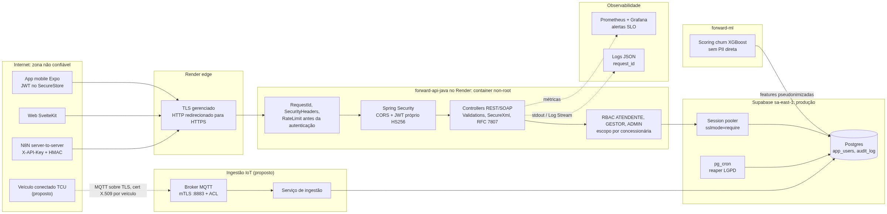
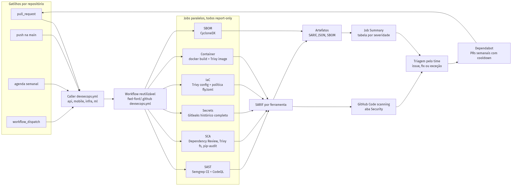
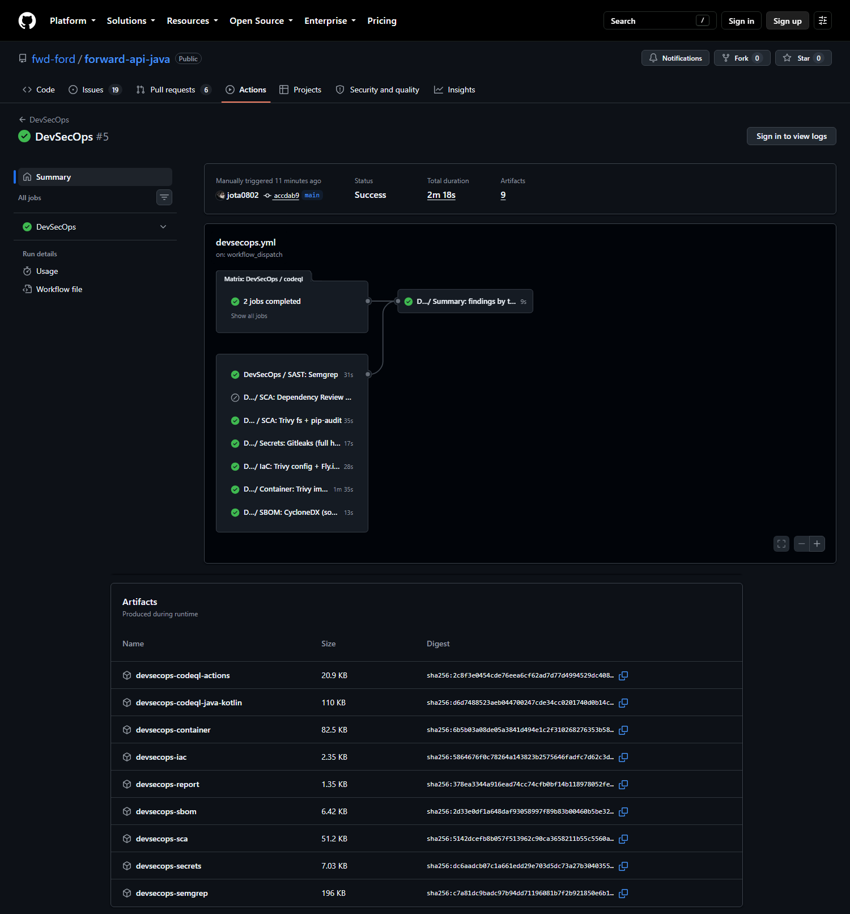
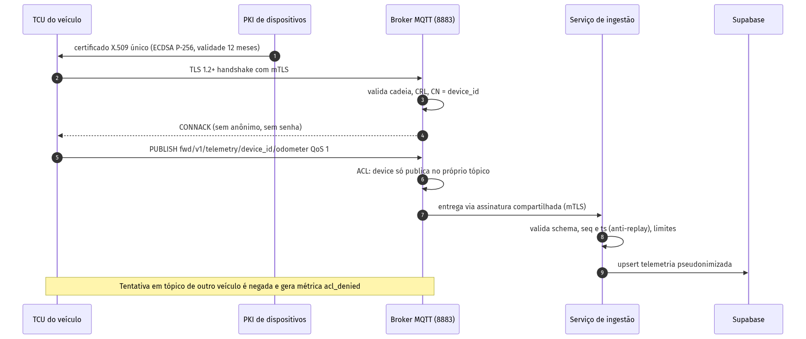
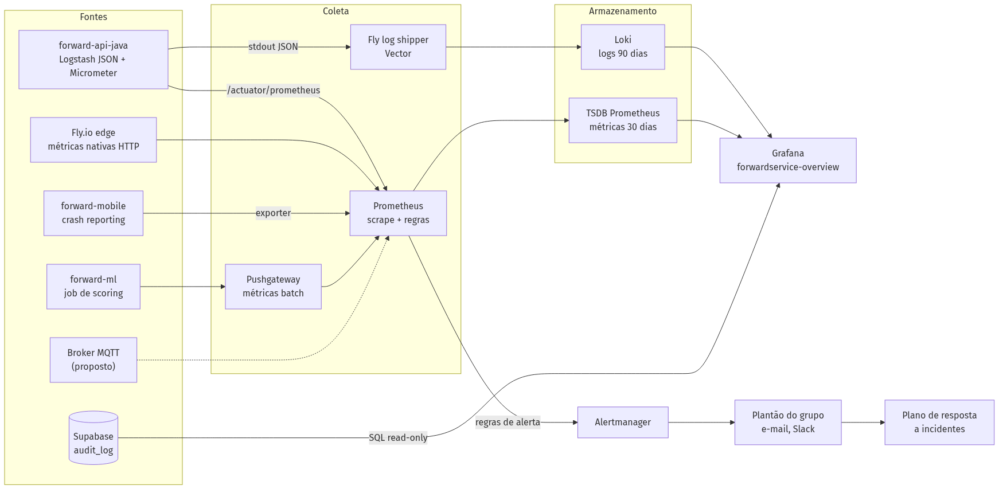
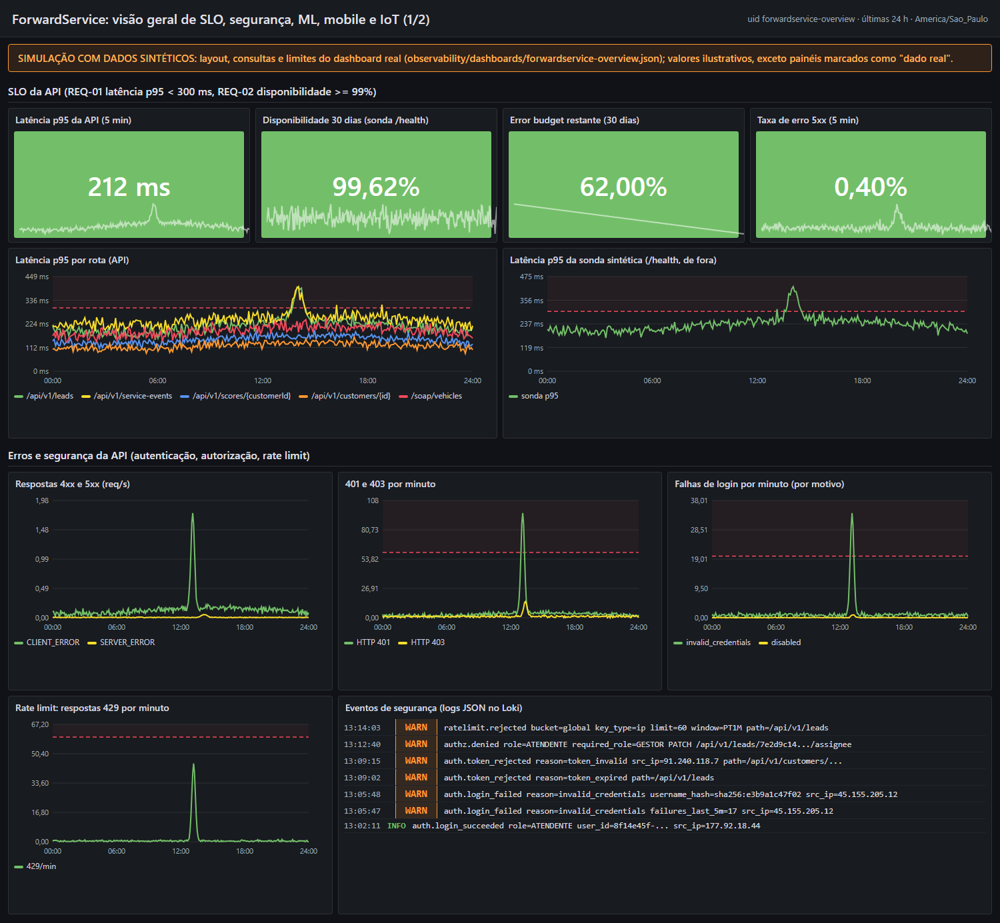
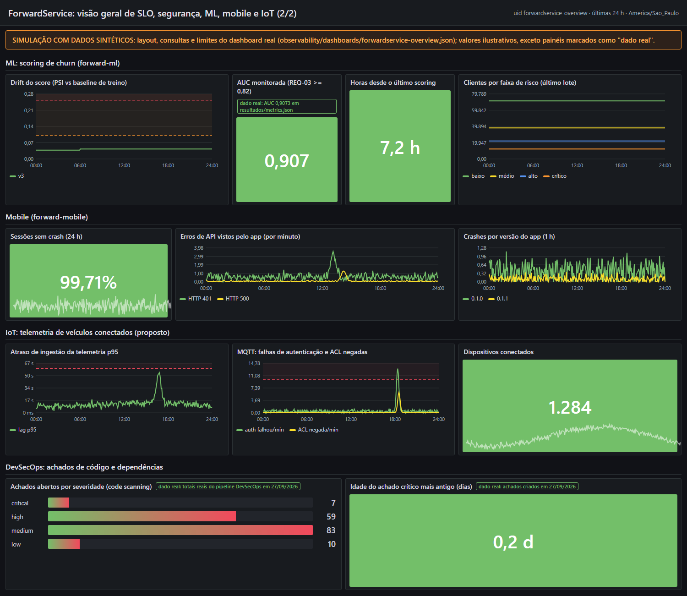
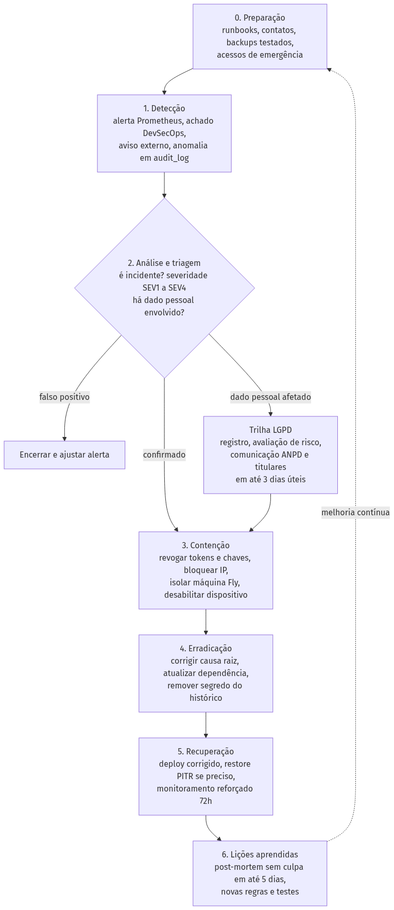

# Entrega Cybersecurity Sprint 3: ForwardService

<div class="cover">

**FIAP · Challenge Ford 2026 · Desafio 02: VIN Share e retenção no pós-venda**

**Produto:** ForwardService, score de churn e leads proativos de serviço para concessionárias Ford

**Disciplina:** Cybersecurity · **Professor:** Vitor Miguel Lasse Silva · **Turma:** 3ESPZ

**Grupo**

| Integrante | RM |
| --- | --- |
| João Victor Franco | RM556790 |
| Lucca Saraiva Borges | RM554608 |
| Ruan Melo Vieira | RM557599 |
| Rodrigo César Jimenez | RM558148 |

**Data:** 27/09/2026 · **Organização GitHub:** [github.com/fwd-ford](https://github.com/fwd-ford)

</div>

> Documento único da Sprint 3, separado pelas quatro atividades da rubrica e integrado ao projeto Ford (API, mobile, IoT, dados, ML e arquitetura). Ele **continua** a entrega da Sprint 1 e não repete o que já está lá: modelo de ameaças STRIDE em [01_THREAT_MODEL.md](../01_THREAT_MODEL.md), OWASP Top 10 2021 em [02_OWASP_TOP10.md](../02_OWASP_TOP10.md) e plano de segurança em [03_SECURITY_PLAN.md](../03_SECURITY_PLAN.md).

**Legenda de status usada em todo o documento**

| Status | Significado |
| --- | --- |
| **Implementado** | Está na branch `main` (código, configuração ou workflow) e há evidência executada |
| **Parcial** | Parte do controle implementada, com lacuna descrita |
| **Planejado** | Decisão tomada e descrita, sem código ainda |
| **Proposto** | Desenho de referência (ex.: IoT), sem componente real no projeto |
| **Aceito** | Risco conhecido, mantido por decisão documentada |

## Sumário

- [0. Contexto e escopo](#0-contexto-e-escopo)
- [1. Pipeline DevSecOps Integrado (peso 3,0)](#1-pipeline-devsecops-integrado-peso-30)
- [2. Segurança em Código e Infraestrutura (peso 2,5)](#2-segurança-em-código-e-infraestrutura-peso-25)
- [3. Observabilidade, Monitoramento e Resposta (peso 2,0)](#3-observabilidade-monitoramento-e-resposta-peso-20)
- [4. Compliance, Riscos e Segurança Contínua (peso 2,5)](#4-compliance-riscos-e-segurança-contínua-peso-25)
- [Anexos](#anexos)

## 0. Contexto e escopo

O ForwardService cruza o histórico de serviço dos veículos Ford (VIN pseudonimizado) com um modelo de churn (XGBoost) e entrega às concessionárias leads de retorno à oficina. Os componentes cobertos por esta entrega são:

| Componente | Repositório | Tecnologia | Papel na segurança |
| --- | --- | --- | --- |
| API REST + SOAP | [forward-api-java](https://github.com/fwd-ford/forward-api-java) | Spring Boot 3.5 / Java 17, Render (Docker, Blueprint `render.yaml`) | Autenticação JWT própria, RBAC, validação, rate limit, auditoria |
| App mobile | [forward-mobile](https://github.com/fwd-ford/forward-mobile) | Expo SDK 55 / React Native | Sessão do atendente, armazenamento seguro do token |
| Dados e infraestrutura | [forward-infra](https://github.com/fwd-ford/forward-infra) | Supabase PostgreSQL de produção (sa-east-1, Session pooler com TLS), migrations, docker compose | RLS da Data API, audit_log, retenção LGPD, backup |
| ML | [forward-ml](https://github.com/fwd-ford/forward-ml) | Python, XGBoost | Score de churn sem PII direta |
| CI/CD compartilhado | [.github](https://github.com/fwd-ford/.github) | GitHub Actions reutilizáveis | Pipeline DevSecOps da organização |
| Telemetria IoT | (sem repositório) | MQTT sobre TLS | **Proposto**: veículos conectados como fonte IoT |



*Figura 1. Arquitetura e fronteiras de confiança: API no Render e banco de produção no Supabase. Linhas tracejadas da ingestão IoT indicam componentes propostos.*

**O que mudou desde a Sprint 1:** (1) pipeline DevSecOps único e reutilizável rodando em quatro repositórios, com resultados no GitHub code scanning; (2) login próprio da API com JWT, RBAC ATENDENTE / GESTOR / ADMIN por concessionária e revogação imediata de token ([forward-api-java#48](https://github.com/fwd-ford/forward-api-java/pull/48), mergeado em `c4b5526`), token do app guardado no SecureStore ([forward-mobile#98](https://github.com/fwd-ford/forward-mobile/pull/98)) e correções da revisão final ([forward-api-java#50](https://github.com/fwd-ford/forward-api-java/pull/50), mergeado em `89dfab1`: nenhuma CVE CRITICAL ou HIGH na API, VIN mascarado nos logs e fim do ADMIN com senha pública em produção); (3) hospedagem: a API sai do Fly.io (desativado) para o Render, com Blueprint `render.yaml` como IaC, e o banco de produção é o Supabase restaurado; (4) plano de observabilidade com dashboard, regras de alerta e plano de resposta; (5) revisão final de riscos e checklist de compliance (ASVS, Mobile Top 10, API Top 10, LGPD).

## 1. Pipeline DevSecOps Integrado (peso 3,0)

### 1.1 Objetivo

Automatizar, em todo pull request, push na `main`, agenda semanal e execução manual, as verificações de segurança que antes dependiam de revisão humana: SAST, SCA, varredura de segredos, IaC, imagem de container e SBOM, publicando os achados no GitHub code scanning sem travar o fluxo de entrega do time.

### 1.2 O que foi feito

- **Workflow reutilizável da organização** [`.github/workflows/devsecops.yml`](https://github.com/fwd-ford/.github/blob/c5bf309fbfd9c19ee5aae7ee97f0fc8b8249458b/.github/workflows/devsecops.yml) (944 linhas): 8 jobs de varredura em paralelo (o CodeQL roda em matriz por linguagem) e 1 job de resumo. Mergeado em [fwd-ford/.github#4](https://github.com/fwd-ford/.github/pull/4) e ajustado em [fwd-ford/.github#10](https://github.com/fwd-ford/.github/pull/10) e [fwd-ford/.github#12](https://github.com/fwd-ford/.github/pull/12) (política de manifesto PaaS para o `render.yaml`).
- **Callers em quatro repositórios** (`.github/workflows/devsecops.yml`), mergeados: [forward-api-java#47](https://github.com/fwd-ford/forward-api-java/pull/47), [forward-mobile#97](https://github.com/fwd-ford/forward-mobile/pull/97), [forward-infra#42](https://github.com/fwd-ford/forward-infra/pull/42), [forward-ml#32](https://github.com/fwd-ford/forward-ml/pull/32).
- **Gate antigo consertado:** o job bloqueante do `java-security.yml` falhava em todo run da API por HTTP 429 do Maven Central, sem chegar a avaliar vulnerabilidades; [fwd-ford/.github#11](https://github.com/fwd-ford/.github/pull/11) aquece o cache Maven antes do Trivy e fixa a trivy-action por SHA (seção 1.5). Com as versões atualizadas no [forward-api-java#50](https://github.com/fwd-ford/forward-api-java/pull/50), o gate está **verde** na `main` (0 CRITICAL/HIGH).
- **Autoteste do pipeline** ([`devsecops-selftest.yml`](https://github.com/fwd-ford/.github/blob/c5bf309fbfd9c19ee5aae7ee97f0fc8b8249458b/.github/workflows/devsecops-selftest.yml)): toda mudança no workflow roda o próprio pipeline sobre o repositório `.github` antes de chegar aos callers.
- **Dependabot com cooldown de 7 dias** nos dois repositórios que ainda não tinham: `.github` ([`dependabot.yml`](https://github.com/fwd-ford/.github/blob/c5bf309fbfd9c19ee5aae7ee97f0fc8b8249458b/.github/dependabot.yml)) e forward-web ([forward-web#3](https://github.com/fwd-ford/forward-web/pull/3), só GitHub Actions porque o app ainda não tem `package.json`). Os demais já tinham Dependabot (Maven, npm, pip, Docker, Actions).

### 1.3 Desenho do pipeline



*Figura 2. Fluxo do pipeline: gatilhos, jobs paralelos, SARIF, code scanning, resumo e triagem.*

| Estágio | Ferramenta (versão fixada) | Quando roda | Saída | Como reduz riscos do projeto |
| --- | --- | --- | --- | --- |
| SAST | Semgrep CE 1.178.0 (container oficial por digest) com rulesets por repo | Todo evento | SARIF `semgrep` | Pega injeção, uso inseguro de API, workflows com shell injection (STRIDE T/E; OWASP A03, A05) antes do merge |
| SAST | CodeQL `security-extended`, matriz por linguagem (`java-kotlin`, `javascript-typescript`, `python`, `actions`), `build-mode: none` | Todo evento | SARIF por linguagem | Análise de fluxo de dados (taint) no código Java/TS/Python e nos próprios workflows (supply chain de CI) |
| SCA | `dependency-review-action` v5 (warn-only) | Só em PR | Resumo no job | Barra a **introdução** de dependência vulnerável no diff do PR (OWASP A06, Mobile M2) |
| SCA | Trivy 0.74.0 `fs --scanners vuln` (pom.xml, package-lock.json) + pip-audit 2.9.0 (requirements resolvidos) | Todo evento | SARIF `trivy-sca` + JSON | Inventário de CVEs em dependências diretas e transitivas; cobre o `requirements.txt` com ranges `>=` do ML |
| Secrets | Gitleaks 8.30.1 no **histórico completo** do git, relatório redigido | Todo evento | SARIF `gitleaks` | Detecta chave/token commitado em qualquer commit antigo (STRIDE S/I; ASVS V2.10.4; LGPD art. 46) |
| IaC | Trivy `config` (Dockerfile e afins) + política própria de manifesto PaaS: `render.yaml` (RND001 segredo literal, RND002 sem health check, RND003 banco aberto para qualquer IP, RND004 credencial em URL) e `fly.toml` legado | Todo evento | SARIF `trivy-iac` e `paas-policy` | Evita container como root, segredo em manifesto de deploy e banco exposto (OWASP A05, API8) |
| Container | `docker build` local (imagem nunca publicada) + Trivy `image` | Repos com Dockerfile (API) | SARIF `trivy-image` + SBOM da imagem | Vê o que realmente vai para produção: pacotes do SO e JARs dentro do fat jar |
| SBOM | CycloneDX via Trivy (fonte, imagem e Python resolvido) | Todo evento | Artefato (90 dias) | Resposta rápida a um novo CVE: saber em minutos se a lib está em uso |
| Resumo | Script do job `summary` | Sempre | Tabela no Job Summary + `devsecops-summary.json` | Visão única por severidade para a triagem semanal |

### 1.4 Como o pipeline roda no projeto Ford

| Repositório | Componente Ford | CodeQL | Semgrep | SCA | Container | Observações |
| --- | --- | --- | --- | --- | --- | --- |
| forward-api-java | API que atende app, web e N8N | `java-kotlin`, `actions` | `p/default p/owasp-top-ten p/java p/dockerfile` | Trivy fs (pom resolvido pelo Maven) | Sim, `Dockerfile` de produção | Único repo com imagem; política do `render.yaml` ativa |
| forward-mobile | App do atendente (Android) | `javascript-typescript`, `actions` | `p/default p/owasp-top-ten p/typescript p/react` | Trivy fs no `package-lock.json` | Não | Gitleaks respeita o allowlist da anon key pública (presente no histórico) |
| forward-infra | Banco Supabase, RLS, LGPD | `actions` | `p/default p/docker-compose` | Trivy fs | Não | Foco em IaC e compose de desenvolvimento |
| forward-ml | Modelo de churn e scoring | `python`, `actions` | `p/default p/python p/owasp-top-ten` | pip-audit sobre o conjunto resolvido | Não | SBOM do Python resolvido (49 pacotes) |

Trecho do caller da API (o agendamento `17 6 * * 1` é segunda-feira às 03:17 BRT) ([`forward-api-java/.github/workflows/devsecops.yml:8-35`](https://github.com/fwd-ford/forward-api-java/blob/accdab92a54c0c1b624614fb26b864f817461e35/.github/workflows/devsecops.yml#L8-L35)):

```yaml
on:
  push:
    branches: [main]
  pull_request:
    branches: [main]
  schedule:
    - cron: "17 6 * * 1"
  workflow_dispatch:

permissions:
  contents: read
  security-events: write
  pull-requests: read

concurrency:
  group: devsecops-${{ github.ref }}
  cancel-in-progress: true

jobs:
  devsecops:
    name: DevSecOps
    uses: fwd-ford/.github/.github/workflows/devsecops.yml@main
    with:
      codeql-languages: '["java-kotlin","actions"]'
      semgrep-config: "p/default p/owasp-top-ten p/java p/dockerfile"
      dockerfile: Dockerfile
      docker-context: "."
      run-container-scan: true
```

**Fluxo do time:** o desenvolvedor abre o PR, o pipeline roda em cerca de 2 minutos, os achados novos aparecem como anotações de code scanning no próprio PR e a tabela de severidade fica no resumo do run. Na segunda-feira o agendamento varre a `main` inteira (inclusive CVEs publicadas durante a semana) e a triagem semanal decide: corrigir, abrir issue com prazo pelo SLA ([seção 4.8](#48-plano-de-segurança-contínua)) ou descartar com justificativa registrada no alerta (exemplo real: o alerta [#125](https://github.com/fwd-ford/forward-api-java/security/code-scanning/125) do CodeQL, CSRF desabilitado, dispensado como falso positivo porque a API é stateless, com Bearer token e sem cookie de sessão).

### 1.5 Segurança do próprio pipeline

O pipeline é parte da superfície de ataque (cadeia de suprimentos de CI). Decisões tomadas, visíveis em [`devsecops.yml:81-91`](https://github.com/fwd-ford/.github/blob/c5bf309fbfd9c19ee5aae7ee97f0fc8b8249458b/.github/workflows/devsecops.yml#L81-L91):

```yaml
permissions:
  contents: read
  security-events: write
  pull-requests: read

env:
  TRIVY_VERSION: "0.74.0"
  TRIVY_SHA256: "2ae6fe3ee734b7fdf11335663e18c75ea12dccc76062f09f164a3b0f8be4371a"
  GITLEAKS_VERSION: "8.30.1"
  GITLEAKS_SHA256: "551f6fc83ea457d62a0d98237cbad105af8d557003051f41f3e7ca7b3f2470eb"
  SEMGREP_IMAGE: "semgrep/semgrep:1.178.0@sha256:32e459968daabe7ab86968184a29109b9564aa00392401156f9788452b42786b"
```

- **Nada mutável:** actions fixadas por SHA de commit (ex.: `actions/checkout@d23441a...  # v6.1.0`), binários por versão + SHA-256 conferido com `sha256sum -c` ([linha 245](https://github.com/fwd-ford/.github/blob/c5bf309fbfd9c19ee5aae7ee97f0fc8b8249458b/.github/workflows/devsecops.yml#L245)) e Semgrep por digest. Motivo concreto: em março de 2026 tags da `aquasecurity/trivy-action` foram sequestradas; o workflow antigo `java-security.yml` usava `trivy-action@master` até o [.github#11](https://github.com/fwd-ford/.github/pull/11).
- **Menor privilégio:** o token só lê código e escreve em code scanning; `persist-credentials: false` em todos os checkouts; nenhum segredo é necessário.
- **Report-only de propósito:** todo passo de scan e todo job são `continue-on-error`. Um gate bloqueante com dezenas de achados abertos na API travaria a entrega da sprint. A política é: tornar bloqueante só **Critical novo** depois que a linha de base for zerada ([seção 1.8](#18-limitações-e-próximos-passos)); até lá o único gate bloqueante é o antigo `java-security.yml` (Trivy CRITICAL/HIGH).
- **Gate antigo consertado ([.github#11](https://github.com/fwd-ford/.github/pull/11)):** o `java-security.yml` falhava sempre com `FATAL ... remote Maven repository returned 429 Too Many Requests` ([exemplo](https://github.com/fwd-ford/forward-api-java/actions/runs/36298865808/job/108562660877)), ou seja, por limite de taxa e não por vulnerabilidade. Agora roda `setup-java` com cache Maven e `mvnw dependency:go-offline` antes do Trivy ([java-security.yml:16-30](https://github.com/fwd-ford/.github/blob/c5bf309fbfd9c19ee5aae7ee97f0fc8b8249458b/.github/workflows/java-security.yml#L16-L30)). Verificação no PR temporário [forward-api-java#49](https://github.com/fwd-ford/forward-api-java/pull/49): no mesmo PR o gate antigo falhou com 429 ([run 36305315128](https://github.com/fwd-ford/forward-api-java/actions/runs/36305315128)) e o corrigido terminou com `pom.xml: 0` vulnerabilidades usando Spring Boot 3.5.16, Tomcat 10.1.60 e pgjdbc 42.7.13 ([run 36305315165](https://github.com/fwd-ford/forward-api-java/actions/runs/36305315165)). Na `main` pós-merge do #48 o gate já roda sem 429 e reprova pelas vulnerabilidades reais: `Total: 14 (HIGH: 11, CRITICAL: 3)` ([job](https://github.com/fwd-ford/forward-api-java/actions/runs/36305755673/job/108581970255)). Com o [forward-api-java#50](https://github.com/fwd-ford/forward-api-java/pull/50) (`89dfab1`: Spring Boot 3.5.16, Tomcat 10.1.60, pgjdbc 42.7.13 e `.trivyignore` sem nenhuma supressão) o gate ficou **verde** na `main`, com `pom.xml: 0` ([job](https://github.com/fwd-ford/forward-api-java/actions/runs/36307904777/job/108588036936)).
- **Correção de bug herdado:** `secrets-scan.yml` usa `fetch-depth: ${{ inputs.scan-history && 0 || 1 }}`; como `0` é falsy nas expressions do Actions, o resultado é sempre `1` e o "scan de histórico" nunca buscou o histórico. O novo workflow usa a string `'0'` ([linha 348](https://github.com/fwd-ford/.github/blob/c5bf309fbfd9c19ee5aae7ee97f0fc8b8249458b/.github/workflows/devsecops.yml#L348)).
- **Iteração real:** o primeiro run da API falhou no Trivy com HTTP 429 do Maven Central ao resolver o BOM do Spring ([run 36298364077](https://github.com/fwd-ford/forward-api-java/actions/runs/36298364077)). A correção ([.github#10](https://github.com/fwd-ford/.github/pull/10)) resolve as dependências com Maven e cache antes do Trivy, validada no [run 36298745497](https://github.com/fwd-ford/forward-api-java/actions/runs/36298745497).

### 1.6 Evidências

**Pull requests desta entrega**

| PR | Repositório | Conteúdo | Estado |
| --- | --- | --- | --- |
| [#4](https://github.com/fwd-ford/.github/pull/4) | .github | Workflow reutilizável, autoteste, Dependabot com cooldown | Mergeado (`e96379a`) |
| [#10](https://github.com/fwd-ford/.github/pull/10) | .github | Maven antes do Trivy, SBOM Python, resumo mais claro | Mergeado (`b5cb51a`) |
| [#47](https://github.com/fwd-ford/forward-api-java/pull/47) | forward-api-java | Caller com CodeQL Java e scan da imagem | Mergeado (`accdab9`) |
| [#97](https://github.com/fwd-ford/forward-mobile/pull/97) | forward-mobile | Caller com CodeQL JS/TS | Mergeado (`e5b3cef`) |
| [#42](https://github.com/fwd-ford/forward-infra/pull/42) | forward-infra | Caller com foco em IaC | Mergeado (`19114d3`) |
| [#32](https://github.com/fwd-ford/forward-ml/pull/32) | forward-ml | Caller com CodeQL Python e pip-audit | Mergeado (`5a7af86`) |
| [#11](https://github.com/fwd-ford/.github/pull/11) | .github | `java-security.yml`: cache Maven antes do Trivy e trivy-action fixada por SHA | Mergeado (`bae0c14`) |
| [#12](https://github.com/fwd-ford/.github/pull/12) | .github | Política de manifesto PaaS (`render.yaml`) no job de IaC | Mergeado (`c5bf309`) |
| [#3](https://github.com/fwd-ford/forward-web/pull/3) | forward-web | Dependabot (GitHub Actions) com cooldown | Mergeado (`a3f5300`) |

**Execuções na `main` (workflow_dispatch em 27/09/2026, todas com sucesso)**

| Repositório | Run | Commit |
| --- | --- | --- |
| forward-api-java | [36299068758](https://github.com/fwd-ford/forward-api-java/actions/runs/36299068758) | `accdab9` |
| forward-mobile | [36299071189](https://github.com/fwd-ford/forward-mobile/actions/runs/36299071189) | `0db4953` |
| forward-infra | [36299073383](https://github.com/fwd-ford/forward-infra/actions/runs/36299073383) | `19114d3` |
| forward-ml | [36299075207](https://github.com/fwd-ford/forward-ml/actions/runs/36299075207) | `5a7af86` |
| .github (autoteste) | [36299076861](https://github.com/fwd-ford/.github/actions/runs/36299076861) | `b5cb51a` |
| forward-api-java depois do merge do #48 (push) | [36305755636](https://github.com/fwd-ford/forward-api-java/actions/runs/36305755636) | `c4b5526` |
| forward-api-java depois do merge do #50 (push) | [36307904817](https://github.com/fwd-ford/forward-api-java/actions/runs/36307904817) | `89dfab1` |



*Figura 3. Print real (27/09/2026) da execução 36299068758 na forward-api-java: 9 jobs verdes (o dependency review só roda em PR) e 9 artefatos (SARIF, JSON e SBOM) com digest SHA-256.*

**Achados por ferramenta e severidade** (resumo gerado pelo pipeline; JSON completo em [`evidencias/devsecops-achados-2026-09-27.json`](evidencias/devsecops-achados-2026-09-27.json))

| Repositório | Semgrep | CodeQL | Trivy fs (deps) | Gitleaks | Trivy config / política PaaS | Trivy image | Critical | High | Medium | Low | Total |
| --- | --- | --- | --- | --- | --- | --- | ---: | ---: | ---: | ---: | ---: |
| forward-api-java | 2 | 6 | 39 | 0 | 1 / 0 | 39 | 6 | 23 | 49 | 9 | 87 |
| forward-mobile | 10 | 4 | 49 | 0 | 0 / 0 | n/a | 1 | 36 | 25 | 1 | 63 |
| forward-infra | 2 | 2 | 0 | 0 | 0 / 0 | n/a | 0 | 0 | 4 | 0 | 4 |
| forward-ml | 3 | 2 | 0 (pip-audit: 0 em 48 pacotes) | 0 | 0 / 0 | n/a | 0 | 0 | 5 | 0 | 5 |
| .github | 21 | 7 | 0 | 0 | 0 / 0 | n/a | 0 | 4 | 24 | 0 | 28 |
| forward-api-java depois do #48 (`c4b5526`) | 2 | 5 | 37 | 0 | 1 / 0 | 78 | 6 | 23 | 69 | 25 | 123 |
| forward-api-java depois do #50 (`89dfab1`) | 2 | 5 | 4 | 0 | 1 / 0 | 45 | 0 | 1 | 39 | 17 | 57 |

Na API, Trivy fs e Trivy image apontam as **mesmas CVEs** das bibliotecas Java (visão do código e visão da imagem). Na primeira varredura a imagem era Alpine 3.24.2, sem nenhuma vulnerabilidade de sistema; depois do #48 a imagem passou a Ubuntu Jammy (necessária para o perfil demo), o que acrescentou 44 MEDIUM e 20 LOW de pacotes do sistema, sem novos CRITICAL ou HIGH. Na execução da madrugada de 27/09 a política PaaS avaliava o `fly.toml`; nos runs pós-merge ela avaliou o `render.yaml`, com 0 achados. **Depois do #50 a API não tem nenhum CRITICAL:** o único High que o SARIF ainda conta é o alerta de CSRF do CodeQL, dispensado como falso positivo no code scanning (T-04); sobram 4 MEDIUM em dependências (T-12) e 41 achados de pacotes do Ubuntu na imagem (25 MEDIUM e 16 LOW). Resumo completo em [`evidencias/devsecops-api-pos-merge-pr50.json`](evidencias/devsecops-api-pos-merge-pr50.json). SBOMs gerados: API 100 componentes (fonte) e 234 (imagem) depois do #50, mobile 680, ML 49 (Python resolvido).

**Triagem dos principais achados**

| ID | Ferramenta | Achado | Onde | Severidade | Decisão |
| --- | --- | --- | --- | --- | --- |
| T-01 | Trivy | `tomcat-embed-core` 10.1.55: CVE-2026-65182, CVE-2026-65905, CVE-2026-68525 (corrigido em 10.1.58) | [`pom.xml:26`](https://github.com/fwd-ford/forward-api-java/blob/c4b55263e933c5fe3486c7420bc3e27a80a6e5d1/pom.xml#L26) fixava a versão | Critical | **Corrigido no [#50](https://github.com/fwd-ford/forward-api-java/pull/50)** (validado antes no [#49](https://github.com/fwd-ford/forward-api-java/pull/49)): `tomcat.version` 10.1.60 ([pom.xml:26](https://github.com/fwd-ford/forward-api-java/blob/89dfab15c0d71dc0924368e700fe48b9fe1b5fe9/pom.xml#L26)); gate verde na `main` |
| T-02 | Trivy | `jackson-databind` 2.21.2, `spring-webmvc` 6.2.18, `micrometer-core` 1.15.11, `postgresql` 42.7.11, `spring-ws` 4.1.3 (SSRF e XXE) | BOM do Spring Boot 3.5.14 | High | **Corrigido no [#50](https://github.com/fwd-ford/forward-api-java/pull/50):** Spring Boot 3.5.16 ([pom.xml:10](https://github.com/fwd-ford/forward-api-java/blob/89dfab15c0d71dc0924368e700fe48b9fe1b5fe9/pom.xml#L10)) traz Jackson 2.21.4, Spring 6.2.19, Micrometer 1.15.12 e Spring WS 4.1.4, mais pgjdbc 42.7.13 ([pom.xml:25](https://github.com/fwd-ford/forward-api-java/blob/89dfab15c0d71dc0924368e700fe48b9fe1b5fe9/pom.xml#L25)); o `.trivyignore`, cuja revisão tinha vencido em 01/08/2026, ficou sem nenhuma supressão ([.trivyignore](https://github.com/fwd-ford/forward-api-java/blob/89dfab15c0d71dc0924368e700fe48b9fe1b5fe9/.trivyignore)) |
| T-03 | Trivy | `shell-quote` 1.8.3 (CVE-2026-9277), `@xmldom/xmldom`, `js-yaml`, `brace-expansion`, `nanoid`, `postcss`, `ws` | `package-lock.json` do mobile | Critical / High | Quase tudo é toolchain de build (Metro, Expo CLI), não vai no APK. **Planejado:** mergear os PRs do Dependabot abertos desde maio (#62 a #66) |
| T-04 | CodeQL | `java/spring-disabled-csrf-protection` | [`SecurityConfig.java:73`](https://github.com/fwd-ford/forward-api-java/blob/c4b55263e933c5fe3486c7420bc3e27a80a6e5d1/src/main/java/com/fwdford/forwardapi/security/SecurityConfig.java#L73) | High (8,8) | **Falso positivo, dispensado** no code scanning (alerta [#125](https://github.com/fwd-ford/forward-api-java/security/code-scanning/125), motivo *false positive*): API stateless com Bearer token, sem cookie de sessão (justificativa também no próprio `SecurityConfig`). O SARIF bruto continua contando o resultado |
| T-05 | CodeQL | `java/log-injection` (URI e mensagem de exceção no log) | `GlobalExceptionHandler.java` (versão anterior) | Medium | **Corrigido no PR #48:** `LogSanitizer` em todo valor vindo do cliente; o alerta não aparece no run pós-merge |
| T-06 | Semgrep + CodeQL | Shell injection por `${{ inputs.* }}` em `run:` e actions por tag mutável (inclui `trivy-action@master`) | `java-quality.yml:24/36/48`, `secrets-scan.yml:29`, `java-security.yml:15` | High / Medium | Real. `java-security.yml` corrigido no [.github#11](https://github.com/fwd-ford/.github/pull/11) (trivy-action fixada por SHA); `java-quality.yml` e `secrets-scan.yml` continuam. **Planejado:** mesmo padrão do `devsecops.yml` (env + SHA) |
| T-07 | CodeQL | `actions/unpinned-tag` nos callers `@main` e em `android-apk.yml` | Callers e workflow do APK | Medium | Callers em `@main` é intencional (repo interno com PR obrigatório); `android-apk.yml` **Planejado:** fixar por SHA |
| T-08 | Semgrep | `dependabot-missing-cooldown` | `dependabot.yml` dos repos de app | Medium | Corrigido no `.github` (cooldown 7 dias); demais **Planejado** |
| T-09 | Semgrep | `insecure-hash-algorithm-sha1` | [`scripts/internal_analysis.py:374`](https://github.com/fwd-ford/forward-ml/blob/5a7af86dd62bf8e451c5e1e3b539064a66704e53/scripts/internal_analysis.py#L374) | Medium | **Aceito:** script de pesquisa que testa a reversão do VIN_Hash SHA-1 fornecido pela Ford; não é controle de segurança |
| T-10 | Trivy config | DS-0026 sem `HEALTHCHECK` | `Dockerfile` | Low | Mitigado pelo `healthCheckPath: /health` do Render ([render.yaml:20](https://github.com/fwd-ford/forward-api-java/blob/c4b55263e933c5fe3486c7420bc3e27a80a6e5d1/render.yaml#L20)) |
| T-11 | Gitleaks | Histórico completo dos quatro repositórios | todos | 0 | Nenhum segredo encontrado |
| T-12 | Trivy | `jackson-databind` 2.21.4 (CVE-2026-54515, CVE-2026-59889, GHSA-mhm7-754m-9p8w) e `log4j-api` 2.24.3 (CVE-2026-49844) | BOM do Spring Boot 3.5.16 | Medium | Restantes depois do #50 ([run 36307904817](https://github.com/fwd-ford/forward-api-java/actions/runs/36307904817)). **Planejado:** Jackson 2.21.5 e Log4j 2.25.5 pela propriedade de versão do BOM ou no próximo Spring Boot, dentro do SLA de 90 dias para Medium |

### 1.7 Resumo de como o pipeline reduz os riscos identificados

| Risco (Sprint 1 ou revisão Sprint 3) | Estágio que detecta | Efeito |
| --- | --- | --- |
| Dependência com CVE (A06, M2, API8) | SCA, Container, Dependency Review | Descoberta semanal automática; na primeira varredura revelou 3 CVEs críticas no Tomcat 10.1.55 fixado no `pom.xml` e a revisão vencida do `.trivyignore`; o gate consertado acusou as CVEs na `main` até o #50 zerar CRITICAL e HIGH no mesmo dia |
| Segredo commitado (INTERNAL_API_KEY, JWT secret) | Secrets (histórico completo) | Garantia de que nenhum segredo está no histórico, não só no último commit |
| Injeção e uso inseguro de API (A03) | SAST Semgrep + CodeQL | Achado aparece no PR, antes do merge |
| Configuração insegura de container e deploy (A05) | IaC + política de manifesto PaaS (`render.yaml`) | Container root, segredo literal no manifesto ou banco aberto viram alerta Critical/High |
| Supply chain do CI (actions comprometidas) | CodeQL `actions`, Semgrep `github-actions`, pins por SHA | Achados reais nos workflows antigos; o novo pipeline não depende de ref mutável |
| Resposta lenta a CVE nova | SBOM CycloneDX | Consulta imediata de "onde usamos a lib X" |

### 1.8 Limitações e próximos passos

- **Dependency graph desabilitado:** o `dependency-review-action` termina com "Dependency review is not supported on this repository". Habilitar em *Settings > Advanced Security > Dependency graph* é ação do owner da organização (**Planejado**); enquanto isso o Trivy cobre o SCA.
- **Secret scanning e push protection do GitHub** estão desligados nos repositórios públicos, embora sejam gratuitos. **Planejado:** ligar (bloqueia o push do segredo, o Gitleaks só detecta depois).
- **Gate bloqueante:** **Planejado** para depois de zerar a linha de base: falhar o PR só com achado Critical **novo** (diff), mantendo o resto report-only. A linha de base de Critical da API chegou a 0 com o #50; falta o toolchain do mobile (T-03).
- **DAST:** OWASP ZAP baseline contra um ambiente de staging, mensal (**Planejado**).
- **Proveniência:** assinatura da imagem com cosign e atestado SLSA (**Planejado**).

## 2. Segurança em Código e Infraestrutura (peso 2,5)

### 2.1 Objetivo

Mostrar correções e controles reais no código e na infraestrutura: criptografia local, hardening da API (rate limit, validação, JWT seguro), controle de acesso por papel, segurança da telemetria IoT e segurança de IaC, com trechos de código, links para commits e evidência executada. As referências de código da API apontam para os commits de merge do [forward-api-java#48](https://github.com/fwd-ford/forward-api-java/pull/48) (`c4b5526`) e do [forward-api-java#50](https://github.com/fwd-ford/forward-api-java/pull/50) (`89dfab1`), conforme o PR que introduziu cada controle.

### 2.2 Mapa de controles

| Controle | Onde | Status | Evidência |
| --- | --- | --- | --- |
| Token do app no Keystore/Keychain | `forward-mobile/lib/session.ts` | Implementado ([mobile#98](https://github.com/fwd-ford/forward-mobile/pull/98)) | [session.ts:37-53](https://github.com/fwd-ford/forward-mobile/blob/0db49536c5f7dba68db4f3b93eb69a64fe30b221/lib/session.ts#L37-L53) |
| APK release só HTTPS | `forward-mobile/app.config.js` | Implementado | [app.config.js:9-16](https://github.com/fwd-ford/forward-mobile/blob/0db49536c5f7dba68db4f3b93eb69a64fe30b221/app.config.js#L9-L16) |
| JWT próprio HS256 (iss, aud, exp, jti, chave de 256 bits, falha na inicialização sem segredo em produção) | `security/JwtService.java` | Implementado (PR forward-api-java#48) | [JwtService.java:79-105](https://github.com/fwd-ford/forward-api-java/blob/c4b55263e933c5fe3486c7420bc3e27a80a6e5d1/src/main/java/com/fwdford/forwardapi/security/JwtService.java#L79-L105) |
| Revogação imediata de token (`token_version` e estado atual do usuário) | `security/JwtAuthenticationFilter.java`, `UserStateCache.java`, migration V16 | Implementado (PR forward-api-java#48) | [JwtAuthenticationFilter.java:117-144](https://github.com/fwd-ford/forward-api-java/blob/c4b55263e933c5fe3486c7420bc3e27a80a6e5d1/src/main/java/com/fwdford/forwardapi/security/JwtAuthenticationFilter.java#L117-L144), `TokenRevocationIT` (8 testes) |
| RBAC ATENDENTE / GESTOR / ADMIN e SERVICE | `security/Role.java`, `SecurityConfig.java`, `@PreAuthorize` | Implementado (PR forward-api-java#48) | [Role.java:12-44](https://github.com/fwd-ford/forward-api-java/blob/c4b55263e933c5fe3486c7420bc3e27a80a6e5d1/src/main/java/com/fwdford/forwardapi/security/Role.java#L12-L44), [SecurityConfig.java:93-102](https://github.com/fwd-ford/forward-api-java/blob/c4b55263e933c5fe3486c7420bc3e27a80a6e5d1/src/main/java/com/fwdford/forwardapi/security/SecurityConfig.java#L93-L102) |
| Escopo por concessionária (403 `ACCESS_OTHER_DEALER`) | `CustomerService`, `LeadService`, `VehicleService`, `ServiceEventService` | Implementado (PR forward-api-java#48) | [CustomerService.java:31-35](https://github.com/fwd-ford/forward-api-java/blob/c4b55263e933c5fe3486c7420bc3e27a80a6e5d1/src/main/java/com/fwdford/forwardapi/service/CustomerService.java#L31-L35) |
| Rate limit antes da autenticação e de login por IP | `security/RateLimitFilter.java` | Implementado (PR forward-api-java#48) | [RateLimitFilter.java:43-95](https://github.com/fwd-ford/forward-api-java/blob/c4b55263e933c5fe3486c7420bc3e27a80a6e5d1/src/main/java/com/fwdford/forwardapi/security/RateLimitFilter.java#L43-L95) |
| Headers de segurança e `X-Request-Id` também em 401 | `web/SecurityHeadersFilter.java`, `web/RequestIdFilter.java` | Implementado (PR forward-api-java#48) | [SecurityHeadersFilter.java:18-29](https://github.com/fwd-ford/forward-api-java/blob/c4b55263e933c5fe3486c7420bc3e27a80a6e5d1/src/main/java/com/fwdford/forwardapi/web/SecurityHeadersFilter.java#L18-L29), `SecurityIT.security_headers_on_401` |
| Sanitização de log (CWE-117) | `util/LogSanitizer.java`, `RequestIdFilter` | Implementado (PR forward-api-java#48) | [LogSanitizer.java:12-21](https://github.com/fwd-ford/forward-api-java/blob/c4b55263e933c5fe3486c7420bc3e27a80a6e5d1/src/main/java/com/fwdford/forwardapi/util/LogSanitizer.java#L12-L21) |
| VIN mascarado nos logs (só os 6 últimos caracteres) | `util/LogSanitizer.java`, `ServiceEventService` | Implementado (PR forward-api-java#50) | [LogSanitizer.java:39-42](https://github.com/fwd-ford/forward-api-java/blob/89dfab15c0d71dc0924368e700fe48b9fe1b5fe9/src/main/java/com/fwdford/forwardapi/util/LogSanitizer.java#L39-L42), [ServiceEventService.java:86-90](https://github.com/fwd-ford/forward-api-java/blob/89dfab15c0d71dc0924368e700fe48b9fe1b5fe9/src/main/java/com/fwdford/forwardapi/service/ServiceEventService.java#L86-L90), `LogSanitizerTest` |
| SOAP endurecido contra XXE | `util/SecureXml.java` | Implementado (PR forward-api-java#48) | [SecureXml.java:19-27](https://github.com/fwd-ford/forward-api-java/blob/c4b55263e933c5fe3486c7420bc3e27a80a6e5d1/src/main/java/com/fwdford/forwardapi/util/SecureXml.java#L19-L27) |
| Validação de entrada e erros RFC 7807 | `Validations`, Bean Validation, `error/` | Implementado | [Validations.java:11-22](https://github.com/fwd-ford/forward-api-java/blob/c4b55263e933c5fe3486c7420bc3e27a80a6e5d1/src/main/java/com/fwdford/forwardapi/web/Validations.java#L11-L22), [application.yml:16-21](https://github.com/fwd-ford/forward-api-java/blob/c4b55263e933c5fe3486c7420bc3e27a80a6e5d1/src/main/resources/application.yml#L16-L21) |
| HMAC-SHA256 server-to-server | `HmacValidator` | Implementado | [HmacValidator.java:58-124](https://github.com/fwd-ford/forward-api-java/blob/c4b55263e933c5fe3486c7420bc3e27a80a6e5d1/src/main/java/com/fwdford/forwardapi/security/HmacValidator.java#L58-L124) |
| Tabela de usuários fora da Data API do Supabase | migration V14 (RLS sem políticas e `REVOKE`) | Implementado (PR forward-api-java#48) | [V14__create_app_users.sql:43-51](https://github.com/fwd-ford/forward-api-java/blob/c4b55263e933c5fe3486c7420bc3e27a80a6e5d1/src/main/resources/db/migration/V14__create_app_users.sql#L43-L51) |
| RLS das tabelas de negócio (Data API) | forward-infra, migration 010 | Implementado para acesso direto pelo Supabase; a API conecta como dono das tabelas (decisão, F-17) | [010_rls_policies.sql:5-53](https://github.com/fwd-ford/forward-infra/blob/19114d3e75f2401c5283053b9b974ea1e7f2a9ee/supabase/migrations/010_rls_policies.sql#L5-L53) |
| Retenção e anonimização LGPD | forward-infra, migration 013 e pg_cron | Implementado | [013_lgpd_retention_policy.sql:21-101](https://github.com/fwd-ford/forward-infra/blob/19114d3e75f2401c5283053b9b974ea1e7f2a9ee/supabase/migrations/013_lgpd_retention_policy.sql#L21-L101) |
| Container non-root | `Dockerfile` | Implementado | [Dockerfile:14-21](https://github.com/fwd-ford/forward-api-java/blob/c4b55263e933c5fe3486c7420bc3e27a80a6e5d1/Dockerfile#L14-L21) |
| Blueprint do Render (segredos gerados ou fora do git, health check) | `render.yaml` | Implementado (PR forward-api-java#48 e #50) | [render.yaml:20-57](https://github.com/fwd-ford/forward-api-java/blob/89dfab15c0d71dc0924368e700fe48b9fe1b5fe9/render.yaml#L20-L57) |
| Senhas de bootstrap fora do código: ADMIN só com `ADMIN_BOOTSTRAP_PASSWORD`; ADMIN legado com a senha publicada é rotacionado ou desativado | `db/bootstrap`, `FlywayPlaceholderConfig`, `render.yaml` | Implementado (PR forward-api-java#50); usuários demo de baixo privilégio com a senha publicada: Aceito | [R__bootstrap_demo_data.sql:203-227](https://github.com/fwd-ford/forward-api-java/blob/89dfab15c0d71dc0924368e700fe48b9fe1b5fe9/src/main/resources/db/bootstrap/R__bootstrap_demo_data.sql#L203-L227), `ProdMigrationIT` |
| Dependências sem CVE CRITICAL ou HIGH, com gate bloqueante | `pom.xml`, `.trivyignore`, `java-security.yml` | Implementado (PR forward-api-java#50 e .github#11) | [pom.xml:10-26](https://github.com/fwd-ford/forward-api-java/blob/89dfab15c0d71dc0924368e700fe48b9fe1b5fe9/pom.xml#L10-L26), [gate verde](https://github.com/fwd-ford/forward-api-java/actions/runs/36307904777/job/108588036936) |
| MQTT sobre TLS com mTLS e ACL | `iot/` desta entrega | Proposto | [mosquitto.conf](iot/mosquitto.conf), [acl](iot/acl) |

### 2.3 Criptografia local e proteção de dados

**Mobile: token no armazenamento seguro do sistema.** O login do app usa o JWT emitido pela própria API ([forward-mobile#98](https://github.com/fwd-ford/forward-mobile/pull/98)). A sessão é gravada com `expo-secure-store`, que cifra o valor com chave do Android Keystore (AES-GCM) ou guarda no iOS Keychain ([`lib/session.ts:37-53`](https://github.com/fwd-ford/forward-mobile/blob/0db49536c5f7dba68db4f3b93eb69a64fe30b221/lib/session.ts#L37-L53)):

```ts
async function readRaw(): Promise<string | null> {
  if (Platform.OS === "web") {
    return typeof window === "undefined" ? null : window.localStorage.getItem(STORE_KEY);
  }
  return SecureStore.getItemAsync(STORE_KEY);
}

async function writeRaw(value: string | null): Promise<void> {
  if (Platform.OS === "web") {
    if (typeof window === "undefined") return;
    if (value === null) window.localStorage.removeItem(STORE_KEY);
    else window.localStorage.setItem(STORE_KEY, value);
    return;
  }
  if (value === null) await SecureStore.deleteItemAsync(STORE_KEY);
  else await SecureStore.setItemAsync(STORE_KEY, value);
}
```

- **Ciclo de vida do token:** expiração local com 30 s de margem ([`lib/auth.ts:12-21`](https://github.com/fwd-ford/forward-mobile/blob/0db49536c5f7dba68db4f3b93eb69a64fe30b221/lib/auth.ts#L12-L21)), descarte da sessão vencida ao abrir o app ([`session.ts:60-73`](https://github.com/fwd-ford/forward-mobile/blob/0db49536c5f7dba68db4f3b93eb69a64fe30b221/lib/session.ts#L60-L73)) e logout automático em qualquer 401 ([`lib/api.ts:79-83`](https://github.com/fwd-ford/forward-mobile/blob/0db49536c5f7dba68db4f3b93eb69a64fe30b221/lib/api.ts#L79-L83)), o que inclui o 401 `AUTH_TOKEN_REVOKED` da revogação imediata (seção 2.4).
- **Separação do que é sensível:** `AsyncStorage` (sem cifra) guarda só preferências (tema, idioma, cidade) e o avatar, que fica só no aparelho ([`lib/profile.ts:1-4`](https://github.com/fwd-ford/forward-mobile/blob/0db49536c5f7dba68db4f3b93eb69a64fe30b221/lib/profile.ts#L1-L4)).
- **Em trânsito:** o APK de release bloqueia HTTP em texto claro (`usesCleartextTraffic: false`, só liberado com `ALLOW_HTTP=1` em build local) ([`app.config.js:9-16`](https://github.com/fwd-ford/forward-mobile/blob/0db49536c5f7dba68db4f3b93eb69a64fe30b221/app.config.js#L9-L16)); o Render termina o TLS na borda e redireciona HTTP para HTTPS, e a API envia HSTS de 1 ano ([SecurityHeadersFilter.java:28](https://github.com/fwd-ford/forward-api-java/blob/c4b55263e933c5fe3486c7420bc3e27a80a6e5d1/src/main/java/com/fwdford/forwardapi/web/SecurityHeadersFilter.java#L28)); a conexão da API com o banco passa pelo Session pooler do Supabase com `sslmode=require` ([render.yaml:29-35](https://github.com/fwd-ford/forward-api-java/blob/c4b55263e933c5fe3486c7420bc3e27a80a6e5d1/render.yaml#L29-L35)).
- **Senhas:** só hash BCrypt, com `CHECK` no banco que recusa qualquer valor que não seja um hash `$2a/$2b/$2y` ([V14__create_app_users.sql:25](https://github.com/fwd-ford/forward-api-java/blob/c4b55263e933c5fe3486c7420bc3e27a80a6e5d1/src/main/resources/db/migration/V14__create_app_users.sql#L25)); os usuários de bootstrap recebem o hash calculado no próprio SQL com `pgcrypto` (`crypt(..., gen_salt('bf', 10))`, compatível com o `BCryptPasswordEncoder`) ([R__bootstrap_demo_data.sql:191](https://github.com/fwd-ford/forward-api-java/blob/89dfab15c0d71dc0924368e700fe48b9fe1b5fe9/src/main/resources/db/bootstrap/R__bootstrap_demo_data.sql#L191) e [206](https://github.com/fwd-ford/forward-api-java/blob/89dfab15c0d71dc0924368e700fe48b9fe1b5fe9/src/main/resources/db/bootstrap/R__bootstrap_demo_data.sql#L206)). Desde o #50 a senha em claro do bootstrap vem de variável de ambiente (placeholder do Flyway), sem valor padrão no caso do ADMIN, e nunca aparece em log (seção 2.7).
- **Banco em repouso:** o Supabase (produção, sa-east-1) cifra o armazenamento (AES-256, controle do provedor); `cpf_hash` é SHA-256 gerado pelo banco ([`002_create_customers.sql:9`](https://github.com/fwd-ford/forward-infra/blob/19114d3e75f2401c5283053b9b974ea1e7f2a9ee/supabase/migrations/002_create_customers.sql#L9)). **Achado F-09:** a coluna `cpf` continua em claro ([linha 8](https://github.com/fwd-ford/forward-infra/blob/19114d3e75f2401c5283053b9b974ea1e7f2a9ee/supabase/migrations/002_create_customers.sql#L8)). **Planejado:** cifrar com `pgcrypto` (chave no Vault do Supabase) ou manter só um HMAC com pepper.
- **Limitação aceita:** no build **web** de demonstração o token fica em `localStorage` (sem Keystore no navegador). O canal oficial do atendente é o APK.

### 2.4 Hardening da API

| Controle | Implementação na `main` (`c4b5526` e `89dfab1`) | Referência |
| --- | --- | --- |
| Ordem dos filtros | `RequestIdFilter` -> `SecurityHeadersFilter` -> `RateLimitFilter` -> cadeia do Spring Security: toda resposta, inclusive 401 e 429, tem headers de segurança e `X-Request-Id` | [SecurityConfig.java:3-4](https://github.com/fwd-ford/forward-api-java/blob/c4b55263e933c5fe3486c7420bc3e27a80a6e5d1/src/main/java/com/fwdford/forwardapi/security/SecurityConfig.java#L3-L4), [RequestIdFilter.java:22](https://github.com/fwd-ford/forward-api-java/blob/c4b55263e933c5fe3486c7420bc3e27a80a6e5d1/src/main/java/com/fwdford/forwardapi/web/RequestIdFilter.java#L22) |
| Rate limit | Bucket4j por IP antes da autenticação (inclui tokens inválidos); balde de login de 5 tentativas por minuto por IP (10 no `render.yaml`); 429 RFC 7807 com `Retry-After`; teto de 50 mil clientes em memória | [RateLimitFilter.java:43-95](https://github.com/fwd-ford/forward-api-java/blob/c4b55263e933c5fe3486c7420bc3e27a80a6e5d1/src/main/java/com/fwdford/forwardapi/security/RateLimitFilter.java#L43-L95), [application.yml:85](https://github.com/fwd-ford/forward-api-java/blob/c4b55263e933c5fe3486c7420bc3e27a80a6e5d1/src/main/resources/application.yml#L85) |
| IP real do cliente | `server.forward-headers-strategy=native` no Render: o `RemoteIpValve` do Tomcat só aceita `X-Forwarded-For` de proxies internos | [application.yml:15](https://github.com/fwd-ford/forward-api-java/blob/c4b55263e933c5fe3486c7420bc3e27a80a6e5d1/src/main/resources/application.yml#L15), [render.yaml:41](https://github.com/fwd-ford/forward-api-java/blob/c4b55263e933c5fe3486c7420bc3e27a80a6e5d1/render.yaml#L41) |
| Limite de corpo | Tomcat `max-http-form-post-size` e `max-swallow-size` de 1 MB | [application.yml:22-24](https://github.com/fwd-ford/forward-api-java/blob/c4b55263e933c5fe3486c7420bc3e27a80a6e5d1/src/main/resources/application.yml#L22-L24) |
| Validação de entrada | Regex RFC 4122 (UUID), ISO 3779 (VIN), enum allowlist, Bean Validation nos DTOs | [Validations.java:11-22](https://github.com/fwd-ford/forward-api-java/blob/c4b55263e933c5fe3486c7420bc3e27a80a6e5d1/src/main/java/com/fwdford/forwardapi/web/Validations.java#L11-L22) |
| Erros sem vazamento | RFC 7807 com códigos estáveis; `include-stacktrace` e `include-message` em `never` | [application.yml:16-21](https://github.com/fwd-ford/forward-api-java/blob/c4b55263e933c5fe3486c7420bc3e27a80a6e5d1/src/main/resources/application.yml#L16-L21) |
| Log injection (CWE-117) e dado pessoal em log | Tudo que vem do cliente passa pelo `LogSanitizer`; `X-Request-Id` fora do padrão é substituído; VIN mascarado, só os 6 últimos caracteres (#50) | [LogSanitizer.java:12-21](https://github.com/fwd-ford/forward-api-java/blob/c4b55263e933c5fe3486c7420bc3e27a80a6e5d1/src/main/java/com/fwdford/forwardapi/util/LogSanitizer.java#L12-L21), [RequestIdFilter.java:26-33](https://github.com/fwd-ford/forward-api-java/blob/c4b55263e933c5fe3486c7420bc3e27a80a6e5d1/src/main/java/com/fwdford/forwardapi/web/RequestIdFilter.java#L26-L33), [LogSanitizer.java:39-42](https://github.com/fwd-ford/forward-api-java/blob/89dfab15c0d71dc0924368e700fe48b9fe1b5fe9/src/main/java/com/fwdford/forwardapi/util/LogSanitizer.java#L39-L42) |
| XXE no SOAP | `DocumentBuilderFactory` com DOCTYPE proibido e entidades externas desligadas | [SecureXml.java:19-27](https://github.com/fwd-ford/forward-api-java/blob/c4b55263e933c5fe3486c7420bc3e27a80a6e5d1/src/main/java/com/fwdford/forwardapi/util/SecureXml.java#L19-L27) |
| CORS e headers | Allowlist de origens; HSTS, CSP `default-src 'none'`, nosniff, DENY | [CorsConfig.java:33-48](https://github.com/fwd-ford/forward-api-java/blob/c4b55263e933c5fe3486c7420bc3e27a80a6e5d1/src/main/java/com/fwdford/forwardapi/web/CorsConfig.java#L33-L48), [SecurityHeadersFilter.java:18-29](https://github.com/fwd-ford/forward-api-java/blob/c4b55263e933c5fe3486c7420bc3e27a80a6e5d1/src/main/java/com/fwdford/forwardapi/web/SecurityHeadersFilter.java#L18-L29) |
| Integridade server-to-server | HMAC-SHA256 de `ts:METHOD:path:sha256(body)`, janela de 5 min, comparação em tempo constante | [HmacValidator.java:58-124](https://github.com/fwd-ford/forward-api-java/blob/c4b55263e933c5fe3486c7420bc3e27a80a6e5d1/src/main/java/com/fwdford/forwardapi/security/HmacValidator.java#L58-L124) |
| Dependências | Spring Boot 3.5.16, Tomcat 10.1.60 e pgjdbc 42.7.13 (#50); `.trivyignore` sem supressões; gate Trivy CRITICAL/HIGH verde | [pom.xml:10-26](https://github.com/fwd-ford/forward-api-java/blob/89dfab15c0d71dc0924368e700fe48b9fe1b5fe9/pom.xml#L10-L26), [.trivyignore](https://github.com/fwd-ford/forward-api-java/blob/89dfab15c0d71dc0924368e700fe48b9fe1b5fe9/.trivyignore) |
| Credenciais de bootstrap | ADMIN só com `ADMIN_BOOTSTRAP_PASSWORD` (sem padrão no perfil `prod`); senhas escapadas antes de entrar no SQL; log do Flyway fixo em INFO para nunca registrar os comandos com senha (#50) | [R__bootstrap_demo_data.sql:203-227](https://github.com/fwd-ford/forward-api-java/blob/89dfab15c0d71dc0924368e700fe48b9fe1b5fe9/src/main/resources/db/bootstrap/R__bootstrap_demo_data.sql#L203-L227), [FlywayPlaceholderConfig.java:23-37](https://github.com/fwd-ford/forward-api-java/blob/89dfab15c0d71dc0924368e700fe48b9fe1b5fe9/src/main/java/com/fwdford/forwardapi/config/FlywayPlaceholderConfig.java#L23-L37), [application.yml:73-74](https://github.com/fwd-ford/forward-api-java/blob/89dfab15c0d71dc0924368e700fe48b9fe1b5fe9/src/main/resources/application.yml#L73-L74) |

**Testes que provam os controles** (PRs #48 e #50): 220 testes na `main` (121 unitários e 99 de integração contra PostgreSQL real embarcado), com 92,4% de cobertura de linhas e 76,1% de ramos no JaCoCo ([docs/evidencias/jacoco-resumo.md](https://github.com/fwd-ford/forward-api-java/blob/89dfab15c0d71dc0924368e700fe48b9fe1b5fe9/docs/evidencias/jacoco-resumo.md)). Exemplos: `SecurityIT.security_headers_on_401` ([linha 279](https://github.com/fwd-ford/forward-api-java/blob/c4b55263e933c5fe3486c7420bc3e27a80a6e5d1/src/test/java/com/fwdford/forwardapi/it/SecurityIT.java#L279)), `AuthIT.login_is_rate_limited_per_ip` (6a tentativa recebe 429, [linha 151](https://github.com/fwd-ford/forward-api-java/blob/c4b55263e933c5fe3486c7420bc3e27a80a6e5d1/src/test/java/com/fwdford/forwardapi/it/AuthIT.java#L151)), `HttpServerIT.soap_with_doctype_is_rejected` ([linha 96](https://github.com/fwd-ford/forward-api-java/blob/c4b55263e933c5fe3486c7420bc3e27a80a6e5d1/src/test/java/com/fwdford/forwardapi/it/HttpServerIT.java#L96)), `ErrorHandlingIT.unsafe_request_id_is_replaced` ([linha 95](https://github.com/fwd-ford/forward-api-java/blob/c4b55263e933c5fe3486c7420bc3e27a80a6e5d1/src/test/java/com/fwdford/forwardapi/it/ErrorHandlingIT.java#L95)), `LogSanitizerTest.vin_is_masked_except_the_last_six_characters` ([linha 42](https://github.com/fwd-ford/forward-api-java/blob/89dfab15c0d71dc0924368e700fe48b9fe1b5fe9/src/test/java/com/fwdford/forwardapi/util/LogSanitizerTest.java#L42)) e `ProdMigrationIT.remediates_a_legacy_admin_with_the_published_password` ([linha 209](https://github.com/fwd-ford/forward-api-java/blob/89dfab15c0d71dc0924368e700fe48b9fe1b5fe9/src/test/java/com/fwdford/forwardapi/it/ProdMigrationIT.java#L209)).

**Evidência histórica em produção (hospedagem anterior no Fly.io, 27/09/2026 às 03:13 BRT, antes do PR #48).** Esta medição revelou o achado F-01 e motivou a correção acima (saída resumida):

```text
$ curl -sD - https://forward-api-java.fly.dev/health
HTTP/1.1 200
x-request-id: d361eed3-9a24-4c11-be88-5fb6bb826d87
strict-transport-security: max-age=31536000; includeSubDomains
content-security-policy: default-src 'none'; frame-ancestors 'none'

$ curl -sD - https://forward-api-java.fly.dev/api/v1/leads      (sem token)
HTTP/1.1 401
x-content-type-options: nosniff
x-frame-options: DENY
(sem HSTS, sem CSP e sem x-request-id)

70 requisições seguidas sem token em /api/v1/leads -> 70 x 401, nenhum 429
70 requisições seguidas em /health                  -> 69 x 200, 1 x 429
```

Na versão antiga a cadeia do Spring Security (ordem -100) rodava antes dos filtros `@Order(0)`, `@Order(1)` e `@Order(10)`, então o 401 do filtro de autenticação encerrava a requisição sem headers, sem id de correlação e sem rate limit. O PR #48 moveu os três filtros para antes da cadeia de segurança. O Fly.io foi desativado e a API passa para o Render; na última verificação, às 06:07 BRT de 27/09, o serviço ainda não estava publicado (resposta `x-render-routing: no-server`), por isso a mesma medição deve ser repetida no Render depois do primeiro deploy.

**JWT seguro e revogação imediata.**

- **Antes (Sprint 1 e 2):** a API só validava tokens do Supabase (HS256 ou JWKS com allowlist RS256/ES256), sem checar o emissor (F-04), e ficava aberta quando nenhum validador era configurado (F-02).
- **Implementado no PR #48:** a API passa a ser o próprio provedor de identidade. JWT HS256 com `iss=forward-api`, `aud=forward-app`, `exp` (60 min), `nbf`, `jti` aleatório e tolerância de relógio de 30 s ([JwtService.java:79-81](https://github.com/fwd-ford/forward-api-java/blob/c4b55263e933c5fe3486c7420bc3e27a80a6e5d1/src/main/java/com/fwdford/forwardapi/security/JwtService.java#L79-L81), [122-129](https://github.com/fwd-ford/forward-api-java/blob/c4b55263e933c5fe3486c7420bc3e27a80a6e5d1/src/main/java/com/fwdford/forwardapi/security/JwtService.java#L122-L129)); chave de no mínimo 256 bits e **falha na inicialização** se `JWT_SECRET` faltar em produção ([JwtService.java:91-105](https://github.com/fwd-ford/forward-api-java/blob/c4b55263e933c5fe3486c7420bc3e27a80a6e5d1/src/main/java/com/fwdford/forwardapi/security/JwtService.java#L91-L105)); senha com BCrypt e a mesma resposta 401, no mesmo tempo, para e-mail inexistente e senha errada ([AuthService.java:43-59](https://github.com/fwd-ford/forward-api-java/blob/c4b55263e933c5fe3486c7420bc3e27a80a6e5d1/src/main/java/com/fwdford/forwardapi/service/AuthService.java#L43-L59)); `X-API-Key` comparada em tempo constante sobre digests SHA-256 ([JwtAuthenticationFilter.java:163](https://github.com/fwd-ford/forward-api-java/blob/c4b55263e933c5fe3486c7420bc3e27a80a6e5d1/src/main/java/com/fwdford/forwardapi/security/JwtAuthenticationFilter.java#L163)); cada tentativa de login gravada no `audit_log`.
- **Revogação imediata (Implementado no PR #48):** depois de validar a assinatura, o filtro confere a linha atual do usuário em `app_users` (existe, ativo, papel, concessionária e `token_version`) por meio do `UserStateCache` em memória com TTL de 30 s (`JWT_USER_STATE_CACHE_TTL`) e responde 401 `AUTH_TOKEN_REVOKED` se algo mudou ([JwtAuthenticationFilter.java:117-144](https://github.com/fwd-ford/forward-api-java/blob/c4b55263e933c5fe3486c7420bc3e27a80a6e5d1/src/main/java/com/fwdford/forwardapi/security/JwtAuthenticationFilter.java#L117-L144), [UserStateCache.java:27-42](https://github.com/fwd-ford/forward-api-java/blob/c4b55263e933c5fe3486c7420bc3e27a80a6e5d1/src/main/java/com/fwdford/forwardapi/security/UserStateCache.java#L27-L42)). A migration V16 cria `app_users.token_version`, incrementada quando um ADMIN altera papel, status, concessionária ou senha; excluir o usuário remove a linha ([V16__app_users_token_version.sql](https://github.com/fwd-ford/forward-api-java/blob/c4b55263e933c5fe3486c7420bc3e27a80a6e5d1/src/main/resources/db/migration/V16__app_users_token_version.sql)). Coberto por `TokenRevocationIT` (8 testes, por exemplo usuário desativado perde o token antigo na hora e ADMIN rebaixado a GESTOR perde `/users`).

### 2.5 Controle de acesso baseado em papéis (RBAC)

A rubrica usa os papéis genéricos Brigadista, Gestor e Administrador. No ForwardService eles correspondem a:

| Papel da rubrica | Papel no projeto | Quem é | Escopo |
| --- | --- | --- | --- |
| Brigadista (linha de frente) | **ATENDENTE** | Atendente de pós-venda da concessionária que liga para o cliente e trata o lead | Só a própria concessionária |
| Gestor | **GESTOR** | Gerente de serviços da concessionária | Só a própria concessionária, com escrita de eventos de serviço |
| Administrador | **ADMIN** | Administrador da plataforma (equipe ForwardService / Ford) | Todas as concessionárias, gestão de usuários |
| (sem equivalente) | **SERVICE** | Integração server-to-server (N8N, jobs) via `X-API-Key` | Nunca atribuído a pessoa, nunca vai em JWT |

**Matriz de permissões** ([`Role.java:12-44`](https://github.com/fwd-ford/forward-api-java/blob/c4b55263e933c5fe3486c7420bc3e27a80a6e5d1/src/main/java/com/fwdford/forwardapi/security/Role.java#L12-L44), Implementado no PR forward-api-java#48):

| Permissão | ATENDENTE | GESTOR | ADMIN | SERVICE |
| --- | :---: | :---: | :---: | :---: |
| `leads:read`, `leads:update` | Sim | Sim | Sim | Sim |
| `customers:read`, `vehicles:read`, `scores:read` | Sim | Sim | Sim | Sim |
| `service-events:read` | Sim | Sim | Sim | Sim |
| `service-events:write` | Não | Sim | Sim | Sim |
| `service-events:delete` | Não | Não | Sim | Não |
| `users:manage` | Não | Não | Sim | Não |
| `dealers:all` (ver todas as concessionárias) | Não | Não | Sim | Sim |

**Defesa em profundidade:**

1. **Borda da API:** regras de URL por papel antes de qualquer validação de corpo (`/api/v1/users` só ADMIN; excluir evento de serviço só ADMIN; criar e alterar evento de serviço GESTOR, ADMIN ou SERVICE) e `anyRequest().authenticated()` ([SecurityConfig.java:93-102](https://github.com/fwd-ford/forward-api-java/blob/c4b55263e933c5fe3486c7420bc3e27a80a6e5d1/src/main/java/com/fwdford/forwardapi/security/SecurityConfig.java#L93-L102)).
2. **Serviço:** `@PreAuthorize` nos métodos e escopo por concessionária para ATENDENTE e GESTOR, com 403 `ACCESS_OTHER_DEALER` ([CustomerService.java:31-35](https://github.com/fwd-ford/forward-api-java/blob/c4b55263e933c5fe3486c7420bc3e27a80a6e5d1/src/main/java/com/fwdford/forwardapi/service/CustomerService.java#L31-L35), [LeadService.java:40-44](https://github.com/fwd-ford/forward-api-java/blob/c4b55263e933c5fe3486c7420bc3e27a80a6e5d1/src/main/java/com/fwdford/forwardapi/service/LeadService.java#L40-L44)); o JWT só é emitido com `dealer_id` para papéis com escopo ([JwtService.java:191](https://github.com/fwd-ford/forward-api-java/blob/c4b55263e933c5fe3486c7420bc3e27a80a6e5d1/src/main/java/com/fwdford/forwardapi/security/JwtService.java#L191)). Testado em `SecurityIT.cross_dealer_lead_is_403` ([linha 200](https://github.com/fwd-ford/forward-api-java/blob/c4b55263e933c5fe3486c7420bc3e27a80a6e5d1/src/test/java/com/fwdford/forwardapi/it/SecurityIT.java#L200)).
3. **Sessão:** mudança de papel ou concessionária revoga os tokens antigos (seção 2.4).
4. **Banco (decisão de arquitetura):** a API conecta ao Supabase como dono das tabelas, então o RLS não se aplica a ela e a autorização é responsabilidade da API (itens 1 a 3). O RLS do forward-infra continua protegendo a Data API do Supabase (chaves anon e authenticated), e `app_users` tem RLS sem políticas e `REVOKE` para esses papéis, de modo que os hashes de senha não ficam expostos por ela ([V14__create_app_users.sql:43-51](https://github.com/fwd-ford/forward-api-java/blob/c4b55263e933c5fe3486c7420bc3e27a80a6e5d1/src/main/resources/db/migration/V14__create_app_users.sql#L43-L51)).
5. **Cliente:** o app só adapta a interface ao papel ([`session.ts:12`](https://github.com/fwd-ford/forward-mobile/blob/0db49536c5f7dba68db4f3b93eb69a64fe30b221/lib/session.ts#L12)); a decisão é sempre do servidor.

**Estado anterior (Sprint 1 e 2):** papéis legados do Supabase (`dealer`, `analyst`, `admin`) checados de forma inline no serviço e `CustomerService` liberado para qualquer usuário autenticado (BOLA, F-06). Mapeamento na migração: `dealer` vira ATENDENTE ou GESTOR conforme o cargo e `analyst` e `admin` viram ADMIN.

### 2.6 Segurança IoT: telemetria de veículos conectados (Proposto)

> **Status: PROPOSTO, não implementado.** O projeto não tem dispositivo físico. Tratamos como fonte IoT a telemetria dos veículos Ford conectados (cerca de 20% da frota; os outros 80% usam o "Fluxo Simplificado" por ordens de serviço). A telemetria (odômetro, códigos DTC, bateria, vida útil do óleo e localização aproximada) melhoraria a previsão de revisão e o score de churn. O Render expõe publicamente só HTTP(S) em web services, então o broker MQTT/TLS na porta 8883 ficaria fora dele (serviço gerenciado de IoT ou VM), com os mesmos controles.



*Figura 4. Sequência proposta: certificado por veículo, handshake mTLS, ACL por tópico e validação anti-replay na ingestão.*

**Desenho de referência**

| Controle | Decisão | Ameaça tratada (STRIDE) |
| --- | --- | --- |
| Transporte | MQTT só na porta 8883 com TLS 1.2 mínimo (1.3 quando disponível), sem porta 1883 | Interceptação e adulteração (I, T) |
| Autenticação do dispositivo | mTLS com certificado X.509 **único por veículo** (ECDSA P-256, validade de 12 meses, rotação por OTA), CRL publicada | Dispositivo falso ou clonado (S) |
| Identidade | CN do certificado = `device_id` pseudônimo (nunca o VIN), usado como usuário MQTT; sem cliente anônimo e sem senha | Vazamento de identificador (I) |
| Autorização | ACL por tópico: cada veículo só publica em `fwd/v1/telemetry/<device_id>/+` e só lê a própria configuração; sem comandos remotos ao veículo | Escalada e movimento lateral (E) |
| Integridade da mensagem | Schema JSON estrito, `seq` monotônico e `ts` com janela, rejeição de replay | Replay e injeção (T, R) |
| Disponibilidade | `max_packet_size` 16 KB, fila e inflight limitados, alerta de falha de autenticação | Flood de mensagens (D) |
| Privacidade | Localização com 2 casas decimais (cerca de 1 km), sem nome/contato no payload, broker não loga payload | LGPD: minimização (art. 6, III) |
| Operação | Em produção, preferir serviço gerenciado com os mesmos controles (AWS IoT Core ou Azure IoT Hub, ambos com X.509 por dispositivo) | Custo de operar PKI e broker |

Trecho do [`iot/mosquitto.conf`](iot/mosquitto.conf) (Mosquitto 2.x) e da [`iot/acl`](iot/acl):

```conf
listener 8883
cafile /mosquitto/certs/fwd-device-ca-chain.pem
certfile /mosquitto/certs/broker.fwd-telemetry.crt
keyfile /mosquitto/certs/broker.fwd-telemetry.key
crlfile /mosquitto/certs/fwd-device-ca.crl
tls_version tlsv1.2
require_certificate true
use_identity_as_username true
allow_anonymous false
acl_file /mosquitto/config/acl
max_packet_size 16384

# acl
pattern write fwd/v1/telemetry/%u/+
pattern read fwd/v1/config/%u
user svc-telemetry-ingest
topic read $share/ingest/fwd/v1/telemetry/#
```

O contrato do payload está em [`iot/telemetry.schema.json`](iot/telemetry.schema.json) (JSON Schema 2020-12, `additionalProperties: false`). Métricas e alertas do broker estão na [seção 3.4](#34-métricas-slos-e-alertas).

### 2.7 Segurança de infraestrutura como código

- **`render.yaml` (Blueprint do Render, IaC do deploy)** ([render.yaml:10-59](https://github.com/fwd-ford/forward-api-java/blob/89dfab15c0d71dc0924368e700fe48b9fe1b5fe9/render.yaml#L10-L59)): um web service Docker no plano free, região `virginia`. Segredos nunca ficam no arquivo: `JWT_SECRET` e `INTERNAL_API_KEY` usam `generateValue: true` (valor aleatório gerado pelo Render, linhas [27](https://github.com/fwd-ford/forward-api-java/blob/89dfab15c0d71dc0924368e700fe48b9fe1b5fe9/render.yaml#L27) e [52](https://github.com/fwd-ford/forward-api-java/blob/89dfab15c0d71dc0924368e700fe48b9fe1b5fe9/render.yaml#L52)) e `DATABASE_URL`, `DATABASE_USER`, `DATABASE_PASSWORD` e, desde o #50, `ADMIN_BOOTSTRAP_PASSWORD` usam `sync: false` (digitados no painel, [linhas 33-41](https://github.com/fwd-ford/forward-api-java/blob/89dfab15c0d71dc0924368e700fe48b9fe1b5fe9/render.yaml#L33-L41)). `DEMO_USERS_PASSWORD` fica de fora de propósito ([linhas 42-50](https://github.com/fwd-ford/forward-api-java/blob/89dfab15c0d71dc0924368e700fe48b9fe1b5fe9/render.yaml#L42-L50)): sem ele, os usuários demo de baixo privilégio usam a senha publicada (risco aceito, F-18). `healthCheckPath: /health` ([linha 20](https://github.com/fwd-ford/forward-api-java/blob/89dfab15c0d71dc0924368e700fe48b9fe1b5fe9/render.yaml#L20)); `SPRING_PROFILES_ACTIVE=prod` e `ENV=production` ligam o log JSON e a falha na inicialização sem `JWT_SECRET` ([linhas 23-25](https://github.com/fwd-ford/forward-api-java/blob/89dfab15c0d71dc0924368e700fe48b9fe1b5fe9/render.yaml#L23-L25)); `FORWARD_HEADERS_STRATEGY=native` e limites de rate limit ([linhas 55-57](https://github.com/fwd-ford/forward-api-java/blob/89dfab15c0d71dc0924368e700fe48b9fe1b5fe9/render.yaml#L55-L57)); TLS na borda do Render. A política de manifesto PaaS do pipeline (RND001 a RND004, [.github#12](https://github.com/fwd-ford/.github/pull/12)) rodou na `main` depois dos merges do #48 e do #50 e deu **0 achados** nas duas vezes ([run 36305755636](https://github.com/fwd-ford/forward-api-java/actions/runs/36305755636) e [run 36307904817](https://github.com/fwd-ford/forward-api-java/actions/runs/36307904817)). A região fica nos EUA, o que é transferência internacional de dados pessoais (seção 4.6).
- **Dockerfile** ([Dockerfile:1-27](https://github.com/fwd-ford/forward-api-java/blob/c4b55263e933c5fe3486c7420bc3e27a80a6e5d1/Dockerfile#L1-L27)): build multi-stage (JDK só no estágio de build); runtime `eclipse-temurin:17-jre-jammy` (glibc, para o perfil demo com PostgreSQL embarcado); usuário e grupo sem privilégio 10001 com `USER 10001:10001` ([linhas 14-21](https://github.com/fwd-ford/forward-api-java/blob/c4b55263e933c5fe3486c7420bc3e27a80a6e5d1/Dockerfile#L14-L21)); nenhum segredo na imagem. No run pós-merge do #48 o Trivy config apontou só DS-0026 (sem `HEALTHCHECK`, LOW, coberto pelo `healthCheckPath` do Render) e a imagem Jammy somou 3 CRITICAL e 11 HIGH (as mesmas bibliotecas Java de F-10) e 44 MEDIUM e 20 LOW de pacotes do Ubuntu; depois do #50 a imagem não tem CRITICAL nem HIGH (4 MEDIUM de bibliotecas Java e 25 MEDIUM e 16 LOW do Ubuntu). **Planejado:** fixar a imagem base por digest e adicionar `HEALTHCHECK`.
- **Perfil `prod` e migrations:** o Supabase restaurado já tem o esquema do forward-infra (001 a 013); o Flyway da API faz baseline na versão 13 e aplica só V14 (`app_users`), V15 e V16 (`token_version`), mais o bootstrap idempotente de `db/bootstrap` ([application-prod.yml:10-12](https://github.com/fwd-ford/forward-api-java/blob/c4b55263e933c5fe3486c7420bc3e27a80a6e5d1/src/main/resources/application-prod.yml#L10-L12)). Até o #48 esse bootstrap criava em produção também o ADMIN de demonstração com a senha publicada no repositório (achado F-18). O [#50](https://github.com/fwd-ford/forward-api-java/pull/50) corrigiu: as senhas vêm de placeholders do Flyway alimentados por variável de ambiente ([application.yml:45-51](https://github.com/fwd-ford/forward-api-java/blob/89dfab15c0d71dc0924368e700fe48b9fe1b5fe9/src/main/resources/application.yml#L45-L51)); o ADMIN só é criado quando `ADMIN_BOOTSTRAP_PASSWORD` está definido, sem valor padrão no perfil `prod` ([R__bootstrap_demo_data.sql:203-210](https://github.com/fwd-ford/forward-api-java/blob/89dfab15c0d71dc0924368e700fe48b9fe1b5fe9/src/main/resources/db/bootstrap/R__bootstrap_demo_data.sql#L203-L210)); um ADMIN antigo que ainda tenha a senha publicada é trocado para a senha configurada ou desativado, sempre com `token_version` incrementado para revogar as sessões ([linhas 212-227](https://github.com/fwd-ford/forward-api-java/blob/89dfab15c0d71dc0924368e700fe48b9fe1b5fe9/src/main/resources/db/bootstrap/R__bootstrap_demo_data.sql#L212-L227)); reexecuções nunca sobrescrevem uma senha existente; aspas nas senhas são escapadas ([FlywayPlaceholderConfig.java:23-37](https://github.com/fwd-ford/forward-api-java/blob/89dfab15c0d71dc0924368e700fe48b9fe1b5fe9/src/main/java/com/fwdford/forwardapi/config/FlywayPlaceholderConfig.java#L23-L37)) e o `org.flywaydb` fica em INFO para que os comandos com senha nunca sejam logados ([application.yml:73-74](https://github.com/fwd-ford/forward-api-java/blob/89dfab15c0d71dc0924368e700fe48b9fe1b5fe9/src/main/resources/application.yml#L73-L74)). Os usuários GESTOR e ATENDENTE de demonstração continuam com `DEMO_USERS_PASSWORD`, cujo padrão é a senha publicada, porque os professores e o botão "Usar usuário de teste" do app dependem dela: **risco aceito** (baixo privilégio, escopo de uma concessionária, dados sintéticos), que se encerra definindo a variável no painel do Render antes do primeiro deploy (usuários que já existirem mantêm a senha e precisam ter a senha trocada pela API ou ser desativados). Coberto por `ProdMigrationIT` (3 testes: sem a variável não existe ADMIN; com ela o ADMIN é criado e faz login; o ADMIN legado é desativado ou trocado e nunca sobrescrito depois).
- **docker compose de desenvolvimento** ([docker-compose.yml:5-10](https://github.com/fwd-ford/forward-infra/blob/19114d3e75f2401c5283053b9b974ea1e7f2a9ee/docker/docker-compose.yml#L5-L10)): credenciais fixas `forward_dev` aceitáveis só em máquina local, mas a porta 55432 é publicada em todas as interfaces (F-15). **Planejado:** `127.0.0.1:55432:5432` e `no-new-privileges`.
- **Migrations do forward-infra:** RLS (010), `audit_log` append-only com `REVOKE UPDATE, DELETE` ([009_create_audit_log.sql:26](https://github.com/fwd-ford/forward-infra/blob/19114d3e75f2401c5283053b9b974ea1e7f2a9ee/supabase/migrations/009_create_audit_log.sql#L26)), reaper LGPD (013) e agendamento `pg_cron` ([lgpd-retention-cron.sql](https://github.com/fwd-ford/forward-infra/blob/19114d3e75f2401c5283053b9b974ea1e7f2a9ee/scripts/lgpd-retention-cron.sql)).
- **Workflows como IaC:** o pipeline novo segue permissões mínimas e pins por SHA; o gate antigo `java-security.yml` foi corrigido em [.github#11](https://github.com/fwd-ford/.github/pull/11) (seção 1.5); os demais achados de workflow estão em T-06 e T-07.

### 2.8 Commits e pull requests de evidência

| PR | Repositório | Conteúdo de segurança | Estado |
| --- | --- | --- | --- |
| [#48](https://github.com/fwd-ford/forward-api-java/pull/48) | forward-api-java | JWT próprio, RBAC por perfil e concessionária, revogação imediata de token, rate limit de login, ordem dos filtros, LogSanitizer, SecureXml, RFC 7807, Render e Supabase, 217 testes | Mergeado (`c4b5526`) |
| [#50](https://github.com/fwd-ford/forward-api-java/pull/50) | forward-api-java | ADMIN só com `ADMIN_BOOTSTRAP_PASSWORD` e remediação do ADMIN legado (F-18), Spring Boot 3.5.16, Tomcat 10.1.60 e pgjdbc 42.7.13 (F-10), VIN mascarado em log (F-07), 220 testes | Mergeado (`89dfab1`) |
| [#98](https://github.com/fwd-ford/forward-mobile/pull/98) | forward-mobile | Login JWT na API, sessão no SecureStore, HTTPS-only no APK, permissões mínimas | Mergeado (`0db4953`) |
| [#4](https://github.com/fwd-ford/.github/pull/4), [#10](https://github.com/fwd-ford/.github/pull/10), [#12](https://github.com/fwd-ford/.github/pull/12) | .github | Pipeline DevSecOps e política de manifesto PaaS | Mergeados |
| [#11](https://github.com/fwd-ford/.github/pull/11) | .github | Gate `java-security.yml`: cache Maven antes do Trivy, trivy-action fixada por SHA | Mergeado (`bae0c14`) |
| [#49](https://github.com/fwd-ford/forward-api-java/pull/49) | forward-api-java | Verificação temporária do gate com versões corrigidas (aplicadas depois no #50) | Fechado sem merge |
| [#26](https://github.com/fwd-ford/forward-api-java/pull/26) | forward-api-java | HmacValidator (Sprint 1) | Mergeado |
| [#7](https://github.com/fwd-ford/forward-infra/pull/7) | forward-infra | Retenção LGPD, cron e runbook de backup (Sprint 1) | Mergeado |
| [#6](https://github.com/fwd-ford/forward-infra/pull/6) | forward-infra | STRIDE do infra (Sprint 1) | Mergeado |

### 2.9 Achados da revisão de código e plano de correção

Revisão manual feita nesta sprint (API, mobile, infra e ML), complementar aos scanners. Os achados F-01 a F-06 e F-08 foram abertos sobre a versão anterior da API (`accdab9`) e corrigidos no PR #48; F-07, a parte da API de F-10 e F-18 foram corrigidos no PR #50. Os links de "Situação atual" apontam para o commit de merge que corrigiu cada achado (`c4b5526` ou `89dfab1`).

| ID | Achado | Situação atual | Risco | Status |
| --- | --- | --- | --- | --- |
| F-01 | 401 saía sem headers de segurança, sem `X-Request-Id` e sem rate limit (ordem dos filtros) | Filtros antes da cadeia de segurança ([SecurityConfig.java:3-4](https://github.com/fwd-ford/forward-api-java/blob/c4b55263e933c5fe3486c7420bc3e27a80a6e5d1/src/main/java/com/fwdford/forwardapi/security/SecurityConfig.java#L3-L4)); `SecurityIT.security_headers_on_401` | Alto | Implementado (PR forward-api-java#48) |
| F-02 | API aberta quando nenhum validador JWT estava configurado (fail-open) | Falha na inicialização sem `JWT_SECRET` em produção ([JwtService.java:91-105](https://github.com/fwd-ford/forward-api-java/blob/c4b55263e933c5fe3486c7420bc3e27a80a6e5d1/src/main/java/com/fwdford/forwardapi/security/JwtService.java#L91-L105)) | Alto | Implementado (PR forward-api-java#48) |
| F-03 | `X-API-Key` comparada com `equals` (tempo variável) | `MessageDigest.isEqual` sobre SHA-256 ([JwtAuthenticationFilter.java:163](https://github.com/fwd-ford/forward-api-java/blob/c4b55263e933c5fe3486c7420bc3e27a80a6e5d1/src/main/java/com/fwdford/forwardapi/security/JwtAuthenticationFilter.java#L163)) | Baixo | Implementado (PR forward-api-java#48) |
| F-04 | `issuer` do JWT não validado | `requireIssuer` e `requireAudience` ([JwtService.java:79-81](https://github.com/fwd-ford/forward-api-java/blob/c4b55263e933c5fe3486c7420bc3e27a80a6e5d1/src/main/java/com/fwdford/forwardapi/security/JwtService.java#L79-L81)) | Médio | Implementado (PR forward-api-java#48) |
| F-05 | Rate limit usava o IP do proxy; mapa de baldes sem limite de memória | `forward-headers-strategy=native` ([application.yml:15](https://github.com/fwd-ford/forward-api-java/blob/c4b55263e933c5fe3486c7420bc3e27a80a6e5d1/src/main/resources/application.yml#L15)) e teto de 50 mil clientes ([RateLimitFilter.java:51](https://github.com/fwd-ford/forward-api-java/blob/c4b55263e933c5fe3486c7420bc3e27a80a6e5d1/src/main/java/com/fwdford/forwardapi/security/RateLimitFilter.java#L51)) | Médio | Implementado (PR forward-api-java#48) |
| F-06 | Qualquer usuário autenticado lia qualquer cliente (BOLA) | 403 `ACCESS_OTHER_DEALER` ([CustomerService.java:31-35](https://github.com/fwd-ford/forward-api-java/blob/c4b55263e933c5fe3486c7420bc3e27a80a6e5d1/src/main/java/com/fwdford/forwardapi/service/CustomerService.java#L31-L35)); `SecurityIT.cross_dealer_lead_is_403` | Alto | Implementado (PR forward-api-java#48) |
| F-07 | VIN completo nos logs de evento de serviço | Mascarado: só os 6 últimos caracteres ficam visíveis ([ServiceEventService.java:86-90](https://github.com/fwd-ford/forward-api-java/blob/89dfab15c0d71dc0924368e700fe48b9fe1b5fe9/src/main/java/com/fwdford/forwardapi/service/ServiceEventService.java#L86-L90), [LogSanitizer.java:39-42](https://github.com/fwd-ford/forward-api-java/blob/89dfab15c0d71dc0924368e700fe48b9fe1b5fe9/src/main/java/com/fwdford/forwardapi/util/LogSanitizer.java#L39-L42)); `LogSanitizerTest` | Médio (LGPD) | Implementado (PR forward-api-java#50) |
| F-08 | Log JSON dependia de um perfil Spring que o deploy não ativava | Formato escolhido por `ENV=production` ([application.yml:101](https://github.com/fwd-ford/forward-api-java/blob/c4b55263e933c5fe3486c7420bc3e27a80a6e5d1/src/main/resources/application.yml#L101)) | Médio | Implementado (PR forward-api-java#48) |
| F-09 | CPF em texto claro na tabela `customers` | [002_create_customers.sql:8](https://github.com/fwd-ford/forward-infra/blob/19114d3e75f2401c5283053b9b974ea1e7f2a9ee/supabase/migrations/002_create_customers.sql#L8) | Alto (LGPD) | Planejado: `pgcrypto` ou só HMAC |
| F-10 | CVEs CRITICAL/HIGH em Tomcat 10.1.55, Jackson, Spring, Spring WS, Micrometer e pgjdbc; toolchain npm do mobile | API: o gate acusou 14 (3 CRITICAL, 11 HIGH) na `main` ([run 36305755673](https://github.com/fwd-ford/forward-api-java/actions/runs/36305755673/job/108581970255)) e o #50 zerou todas com Spring Boot 3.5.16, Tomcat 10.1.60 e pgjdbc 42.7.13 ([pom.xml:10-26](https://github.com/fwd-ford/forward-api-java/blob/89dfab15c0d71dc0924368e700fe48b9fe1b5fe9/pom.xml#L10-L26), [gate verde](https://github.com/fwd-ford/forward-api-java/actions/runs/36307904777/job/108588036936)), dentro do SLA de 7 dias; restam 4 MEDIUM (T-12). Mobile: 1 Critical e 36 High no toolchain (T-03) | Alto | Parcial: API Implementado (PR forward-api-java#50); mobile Planejado |
| F-11 | Workflows reutilizáveis antigos com shell injection e actions mutáveis | `java-security.yml` corrigido em [.github#11](https://github.com/fwd-ford/.github/pull/11) (sem `@master`); `java-quality.yml` e demais tags continuam | Alto (supply chain) | Parcial |
| F-12 | `secrets-scan.yml` nunca fez scan de histórico (bug do `fetch-depth`) | [secrets-scan.yml:18](https://github.com/fwd-ford/.github/blob/c5bf309fbfd9c19ee5aae7ee97f0fc8b8249458b/.github/workflows/secrets-scan.yml#L18) | Médio | Mitigado pelo novo pipeline (histórico completo) |
| F-13 | Modelo carregado com `joblib` (pickle) e sem lockfile Python (`*.lock` ignorado no git) | [inference.py:64](https://github.com/fwd-ford/forward-ml/blob/5a7af86dd62bf8e451c5e1e3b539064a66704e53/src/inference.py#L64), [.gitignore:38](https://github.com/fwd-ford/forward-ml/blob/5a7af86dd62bf8e451c5e1e3b539064a66704e53/.gitignore#L38) | Médio | Planejado: hash SHA-256 do artefato e `requirements` com hashes |
| F-14 | Senha mínima de 6 caracteres no app contra 8 no servidor; APK sem R8 e sem chave de assinatura própria documentada | [validation.ts:7](https://github.com/fwd-ford/forward-mobile/blob/0db49536c5f7dba68db4f3b93eb69a64fe30b221/lib/validation.ts#L7), [android-apk.yml](https://github.com/fwd-ford/forward-mobile/blob/0db49536c5f7dba68db4f3b93eb69a64fe30b221/.github/workflows/android-apk.yml) | Baixo / Médio | Planejado |
| F-15 | Postgres de desenvolvimento publicado em todas as interfaces com senha padrão | [docker-compose.yml:9-10](https://github.com/fwd-ford/forward-infra/blob/19114d3e75f2401c5283053b9b974ea1e7f2a9ee/docker/docker-compose.yml#L9-L10) | Baixo | Planejado |
| F-16 | SOAP sem validação XSD e parser XML sem proteção explícita contra XXE | XXE resolvido com `SecureXml` ([SecureXml.java:19-27](https://github.com/fwd-ford/forward-api-java/blob/c4b55263e933c5fe3486c7420bc3e27a80a6e5d1/src/main/java/com/fwdford/forwardapi/util/SecureXml.java#L19-L27)); XSD pendente | Baixo | Parcial |
| F-17 | RLS não filtra as consultas da API (conexão como dono das tabelas) | Decisão de arquitetura: autorização na API (seção 2.5); RLS e `REVOKE` para a Data API | Médio | Aceito (documentado) |
| F-18 | Usuários de demonstração, inclusive ADMIN, com senha pública documentada no repositório, criados pelo bootstrap também no perfil `prod` | Antes: [R__bootstrap_demo_data.sql:11-12](https://github.com/fwd-ford/forward-api-java/blob/c4b55263e933c5fe3486c7420bc3e27a80a6e5d1/src/main/resources/db/bootstrap/R__bootstrap_demo_data.sql#L11-L12), [175-185](https://github.com/fwd-ford/forward-api-java/blob/c4b55263e933c5fe3486c7420bc3e27a80a6e5d1/src/main/resources/db/bootstrap/R__bootstrap_demo_data.sql#L175-L185). Agora: ADMIN só com `ADMIN_BOOTSTRAP_PASSWORD` (`sync: false`, sem padrão em `prod`); ADMIN legado com a senha publicada é trocado ou desativado, com as sessões revogadas ([R__bootstrap_demo_data.sql:203-227](https://github.com/fwd-ford/forward-api-java/blob/89dfab15c0d71dc0924368e700fe48b9fe1b5fe9/src/main/resources/db/bootstrap/R__bootstrap_demo_data.sql#L203-L227)); `ProdMigrationIT` | Alto (acesso ADMIN a todas as concessionárias); residual Baixo | Implementado (PR forward-api-java#50); residual Aceito: GESTOR e ATENDENTE de demonstração com a senha publicada (baixo privilégio, dados sintéticos) |
| F-19 | Gate `java-security.yml` falhava sempre por HTTP 429 do Maven Central, sem avaliar vulnerabilidades | Cache Maven antes do Trivy ([java-security.yml:16-30](https://github.com/fwd-ford/.github/blob/c5bf309fbfd9c19ee5aae7ee97f0fc8b8249458b/.github/workflows/java-security.yml#L16-L30)); o gate passou a avaliar de verdade (reprovou as 14 CVEs depois do #48) e está verde desde o #50 ([job](https://github.com/fwd-ford/forward-api-java/actions/runs/36307904777/job/108588036936)) | Médio | Implementado ([.github#11](https://github.com/fwd-ford/.github/pull/11)); verde na `main` |

### 2.10 Limitações e próximos passos

- O deploy no Render ainda não estava publicado em 27/09 (última verificação às 06:07 BRT); a evidência de produção (headers no 401 e 429 sem token) precisa ser repetida lá.
- Risco aceito de F-18: os usuários GESTOR e ATENDENTE de demonstração usam a senha publicada enquanto `DEMO_USERS_PASSWORD` não for definido no Render. Antes de qualquer uso com dados reais, definir a variável (ou deixá-la em branco para não criar esses usuários) e trocar a senha ou desativar, pela API, os usuários demo que já existirem, porque o bootstrap nunca sobrescreve uma senha existente.
- Restam 4 CVEs MEDIUM na API (T-12) e as CVEs do toolchain do mobile (T-03).
- IoT é desenho: não há broker, PKI nem dispositivo; o próximo passo seria um laboratório local com Mosquitto e certificados de teste.
- Cifra de campo (CPF, e-mail, telefone) e rotação de chaves continuam planejadas desde a Sprint 1 (R2 do [03_SECURITY_PLAN.md](../03_SECURITY_PLAN.md)).

## 3. Observabilidade, Monitoramento e Resposta (peso 2,0)

### 3.1 Objetivo

Ter sinais suficientes para detectar ataque, falha e degradação em API, mobile, IoT e ML, medir os requisitos de qualidade REQ-01 (p95 da API abaixo de 300 ms) e REQ-02 (disponibilidade de pelo menos 99%) e responder a incidentes com um processo definido, incluindo a comunicação exigida pela LGPD.

### 3.2 Arquitetura de observabilidade



*Figura 5. Fontes, coleta, armazenamento, dashboards e alertas. Continua a Monitoring View do TOGAF ([06_monitoring_view.png](../../togaf/views/06_monitoring_view.png)).*

| Fonte | Sinal | Coleta | Estado |
| --- | --- | --- | --- |
| forward-api-java | Logs JSON (LogstashEncoder) com `request_id`, `service` e `version` | stdout do Render; envio para Loki por Log Stream (syslog com TLS) | Formato implementado (PR #48); Log Stream planejado |
| forward-api-java | `audit_log` (login, usuários, leads, eventos de serviço) | Datasource Postgres somente leitura no Grafana | Implementado (PR #48) |
| forward-api-java | Métricas HTTP (Micrometer `http.server.requests`) | `/actuator/prometheus` protegido | Planejado (dependência `micrometer-registry-prometheus`) |
| Sonda sintética | `probe_success` e `probe_duration_seconds` em `/health` a cada 30 s, passando pela borda do Render | blackbox exporter | Planejado (principal fonte externa de SLO, já que o plano free do Render não exporta métricas para Prometheus) |
| Render | Eventos de deploy, CPU e memória | Painel do Render | Disponível só no painel |
| forward-mobile | Sessões sem crash, erros de API no app | Crash reporting exportado para Prometheus | Planejado |
| forward-ml | PSI, AUC, horário do último scoring | Pushgateway ao fim do job | Planejado |
| Broker MQTT | Conexões, falhas mTLS, ACL negada, atraso de ingestão | Exporter do broker | Proposto |
| DevSecOps | Achados abertos por severidade e idade | Exporter da API de code scanning | Planejado (dados reais já existem no pipeline) |

### 3.3 Logs estruturados

**Formato atual (Implementado no PR forward-api-java#48).** O `logback-spring.xml` usa `LogstashEncoder` quando `forward.log-format=JSON`, o que acontece com `ENV=production` ou no perfil demo, e grava `request_id` (MDC), `service` e `version` em toda linha ([logback-spring.xml:10-18](https://github.com/fwd-ford/forward-api-java/blob/c4b55263e933c5fe3486c7420bc3e27a80a6e5d1/src/main/resources/logback-spring.xml#L10-L18), [application.yml:101](https://github.com/fwd-ford/forward-api-java/blob/c4b55263e933c5fe3486c7420bc3e27a80a6e5d1/src/main/resources/application.yml#L101)). O `RequestIdFilter` aceita o `X-Request-Id` do cliente só se ele casar com `^[A-Za-z0-9._-]{8,64}$`; caso contrário gera um UUID ([RequestIdFilter.java:26-33](https://github.com/fwd-ford/forward-api-java/blob/c4b55263e933c5fe3486c7420bc3e27a80a6e5d1/src/main/java/com/fwdford/forwardapi/web/RequestIdFilter.java#L26-L33)). Exemplos no formato produzido pela `main` ([`observability/logs/api-logs-formato-atual.jsonl`](observability/logs/api-logs-formato-atual.jsonl)):

```json
{"@timestamp":"2026-09-27T13:05:49.217Z","@version":"1","message":"login_rate_limited ip=45.155.205.12","logger_name":"com.fwdford.forwardapi.security.RateLimitFilter","thread_name":"http-nio-8080-exec-2","level":"WARN","level_value":30000,"request_id":"c4e19b7a-5d28-4f03-8e6a-1b9d2c7f4e55","service":"forward-api","version":"3.0.0"}
{"@timestamp":"2026-09-27T13:21:44.387Z","@version":"1","message":"unhandled_error path=/api/v1/leads type=org.springframework.jdbc.CannotGetJdbcConnectionException","logger_name":"com.fwdford.forwardapi.error.GlobalExceptionHandler","thread_name":"http-nio-8080-exec-9","level":"ERROR","level_value":40000,"request_id":"7d5e2a1c-9b84-4f6e-a3c0-8e1f2b9d5c67","service":"forward-api","version":"3.0.0","stack_trace":"org.springframework.jdbc.CannotGetJdbcConnectionException: Failed to obtain JDBC Connection\n\t..."}
```

**Eventos de segurança com campos estruturados (formato alvo).** Hoje os eventos são mensagens chave=valor com o valor do cliente sanitizado. A proposta é emitir os mesmos eventos com campos JSON (StructuredArguments) para alimentar dashboards e alertas sem parsing ([`observability/logs/api-logs-eventos-seguranca.jsonl`](observability/logs/api-logs-eventos-seguranca.jsonl)):

```json
{"@timestamp":"2026-09-27T13:05:47.903Z","@version":"1","message":"login_failed reason=invalid_credentials","logger_name":"com.fwdford.forwardapi.service.AuthService","thread_name":"http-nio-8080-exec-6","level":"WARN","level_value":30000,"request_id":"5a1f9e3c-7b2d-4c68-8e05-d4b3a2c1f9e7","service":"forward-api","version":"3.0.0","event":"auth.login_failed","outcome":"failure","reason":"invalid_credentials","username_hash":"sha256:4b6f1e0a9c2d","src_ip":"45.155.205.12","user_agent":"python-requests/2.32.3","failures_last_5m":17}
{"@timestamp":"2026-09-27T13:12:40.019Z","@version":"1","message":"authz_denied","logger_name":"com.fwdford.forwardapi.security.ProblemAccessDeniedHandler","thread_name":"http-nio-8080-exec-2","level":"WARN","level_value":30000,"request_id":"19d4e7b2-8c3a-4f56-a9e1-0b2c5d8f7e36","service":"forward-api","version":"3.0.0","event":"authz.denied","outcome":"failure","user_id":"8f14e45f-ceea-467a-9c1e-2b7d3a5c6e90","role":"ATENDENTE","required_role":"GESTOR","method":"PATCH","path":"/api/v1/leads/7e2d9c14-5b8a-4f31-a6e0-3c9b1d7f2a58/assignee"}
```

**Catálogo de eventos**

| Evento | Quando | Campos principais | Nível | Status |
| --- | --- | --- | --- | --- |
| `login_succeeded` / `login_failed` (log) e `auth.login_*` (`audit_log`) | Login | `user_id`, `role`, `reason` | INFO | Implementado (PR #48) |
| `login_rate_limited` | 6a tentativa de login no minuto (IP) | `ip` sanitizado | WARN | Implementado (PR #48) |
| `token_revoked` | Token de usuário desativado, excluído, com papel ou concessionária alterados ou `token_version` antigo | `user_id`, `reason` | WARN | Implementado (PR #48) |
| `user.created` / `user.updated` / `user.deleted` (`audit_log`) | Mudanças críticas de usuário e papel | `actor`, alterações | audit_log | Implementado (PR #48) |
| `lead_updated`, `service_event_created`, `service_event_deleted` | Ações de negócio | `id`, `actor`, status; `vin` mascarado, só os 6 últimos caracteres (F-07) | INFO | Implementado (PRs #48 e #50) |
| `unhandled_error`, `data_integrity_violation`, `framework_error` | Erros (resposta RFC 7807 genérica) | `path` sanitizado, tipo da exceção | ERROR / WARN | Implementado (PR #48) |
| `jwt_secret_missing` | Inicialização sem `JWT_SECRET` fora de produção (em produção a API nem sobe) | nenhum | WARN | Implementado (PR #48) |
| `lgpd.anonymize` (`audit_log`) | Reaper ou pedido do titular | `resource_id`, `reason` | audit_log | Implementado (forward-infra 013) |
| `auth.token_rejected`, `authz.denied` estruturados | 401 e 403 | `reason`, `path`, `role`, `src_ip` | WARN | Proposto |
| `ml.scoring.completed` | Fim do lote de scoring | `n_scored`, `psi_vs_train`, `model_sha256` | INFO | Proposto |
| `telemetry.rejected` | Mensagem IoT inválida ou replay | `device_id`, `reason`, `seq` | WARN | Proposto |

**Regras de privacidade dos logs:** nunca registrar senha, token, `Authorization`, CPF, e-mail ou telefone; e-mail só como hash truncado; VIN mascarado, só os 6 últimos caracteres (Implementado no PR #50, F-07); comandos SQL do Flyway, que carregam as senhas do bootstrap, nunca logados (`org.flywaydb` fixo em INFO, PR #50); IP de origem mantido por 90 dias por interesse legítimo em segurança (LGPD art. 7, IX, e art. 46); retenção de 90 dias no Loki e `audit_log` pela política de backup.

### 3.4 Métricas, SLOs e alertas

As regras estão em [`observability/alerts/forwardservice-alerts.yml`](observability/alerts/forwardservice-alerts.yml) (7 grupos, 6 regras de gravação e 21 alertas). REQ-02 de 99% significa um orçamento de erro de 1%, ou cerca de **7 h 12 min por mês**; o alerta usa queima de orçamento em duas janelas (14,4 vezes em 1 h e 5 min para acionar plantão, 6 vezes em 6 h e 30 min para ticket), o que evita alarme por oscilação curta. Como o plano free do Render não exporta métricas para Prometheus, a sonda sintética é a fonte de SLO que não depende de mudança de código; o cold start do plano free deve ser descontado.

| Domínio | Métrica | SLO ou limite | Alerta | Severidade | Status |
| --- | --- | --- | --- | --- | --- |
| API | Latência p95 (Micrometer e sonda sintética) | abaixo de 300 ms (REQ-01) | `ApiLatencyP95AboveSLO`, `ApiProbeLatencyP95AboveSLO` | warning | Planejado |
| API | Disponibilidade (`probe_success`) | pelo menos 99% em 30 dias (REQ-02) | `ApiAvailabilityFastBurn`, `ApiAvailabilitySlowBurn`, `ApiDown` | critical / warning | Planejado |
| API | Taxa de 5xx | abaixo de 2% | `ApiHigh5xxRatio` | critical | Planejado |
| API | 401 e 403 por minuto | 60 e 20 por minuto | `AuthFailuresSpike`, `ForbiddenSpike` | warning | Planejado |
| API | Falhas de login | 20 em 5 min; mais de 10 contas distintas | `LoginBruteForce`, `LoginCredentialStuffing` | warning / critical | Planejado |
| API | Respostas 429 | 60 por minuto durante 10 min | `RateLimitSaturation` | warning | Planejado |
| API | Promoção para ADMIN | qualquer ocorrência | `PrivilegedRoleChange` | warning | Planejado |
| Mobile | Sessões sem crash | pelo menos 99,5% | `MobileCrashFreeBelowTarget` | warning | Planejado |
| IoT | Atraso de ingestão p95 | abaixo de 60 s | `TelemetryIngestionLagHigh` | warning | Proposto |
| IoT | Falhas mTLS e ACL negadas | 10 por minuto; qualquer ACL negada | `MqttAuthFailuresSpike`, `MqttAclDenied` | warning | Proposto |
| ML | Drift do score (PSI) | até 0,1 estável; acima de 0,25 relevante | `MlScoreDriftWarning`, `MlScoreDriftCritical` | info / warning | Planejado |
| ML | AUC | pelo menos 0,82 (REQ-03); abaixo de 0,78 retreina | `MlAucBelowRetrainThreshold` | warning | Planejado (atual: 0,9073) |
| ML | Frescor do scoring | até 26 h | `MlScoringJobStale` | warning | Planejado |
| DevSecOps | Crítico aberto há mais de 7 dias | SLA | `DevSecOpsCriticalFindingOverdue` | warning | Planejado |

Configuração planejada da API para expor métricas (ainda não aplicada):

```yaml
# application.yml (Planejado)
management:
  endpoints.web.exposure.include: health,info,prometheus
  metrics:
    tags.application: forward-api
    distribution.percentiles-histogram.http.server.requests: true
# /actuator/prometheus liberado só para ROLE_SERVICE (X-API-Key) ou rede privada do Render
```

### 3.5 Dashboards

O dashboard [`observability/dashboards/forwardservice-overview.json`](observability/dashboards/forwardservice-overview.json) (Grafana, schema 39, uid `forwardservice-overview`) tem 6 linhas e 23 painéis: SLO da API (inclusive a latência da sonda sintética vista de fora), erros e segurança da API (4xx/5xx, 401/403, falhas de login, 429 e logs de segurança do Loki), ML (PSI, AUC, frescor, faixas de risco), mobile (sessões sem crash, erros de API, crashes por versão), IoT (atraso de ingestão, falhas mTLS e ACL, dispositivos conectados) e DevSecOps (achados por severidade e idade do crítico mais antigo). A anotação de deploys usa o reinício do processo (`process_start_time_seconds`). Para usar: *Dashboards > New > Import*, escolher o Prometheus e o Loki nas variáveis `ds_prom` e `ds_loki`.

> **Simulação com dados sintéticos.** Não foi possível subir Grafana e Prometheus na máquina de build (Docker Desktop sem engine, virtualização desabilitada; tentativa de 10 minutos). Os prints abaixo são de uma página HTML estática gerada a partir **do mesmo JSON** (títulos, consultas e limites) com séries sintéticas ([`observability/mock/`](observability/mock/dashboard-mock-1-api.html)). Só os painéis marcados "dado real" usam números reais: AUC 0,9073 do `resultados/metrics.json` do forward-ml e os totais de achados do pipeline DevSecOps de 27/09/2026.



*Figura 6. Simulação com dados sintéticos: SLO da API e segurança. O pico às 13h ilustra um ataque de força bruta (401 e falhas de login acima do limite) contido pelo rate limit.*



*Figura 7. Simulação com dados sintéticos: ML, mobile, IoT (proposto) e DevSecOps (dado real).*

### 3.6 Plano de resposta a incidentes

Baseado no ciclo do NIST SP 800-61 (preparação, detecção e análise, contenção, erradicação, recuperação e atividades pós-incidente), com a trilha de comunicação da LGPD.



*Figura 8. Fluxo de resposta: detecção, análise, contenção, erradicação, recuperação e lições aprendidas, com desvio para a trilha LGPD.*

**Severidade e tempo de resposta**

| Severidade | Exemplos no ForwardService | Primeira resposta | Comunicação |
| --- | --- | --- | --- |
| SEV1 | Vazamento confirmado de dados de clientes; segredo de produção vazado; API fora do ar por mais de 30 min | 15 min, 24x7 | Líder do grupo e Ford imediatamente; ANPD e titulares em até 3 dias úteis quando houver risco relevante |
| SEV2 | Credential stuffing em andamento; CVE crítica explorável exposta; queima rápida do error budget | 1 h | Canal do time; registro no incidente |
| SEV3 | Achado High sem exploração; p95 acima de 300 ms; drift de ML acima de 0,25 | 1 dia útil | Issue com prazo |
| SEV4 | Achados Medium ou Low; alertas informativos | Próxima sprint | Backlog |

**Papéis (sugestão inicial, com rodízio no grupo)**

| Papel | Responsabilidade | Titular sugerido |
| --- | --- | --- |
| Coordenador do incidente | Decide severidade, contenção e encerramento | João Victor Franco (owner da organização) |
| Líder técnico de backend e infraestrutura | Investigação na API, Render e Supabase | Lucca Saraiva Borges |
| Líder técnico de mobile e ML | Investigação no app, EAS e pipeline de ML | Ruan Melo Vieira |
| Comunicação, LGPD e registro | Linha do tempo, evidências, comunicação à Ford e à ANPD | Rodrigo César Jimenez |

**Playbooks**

| Playbook | Detecção | Análise | Contenção | Erradicação | Recuperação |
| --- | --- | --- | --- | --- | --- |
| PB-01 Segredo vazado (`JWT_SECRET`, `INTERNAL_API_KEY`, senha do banco, senha do ADMIN) | Gitleaks no pipeline, secret scanning, aviso externo | Onde vazou, desde quando, o que o segredo permite | Gerar novo valor no Render (trocar `JWT_SECRET` invalida todos os JWT), revogar a chave do N8N, trocar a senha do banco no Supabase e atualizar `DATABASE_PASSWORD`; senha do ADMIN (`ADMIN_BOOTSTRAP_PASSWORD`) trocada pela API, o que incrementa o `token_version` e derruba as sessões | Remover do histórico (`git filter-repo`) e manter só em variáveis `generateValue` ou `sync: false` | Novo deploy, smoke test em `/api/v1/me`, varrer o `audit_log` da janela exposta |
| PB-02 Força bruta ou credential stuffing | `LoginBruteForce`, `LoginCredentialStuffing`, `AuthFailuresSpike`, logs `login_rate_limited` | Eventos `auth.login_failed` por IP e conta | Reduzir `LOGIN_RATE_LIMIT_MAX`; revogar as sessões das contas atacadas (incrementar `token_version` desativando e reativando o usuário, efeito em até 30 s); o plano free do Render não bloqueia IP, então bloqueio na aplicação ou Cloudflare na frente (planejado) | Exigir troca de senha das contas com login suspeito | Monitoramento reforçado por 72 h |
| PB-03 Vazamento de dados pessoais (LGPD) | `ForbiddenSpike`, anomalia no `audit_log`, relato externo | Quais titulares e dados, risco ou dano relevante | Revogar acessos (`token_version`), suspender o serviço no Render, snapshot do banco e dos logs | Corrigir a falha (ex.: autorização) | Comunicar ANPD e titulares em até 3 dias úteis (art. 48 e Resolução CD/ANPD 15/2024) e registrar o incidente |
| PB-04 CVE crítica em dependência | Pipeline DevSecOps, gate `java-security.yml` e Dependabot | Exploração possível no nosso uso? Há correção? | Mitigação temporária se explorável | Atualizar a dependência (SLA de 7 dias) | Rodar o pipeline e fechar o alerta (caso real: as 3 CRITICAL do Tomcat 10.1.55, acusadas pelo gate e corrigidas no #50 no mesmo dia) |
| PB-05 Dispositivo IoT comprometido (proposto) | `MqttAclDenied`, `MqttAuthFailuresSpike` | Certificado clonado? Padrão de mensagens | Revogar o certificado (CRL) e bloquear o `device_id` | Reemitir certificado por OTA | Reprocessar a telemetria afetada |
| PB-06 Drift ou envenenamento do modelo | `MlScoreDriftCritical`, mudança brusca nas faixas | Comparar a distribuição de entrada com a linha de base | Congelar a geração automática de leads críticos | Retreinar com dados validados e conferir o hash do artefato | Validar AUC igual ou acima de 0,82 antes de liberar |
| PB-07 Indisponibilidade da API | `ApiDown`, `ApiAvailabilityFastBurn` | Eventos e logs do serviço no Render, último deploy, status do Supabase | Rollback para o deploy anterior no Render | Corrigir a causa | Restore por PITR se houver dado corrompido ([BACKUP_RESTORE.md](https://github.com/fwd-ford/forward-infra/blob/19114d3e75f2401c5283053b9b974ea1e7f2a9ee/BACKUP_RESTORE.md)) |

**Preservação de evidências:** exportar logs da janela do incidente antes da rotação, snapshot de `audit_log` (tabela append-only) e dos artefatos do pipeline, e linha do tempo com `request_id`. **Pós-incidente:** post-mortem sem culpados em até 5 dias úteis, com causa raiz, ações e novas regras de detecção.

### 3.7 Evidências da seção

- Dashboard: [`observability/dashboards/forwardservice-overview.json`](observability/dashboards/forwardservice-overview.json)
- Alertas: [`observability/alerts/forwardservice-alerts.yml`](observability/alerts/forwardservice-alerts.yml)
- Logs: [`observability/logs/api-logs-formato-atual.jsonl`](observability/logs/api-logs-formato-atual.jsonl) e [`observability/logs/api-logs-eventos-seguranca.jsonl`](observability/logs/api-logs-eventos-seguranca.jsonl)
- Simulação do dashboard: [`observability/mock/dashboard-mock-1-api.html`](observability/mock/dashboard-mock-1-api.html) e [`observability/mock/dashboard-mock-2-ml-mobile-iot.html`](observability/mock/dashboard-mock-2-ml-mobile-iot.html)

### 3.8 Limitações

- Métricas `forward_*` e a exposição Prometheus da API ainda não existem; o plano define nomes, limites e consultas para quando forem instrumentadas.
- Os prints do dashboard são simulação; o print real desta entrega é o da execução do pipeline (Figura 3).
- Nenhum Log Stream está configurado no Render; os logs ficam só no painel do serviço, com a retenção do plano free.

## 4. Compliance, Riscos e Segurança Contínua (peso 2,5)

### 4.1 Objetivo

Fechar o ciclo com uma revisão final de riscos (STRIDE e DevSecOps), o mapeamento para OWASP ASVS, OWASP Mobile Top 10 2024, OWASP API Security Top 10 2023 e LGPD, e um plano de segurança contínua com rotinas, responsáveis e evidências.

### 4.2 Revisão final de riscos

Probabilidade (P) e impacto (I) de 1 a 5, avaliados antes dos controles; nível = P x I (1 a 6 baixo, 8 a 12 médio, 15 a 25 alto). Riscos da Sprint 1 em [01_THREAT_MODEL.md §6](../01_THREAT_MODEL.md) e [03_SECURITY_PLAN.md §3](../03_SECURITY_PLAN.md).

| ID | Risco | STRIDE | Componente | P | I | Nível | Tratamento | Status |
| --- | --- | --- | --- | ---: | ---: | --- | --- | --- |
| RS-01 | Força bruta de token e de login sem rate limit | S, D | API | 4 | 4 | Alto (16) | Rate limit antes da autenticação e balde de login por IP | Mitigado (PR #48) |
| RS-02 | Leitura de clientes de outra concessionária (BOLA) | I | API | 3 | 5 | Alto (15) | Escopo por concessionária na camada de serviço, 403 `ACCESS_OTHER_DEALER`, testes | Mitigado (PR #48) |
| RS-03 | CVEs críticas no Tomcat e High no Spring, Jackson e pgjdbc | T, E | API | 3 | 5 | Alto (15) | Gate `java-security.yml` funcionando (.github#11) e versões atualizadas no #50 (Spring Boot 3.5.16, Tomcat 10.1.60, pgjdbc 42.7.13): 0 CRITICAL/HIGH; 4 MEDIUM no SLA | Mitigado (PR #50) |
| RS-04 | CPF em claro no banco | I | Dados | 2 | 5 | Médio (10) | pgcrypto ou HMAC | Planejado |
| RS-05 | Segredo commitado | I, S | Todos | 2 | 5 | Médio (10) | Gitleaks no histórico (0 achados), segredos gerados pelo Render; push protection | Mitigado / Planejado |
| RS-06 | Action de terceiro comprometida no CI | T, E | CI/CD | 2 | 5 | Médio (10) | Pins por SHA e checksums no pipeline novo e no `java-security.yml` | Mitigado; demais workflows planejados |
| RS-07 | Shell injection em workflows reutilizáveis | T, E | CI/CD | 2 | 4 | Médio (8) | Inputs via env | Planejado |
| RS-08 | API aberta por configuração ausente (fail-open) | E | API | 2 | 5 | Médio (10) | Falha na inicialização sem `JWT_SECRET` em produção | Mitigado (PR #48) |
| RS-09 | Token do app extraído do aparelho | I | Mobile | 1 | 4 | Baixo (4) | SecureStore, expiração e revogação | Mitigado |
| RS-10 | Toolchain npm vulnerável | T | Mobile (build) | 2 | 3 | Baixo (6) | Dependabot e SBOM | Planejado |
| RS-11 | Dispositivo IoT clonado ou falso | S, T | IoT | 3 | 4 | Médio (12) | mTLS, ACL, CRL e anti-replay | Proposto |
| RS-12 | Artefato de modelo adulterado (pickle) | T, E | ML | 1 | 5 | Baixo (5) | Hash SHA-256 e origem confiável | Planejado |
| RS-13 | Falta de logs de segurança para investigar incidente | R | API | 3 | 3 | Médio (9) | JSON com `request_id` e `audit_log` de login e mudanças críticas; 401/403 estruturados propostos | Parcial |
| RS-14 | Perda de dados do banco | D | Dados | 1 | 5 | Baixo (5) | Backup diário, PITR e teste mensal de restore do Supabase | Mitigado (teste manual) |
| RS-15 | Indisponibilidade ou lentidão acima do SLO (o plano free do Render hiberna após inatividade) | D | API | 3 | 3 | Médio (9) | SLO, burn rate, rollback; plano pago ou sonda que mantém o serviço ativo | Planejado |
| RS-16 | RLS sem efeito sobre a API | E, I | Dados | 2 | 4 | Médio (8) | Autorização na API (testada); RLS e `REVOKE` só para a Data API | Aceito (decisão de arquitetura) |
| RS-17 | Credencial ADMIN de demonstração pública válida em produção (F-18) | S, E | API / Dados | 4 | 4 | Alto (16) | ADMIN só com `ADMIN_BOOTSTRAP_PASSWORD` (`sync: false`); ADMIN legado com a senha publicada trocado ou desativado, com as sessões revogadas; GESTOR e ATENDENTE de demonstração com a senha publicada mantidos por decisão (baixo privilégio, dados sintéticos) | Mitigado (PR #50); residual Aceito |
| RS-18 | Transferência internacional: API no Render (Virginia, EUA) processa dados do banco no Brasil | I | Infra / LGPD | 3 | 3 | Médio (9) | Cláusulas-padrão contratuais (Resolução CD/ANPD 19/2024) ou hospedagem no Brasil | Planejado |
| RS-19 | Sessão continua válida depois de desligamento, rebaixamento ou troca de senha | E | API | 3 | 4 | Médio (12) | `token_version` e estado do usuário conferidos a cada requisição (cache de 30 s) | Mitigado (PR #48) |

**Correção de premissa da Sprint 1:** o [01_THREAT_MODEL.md](../01_THREAT_MODEL.md) trata o RLS como segunda barreira atrás da API. A revisão mostrou que isso só vale para o acesso direto ao Supabase, e o time decidiu manter a autorização na API (F-17, RS-16).

**Situação dos riscos residuais da Sprint 1:** R1 (RBAC declarativo) implementado no PR #48 (regras de URL e `@PreAuthorize`); R2 (cifra de campo) planejado, reforçado por RS-04; R3 (mascaramento de PII em log) implementado no PR #50 para o VIN (F-07), e CPF, e-mail e telefone não são logados; R4 (auditoria de ações sensíveis) implementado no PR #48 (login, usuários, leads e eventos de serviço no `audit_log`); R5 (rate limit distribuído) inalterado com uma instância; R6 (X-API-Key em tempo constante) implementado no PR #48; R7 (WAF) planejado, porque o plano free do Render não oferece WAF nem bloqueio de IP.

### 4.3 Checklist: OWASP ASVS 4.0.3

Status do checklist (seções 4.3 a 4.6): **Atende** (controle implementado e evidenciado), **Parcial** (parte implementada) e **Planejado** (sem implementação). IDs da versão 4.0.3 do ASVS; a migração para a numeração do ASVS 5.0 fica para o próximo ciclo.

| Requisito | Controle no projeto | Evidência | Status |
| --- | --- | --- | --- |
| V1.1.2 Modelagem de ameaças | STRIDE da Sprint 1 e revisão final | [01_THREAT_MODEL.md](../01_THREAT_MODEL.md), seção 4.2 | Atende |
| V2.2.1 Anti-automação contra força bruta | Rate limit por IP antes da autenticação e 5 logins por minuto por IP | RateLimitFilter.java, `AuthIT.login_is_rate_limited_per_ip` | Atende |
| V2.4.1 Hash de senha adaptativo | BCrypt; `CHECK` no banco recusa texto claro | AuthService.java, V14__create_app_users.sql | Atende |
| V2.10.4 Segredos fora do código | Render `generateValue` e `sync: false`; Gitleaks sem achados; senha do ADMIN só por variável de ambiente (#50); exceção aceita: padrão público da senha dos usuários demo de baixo privilégio (F-18) | render.yaml, application.yml, R__bootstrap_demo_data.sql | Parcial |
| V3.3.1 e V3.3.3 Expiração e encerramento de sessões | `exp` de 60 min; `token_version` revoga as sessões ao desativar, excluir, trocar papel, concessionária ou senha | JwtAuthenticationFilter.java, `TokenRevocationIT` | Atende |
| V3.5.3 Token stateless assinado e à prova de adulteração | HS256 com iss, aud, exp, nbf e jti, chave de 256 bits | JwtService.java, `SecurityIT` (expirado, assinatura, iss, aud) | Atende |
| V4.1.1 Controle de acesso em camada confiável | Regras de URL e `@PreAuthorize` no servidor | SecurityConfig.java | Atende |
| V4.1.3 Menor privilégio | Permissões por papel; `app_users` fora da Data API | Role.java, V14__create_app_users.sql | Atende |
| V4.2.1 Proteção contra IDOR/BOLA | 403 `ACCESS_OTHER_DEALER` para dado de outra concessionária | CustomerService.java, `SecurityIT.cross_dealer_lead_is_403` | Atende |
| V5.1.3 Validação por allowlist | Regex de UUID, VIN e enum; Bean Validation | Validations.java | Atende |
| V5.3.4 Consultas parametrizadas | `NamedParameterJdbcTemplate` | repository/ | Atende |
| V5.5.2 Parser XML restrito (XXE) | DOCTYPE proibido, entidades externas desligadas | SecureXml.java, `HttpServerIT.soap_with_doctype_is_rejected` | Atende |
| V7.1.1 Sem credenciais em log | Nenhuma senha, token ou `Authorization` logado; comandos do Flyway com as senhas do bootstrap fora do log (`org.flywaydb` em INFO) | Catálogo da seção 3.3, application.yml | Atende |
| V7.1.2 Sem outros dados sensíveis (LGPD) em log | VIN mascarado, só os 6 últimos caracteres (F-07); CPF, e-mail e telefone não são logados | LogSanitizer.java, ServiceEventService.java, `LogSanitizerTest` | Atende |
| V7.1.3 Log de eventos de segurança | Login, rate limit de login, revogação e mudanças de usuário registrados; 403 ainda sem evento de log | Seção 3.3 | Parcial |
| V7.1.4 Contexto para investigação | JSON com `@timestamp`, `request_id` e `version` em produção | logback-spring.xml, application.yml | Atende |
| V7.3.1 Codificação contra log injection | `LogSanitizer` e `X-Request-Id` validado | LogSanitizer.java, `ErrorHandlingIT.unsafe_request_id_is_replaced` | Atende |
| V7.4.1 Erro genérico ao cliente | RFC 7807 sem stack trace | GlobalExceptionHandler.java, application.yml | Atende |
| V8.2.2 Nada sensível no storage do navegador | Token no SecureStore; build web de demonstração usa localStorage | session.ts | Parcial |
| V8.3.4 Dados sensíveis identificados | Inventário de dados pessoais | Seção 4.6 | Atende |
| V8.3.8 Retenção e eliminação automática | Reaper diário e anonimização | 013_lgpd_retention_policy.sql | Atende |
| V9.1.1 TLS para todos os clientes | TLS na borda do Render, HSTS e APK sem cleartext | render.yaml, SecurityHeadersFilter.java, app.config.js | Atende |
| V9.2.2 TLS nas conexões de saída | Supabase via Session pooler com `sslmode=require` | render.yaml | Atende |
| V10.3.2 Integridade de artefatos | Pins por SHA, checksums, SHA256SUMS do APK; imagem sem assinatura | devsecops.yml, android-apk.yml | Parcial |
| V13.2.5 Content-Type verificado | `consumes = application/json`; 415 testado | `ErrorHandlingIT.unsupported_media_type_is_415` | Atende |
| V13.3.1 Validação XSD no SOAP | Só o VIN é validado no endpoint | WebServiceConfig.java (F-16) | Planejado |
| V14.1.1 Build e deploy seguros e repetíveis | Workflows reutilizáveis, pipeline DevSecOps e Blueprint `render.yaml` | Seções 1 e 2.7 | Atende |
| V14.2.1 Componentes atualizados | Trivy, pip-audit, Dependabot e gate bloqueante; API sem CRITICAL ou HIGH desde o #50 (4 MEDIUM no SLA); toolchain do mobile com 1 Critical e 36 High | Seção 1.6, F-10 | Parcial |
| V14.2.5 SBOM mantido | CycloneDX em todo run | Artefatos `devsecops-sbom` | Atende |
| V14.3.3 Sem versão de componente nos headers | Erros sem stack trace e sem mensagem; sem banner do Tomcat | application.yml | Atende |
| V14.4.3 a V14.4.7 Headers de segurança | CSP, nosniff, HSTS, Referrer-Policy e frame-ancestors em todas as respostas, inclusive 401 | SecurityHeadersFilter.java, `SecurityIT.security_headers_on_401` | Atende |
| V14.5.3 CORS com allowlist estrita | `ALLOWED_ORIGINS`, sem curinga | CorsConfig.java | Atende |

### 4.4 Checklist: OWASP Mobile Top 10 (2024)

| Requisito | Controle no projeto | Evidência | Status |
| --- | --- | --- | --- |
| M1 Improper Credential Usage | Nenhuma credencial de serviço no app (a anon key saiu no #98); só o JWT do usuário | app.json, session.ts | Atende |
| M2 Inadequate Supply Chain Security | Trivy no lockfile, Dependabot, SBOM de 680 componentes; 1 Critical e 36 High no toolchain | Run 36299071189 | Parcial |
| M3 Insecure Authentication/Authorization | Login na API (BCrypt, JWT com expiração e revogação), logout em 401, autorização no servidor | auth.ts, api.ts, PR forward-api-java#48 | Atende |
| M4 Insufficient Input/Output Validation | Validação de formulário no app; servidor valida tudo | validation.ts (F-14) | Parcial |
| M5 Insecure Communication | HTTPS-only no APK de release e HSTS; sem certificate pinning | app.config.js | Parcial |
| M6 Inadequate Privacy Controls | Cidade escolhida manualmente (sem GPS), avatar só no aparelho, só permissão de câmera | app.json, profile.ts | Atende |
| M7 Insufficient Binary Protections | Sem R8/ofuscação e sem chave de assinatura própria documentada | android-apk.yml (F-14) | Planejado |
| M8 Security Misconfiguration | Permissões mínimas e `blockedPermissions`; `allowBackup` no padrão do Expo | app.json | Parcial |
| M9 Insecure Data Storage | Token no SecureStore; AsyncStorage só com preferências | session.ts, storage-keys.ts | Atende |
| M10 Insufficient Cryptography | Cripto delegada ao sistema (Keystore/Keychain) e TLS; nada caseiro | session.ts | Atende |

### 4.5 Checklist: OWASP API Security Top 10 (2023)

| Requisito | Controle no projeto | Evidência | Status |
| --- | --- | --- | --- |
| API1 Broken Object Level Authorization | 403 `ACCESS_OTHER_DEALER` em clientes, leads, veículos e eventos de serviço | CustomerService.java, LeadService.java, `SecurityIT` | Atende |
| API2 Broken Authentication | JWT com iss, aud, exp e jti; BCrypt; anti-enumeração; rate limit de login; revogação imediata | JwtService.java, AuthService.java, `AuthIT`, `TokenRevocationIT` | Atende |
| API3 Broken Object Property Level Authorization | DTOs `record` explícitos, sem mass assignment; Bean Validation | web/dto/ | Atende |
| API4 Unrestricted Resource Consumption | Rate limit antes da autenticação, corpo de 1 MB, paginação limitada | RateLimitFilter.java, application.yml | Atende |
| API5 Broken Function Level Authorization | Regras de URL por papel e `@PreAuthorize` | SecurityConfig.java, `SecurityIT` | Atende |
| API6 Unrestricted Access to Sensitive Business Flows | Rate limit, HMAC para o N8N, transições de status do lead validadas | HmacValidator.java, lead-status.ts | Parcial |
| API7 Server Side Request Forgery | Nenhuma URL vinda do usuário é buscada; a CVE de SSRF do spring-ws foi corrigida com o Spring Boot 3.5.16 (#50) | T-02 | Atende |
| API8 Security Misconfiguration | Headers, CORS, actuator restrito, política de manifesto PaaS; CVEs do Tomcat corrigidas e nenhum ADMIN com senha padrão em produção (#50); exceção aceita: usuários demo de baixo privilégio | Seções 2.4 e 2.7, F-10, F-18 | Atende |
| API9 Improper Inventory Management | `openapi.yaml` versionado e espelhado no forward-docs; prefixo `/api/v1` | [api/openapi.yaml](../../../api/openapi.yaml) | Atende |
| API10 Unsafe Consumption of APIs | Integrações limitadas a Supabase e N8N; N8N com HMAC | HmacValidator.java | Parcial |

### 4.6 Checklist: LGPD (dados pessoais, telemetria e localização)

| Requisito | Controle no projeto | Evidência | Status |
| --- | --- | --- | --- |
| Art. 6 Princípios (finalidade, necessidade, segurança) | ML sem PII direta; cidade manual; VIN mascarado nos logs (#50); telemetria mínima proposta | forward-ml, LogSanitizer.java, seção 2.6 | Atende |
| Art. 7 Base legal | Consentimento (`lgpd_consent_at`) e legítimo interesse no pós-venda, a registrar no ROPA | 002_create_customers.sql | Parcial |
| Art. 12 Dados anonimizados fora do escopo | `anonymize_customer()` remove PII e mantém as FKs | 013, linhas 21-57 | Atende |
| Art. 15 e 16 Término e eliminação | Reaper: 30 dias após pedido e 12 meses sem consentimento | 013, linhas 66-93 | Atende |
| Art. 18 Direitos do titular | Marca de pedido de exclusão e anonimização; sem canal de autoatendimento | 013, linhas 12-13 | Parcial |
| Art. 20 Revisão de decisão automatizada | O score só prioriza o contato e o atendente humano decide; SHAP explica o modelo | forward-ml `reports/` | Parcial |
| Art. 33 Transferência internacional | Banco no Brasil (Supabase sa-east-1), mas a API que processa os dados roda no Render em Virginia (EUA) | render.yaml | Planejado |
| Art. 37 Registro das operações | `audit_log` append-only com login, usuários, leads e eventos de serviço; ROPA formal pendente | 009_create_audit_log.sql, PR #48 | Parcial |
| Art. 38 Relatório de impacto (RIPD) | Modelo a elaborar antes do piloto com dados reais | Seção 4.6 | Planejado |
| Art. 41 Encarregado (DPO) | Não atribuído (piloto acadêmico) | 03_SECURITY_PLAN §4 | Planejado |
| Art. 46 Medidas de segurança | TLS, JWT, RBAC por concessionária, rate limit, pipeline DevSecOps, dependências da API sem CVE CRITICAL ou HIGH, backups | Seções 1 e 2 | Atende |
| Art. 48 Comunicação de incidente | PB-03 com prazo de 3 dias úteis (Resolução CD/ANPD 15/2024) | Seção 3.6 | Atende |
| Art. 49 Segurança desde a concepção | Princípios privacy by default e defense in depth | 03_SECURITY_PLAN §1 | Atende |
| Telemetria e localização | Payload sem PII, localização de cerca de 1 km, `device_id` pseudônimo | iot/telemetry.schema.json | Planejado |

**Inventário de dados pessoais (base do ROPA e do futuro RIPD)**

| Dado | Categoria | Onde | Finalidade | Base legal | Retenção | Proteção |
| --- | --- | --- | --- | --- | --- | --- |
| Nome, e-mail, telefone, cidade/UF | Pessoal (contato) | `customers` | Contato de pós-venda | Consentimento ou legítimo interesse | Até pedido de exclusão (30 dias) ou 12 meses sem consentimento | Escopo por concessionária na API, TLS, anonimização |
| CPF | Pessoal (identificador) | `customers.cpf` e `cpf_hash` | Deduplicação | Execução de contrato | Idem | Hash SHA-256; cifra planejada (F-09) |
| VIN e histórico de serviço | Pessoal indireto (vinculável ao dono) | `vehicles`, `service_events` | Previsão de revisão | Legítimo interesse | Enquanto houver relação | Escopo por concessionária; mascarado em log (F-07, PR #50) |
| Score de churn e segmento | Inferência sobre a pessoa | `churn_scores` | Priorizar o contato | Legítimo interesse (art. 20: revisão humana) | Último lote mais histórico de 12 meses | Só perfis internos |
| Usuário do app (atendente, gestor, admin) | Pessoal (funcionário) | `app_users` | Autenticação e auditoria | Execução de contrato | Enquanto ativo | BCrypt, `token_version`, fora da Data API |
| Telemetria e localização | Pessoal (comportamento e local) | Proposto | Previsão de manutenção | Consentimento no app Ford | 90 dias em bruto, depois agregado | mTLS, localização reduzida |
| IP e user agent em logs | Pessoal (técnico) | Logs e `audit_log` | Segurança | Legítimo interesse (art. 7, IX) | 90 dias | Acesso restrito |

### 4.7 Resumo do checklist de compliance

| Framework | Itens | Atende | Parcial | Planejado |
| --- | ---: | ---: | ---: | ---: |
| OWASP ASVS 4.0.3 | 32 | 26 | 5 | 1 |
| OWASP Mobile Top 10 2024 | 10 | 5 | 4 | 1 |
| OWASP API Security Top 10 2023 | 10 | 8 | 2 | 0 |
| LGPD | 14 | 6 | 4 | 4 |
| **Total** | **66** | **45** | **15** | **6** |

O merge do PR #48 levou autenticação, sessão, autorização por objeto, headers e log injection para "Atende". O PR #50 fechou as CVEs CRITICAL e HIGH da API (API7 e API8 passam a "Atende"), mascarou o VIN nos logs (item V7.1.2, incluído nesta revisão já como "Atende") e tirou de produção o ADMIN com senha pública. Os itens parciais que restam concentram-se na senha pública dos usuários de demonstração de baixo privilégio (exceção aceita em V2.10.4), nas dependências do toolchain do mobile, no build web e no binário do app, e em documentação LGPD (ROPA, RIPD e transferência internacional).

### 4.8 Plano de segurança contínua

| Rotina | Frequência | Como | Responsável | Evidência gerada | Escala se |
| --- | --- | --- | --- | --- | --- |
| Revisão de dependências | Semanal (segunda) e a cada PR | Dependabot com cooldown de 7 dias; agendamento do DevSecOps (segunda, 03h BRT); gate bloqueante `java-security.yml` (Trivy CRITICAL/HIGH, verde desde o #50); triagem no code scanning, com falso positivo dispensado só com justificativa registrada (ex.: alerta #125) | Líder técnico de cada repo (rodízio) | PRs do Dependabot mergeados, alertas fechados | Critical aberto há mais de 7 dias |
| Testes de segurança | A cada PR (SAST, SCA, segredos, IaC e os 220 testes da API, com os de segurança e o `ProdMigrationIT` do bootstrap de produção); semanal (varredura completa); mensal (DAST ZAP baseline, planejado); semestral (revisão manual) | `devsecops.yml`, `java-quality.yml`, OWASP ZAP | Cyber e QA | URLs dos runs, relatório ZAP | Achado Critical novo ou teste de segurança falhando |
| Auditoria de permissões | Mensal | `gh api orgs/fwd-ford/members`, colaboradores externos e rulesets; acessos no Render e no Supabase; `SELECT email, role, active, token_version FROM app_users`; conferir que `admin@forward.dev` só existe com senha própria e que os usuários de demonstração continuam GESTOR ou ATENDENTE (F-18); `SELECT * FROM pg_policies` | Owner da organização | Checklist registrado em `forward-docs` | ADMIN sem justificativa |
| Backup e recuperação | Diário (automático); mensal (teste de restore); trimestral (simulação de desastre) | Backup do Supabase e PITR; `pg_dump`; runbook de [BACKUP_RESTORE.md §7](https://github.com/fwd-ford/forward-infra/blob/19114d3e75f2401c5283053b9b974ea1e7f2a9ee/BACKUP_RESTORE.md) (RPO 24 h, RTO 2 h) | Responsável por infraestrutura | Registro em `runbooks/restore-tests/AAAA-MM.md` | Restore com falha |
| Rotação de segredos | Trimestral e em todo incidente | Render (`JWT_SECRET` e `INTERNAL_API_KEY` gerados pela plataforma; trocar o `JWT_SECRET` derruba todas as sessões); senha do banco no Supabase e `DATABASE_PASSWORD`; senha do ADMIN trocada pela API (`ADMIN_BOOTSTRAP_PASSWORD` só vale na criação); `DEMO_USERS_PASSWORD` definido no painel antes de qualquer uso com dados reais; segredos do GitHub e do N8N | Owner | Registro `rotate_secret` no `audit_log` | Suspeita de vazamento |
| Revisão de logs e alertas | Diária (alertas), semanal (tendências), mensal (ajuste de limites) | Grafana e Alertmanager | Plantão | Notas da revisão | Alerta ignorado duas vezes |
| Revisão do modelo de ameaças | Trimestral e a cada mudança de arquitetura | STRIDE | Cyber | Documento atualizado | Componente novo (ex.: IoT, troca de hospedagem) |
| Revisão LGPD | Semestral | ROPA, RIPD, prazos de retenção, transferência internacional | Encarregado (a nomear) | Relatório | Novo uso de dado pessoal |

**SLA de correção por severidade:** Critical 7 dias, High 30 dias, Medium 90 dias, Low sem prazo (backlog).

**Indicadores (KPIs)**

| Indicador | Linha de base (27/09/2026) | Meta |
| --- | --- | --- |
| Repositórios com pipeline DevSecOps | 4 de 4 repositórios de aplicação, mais o `.github` | 100% (incluir forward-web e forward-docs) |
| Gate bloqueante da API (`java-security.yml`) | Verde desde o #50 (0 CRITICAL/HIGH); antes vermelho por 14 CVEs reais e, até o .github#11, por HTTP 429 | Manter verde |
| Achados Critical abertos | 0 na API desde o #50 (eram 6: as 3 CVEs do Tomcat contadas no fs e na imagem) e 1 no mobile | 0 |
| Idade do Critical mais antigo | Menos de 1 dia: os da API foram corrigidos no mesmo dia da detecção e o do mobile é da primeira varredura | Até 7 dias |
| Segredos encontrados no histórico | 0 | 0 |
| Testes automatizados da API | 220 testes, 92,4% de linhas e 76,1% de ramos | Manter acima de 90% de linhas |
| Testes de restore com sucesso | Runbook manual existente | 1 por mês |
| Revisão de acessos concluída | Não iniciada | 1 por mês |

### 4.9 Limitações e próximos passos

- Zerar os 4 MEDIUM restantes da API (Jackson 2.21.5 e Log4j 2.25.5, T-12) e as CVEs do toolchain do mobile (T-03) dentro do SLA.
- Encerrar o risco aceito de F-18 (definir `DEMO_USERS_PASSWORD` no Render e trocar a senha dos usuários demo que já existirem) antes de qualquer uso com dados reais, e repetir a evidência de produção no Render depois do primeiro deploy.
- Dependency graph, secret scanning e push protection dependem de configuração do owner da organização.
- RIPD, ROPA, cláusulas de transferência internacional e nomeação do encarregado são pré-requisitos para qualquer piloto com dados reais de clientes Ford.

## Anexos

### A. Índice de evidências

| Tipo | Link |
| --- | --- |
| Workflow reutilizável | [fwd-ford/.github devsecops.yml](https://github.com/fwd-ford/.github/blob/c5bf309fbfd9c19ee5aae7ee97f0fc8b8249458b/.github/workflows/devsecops.yml) |
| PRs do pipeline | [.github#4](https://github.com/fwd-ford/.github/pull/4), [.github#10](https://github.com/fwd-ford/.github/pull/10), [.github#11](https://github.com/fwd-ford/.github/pull/11), [.github#12](https://github.com/fwd-ford/.github/pull/12), [api#47](https://github.com/fwd-ford/forward-api-java/pull/47), [mobile#97](https://github.com/fwd-ford/forward-mobile/pull/97), [infra#42](https://github.com/fwd-ford/forward-infra/pull/42), [ml#32](https://github.com/fwd-ford/forward-ml/pull/32), [web#3](https://github.com/fwd-ford/forward-web/pull/3) |
| Runs na `main` | [api](https://github.com/fwd-ford/forward-api-java/actions/runs/36299068758), [mobile](https://github.com/fwd-ford/forward-mobile/actions/runs/36299071189), [infra](https://github.com/fwd-ford/forward-infra/actions/runs/36299073383), [ml](https://github.com/fwd-ford/forward-ml/actions/runs/36299075207), [.github](https://github.com/fwd-ford/.github/actions/runs/36299076861) |
| Iteração do pipeline | [falha por HTTP 429](https://github.com/fwd-ford/forward-api-java/actions/runs/36298364077) e [correção validada](https://github.com/fwd-ford/forward-api-java/actions/runs/36298745497) |
| Gate `java-security.yml` | [antigo com 429](https://github.com/fwd-ford/forward-api-java/actions/runs/36305315128), [corrigido e verde com versões novas](https://github.com/fwd-ford/forward-api-java/actions/runs/36305315165), [corrigido na `main` reprovando 14 CVEs reais](https://github.com/fwd-ford/forward-api-java/actions/runs/36305755673/job/108581970255), [verde na `main` depois do #50](https://github.com/fwd-ford/forward-api-java/actions/runs/36307904777/job/108588036936) |
| Run pós-merge do #48 (política `render.yaml`) | [36305755636](https://github.com/fwd-ford/forward-api-java/actions/runs/36305755636) |
| Run pós-merge do #50 | [36307904817](https://github.com/fwd-ford/forward-api-java/actions/runs/36307904817) |
| Código de segurança mergeado | [forward-api-java#48](https://github.com/fwd-ford/forward-api-java/pull/48) (`c4b5526`), [forward-api-java#50](https://github.com/fwd-ford/forward-api-java/pull/50) (`89dfab1`), [forward-mobile#98](https://github.com/fwd-ford/forward-mobile/pull/98) (`0db4953`) |
| Alerta de CSRF dispensado como falso positivo | [code scanning #125](https://github.com/fwd-ford/forward-api-java/security/code-scanning/125) |
| Verificação temporária (fechada) | [forward-api-java#49](https://github.com/fwd-ford/forward-api-java/pull/49) |
| Achados consolidados | [evidencias/devsecops-achados-2026-09-27.json](evidencias/devsecops-achados-2026-09-27.json) |
| Achados da API depois do #48 | [evidencias/devsecops-api-pos-merge-pr48.json](evidencias/devsecops-api-pos-merge-pr48.json) |
| Achados da API depois do #50 | [evidencias/devsecops-api-pos-merge-pr50.json](evidencias/devsecops-api-pos-merge-pr50.json) |

### B. Arquivos desta entrega

| Arquivo | Conteúdo |
| --- | --- |
| `ENTREGA_CYBER_SPRINT3.md`, `.html`, `.pdf` | Este documento (o HTML e o PDF são gerados a partir do Markdown) |
| `img/` | Diagramas (Mermaid renderizado em PNG), prints do dashboard simulado e do run real |
| `diagrams/` | Fontes Mermaid dos diagramas |
| `observability/dashboards/forwardservice-overview.json` | Dashboard Grafana |
| `observability/alerts/forwardservice-alerts.yml` | Regras de alerta Prometheus |
| `observability/logs/*.jsonl` | Exemplos de log estruturado (formato atual e eventos de segurança) |
| `observability/mock/*.html` | Simulação estática do dashboard com dados sintéticos |
| `iot/` | Desenho proposto: `mosquitto.conf`, `acl`, `telemetry.schema.json` |
| `evidencias/devsecops-achados-2026-09-27.json` | Achados por repositório, ferramenta e severidade |
| `evidencias/devsecops-api-pos-merge-pr48.json` | Resumo do pipeline na `main` da API depois do merge do #48 |
| `evidencias/devsecops-api-pos-merge-pr50.json` | Resumo do pipeline na `main` da API depois do merge do #50 |
| `tools/` | Scripts que regeneram o HTML/PDF (`build_html.mjs`), o dashboard (`gen_dashboard.py`) e a simulação (`gen_mock.py`) |
