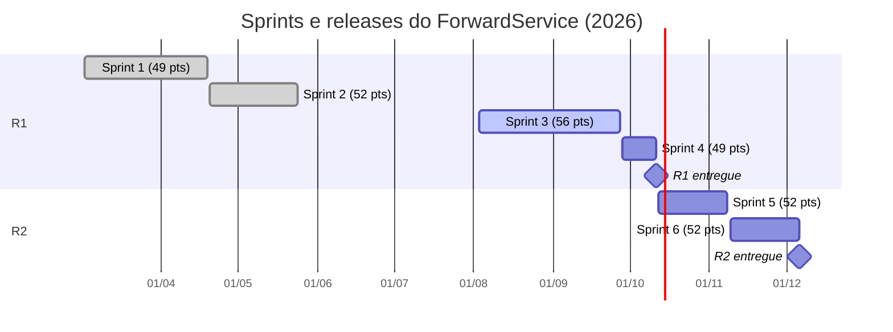
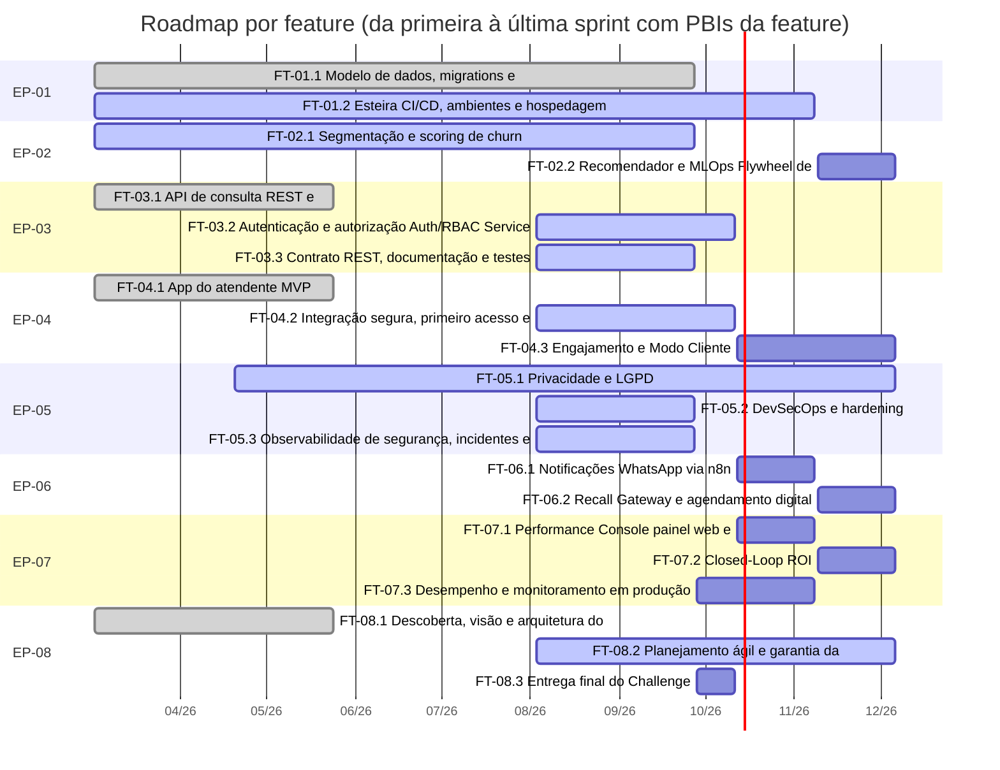
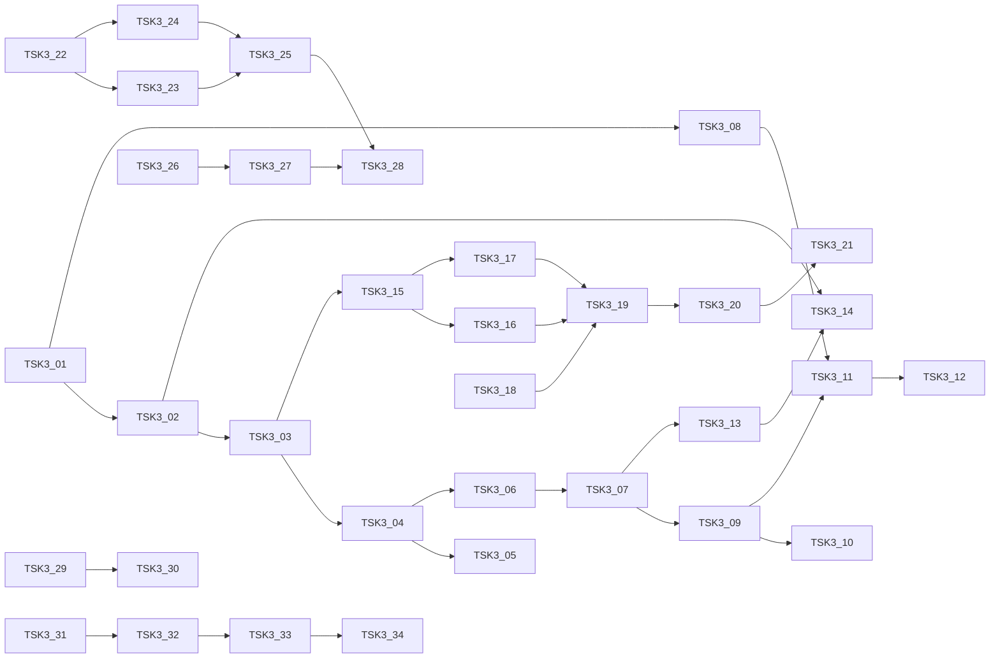

# Plano do projeto no Azure DevOps: ForwardService (Sprint 3)

Entrega da disciplina **Testing, Compliance and Quality Assurance** (Prof. Elias Bernardo), Challenge FIAP x Ford 2026, turma 3ESPZ, Engenharia de Software.

Produto: **ForwardService**, Desafio 02 da Ford (VIN Share e retenção pós-venda). Score de churn por VIN, leads priorizados para o atendente da concessionária e ações proativas medidas de ponta a ponta.

> **Link do projeto no Azure DevOps (preencher depois de publicar):** `https://dev.azure.com/<organizacao>/ForwardService`
>
> O professor precisa estar na organização com acesso **Basic** e no grupo **Project Administrators** do projeto (seção 7.6).

## Sumário

1. [Visão geral](#1-visão-geral)
2. [Backlog alinhado ao TOGAF e ArchiMate](#2-backlog-alinhado-ao-togaf-e-archimate)
3. [Descrição, critérios de aceite (BDD) e Definition of Done](#3-descrição-critérios-de-aceite-bdd-e-definition-of-done)
4. [Prioridade, estimativa, dependências e ordem](#4-prioridade-estimativa-dependências-e-ordem)
5. [Release plan e roadmap](#5-release-plan-e-roadmap)
6. [Sprint 3: detalhamento da sprint atual](#6-sprint-3-detalhamento-da-sprint-atual)
7. [Como publicar no Azure DevOps](#7-como-publicar-no-azure-devops)
8. [Arquivos, testes e evidências](#8-arquivos-testes-e-evidências)
9. [Referências](#9-referências)

## 1. Visão geral

O plano é mantido em um único arquivo, [`backlog.json`](backlog.json), e publicado no Azure DevOps (Azure Boards e Wiki, processo **Scrum**) pelo script [`azure_devops_import.py`](azure_devops_import.py), que usa a REST API 7.1 da Microsoft. Nada é digitado à mão no portal: o mesmo arquivo gera os itens de trabalho, as páginas da wiki, o [CSV de contingência](backlog.csv) e as tabelas deste documento.

### Time e papéis Scrum

| Integrante | RM | Papel no time | Papel Scrum |
| --- | --- | --- | --- |
| João Victor Franco (Jota) | 556790 | Líder técnico; Mobile | Scrum Master e time de desenvolvimento |
| Lucca Saraiva Borges | 554608 | ML e dados | Time de desenvolvimento |
| Ruan Melo Vieira | 557599 | Backend e SOA | Time de desenvolvimento |
| Rodrigo César Jimenez | 558148 | QA e produto | Product Owner e time de desenvolvimento |

### Números do plano

| Nível | Quantidade | Observação |
| --- | --- | --- |
| Épicos | 8 | um por pilar ou camada transversal do ArchiMate |
| Features | 21 | capacidades entregáveis dentro de cada épico |
| PBIs | 60 | 57 planejados em sprints e 3 no backlog futuro (Won't) |
| Tarefas (Sprint 3) | 34 | 134 h estimadas e 30 h restantes |
| Pontos planejados | 310 | média de 51,7 por sprint; maior/menor = 1,14 |

### Onde cada critério da rubrica aparece

| Critério (peso) | No Azure DevOps | Neste documento |
| --- | --- | --- |
| Backlog com épicos, features e PBIs alinhado ao TOGAF/ArchiMate (20%) | Boards > Backlogs (níveis Epics, Features e Backlog items); tags `ArchiMate:<elemento>` e `REQ-xx`; wiki Rastreabilidade TOGAF e ArchiMate | Seção 2 |
| Descrição, critérios de aceite e DoD (20%) | Campos Description e Acceptance Criteria de cada item; colunas Approved (DoR) e Committed (DoD) do board; wiki Definition of Done e BDD | Seção 3 |
| Prioridade, esforço, dependências e ordem (20%) | Campos Priority, Effort, Business Value e Backlog Priority; links Parent/Child e Predecessor/Successor; consultas 01, 02, 03 e 06 | Seção 4 |
| Release plan com sprints e pontos balanceados (20%) | Sprints com datas; Iteration Path de cada PBI; Start/Target Date de épicos e features; consulta 05; wiki Release Plan e Roadmap | Seção 5 |
| Detalhe da sprint atual com tarefas, esforço e dependências (20%) | Boards > Sprints > Sprint 3 (taskboard); Remaining Work, Activity e predecessoras das tarefas; consulta 04; wiki Sprint 3 | Seção 6 |
| Link na nuvem e professor como membro Basic e administrador do projeto | Organization settings > Users; Project Administrators | Seção 7 |

## 2. Backlog alinhado ao TOGAF e ArchiMate

A hierarquia segue o processo Scrum do Azure Boards: **Epic > Feature > Product Backlog Item (PBI) > Task**. Os épicos foram derivados das views do modelo [`ForwardService.archimate`](../../togaf/ForwardService.archimate), gerado por [`gen_archimate.py`](../../togaf/gen_archimate.py):

- **Motivation View**: drivers (Churn pós-garantia, VIN Share baixo), objetivos (Aumentar VIN Share, Reduzir churn pós-venda, ROI mensurável, Escalar cobertura) e princípios (SOA — Portão Único, Flywheel de Dados) justificam cada épico e aparecem na hipótese de valor.
- **Application View**: cada componente (forward-api-java, forward-ml, forward-mobile, forward-web, n8n (Action Engine) e Supabase / PostgreSQL) e cada serviço (Scoring Service, Lead Prioritization, Notification Service, Analytics Service, Auth/RBAC Service e Audit Trail Service) tem épico ou feature dono.
- **Technology View**: a infraestrutura (Docker Engine, Azure VM (B-series), Azure VNet, GitHub Actions CI) está no EP-01 e no EP-05.
- **Requirements View**: os requisitos REQ-01 a REQ-07 viram tags e critérios de aceite mensuráveis.
- **Monitoring View**: Grafana Dashboard, alertas de p95 e disponibilidade, ML Model Monitor e audit_log viewer estão no EP-07, no EP-02 e no EP-05.

### Épicos

| Épico | Pilar ou camada | Elementos ArchiMate (nomes de gen_archimate.py) | Requisitos | Features | Pontos | Estado |
| --- | --- | --- | --- | --- | --- | --- |
| EP-01 Fundação de dados e plataforma | Transversal (Technology Layer) | Supabase / PostgreSQL; PostgreSQL 16; Flyway migrations; GitHub Actions CI; Docker Engine; Azure VM (B-series); Azure VNet; SOA — Portão Único | REQ-02, REQ-05 | FT-01.1, FT-01.2 | 29 | In Progress |
| EP-02 Intelligence Hub: scoring e segmentação de churn | Intelligence Hub | forward-ml; Scoring Service; Segmentar Clientes; Serviço de Scoring; client_scores; client_segments; ML Model Monitor; Flywheel de Dados; Reduzir churn pós-venda | REQ-03, REQ-04, REQ-05 | FT-02.1, FT-02.2 | 34 | In Progress |
| EP-03 Portão Único SOA: forward-api-java | Transversal (Backend Core) | forward-api-java; REST API (OpenAPI); SOAP / WSDL; Auth/RBAC Service; Lead Prioritization; Serviço de Leads; JVM (Java 17); forward-api-java.jar; SOA — Portão Único | REQ-01, REQ-02, REQ-05 | FT-03.1, FT-03.2, FT-03.3 | 48 | In Progress |
| EP-04 Experience Layer: app do atendente e do cliente | Experience Layer | forward-mobile; Atendente; Priorizar Leads; forward-mobile.apk/.ipa; Expo Push API; Cliente Ford | REQ-05, REQ-06, REQ-07 | FT-04.1, FT-04.2, FT-04.3 | 51 | In Progress |
| EP-05 Segurança, privacidade (LGPD) e compliance | Transversal (Cybersecurity) | Auth/RBAC Service; Audit Trail Service; audit_log; audit_log viewer; HTTPS / TLS 1.2+; GitHub Actions CI | REQ-02, REQ-05 | FT-05.1, FT-05.2, FT-05.3 | 33 | In Progress |
| EP-06 Action Engine: n8n e WhatsApp | Action Engine | n8n (Action Engine); n8n (Docker); WhatsApp Business API; WhatsApp Business API (Meta); Notification Service; Serviço de Notificação; Disparar Ação; Recall como Porta; Agendamento Digital; Proatividade sobre reatividade | REQ-05, REQ-07 | FT-06.1, FT-06.2 | 55 | New |
| EP-07 Performance Console e observabilidade | Performance Console | forward-web; Analytics Service; Medir ROI; IHC — Saúde do Dealer; Grafana Dashboard; Alert: API p95 &gt; 300ms; Alert: Disponibilidade &lt;99%; ROI mensurável; Aumentar VIN Share | REQ-01, REQ-02 | FT-07.1, FT-07.2, FT-07.3 | 60 | New |
| EP-08 Governança de produto, qualidade e entregas | Governança (Motivation e Implementation) | Ford Brasil (Diretoria); Equipe ForwardService; Aumentar VIN Share; ForwardService.archimate; PITCH.pptx; VIDEO_PITCH.mp4; Sprint 1 — Entrega 24/05/2026 | - | FT-08.1, FT-08.2, FT-08.3 | 47 | In Progress |

### Features

| Feature | Épico | Elementos ArchiMate | PBIs | Pontos | MoSCoW | Estado |
| --- | --- | --- | --- | --- | --- | --- |
| FT-01.1 Modelo de dados, migrations e ambiente de demonstração | EP-01 | Supabase / PostgreSQL; PostgreSQL 16; Flyway migrations | PBI-005, PBI-017 | 11 | Must | Done |
| FT-01.2 Esteira CI/CD, ambientes e hospedagem | EP-01 | GitHub Actions CI; Docker Engine; Azure VM (B-series); Azure VNet | PBI-001, PBI-033, PBI-042 | 18 | Must | In Progress |
| FT-02.1 Segmentação e scoring de churn (Scoring Service) | EP-02 | forward-ml; Scoring Service; Segmentar Clientes; vin_features.csv; client_segments; client_scores | PBI-008, PBI-013, PBI-014, PBI-031 | 21 | Must | In Progress |
| FT-02.2 Recomendador e MLOps (Flywheel de Dados) | EP-02 | ML Model Monitor; Cron segmentador 02h; Flywheel de Dados; Ação Recomendada | PBI-050, PBI-051 | 13 | Should | New |
| FT-03.1 API de consulta REST e SOAP | EP-03 | forward-api-java; REST API (OpenAPI); SOAP / WSDL; Lead Prioritization; Serviço de Leads | PBI-006, PBI-009, PBI-010, PBI-011 | 23 | Must | Done |
| FT-03.2 Autenticação e autorização (Auth/RBAC Service) | EP-03 | Auth/RBAC Service; forward-api-java | PBI-018, PBI-019, PBI-034 | 13 | Must | In Progress |
| FT-03.3 Contrato REST, documentação e testes da API | EP-03 | REST API (OpenAPI); forward-api-java; GitHub Actions CI | PBI-020, PBI-021, PBI-022, PBI-023 | 12 | Must | In Progress |
| FT-04.1 App do atendente (MVP) | EP-04 | forward-mobile; Priorizar Leads; Atendente | PBI-007, PBI-012 | 13 | Must | Done |
| FT-04.2 Integração segura, primeiro acesso e release do app | EP-04 | forward-mobile; forward-mobile.apk/.ipa; Auth/RBAC Service | PBI-024, PBI-025, PBI-026, PBI-037, PBI-038 | 25 | Must | In Progress |
| FT-04.3 Engajamento e Modo Cliente | EP-04 | forward-mobile; Expo Push API; Cliente Ford; Escalar cobertura | PBI-046, PBI-056 | 13 | Could | New |
| FT-05.1 Privacidade e LGPD | EP-05 | Audit Trail Service; audit_log; Supabase / PostgreSQL | PBI-015, PBI-035, PBI-036, PBI-055 | 20 | Must | In Progress |
| FT-05.2 DevSecOps e hardening | EP-05 | GitHub Actions CI; Docker Engine; HTTPS / TLS 1.2+ | PBI-027, PBI-028 | 8 | Must | In Progress |
| FT-05.3 Observabilidade de segurança, incidentes e conformidade | EP-05 | Grafana Dashboard; audit_log viewer; Alert: Disponibilidade &lt;99% | PBI-029, PBI-030 | 5 | Must | In Progress |
| FT-06.1 Notificações WhatsApp via n8n | EP-06 | n8n (Action Engine); WhatsApp Business API; Notification Service; Disparar Ação | PBI-043, PBI-044, PBI-045 | 21 | Must | New |
| FT-06.2 Recall Gateway e agendamento digital | EP-06 | Recall como Porta; Agendamento Digital; Serviço de Agendamento | PBI-052, PBI-053, PBI-060 | 34 | Should | New |
| FT-07.1 Performance Console: painel web e Analytics | EP-07 | forward-web; Analytics Service; IHC — Saúde do Dealer; Diretor Regional | PBI-047, PBI-048, PBI-058 | 26 | Should | New |
| FT-07.2 Closed-Loop ROI | EP-07 | Medir ROI; ROI mensurável | PBI-054, PBI-059 | 21 | Should | New |
| FT-07.3 Desempenho e monitoramento em produção | EP-07 | Grafana Dashboard; Alert: API p95 &gt; 300ms; Alert: Disponibilidade &lt;99% | PBI-039, PBI-049 | 13 | Should | New |
| FT-08.1 Descoberta, visão e arquitetura do produto | EP-08 | Ford Brasil (Diretoria); Aumentar VIN Share; ForwardService.archimate | PBI-002, PBI-003, PBI-004, PBI-016 | 26 | Must | Done |
| FT-08.2 Planejamento ágil e garantia da qualidade | EP-08 | Equipe ForwardService | PBI-032, PBI-057 | 10 | Must | In Progress |
| FT-08.3 Entrega final do Challenge | EP-08 | VIDEO_PITCH.mp4; Equipe ForwardService | PBI-040, PBI-041 | 11 | Must | New |

### Requisitos de qualidade (REQ-01 a REQ-07)

| Requisito (Requirements View) | Épicos | PBIs que realizam ou evidenciam |
| --- | --- | --- |
| REQ-01: Latência API p95 &lt; 300ms | EP-03, EP-05, EP-07, EP-08 | PBI-009, PBI-010, PBI-011, PBI-016, PBI-020, PBI-021, PBI-022, PBI-029, PBI-039, PBI-047, PBI-048, PBI-049, PBI-054, PBI-057 |
| REQ-02: Disponibilidade ≥ 99% | EP-01, EP-03, EP-04, EP-05, EP-07, EP-08 | PBI-001, PBI-016, PBI-017, PBI-022, PBI-025, PBI-029, PBI-033, PBI-042, PBI-048, PBI-049 |
| REQ-03: AUC classificador ≥ 0,82 | EP-02, EP-08 | PBI-014, PBI-016, PBI-031, PBI-050, PBI-051 |
| REQ-04: Falsos positivos churn &lt; 10% | EP-02, EP-08 | PBI-013, PBI-014, PBI-016, PBI-031, PBI-051 |
| REQ-05: LGPD — dados pseudonimizados | EP-01, EP-02, EP-03, EP-04, EP-05, EP-06, EP-08 | PBI-005, PBI-008, PBI-013, PBI-015, PBI-016, PBI-018, PBI-019, PBI-024, PBI-027, PBI-028, PBI-029, PBI-030, PBI-034, PBI-035, PBI-036, PBI-037, PBI-045, PBI-050, PBI-055, PBI-056, PBI-057 |
| REQ-06: Onboarding atendente &lt; 15 min | EP-03, EP-04, EP-06, EP-08 | PBI-007, PBI-012, PBI-016, PBI-023, PBI-024, PBI-025, PBI-026, PBI-037, PBI-038, PBI-053, PBI-056 |
| REQ-07: Entrega WhatsApp &lt; 30s | EP-04, EP-06, EP-08 | PBI-016, PBI-043, PBI-044, PBI-045, PBI-046, PBI-052, PBI-053 |

### Convenções no Azure Boards

- Título com a chave de rastreio: `[PBI-018] Emissão de JWT próprio no login da API`. A chave liga o item ao `backlog.json` e permite reexecutar o script sem duplicar nada.
- Tags: `fwd-import` (itens do plano), `MoSCoW:<classe>`, `Frente:<SOA|Mobile|ML|Cyber|QA|Infra|Produto|Web>`, `ArchiMate:<elemento>` e `REQ-xx`. Nas tags a vírgula vira ponto, porque o Azure DevOps não aceita vírgula em tag (por exemplo `ArchiMate:3.4M Recalls pendentes`).
- Épicos e features ficam na iteração raiz do projeto e recebem Start Date e Target Date calculadas a partir das sprints dos PBIs filhos, o que alimenta o roadmap e os Delivery Plans.

## 3. Descrição, critérios de aceite (BDD) e Definition of Done

### Descrição do PBI

Todo PBI tem, no campo **Description**:

1. a história no formato `Como <persona>, quero <ação>, para <benefício>`, com personas do mapa de personas da Base Fundacional e do ArchiMate (Atendente, Gerente de Serviço, Diretor Regional, Cliente Ford, Gestor de Retenção, Analista ML e outras);
2. o contexto técnico;
3. o planejamento (sprint, MoSCoW, pontos, valor de negócio, responsável, ordem e predecessoras);
4. a rastreabilidade (elementos ArchiMate, requisitos REQ-xx, feature e épico);
5. os **Critérios de Pronto (DoD)**: a DoD geral mais critérios específicos do item.

Épicos têm objetivo, hipótese de valor, métricas de sucesso e critérios de aceite de resultado. Features têm objetivo, persona, cenários BDD de ponta a ponta e a DoD de feature.

### Critérios de aceite em BDD

Os critérios ficam no campo **Acceptance Criteria**, em Gherkin português (Funcionalidade, Cenário, Dado, Quando, Então, E). Regras adotadas:

- pelo menos um cenário de caminho feliz e um de erro ou de borda por PBI (o script de importação e os testes recusam PBIs sem isso);
- um comportamento por cenário, em linguagem de negócio;
- resultado observável e mensurável (status HTTP, mensagem, tempo, registro em auditoria);
- critérios de qualidade citam o requisito ArchiMate (por exemplo REQ-01 para latência e REQ-06 para onboarding);
- os cenários da API viram testes executáveis (PBI-057, Cucumber-JVM com Gherkin em português).

Exemplo completo (PBI-018, Sprint 3):

Como **Atendente da concessionária**, quero **entrar com e-mail e senha e receber um token de acesso**, para **usar o app sem depender de um provedor de autenticação externo**.

```gherkin
# language: pt
Funcionalidade: Autenticação por JWT

  Cenário: Login válido (caminho feliz)
    Dado um usuário com papel ATENDENTE cadastrado
    Quando ele envia POST /api/v1/auth/login com credenciais corretas
    Então recebe 200 com accessToken, tokenType Bearer e expiresIn
    E o token contém os claims sub, role e dealer

  Cenário: Senha incorreta (erro)
    Dado um e-mail cadastrado
    Quando a senha enviada está errada
    Então a API responde 401 em application/problem+json
    E a mensagem não revela se o e-mail existe

  Cenário: Token expirado (caso de borda)
    Dado um token cuja expiração já passou
    Quando ele é usado em um endpoint protegido
    Então a API responde 401
```

### Definition of Ready (entrada na sprint)

1. História no formato Como &lt;persona&gt;, quero &lt;ação&gt;, para &lt;benefício&gt;, usando uma persona do mapa de personas (Base Fundacional e ArchiMate).
2. Critérios de aceite em Gherkin (pt-BR) com o caminho feliz e pelo menos um cenário de erro ou de borda.
3. Estimado em Planning Poker na escala Fibonacci (1, 2, 3, 5, 8, 13); itens maiores que 13 são quebrados antes da sprint.
4. Dependências (predecessoras) identificadas e concluídas ou planejadas para antes do item.
5. Rastreabilidade registrada: feature pai, elemento ArchiMate e requisito de qualidade (REQ-xx) nas tags.
6. Prioridade MoSCoW definida pelo Product Owner e valor de negócio atribuído.

### Definition of Done

DoD do PBI:

1. Todos os cenários Gherkin do critério de aceite verificados e evidenciados (teste automatizado, relatório ou roteiro com prints).
2. Código ou artefato revisado em pull request aprovado por outro integrante (CODEOWNERS) e integrado à branch main.
3. Pipeline de CI verde: build, testes, lint e verificações de segurança (SAST, SCA e secret scan).
4. Testes automatizados para o caminho feliz e para os cenários de erro sempre que o item envolve código.
5. Nenhuma vulnerabilidade High/Critical aberta sem aceite formal, nenhum segredo commitado e dados pessoais tratados conforme a LGPD (REQ-05).
6. Requisitos de qualidade aplicáveis (REQ-01 a REQ-07) atendidos e medidos.
7. Documentação atualizada (README, OpenAPI, wiki ou model card) e rastreabilidade ArchiMate mantida nas tags.
8. Demonstrado ao Product Owner na Sprint Review e estado atualizado para Done no Azure Boards.

DoD da feature:

1. Todos os PBIs filhos em Done ou movidos explicitamente pelo Product Owner.
2. Fluxo ponta a ponta da feature demonstrado em ambiente integrado.
3. Critérios de aceite da feature verificados na Sprint Review.
4. Documentação e diagramas afetados atualizados (README, wiki, views ArchiMate).

DoD do épico:

1. Features necessárias em Done; as remanescentes repriorizadas pelo Product Owner.
2. Métricas de sucesso do épico medidas e registradas na wiki.
3. Views ArchiMate atualizadas quando a arquitetura mudou.
4. Resultado apresentado aos stakeholders (banca FIAP x Ford) e lições registradas na retrospectiva.

DoD da tarefa:

1. Trabalho commitado em branch vinculada ao PBI e revisado por outro integrante.
2. Remaining Work zerado e estado Done no taskboard.
3. Evidência registrada no PBI quando a tarefa é de teste ou de documentação.

A DoD evoluiu com o projeto:

| Sprints | DoD vigente |
| --- | --- |
| Sprints 1 e 2 | DoD inicial: PR revisado, CI mínimo (lint e build), critérios de aceite demonstrados ao PO e documentação no README. |
| Sprint 3 em diante | DoD atual: soma testes automatizados com relatório, pipeline DevSecOps (SAST, SCA, secret scan e Trivy), requisitos de qualidade REQ-01 a REQ-07 medidos e rastreabilidade ArchiMate nas tags. |

No board de Backlog items, o script grava a Definition of Ready na coluna **Approved** e a DoD do PBI na coluna **Committed** (recurso Definition of done das colunas do Azure Boards).

## 4. Prioridade, estimativa, dependências e ordem

### Prioridade: MoSCoW mapeado para o campo Priority

A prioridade expressa obrigatoriedade (Must), necessidade (Should) e opcionalidade (Could). Itens Won't ficam no backlog, sem sprint, para mostrar o que foi conscientemente deixado de fora.

| MoSCoW | Priority no Azure | Critério | PBIs | Pontos |
| --- | --- | --- | --- | --- |
| Must | 1 | Obrigatório: exigido pela rubrica de uma disciplina do Challenge, pela LGPD ou pré-requisito de outro Must. Sem ele a release não é aceita. | 38 | 197 |
| Should | 2 | Necessário: alto valor para o usuário ou para a qualidade, mas existe contorno temporário. Entra na release se a capacidade permitir. | 15 | 87 |
| Could | 3 | Opcional: desejável, com baixo impacto se ficar de fora; primeiro candidato a corte. | 4 | 26 |
| Won't | 4 | Fora deste horizonte: registrado para transparência, sem sprint planejada; reavaliado a cada release. | 3 | 47 |

O **Business Value** (1 a 100) desempata itens da mesma prioridade e vem do Quadro de Valor.

### Esforço: Planning Poker

Escala Fibonacci modificada: **1, 2, 3, 5, 8, 13 e 21** pontos no campo **Effort** do PBI. Épicos e features recebem a soma dos filhos.

- Cada integrante vota em segredo e as cartas são reveladas juntas.
- Se os votos divergem mais de dois valores da escala, os extremos explicam e há nova rodada (no máximo três).
- A história de referência (5 pontos) é o PBI-011, registro de evento de serviço com erros RFC 7807: conhecida por todo o time e com esforço estável.
- Itens acima de 13 pontos não entram em sprint: são quebrados (o 21 aparece apenas no backlog futuro).
- Tarefas são estimadas em horas (Remaining Work) com uma nota de complexidade em pontos Fibonacci.

As tarefas da sprint são estimadas em horas no campo **Remaining Work** (o único campo de horas da tarefa no processo Scrum) e têm uma nota de complexidade em pontos Fibonacci na descrição.

### Dependências

Há dois tipos de ligação no Azure Boards:

- **Parent/Child** (`System.LinkTypes.Hierarchy-Reverse` no filho): épico > feature > PBI > tarefa;
- **Predecessor/Successor** (`System.LinkTypes.Dependency-Reverse` no sucessor, apontando para a predecessora): ordem técnica entre PBIs e entre tarefas.

Caminho crítico planejado (maior soma de pontos numa cadeia de predecessoras): **PBI-002 → PBI-003 → PBI-004 → PBI-005 → PBI-006 → PBI-009 → PBI-017 → PBI-018 → PBI-024 → PBI-025 → PBI-026 → PBI-037 → PBI-045 → PBI-053 → PBI-054** (91 pontos).

No Azure Boards são 80 links predecessora/sucessora entre PBIs e 34 entre tarefas da Sprint 3, além de 115 links pai/filho.

Mapa de dependências entre PBIs, agrupado por sprint:

```mermaid
graph LR
    subgraph S1["Sprint 1"]
        PBI001["PBI-001 Setup do time papéis"]
        PBI002["PBI-002 Pesquisa de mercado e"]
        PBI003["PBI-003 Base Fundacional tese, 4"]
        PBI004["PBI-004 Solution Design e arquitetura-alvo"]
        PBI005["PBI-005 Schema PostgreSQL com migrations"]
        PBI006["PBI-006 Protótipo da API e"]
        PBI007["PBI-007 Scaffold do app mobile"]
        PBI008["PBI-008 Ambiente de ML reprodutível"]
    end
    subgraph S2["Sprint 2"]
        PBI009["PBI-009 API REST em camadas"]
        PBI010["PBI-010 Operação SOAP GetVehicle com"]
        PBI011["PBI-011 Registro de evento de"]
        PBI012["PBI-012 App do atendente dashboard,"]
        PBI013["PBI-013 Features comportamentais e segmentação"]
        PBI014["PBI-014 Classificador de churn calibrado"]
        PBI015["PBI-015 Baseline de segurança de"]
        PBI016["PBI-016 Pitch, Canvas, Quadro de"]
    end
    subgraph S3["Sprint 3"]
        PBI017["PBI-017 Perfil demo autocontido H2"]
        PBI018["PBI-018 Emissão de JWT próprio"]
        PBI019["PBI-019 Autorização por papel ATENDENTE,"]
        PBI020["PBI-020 Maturidade REST nível 2"]
        PBI021["PBI-021 Erros RFC 7807 padronizados"]
        PBI022["PBI-022 Testes automatizados da API"]
        PBI023["PBI-023 Diagrama de arquitetura SOA"]
        PBI024["PBI-024 App consome a API"]
        PBI025["PBI-025 Modo demo/offline com dados"]
        PBI026["PBI-026 Release APK com identidade"]
        PBI027["PBI-027 Pipeline DevSecOps no GitHub"]
        PBI028["PBI-028 Hardening de código e"]
        PBI029["PBI-029 Plano de observabilidade e"]
        PBI030["PBI-030 Checklist de conformidade OWASP"]
        PBI031["PBI-031 Comparação de modelos de"]
        PBI032["PBI-032 Plano do projeto no"]
    end
    subgraph S4["Sprint 4"]
        PBI033["PBI-033 Deploy de demonstração com"]
        PBI034["PBI-034 Refresh token e revogação"]
        PBI035["PBI-035 Criptografia de PII em"]
        PBI036["PBI-036 Logs sem PII e"]
        PBI037["PBI-037 Primeiro acesso consentimento LGPD"]
        PBI038["PBI-038 Testes E2E do fluxo"]
        PBI039["PBI-039 Teste de desempenho da"]
        PBI040["PBI-040 Vídeo pitch técnico até"]
        PBI041["PBI-041 Pacote final de entrega"]
    end
    subgraph S5["Sprint 5"]
        PBI042["PBI-042 Hospedagem na Azure VM"]
        PBI043["PBI-043 Ordens de ação da"]
        PBI044["PBI-044 Lembrete de revisão via"]
        PBI045["PBI-045 Respostas do cliente e"]
        PBI046["PBI-046 Push de lead crítico"]
        PBI047["PBI-047 Serviço de Analytics segmentos,"]
        PBI048["PBI-048 Painel web Visão da"]
        PBI049["PBI-049 Monitoramento com Grafana e"]
    end
    subgraph S6["Sprint 6"]
        PBI050["PBI-050 Recomendador de ação por"]
        PBI051["PBI-051 Monitor de modelo e"]
        PBI052["PBI-052 Recall Gateway recall pendente"]
        PBI053["PBI-053 Agendamento digital da revisão"]
        PBI054["PBI-054 Closed-Loop ROI da ação"]
        PBI055["PBI-055 Anonimização completa e direito"]
        PBI056["PBI-056 Modo Cliente no app"]
        PBI057["PBI-057 Automação dos critérios de"]
    end
    subgraph S7["Backlog futuro"]
        PBI058["PBI-058 Rede Invertida mapa de"]
        PBI059["PBI-059 Ponte Serviço-Venda"]
        PBI060["PBI-060 Integração com o DMS"]
    end
    PBI002 --> PBI003
    PBI003 --> PBI004
    PBI001 --> PBI005
    PBI004 --> PBI005
    PBI004 --> PBI006
    PBI005 --> PBI006
    PBI001 --> PBI007
    PBI001 --> PBI008
    PBI006 --> PBI009
    PBI009 --> PBI010
    PBI009 --> PBI011
    PBI007 --> PBI012
    PBI009 --> PBI012
    PBI008 --> PBI013
    PBI013 --> PBI014
    PBI005 --> PBI015
    PBI004 --> PBI016
    PBI009 --> PBI017
    PBI017 --> PBI018
    PBI018 --> PBI019
    PBI009 --> PBI020
    PBI019 --> PBI021
    PBI020 --> PBI021
    PBI017 --> PBI022
    PBI021 --> PBI022
    PBI017 --> PBI023
    PBI019 --> PBI023
    PBI018 --> PBI024
    PBI024 --> PBI025
    PBI024 --> PBI026
    PBI025 --> PBI026
    PBI001 --> PBI027
    PBI027 --> PBI028
    PBI015 --> PBI029
    PBI028 --> PBI030
    PBI029 --> PBI030
    PBI014 --> PBI031
    PBI016 --> PBI032
    PBI017 --> PBI033
    PBI027 --> PBI033
    PBI018 --> PBI034
    PBI024 --> PBI034
    PBI015 --> PBI035
    PBI028 --> PBI036
    PBI026 --> PBI037
    PBI026 --> PBI038
    PBI022 --> PBI039
    PBI033 --> PBI039
    PBI022 --> PBI040
    PBI026 --> PBI040
    PBI030 --> PBI041
    PBI040 --> PBI041
    PBI033 --> PBI042
    PBI035 --> PBI043
    PBI042 --> PBI043
    PBI043 --> PBI044
    PBI044 --> PBI045
    PBI037 --> PBI045
    PBI043 --> PBI046
    PBI031 --> PBI047
    PBI047 --> PBI048
    PBI042 --> PBI049
    PBI039 --> PBI049
    PBI031 --> PBI050
    PBI045 --> PBI050
    PBI050 --> PBI051
    PBI049 --> PBI051
    PBI044 --> PBI052
    PBI045 --> PBI053
    PBI053 --> PBI054
    PBI047 --> PBI054
    PBI035 --> PBI055
    PBI036 --> PBI055
    PBI053 --> PBI056
    PBI037 --> PBI056
    PBI032 --> PBI057
    PBI038 --> PBI057
    PBI048 --> PBI058
    PBI054 --> PBI059
    PBI053 --> PBI060
```



### Ordem do backlog

O campo **Backlog Priority** recebe a ordem de implementação (ordem 1 = PBI-001). A ordem respeita as predecessoras (nenhum item vem antes de algo de que depende), agrupa os itens pela sprint de entrega e, dentro da sprint, segue a cadeia técnica e o MoSCoW. A coluna Ordem das tabelas da seção 5 é essa sequência.

## 5. Release plan e roadmap

### Releases

| Release | Sprints | Data | Pontos | Conteúdo principal |
| --- | --- | --- | --- | --- |
| Release 1: MVP acadêmico (Challenge FIAP x Ford) | Sprint 1, Sprint 2, Sprint 3, Sprint 4 | 11/10/2026 | 206 | Discovery, MVP (API REST/SOAP, app, ML), segurança e qualidade, vídeo final |
| Release 2: piloto em concessionária | Sprint 5, Sprint 6 | 06/12/2026 | 104 | Action Engine WhatsApp, Performance Console, monitoramento, ROI, recomendador e LGPD completa |
| Backlog futuro (Won't have now) | sem sprint | a definir | 47 | Rede Invertida, Ponte Serviço-Venda e integração com DMS |

### Pontos por sprint (balanceamento)

| Sprint | Período | Status | PBIs | Pontos | Desvio da média |
| --- | --- | --- | --- | --- | --- |
| Sprint 1 | 02/03/2026 a 19/04/2026 | Concluída | 8 | 49 | -5% |
| Sprint 2 | 20/04/2026 a 24/05/2026 | Concluída | 8 | 52 | +1% |
| Sprint 3 | 03/08/2026 a 27/09/2026 | Em andamento | 16 | 56 | +8% |
| Sprint 4 | 28/09/2026 a 11/10/2026 | Planejada | 9 | 49 | -5% |
| Sprint 5 | 12/10/2026 a 08/11/2026 | Planejada | 8 | 52 | +1% |
| Sprint 6 | 09/11/2026 a 06/12/2026 | Planejada | 8 | 52 | +1% |
| **Total** | | | 57 | **310** | média 51,7 |

A capacidade efetiva de cada sprint do Challenge é parecida, apesar das durações diferentes no calendário: as sprints longas dividem o tempo com as outras disciplinas e a Sprint 4, curta, tem dedicação quase exclusiva. Por isso a velocidade planejada é de cerca de 50 pontos por sprint, com variação máxima de 20% entre a maior e a menor sprint.

### Roadmap das sprints



### Roadmap por feature



### Itens por sprint (na ordem do backlog)

### Sprint 1 (02/03/2026 a 19/04/2026): 49 pontos

Objetivo: Descoberta e fundação: pesquisa validada, visão de produto, arquitetura-alvo e base técnica (repositórios, CI, banco e scaffolds).

| Ordem | PBI | Título | Feature | MoSCoW | Pontos | Estado | Resp. | Predecessoras |
| --- | --- | --- | --- | --- | --- | --- | --- | --- |
| 1 | PBI-001 | Setup do time: papéis Scrum, organização GitHub, repositórios e CI mínimo | FT-01.2 | Must | 8 | Done | Jota | - |
| 2 | PBI-002 | Pesquisa de mercado e validação de hipóteses (30 pesquisas) | FT-08.1 | Must | 8 | Done | Rodrigo | - |
| 3 | PBI-003 | Base Fundacional: tese, 4 pilares, 9 lógicas de negócio e personas | FT-08.1 | Must | 5 | Done | Jota | PBI-002 |
| 4 | PBI-004 | Solution Design e arquitetura-alvo com decisões registradas (ADRs) | FT-08.1 | Must | 5 | Done | Jota | PBI-003 |
| 5 | PBI-005 | Schema PostgreSQL com migrations versionadas e seed sintético | FT-01.1 | Must | 8 | Done | Ruan | PBI-001, PBI-004 |
| 6 | PBI-006 | Protótipo da API e congelamento dos contratos compartilhados | FT-03.1 | Must | 5 | Done | Ruan | PBI-004, PBI-005 |
| 7 | PBI-007 | Scaffold do app mobile com login, lista de leads e i18n | FT-04.1 | Must | 5 | Done | Jota | PBI-001 |
| 8 | PBI-008 | Ambiente de ML reprodutível e EDA inicial | FT-02.1 | Must | 5 | Done | Lucca | PBI-001 |

### Sprint 2 (20/04/2026 a 24/05/2026): 52 pontos

Objetivo: MVP demonstrável: API REST/SOAP, app do atendente, pipeline de ML e artefatos de negócio e arquitetura TOGAF/ArchiMate.

| Ordem | PBI | Título | Feature | MoSCoW | Pontos | Estado | Resp. | Predecessoras |
| --- | --- | --- | --- | --- | --- | --- | --- | --- |
| 9 | PBI-009 | API REST em camadas: veículos, clientes, scores e leads | FT-03.1 | Must | 8 | Done | Ruan | PBI-006 |
| 10 | PBI-010 | Operação SOAP GetVehicle com WSDL contract-first | FT-03.1 | Must | 5 | Done | Ruan | PBI-009 |
| 11 | PBI-011 | Registro de evento de serviço com erros RFC 7807 e contrato OpenAPI | FT-03.1 | Must | 5 | Done | Ruan | PBI-009 |
| 12 | PBI-012 | App do atendente: dashboard, leads priorizados e Vista 360 | FT-04.1 | Must | 8 | Done | Jota | PBI-007, PBI-009 |
| 13 | PBI-013 | Features comportamentais e segmentação K-means em 4 perfis | FT-02.1 | Must | 5 | Done | Lucca | PBI-008 |
| 14 | PBI-014 | Classificador de churn calibrado (XGBoost two-stage) | FT-02.1 | Must | 8 | Done | Lucca | PBI-013 |
| 15 | PBI-015 | Baseline de segurança de dados: RLS, audit_log e retenção LGPD | FT-05.1 | Must | 5 | Done | Jota | PBI-005 |
| 16 | PBI-016 | Pitch, Canvas, Quadro de Valor e arquitetura TOGAF/ArchiMate | FT-08.1 | Must | 8 | Done | Rodrigo | PBI-004 |

### Sprint 3 (03/08/2026 a 27/09/2026): 56 pontos

Objetivo: Segurança e qualidade de ponta a ponta: JWT e RBAC próprios, contrato REST nível 2, testes com evidência, app em release APK, DevSecOps e plano no Azure DevOps.

| Ordem | PBI | Título | Feature | MoSCoW | Pontos | Estado | Resp. | Predecessoras |
| --- | --- | --- | --- | --- | --- | --- | --- | --- |
| 17 | PBI-017 | Perfil demo autocontido (H2 + seed) substituindo o Supabase removido | FT-01.1 | Must | 3 | Done | Ruan | PBI-009 |
| 18 | PBI-018 | Emissão de JWT próprio no login da API | FT-03.2 | Must | 5 | Done | Ruan | PBI-017 |
| 19 | PBI-019 | Autorização por papel (ATENDENTE, GESTOR, ADMIN) | FT-03.2 | Must | 3 | Done | Ruan | PBI-018 |
| 20 | PBI-020 | Maturidade REST nível 2: recursos, verbos e códigos de status | FT-03.3 | Must | 3 | Done | Ruan | PBI-009 |
| 21 | PBI-021 | Erros RFC 7807 padronizados e OpenAPI com autenticação bearer | FT-03.3 | Must | 2 | Done | Ruan | PBI-019, PBI-020 |
| 22 | PBI-022 | Testes automatizados da API com relatório de evidências | FT-03.3 | Must | 5 | Committed | Ruan | PBI-017, PBI-021 |
| 23 | PBI-023 | Diagrama de arquitetura SOA e README de execução | FT-03.3 | Must | 2 | Committed | Ruan | PBI-017, PBI-019 |
| 24 | PBI-024 | App consome a API com JWT guardado no SecureStore | FT-04.2 | Must | 5 | Done | Jota | PBI-018 |
| 25 | PBI-025 | Modo demo/offline com dados de fallback | FT-04.2 | Should | 2 | Done | Jota | PBI-024 |
| 26 | PBI-026 | Release APK com identidade visual consolidada e README ilustrado | FT-04.2 | Must | 5 | Committed | Jota | PBI-024, PBI-025 |
| 27 | PBI-027 | Pipeline DevSecOps no GitHub Actions | FT-05.2 | Must | 5 | Done | Jota | PBI-001 |
| 28 | PBI-028 | Hardening de código e infraestrutura com evidências | FT-05.2 | Must | 3 | Committed | Ruan | PBI-027 |
| 29 | PBI-029 | Plano de observabilidade e resposta a incidentes | FT-05.3 | Must | 2 | Committed | Rodrigo | PBI-015 |
| 30 | PBI-030 | Checklist de conformidade (OWASP ASVS, API e Mobile Top 10, LGPD) | FT-05.3 | Must | 3 | Approved | Rodrigo | PBI-028, PBI-029 |
| 31 | PBI-031 | Comparação de modelos de churn da Sprint 3 | FT-02.1 | Must | 3 | Committed | Lucca | PBI-014 |
| 32 | PBI-032 | Plano do projeto no Azure DevOps (backlog, BDD, DoD e release) | FT-08.2 | Must | 5 | Committed | Rodrigo | PBI-016 |

### Sprint 4 (28/09/2026 a 11/10/2026): 49 pontos

Objetivo: Entrega final do Challenge: vídeo pitch técnico, ambiente de demonstração estável e hardening final.

| Ordem | PBI | Título | Feature | MoSCoW | Pontos | Estado | Resp. | Predecessoras |
| --- | --- | --- | --- | --- | --- | --- | --- | --- |
| 33 | PBI-033 | Deploy de demonstração com Docker Compose e smoke test pós-deploy | FT-01.2 | Must | 5 | Approved | Ruan | PBI-017, PBI-027 |
| 34 | PBI-034 | Refresh token e revogação de sessão | FT-03.2 | Should | 5 | Approved | Ruan | PBI-018, PBI-024 |
| 35 | PBI-035 | Criptografia de PII em nível de campo | FT-05.1 | Should | 5 | New | Ruan | PBI-015 |
| 36 | PBI-036 | Logs sem PII e auditoria de ações sensíveis | FT-05.1 | Should | 5 | New | Jota | PBI-028 |
| 37 | PBI-037 | Primeiro acesso: consentimento LGPD e onboarding guiado | FT-04.2 | Should | 8 | Approved | Jota | PBI-026 |
| 38 | PBI-038 | Testes E2E do fluxo crítico do app | FT-04.2 | Should | 5 | Approved | Rodrigo | PBI-026 |
| 39 | PBI-039 | Teste de desempenho da API (p95 &lt; 300 ms) | FT-07.3 | Should | 5 | Approved | Rodrigo | PBI-022, PBI-033 |
| 40 | PBI-040 | Vídeo pitch técnico (até 6 minutos) | FT-08.3 | Must | 8 | Approved | Rodrigo | PBI-022, PBI-026 |
| 41 | PBI-041 | Pacote final de entrega e ensaio da banca | FT-08.3 | Must | 3 | New | Jota | PBI-030, PBI-040 |

### Sprint 5 (12/10/2026 a 08/11/2026): 52 pontos

Objetivo: Piloto com ação: Action Engine no WhatsApp, Performance Console e monitoramento em produção.

| Ordem | PBI | Título | Feature | MoSCoW | Pontos | Estado | Resp. | Predecessoras |
| --- | --- | --- | --- | --- | --- | --- | --- | --- |
| 42 | PBI-042 | Hospedagem na Azure VM com Docker e VNet | FT-01.2 | Should | 5 | New | Ruan | PBI-033 |
| 43 | PBI-043 | Ordens de ação da API para o n8n (outbox e HMAC) | FT-06.1 | Must | 5 | New | Ruan | PBI-035, PBI-042 |
| 44 | PBI-044 | Lembrete de revisão via WhatsApp Business | FT-06.1 | Must | 8 | New | Jota | PBI-043 |
| 45 | PBI-045 | Respostas do cliente e opt-out pelo WhatsApp | FT-06.1 | Must | 8 | New | Ruan | PBI-044, PBI-037 |
| 46 | PBI-046 | Push de lead crítico no app (Expo Push) | FT-04.3 | Could | 5 | New | Jota | PBI-043 |
| 47 | PBI-047 | Serviço de Analytics: segmentos, Curva da Morte e IHC | FT-07.1 | Should | 5 | New | Lucca | PBI-031 |
| 48 | PBI-048 | Painel web Visão da Frota | FT-07.1 | Should | 8 | New | Rodrigo | PBI-047 |
| 49 | PBI-049 | Monitoramento com Grafana e alertas de SLA | FT-07.3 | Should | 8 | New | Lucca | PBI-042, PBI-039 |

### Sprint 6 (09/11/2026 a 06/12/2026): 52 pontos

Objetivo: Ciclo fechado: agendamento, Recall Gateway, ROI, recomendador por ML e LGPD completa.

| Ordem | PBI | Título | Feature | MoSCoW | Pontos | Estado | Resp. | Predecessoras |
| --- | --- | --- | --- | --- | --- | --- | --- | --- |
| 50 | PBI-050 | Recomendador de ação por ML (camada 3) | FT-02.2 | Could | 8 | New | Lucca | PBI-031, PBI-045 |
| 51 | PBI-051 | Monitor de modelo e retreino mensal (Flywheel de Dados) | FT-02.2 | Should | 5 | New | Lucca | PBI-050, PBI-049 |
| 52 | PBI-052 | Recall Gateway: recall pendente vira convite de retorno | FT-06.2 | Could | 5 | New | Jota | PBI-044 |
| 53 | PBI-053 | Agendamento digital da revisão | FT-06.2 | Should | 8 | New | Ruan | PBI-045 |
| 54 | PBI-054 | Closed-Loop ROI: da ação à receita | FT-07.2 | Should | 8 | New | Rodrigo | PBI-053, PBI-047 |
| 55 | PBI-055 | Anonimização completa e direito ao esquecimento | FT-05.1 | Must | 5 | New | Ruan | PBI-035, PBI-036 |
| 56 | PBI-056 | Modo Cliente no app (Fluxo Simplificado) | FT-04.3 | Could | 8 | New | Jota | PBI-053, PBI-037 |
| 57 | PBI-057 | Automação dos critérios de aceite BDD no pipeline | FT-08.2 | Should | 5 | New | Rodrigo | PBI-032, PBI-038 |

### Backlog futuro (Won't have now)

| Ordem | PBI | Título | Feature | Pontos | Predecessoras |
| --- | --- | --- | --- | --- | --- |
| 58 | PBI-058 | Rede Invertida: mapa de desertos de serviço | FT-07.1 | 13 | PBI-048 |
| 59 | PBI-059 | Ponte Serviço-Venda | FT-07.2 | 13 | PBI-054 |
| 60 | PBI-060 | Integração com o DMS das concessionárias | FT-06.2 | 21 | PBI-053 |

## 6. Sprint 3: detalhamento da sprint atual

- **Período:** 03/08/2026 a 27/09/2026 (sprint em andamento, termina hoje).
- **Objetivo:** segurança e qualidade de ponta a ponta: JWT e RBAC próprios, contrato REST nível 2, testes com evidência, app em release APK, DevSecOps e o plano no Azure DevOps.
- **Onde ver no Azure DevOps:** Boards > Sprints > Sprint 3 (backlog da sprint e taskboard) e a consulta `04 Sprint 3 PBIs e tarefas`.
- **Burndown e capacidade:** Boards > Sprints > Sprint 3 > Analytics e Capacity.
- **Carry-over:** o que não estiver em Done no fim da sprint volta ao Sprint Planning da Sprint 4 e é repriorizado pelo PO.

### PBIs da Sprint 3

| PBI | Título | Resp. | Pontos | Estado | Tarefas feitas |
| --- | --- | --- | --- | --- | --- |
| PBI-017 | Perfil demo autocontido (H2 + seed) substituindo o Supabase removido | Ruan | 3 | Done | 2 de 2 |
| PBI-018 | Emissão de JWT próprio no login da API | Ruan | 5 | Done | 3 de 3 |
| PBI-019 | Autorização por papel (ATENDENTE, GESTOR, ADMIN) | Ruan | 3 | Done | 2 de 2 |
| PBI-020 | Maturidade REST nível 2: recursos, verbos e códigos de status | Ruan | 3 | Done | 1 de 1 |
| PBI-021 | Erros RFC 7807 padronizados e OpenAPI com autenticação bearer | Ruan | 2 | Done | 2 de 2 |
| PBI-022 | Testes automatizados da API com relatório de evidências | Ruan | 5 | Committed | 0 de 2 |
| PBI-023 | Diagrama de arquitetura SOA e README de execução | Ruan | 2 | Committed | 1 de 2 |
| PBI-024 | App consome a API com JWT guardado no SecureStore | Jota | 5 | Done | 2 de 2 |
| PBI-025 | Modo demo/offline com dados de fallback | Jota | 2 | Done | 1 de 1 |
| PBI-026 | Release APK com identidade visual consolidada e README ilustrado | Jota | 5 | Committed | 1 de 4 |
| PBI-027 | Pipeline DevSecOps no GitHub Actions | Jota | 5 | Done | 3 de 3 |
| PBI-028 | Hardening de código e infraestrutura com evidências | Ruan | 3 | Committed | 0 de 1 |
| PBI-029 | Plano de observabilidade e resposta a incidentes | Rodrigo | 2 | Committed | 0 de 2 |
| PBI-030 | Checklist de conformidade (OWASP ASVS, API e Mobile Top 10, LGPD) | Rodrigo | 3 | Approved | 0 de 1 |
| PBI-031 | Comparação de modelos de churn da Sprint 3 | Lucca | 3 | Committed | 1 de 2 |
| PBI-032 | Plano do projeto no Azure DevOps (backlog, BDD, DoD e release) | Rodrigo | 5 | Committed | 2 de 4 |

| Estado do PBI | PBIs | Pontos |
| --- | --- | --- |
| Done | 8 | 28 |
| Committed | 7 | 25 |
| Approved | 1 | 3 |

### Tarefas, esforço e dependências técnicas

Estimativa e restante em horas; complexidade em pontos Fibonacci; predecessoras são links Predecessor/Successor entre as tarefas.

| Tarefa | PBI | Título | Atividade | Estim. (h) | Rest. (h) | Compl. | Estado | Resp. | Predecessoras |
| --- | --- | --- | --- | --- | --- | --- | --- | --- | --- |
| TSK-3.01 | PBI-017 | Criar perfil demo com H2 em memória e migrations compatíveis | Development | 4 | 0 | 2 | Done | Ruan | - |
| TSK-3.02 | PBI-017 | Seed de demonstração com concessionárias, clientes, veículos, leads e usuários por papel | Development | 3 | 0 | 2 | Done | Ruan | TSK-3.01 |
| TSK-3.03 | PBI-018 | Endpoint POST /api/v1/auth/login com BCrypt e emissão de JWT HS256 | Development | 6 | 0 | 3 | Done | Ruan | TSK-3.02 |
| TSK-3.04 | PBI-018 | Filtro de validação do bearer token com segredo por variável de ambiente | Development | 4 | 0 | 2 | Done | Ruan | TSK-3.03 |
| TSK-3.05 | PBI-018 | Testes unitários de emissão, validação e expiração do token | Testing | 3 | 0 | 2 | Done | Ruan | TSK-3.04 |
| TSK-3.06 | PBI-019 | Matriz de permissões por papel e rotas públicas | Design | 2 | 0 | 1 | Done | Ruan | TSK-3.04 |
| TSK-3.07 | PBI-019 | Aplicar regras de autorização no SecurityFilterChain e em @PreAuthorize | Development | 4 | 0 | 2 | Done | Ruan | TSK-3.06 |
| TSK-3.08 | PBI-020 | Revisar recursos, verbos e códigos de status (201 com Location, 204, 400, 404 e 409) | Development | 5 | 0 | 3 | Done | Ruan | TSK-3.01 |
| TSK-3.09 | PBI-021 | Handlers de 401 e 403 em application/problem+json | Development | 3 | 0 | 2 | Done | Ruan | TSK-3.07 |
| TSK-3.10 | PBI-021 | Esquema de segurança bearer no OpenAPI e Swagger UI público | Documentation | 2 | 0 | 1 | Done | Ruan | TSK-3.09 |
| TSK-3.11 | PBI-022 | Testes de integração MockMvc: sucesso, validação, 401 e 403 por endpoint | Testing | 8 | 3 | 5 | In Progress | Ruan | TSK-3.08, TSK-3.09 |
| TSK-3.12 | PBI-022 | Publicar relatórios Surefire e JaCoCo como artefato do CI | Deployment | 3 | 3 | 2 | To Do | Ruan | TSK-3.11 |
| TSK-3.13 | PBI-023 | Diagrama de arquitetura SOA com camadas, componentes e fluxo do JWT | Design | 3 | 0 | 2 | Done | Ruan | TSK-3.07 |
| TSK-3.14 | PBI-023 | README com execução do perfil demo, credenciais de teste e exemplos curl | Documentation | 3 | 1 | 2 | In Progress | Ruan | TSK-3.02, TSK-3.13 |
| TSK-3.15 | PBI-024 | Cliente HTTP com bearer token e armazenamento no expo-secure-store | Development | 5 | 0 | 3 | Done | Jota | TSK-3.03 |
| TSK-3.16 | PBI-024 | Tratar 401 e expiração: limpar a sessão e voltar ao login com aviso | Development | 3 | 0 | 2 | Done | Jota | TSK-3.15 |
| TSK-3.17 | PBI-025 | Fallback para dados de demonstração com banner quando a API não responde | Development | 4 | 0 | 2 | Done | Jota | TSK-3.15 |
| TSK-3.18 | PBI-026 | Consolidar identidade visual: tokens, ícone, splash e tipografia | Design | 4 | 0 | 2 | Done | Jota | - |
| TSK-3.19 | PBI-026 | Gerar APK de release assinado com URL da API por ambiente | Deployment | 4 | 2 | 3 | In Progress | Jota | TSK-3.16, TSK-3.17, TSK-3.18 |
| TSK-3.20 | PBI-026 | Smoke test do APK no emulador Android com roteiro e evidências | Testing | 3 | 3 | 2 | To Do | Jota | TSK-3.19 |
| TSK-3.21 | PBI-026 | README com screenshots de todas as telas e instruções de instalação | Documentation | 3 | 3 | 1 | To Do | Jota | TSK-3.20 |
| TSK-3.22 | PBI-027 | Workflow SAST com Semgrep e CodeQL | Deployment | 4 | 0 | 2 | Done | Jota | - |
| TSK-3.23 | PBI-027 | SCA com Dependabot e dependency-review e secret scanning com Gitleaks | Deployment | 3 | 0 | 2 | Done | Jota | TSK-3.22 |
| TSK-3.24 | PBI-027 | Trivy para imagem Docker e IaC com gate por severidade | Deployment | 3 | 0 | 2 | Done | Jota | TSK-3.22 |
| TSK-3.25 | PBI-028 | Corrigir achados High/Critical e registrar evidências de antes e depois | Development | 6 | 2 | 3 | In Progress | Ruan | TSK-3.23, TSK-3.24 |
| TSK-3.26 | PBI-029 | Plano de observabilidade: logs JSON, métricas e alertas de p95 e disponibilidade | Documentation | 4 | 1 | 2 | In Progress | Rodrigo | - |
| TSK-3.27 | PBI-029 | Runbook de resposta a incidentes com fluxo LGPD e ANPD | Documentation | 3 | 3 | 2 | To Do | Rodrigo | TSK-3.26 |
| TSK-3.28 | PBI-030 | Checklist OWASP ASVS, API Top 10, Mobile Top 10 e LGPD com evidência por item | Requirements | 5 | 5 | 3 | To Do | Rodrigo | TSK-3.25, TSK-3.27 |
| TSK-3.29 | PBI-031 | Notebook comparando regressão logística, Random Forest e XGBoost com validação temporal | Development | 6 | 0 | 3 | Done | Lucca | - |
| TSK-3.30 | PBI-031 | Relatório de métricas (AUC e falsos positivos) e atualização do model card | Documentation | 3 | 1 | 2 | In Progress | Lucca | TSK-3.29 |
| TSK-3.31 | PBI-032 | Estruturar épicos, features e PBIs rastreáveis ao ArchiMate | Requirements | 6 | 0 | 3 | Done | Rodrigo | - |
| TSK-3.32 | PBI-032 | Critérios BDD, DoD, MoSCoW e estimativas em Planning Poker | Requirements | 5 | 0 | 3 | Done | Rodrigo | TSK-3.31 |
| TSK-3.33 | PBI-032 | Script de importação com testes em mock e publicação no Azure DevOps | Deployment | 6 | 2 | 3 | In Progress | Jota | TSK-3.32 |
| TSK-3.34 | PBI-032 | Convidar o professor (Basic e Project Administrators) e publicar o link no Teams | Deployment | 1 | 1 | 1 | To Do | Rodrigo | TSK-3.33 |

| Atividade | Tarefas | Estimativa (h) | Restante (h) |
| --- | --- | --- | --- |
| Development | 12 | 53 | 2 |
| Testing | 3 | 14 | 6 |
| Design | 3 | 9 | 0 |
| Documentation | 6 | 18 | 9 |
| Deployment | 7 | 24 | 8 |
| Requirements | 3 | 16 | 5 |

| Integrante | Tarefas | Estimativa (h) | Restante (h) |
| --- | --- | --- | --- |
| Ruan Melo Vieira | 15 | 59 | 9 |
| João Victor Franco | 11 | 42 | 10 |
| Rodrigo César Jimenez | 6 | 24 | 10 |
| Lucca Saraiva Borges | 2 | 9 | 1 |

| Estado da tarefa | Tarefas | Estimativa (h) | Restante (h) |
| --- | --- | --- | --- |
| Done | 21 | 82 | 0 |
| In Progress | 7 | 34 | 12 |
| To Do | 6 | 18 | 18 |

Dependências técnicas entre as tarefas:



## 7. Como publicar no Azure DevOps

Leva cerca de 10 minutos. O script é idempotente: pode ser executado de novo sem duplicar nada.

### 7.1 Pré-requisitos

- Python 3.10 ou superior (testado com 3.14 no Windows); só biblioteca padrão, sem `pip install`.
- Este repositório clonado e o terminal na pasta `forward-docs/academic/qa/sprint3`.
- Uma conta Microsoft (pessoal ou a conta FIAP) para entrar em `https://dev.azure.com`.

### 7.2 Criar a organização (se ainda não existir)

1. Acesse `https://dev.azure.com` e entre com a conta Microsoft.
2. Clique em **New organization** (ou **Create new organization**), aceite os termos, escolha um nome (por exemplo `fwd-ford`) e a região **Brazil South**.
3. Não crie o projeto manualmente: o script cria o projeto **ForwardService** com o processo **Scrum**. Se o projeto já existir, ele precisa usar o processo Scrum, senão o script para sem alterar nada.

Os cinco primeiros usuários com acesso Basic são gratuitos; o criador da organização conta como um deles.

### 7.3 Criar o Personal Access Token (PAT)

1. No portal, abra **User settings** (ícone de engrenagem ao lado da foto) > **Personal access tokens** > **New Token**.
2. Name: `forward-import`. Organization: a organização do passo 7.2. Expiration: **1 dia** (custom defined).
3. Scopes: **Custom defined**, clique em **Show all scopes** e marque:
    - Work Items: **Read & write**;
    - Project and Team: **Read, write, & manage**;
    - Wiki: **Read & write**;
    - Member Entitlement Management: **Read & write** (só para convidar o professor pelo script).
4. Alternativa mais simples: **Full access** com validade de 1 dia (a organização pode bloquear PATs full access).
5. Clique em **Create** e copie o token. Ele não aparece de novo. Use um PAT com escopo de organização: PATs globais deixam de funcionar em 1º de dezembro de 2026.

### 7.4 Conferir o plano sem alterar nada (dry-run)

```powershell
python azure_devops_import.py --org https://dev.azure.com/<organizacao> --project ForwardService --dry-run
```

Sem PAT, o dry-run roda offline e lista tudo o que seria criado (a saída desta execução está em [`dry_run_output.txt`](dry_run_output.txt)). Com a variável `AZDO_PAT` definida, ele também lê o estado atual do projeto, sem enviar nenhuma escrita.

### 7.5 Publicar

```powershell
python azure_devops_import.py --org https://dev.azure.com/<organizacao> --project ForwardService --professor profelias.bernardo@fiap.com.br
```

O script pede o PAT com a digitação oculta (ou lê a variável de ambiente `AZDO_PAT`) e nunca o imprime. Passos executados:

1. confere o acesso e cria o projeto Scrum (ou valida o processo do projeto existente);
2. cria ou atualiza as sprints com as datas e as seleciona no time `ForwardService Team`;
3. grava a DoR e a DoD nas colunas do board;
4. cria épicos, features, PBIs e tarefas com hierarquia, campos, tags e estados;
5. cria os links predecessora/sucessora;
6. cria as consultas compartilhadas em `Shared Queries/ForwardService - Plano`;
7. cria a wiki do projeto com as 7 páginas;
8. convida o professor (Basic + Project Administrators) e imprime os links para o Teams.

Código de saída: 0 sucesso, 1 concluído com erros não fatais (o resumo lista cada erro), 2 erro fatal (acesso, projeto ou processo), 3 entrada inválida. Para refazer só uma parte: `--steps wiki` ou `--steps workitems,links`.

### 7.6 Conferir e dar acesso ao professor

Checklist de conferência:

- [ ] Boards > Backlogs: níveis Epics, Features e Backlog items com a ordem do plano (ative **View options > Completed child items** para ver as Sprints 1 e 2, que já estão em Done).
- [ ] Boards > Sprints > Sprint 3: 16 PBIs e 34 tarefas no taskboard, com horas restantes.
- [ ] Um PBI qualquer: Description com história e DoD, Acceptance Criteria com Gherkin, aba Links com Parent e Predecessor.
- [ ] Wiki com as 7 páginas e Queries > Shared Queries > ForwardService - Plano com 6 consultas.
- [ ] Professor listado em Organization settings > Users com Access level **Basic**.

Se o convite automático falhar (o script imprime o motivo e o passo a passo), faça manualmente:

1. **Organization settings** (canto inferior esquerdo) > **Users** > **Add users**.
2. Users: `profelias.bernardo@fiap.com.br`. Access level: **Basic**.
3. Add to projects: **ForwardService**. Azure DevOps Groups: **Project Administrators**.
4. Marque **Send email invites** e clique em **Add**.
5. Se ele já estiver na organização: **Project settings > Permissions > Project Administrators > Members > Add**.

Se a organização estiver ligada ao Microsoft Entra ID e o e-mail do professor for de outro domínio, habilite antes **Organization settings > Policies > External guest access**.

### 7.7 Entregar no Teams

Mensagem sugerida:

```text
Projeto ForwardService no Azure DevOps (Scrum): https://dev.azure.com/<organizacao>/ForwardService
Backlog: Boards > Backlogs | Sprint atual: Boards > Sprints > Sprint 3 | Wiki: Overview > Wiki
Prof. Elias adicionado com acesso Basic e como Project Administrator.
Plano detalhado: forward-docs/academic/qa/sprint3/PLANO_AZURE_DEVOPS.md
```

Depois da entrega, revogue o PAT em User settings > Personal access tokens > Revoke.

### 7.8 Plano B: importação por CSV

Se não for possível usar a REST API, o arquivo [`backlog.csv`](backlog.csv) importa a hierarquia pelo recurso nativo **Boards > Queries > Import work items** (colunas Title 1 a Title 4). Limitações documentadas pela Microsoft:

- o CSV só cria links pai/filho: **links predecessora/sucessora não são importados**;
- itens novos entram no estado inicial (New ou To Do): o CSV não traz a coluna State;
- as sprints precisam existir antes: rode `python azure_devops_import.py --org ... --steps iterations` primeiro.

Depois do CSV, complete o plano com `python azure_devops_import.py --org ... --steps workitems,links --sync-state`: o script reconhece os itens pela chave no título, cria as predecessoras e aplica os estados. Para regerar o CSV: `python gen_csv.py`.

### 7.9 Problemas comuns

| Sintoma | Causa provável | O que fazer |
| --- | --- | --- |
| Acesso negado (401) ou resposta HTML | PAT expirado, de outra organização ou sem escopo | Gere outro PAT seguindo 7.3 |
| O projeto usa o processo Agile ou Basic | Projeto criado antes, com outro processo | Use outro nome em `--project` ou recrie com Scrum |
| Aviso de campo ignorado | O processo não tem o campo naquele tipo | Nada: o valor continua na descrição do item |
| Convite do professor recusado | Organização ligada ao Entra ID ou sem licença Basic livre | Siga o passo manual de 7.6 |
| HTTP 429 | Limite de requisições do Azure DevOps | O script espera e repete; se persistir, rode de novo |
| Acentos trocados por símbolos no Git Bash | Terminal em UTF-8 e Python no code page do Windows | Rode com `python -X utf8 azure_devops_import.py ...` ou use o PowerShell |

### 7.10 Pontos que a documentação não detalha e como o script se protege

- **Transição direta de estado** (por exemplo New para Done): o script tenta a transição direta e, se ela for recusada, percorre os estados intermediários do fluxo Scrum.
- **Campos por tipo de item** (Business Value e Priority no PBI, Start Date e Target Date em épicos e features): o script lê os campos de cada tipo (Work Item Types Field - List) e ignora os que não existirem, com aviso no resumo; a informação continua na descrição do item.
- **Tamanho do texto da DoD nas colunas do board:** se o Azure recusar, a DoD continua na wiki e em cada PBI (passo não fatal).
- **Sprint recém-criada ainda indisponível para itens:** o script repete a criação algumas vezes antes de registrar o erro.
- **Alteração de acesso de um usuário que já existe na organização** (inclusão em projectEntitlements): se a API recusar, o script imprime o passo a passo manual da seção 7.6.
- **CSV com Title 3 e Title 4:** a documentação mostra o formato com dois níveis; se o importador recusar quatro níveis, use o script.

## 8. Arquivos, testes e evidências

| Arquivo | Conteúdo |
| --- | --- |
| [`backlog.json`](backlog.json) | Fonte única: sprints, épicos, features, PBIs, tarefas, DoR, DoD, convenções e totais |
| [`azure_devops_import.py`](azure_devops_import.py) | Importador idempotente (só biblioteca padrão, REST API 7.1) |
| [`gen_csv.py`](gen_csv.py) e [`backlog.csv`](backlog.csv) | Plano B pelo Import work items do Azure Boards |
| [`tests/test_import_mock.py`](tests/test_import_mock.py) | Testes contra um Azure DevOps falso (http.server + unittest) |
| [`dry_run_output.txt`](dry_run_output.txt) | Saída do dry-run offline |
| [`wiki/`](wiki/) | Páginas da wiki geradas (mesmo conteúdo publicado no Azure DevOps) |

Como testar localmente:

```powershell
python -m unittest discover -s tests -v
python azure_devops_import.py --org https://dev.azure.com/<organizacao> --dry-run --export-wiki wiki
python gen_csv.py
```

Os testes sobem um Azure DevOps falso em `127.0.0.1` e verificam: formato das requisições e Content-Type (`application/json-patch+json` nos itens), cabeçalho de autenticação e `api-version=7.1` em todas as chamadas, criação do projeto Scrum com polling da operação, sprints com datas, hierarquia pai/filho e predecessoras iguais ao `backlog.json`, estados, filtragem de campos inexistentes, wiki, consultas, convite do professor, reexecução sem criar nada novo, dry-run sem nenhuma escrita, PAT nunca impresso, repetição em HTTP 429, falha isolada sem interromper a importação e as regras de conteúdo (tamanho do backlog, BDD, DoD, MoSCoW, Fibonacci, balanceamento e nomes ArchiMate).

## 9. Referências

- Microsoft Learn: [Projects - Create](https://learn.microsoft.com/en-us/rest/api/azure/devops/core/projects/create?view=azure-devops-rest-7.1), [Classification Nodes](https://learn.microsoft.com/en-us/rest/api/azure/devops/wit/classification-nodes/create-or-update?view=azure-devops-rest-7.1), [Team Iterations](https://learn.microsoft.com/en-us/rest/api/azure/devops/work/iterations/post-team-iteration?view=azure-devops-rest-7.1), [Work Items - Create](https://learn.microsoft.com/en-us/rest/api/azure/devops/wit/work-items/create?view=azure-devops-rest-7.1), [Work Items - Update](https://learn.microsoft.com/en-us/rest/api/azure/devops/wit/work-items/update?view=azure-devops-rest-7.1), [WIQL](https://learn.microsoft.com/en-us/rest/api/azure/devops/wit/wiql/query-by-wiql?view=azure-devops-rest-7.1), [Queries - Create](https://learn.microsoft.com/en-us/rest/api/azure/devops/wit/queries/create?view=azure-devops-rest-7.1), [Wiki Pages](https://learn.microsoft.com/en-us/rest/api/azure/devops/wiki/pages/create-or-update?view=azure-devops-rest-7.1), [User Entitlements - Add](https://learn.microsoft.com/en-us/rest/api/azure/devops/memberentitlementmanagement/user-entitlements/add?view=azure-devops-rest-7.1).
- Microsoft Learn: [Link types](https://learn.microsoft.com/en-us/azure/devops/boards/queries/link-type-reference?view=azure-devops), [Scrum process](https://learn.microsoft.com/en-us/azure/devops/boards/work-items/guidance/scrum-process-workflow?view=azure-devops), [Import work items from CSV](https://learn.microsoft.com/en-us/azure/devops/boards/queries/import-work-items-from-csv?view=azure-devops), [Personal access tokens](https://learn.microsoft.com/en-us/azure/devops/organizations/accounts/use-personal-access-tokens-to-authenticate?view=azure-devops), [Add organization users](https://learn.microsoft.com/en-us/azure/devops/organizations/accounts/add-organization-users?view=azure-devops).
- Projeto: [Base Fundacional](../../../project/00_BASE_FUNDACIONAL.md), [Solution Design](../../../project/03_SOLUTION_DESIGN.md), [Plano de Segurança](../../cyber/03_SECURITY_PLAN.md) e [modelo ArchiMate](../../togaf/gen_archimate.py).
