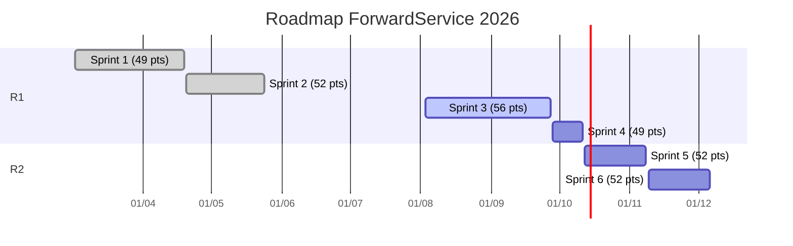
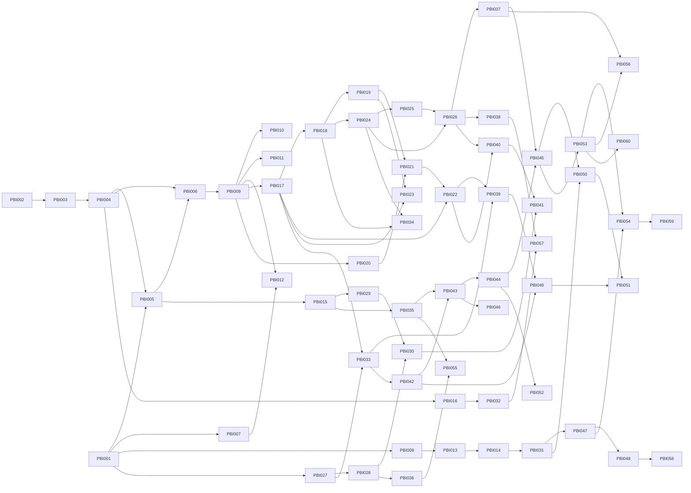

# Release plan e roadmap

## Releases

| Release | Sprints | Data | Pontos |
| --- | --- | --- | --- |
| Release 1: MVP acadêmico (Challenge FIAP x Ford) | Sprint 1, Sprint 2, Sprint 3, Sprint 4 | 11/10/2026 | 206 |
| Release 2: piloto em concessionária | Sprint 5, Sprint 6 | 06/12/2026 | 104 |
| Backlog futuro (Won't have now) | sem sprint | a definir | 47 |

## Pontos por sprint (balanceamento)

| Sprint | Pontos | Desvio da média |
| --- | --- | --- |
| Sprint 1 | 49 | -5% |
| Sprint 2 | 52 | +1% |
| Sprint 3 | 56 | +8% |
| Sprint 4 | 49 | -5% |
| Sprint 5 | 52 | +1% |
| Sprint 6 | 52 | +1% |

Média de 51,7 pontos por sprint; maior/menor = 1,14 (limite adotado: 1,20).

## Roadmap

## Sprint 1 (02/03/2026 a 19/04/2026)

Objetivo: Descoberta e fundação: pesquisa validada, visão de produto, arquitetura-alvo e base técnica (repositórios, CI, banco e scaffolds).

| PBI | Título | MoSCoW | Pontos | Estado |
| --- | --- | --- | --- | --- |
| PBI-001 | Setup do time: papéis Scrum, organização GitHub, repositórios e CI mínimo | Must | 8 | Done |
| PBI-002 | Pesquisa de mercado e validação de hipóteses (30 pesquisas) | Must | 8 | Done |
| PBI-003 | Base Fundacional: tese, 4 pilares, 9 lógicas de negócio e personas | Must | 5 | Done |
| PBI-004 | Solution Design e arquitetura-alvo com decisões registradas (ADRs) | Must | 5 | Done |
| PBI-005 | Schema PostgreSQL com migrations versionadas e seed sintético | Must | 8 | Done |
| PBI-006 | Protótipo da API e congelamento dos contratos compartilhados | Must | 5 | Done |
| PBI-007 | Scaffold do app mobile com login, lista de leads e i18n | Must | 5 | Done |
| PBI-008 | Ambiente de ML reprodutível e EDA inicial | Must | 5 | Done |

Total: **49 pontos**.

## Sprint 2 (20/04/2026 a 24/05/2026)

Objetivo: MVP demonstrável: API REST/SOAP, app do atendente, pipeline de ML e artefatos de negócio e arquitetura TOGAF/ArchiMate.

| PBI | Título | MoSCoW | Pontos | Estado |
| --- | --- | --- | --- | --- |
| PBI-009 | API REST em camadas: veículos, clientes, scores e leads | Must | 8 | Done |
| PBI-010 | Operação SOAP GetVehicle com WSDL contract-first | Must | 5 | Done |
| PBI-011 | Registro de evento de serviço com erros RFC 7807 e contrato OpenAPI | Must | 5 | Done |
| PBI-012 | App do atendente: dashboard, leads priorizados e Vista 360 | Must | 8 | Done |
| PBI-013 | Features comportamentais e segmentação K-means em 4 perfis | Must | 5 | Done |
| PBI-014 | Classificador de churn calibrado (XGBoost two-stage) | Must | 8 | Done |
| PBI-015 | Baseline de segurança de dados: RLS, audit_log e retenção LGPD | Must | 5 | Done |
| PBI-016 | Pitch, Canvas, Quadro de Valor e arquitetura TOGAF/ArchiMate | Must | 8 | Done |

Total: **52 pontos**.

## Sprint 3 (03/08/2026 a 27/09/2026)

Objetivo: Segurança e qualidade de ponta a ponta: JWT e RBAC próprios, contrato REST nível 2, testes com evidência, app em release APK, DevSecOps e plano no Azure DevOps.

| PBI | Título | MoSCoW | Pontos | Estado |
| --- | --- | --- | --- | --- |
| PBI-017 | Perfil demo autocontido (PostgreSQL embarcado + seed) e banco de produção no Supabase | Must | 3 | Done |
| PBI-018 | Emissão de JWT próprio no login da API | Must | 5 | Done |
| PBI-019 | Autorização por papel (ATENDENTE, GESTOR, ADMIN) | Must | 3 | Done |
| PBI-020 | Maturidade REST nível 2: recursos, verbos e códigos de status | Must | 3 | Done |
| PBI-021 | Erros RFC 7807 padronizados e OpenAPI com autenticação bearer | Must | 2 | Done |
| PBI-022 | Testes automatizados da API com relatório de evidências | Must | 5 | Committed |
| PBI-023 | Diagrama de arquitetura SOA e README de execução | Must | 2 | Committed |
| PBI-024 | App consome a API com JWT guardado no SecureStore | Must | 5 | Done |
| PBI-025 | Modo demo/offline com dados de fallback | Should | 2 | Done |
| PBI-026 | Release APK com identidade visual consolidada e README ilustrado | Must | 5 | Committed |
| PBI-027 | Pipeline DevSecOps no GitHub Actions | Must | 5 | Done |
| PBI-028 | Hardening de código e infraestrutura com evidências | Must | 3 | Committed |
| PBI-029 | Plano de observabilidade e resposta a incidentes | Must | 2 | Committed |
| PBI-030 | Checklist de conformidade (OWASP ASVS, API e Mobile Top 10, LGPD) | Must | 3 | Approved |
| PBI-031 | Comparação de modelos de churn da Sprint 3 | Must | 3 | Committed |
| PBI-032 | Plano do projeto no Azure DevOps (backlog, BDD, DoD e release) | Must | 5 | Committed |

Total: **56 pontos**.

## Sprint 4 (28/09/2026 a 11/10/2026)

Objetivo: Entrega final do Challenge: vídeo pitch técnico, ambiente de demonstração estável e hardening final.

| PBI | Título | MoSCoW | Pontos | Estado |
| --- | --- | --- | --- | --- |
| PBI-033 | Deploy da API no Render (Blueprint) com banco Supabase e smoke test pós-deploy | Must | 5 | Approved |
| PBI-034 | Refresh token e revogação de sessão | Should | 5 | Approved |
| PBI-035 | Criptografia de PII em nível de campo | Should | 5 | New |
| PBI-036 | Logs sem PII e auditoria de ações sensíveis | Should | 5 | New |
| PBI-037 | Primeiro acesso: consentimento LGPD e onboarding guiado | Should | 8 | Approved |
| PBI-038 | Testes E2E do fluxo crítico do app | Should | 5 | Approved |
| PBI-039 | Teste de desempenho da API (p95 &lt; 300 ms) | Should | 5 | Approved |
| PBI-040 | Vídeo pitch técnico (até 6 minutos) | Must | 8 | Approved |
| PBI-041 | Pacote final de entrega e ensaio da banca | Must | 3 | New |

Total: **49 pontos**.

## Sprint 5 (12/10/2026 a 08/11/2026)

Objetivo: Piloto com ação: Action Engine no WhatsApp, Performance Console e monitoramento em produção.

| PBI | Título | MoSCoW | Pontos | Estado |
| --- | --- | --- | --- | --- |
| PBI-042 | Hospedagem na Azure VM com Docker e VNet | Should | 5 | New |
| PBI-043 | Ordens de ação da API para o n8n (outbox e HMAC) | Must | 5 | New |
| PBI-044 | Lembrete de revisão via WhatsApp Business | Must | 8 | New |
| PBI-045 | Respostas do cliente e opt-out pelo WhatsApp | Must | 8 | New |
| PBI-046 | Push de lead crítico no app (Expo Push) | Could | 5 | New |
| PBI-047 | Serviço de Analytics: segmentos, Curva da Morte e IHC | Should | 5 | New |
| PBI-048 | Painel web Visão da Frota | Should | 8 | New |
| PBI-049 | Monitoramento com Grafana e alertas de SLA | Should | 8 | New |

Total: **52 pontos**.

## Sprint 6 (09/11/2026 a 06/12/2026)

Objetivo: Ciclo fechado: agendamento, Recall Gateway, ROI, recomendador por ML e LGPD completa.

| PBI | Título | MoSCoW | Pontos | Estado |
| --- | --- | --- | --- | --- |
| PBI-050 | Recomendador de ação por ML (camada 3) | Could | 8 | New |
| PBI-051 | Monitor de modelo e retreino mensal (Flywheel de Dados) | Should | 5 | New |
| PBI-052 | Recall Gateway: recall pendente vira convite de retorno | Could | 5 | New |
| PBI-053 | Agendamento digital da revisão | Should | 8 | New |
| PBI-054 | Closed-Loop ROI: da ação à receita | Should | 8 | New |
| PBI-055 | Anonimização completa e direito ao esquecimento | Must | 5 | New |
| PBI-056 | Modo Cliente no app (Fluxo Simplificado) | Could | 8 | New |
| PBI-057 | Automação dos critérios de aceite BDD no pipeline | Should | 5 | New |

Total: **52 pontos**.

## Backlog futuro (Won't have now)

| PBI | Título | Pontos |
| --- | --- | --- |
| PBI-058 | Rede Invertida: mapa de desertos de serviço | 13 |
| PBI-059 | Ponte Serviço-Venda | 13 |
| PBI-060 | Integração com o DMS das concessionárias | 21 |

## Mapa de dependências entre PBIs

