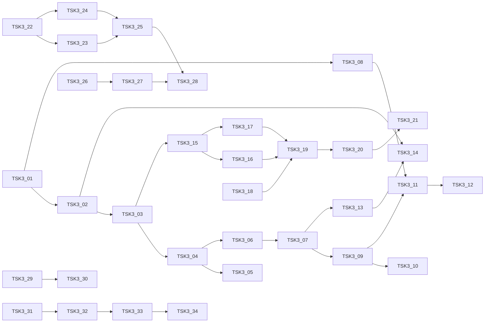

# Sprint 3 — Detalhamento

Período: 03/08/2026 a 27/09/2026 (sprint atual). Objetivo: Segurança e qualidade de ponta a ponta: JWT e RBAC próprios, contrato REST nível 2, testes com evidência, app em release APK, DevSecOps e plano no Azure DevOps.

- PBIs: 16, total de 56 pontos (28 pontos já em Done).
- Tarefas: 34, estimativa de 134 h e 30 h restantes.
- Itens não concluídos no fim da sprint voltam ao Sprint Planning da Sprint 4 (carry-over reavaliado pelo PO).
- O processo Scrum só tem o campo Remaining Work na tarefa: a estimativa original fica na descrição da tarefa e na tabela abaixo.
- Burndown e capacidade: Boards > Sprints > Sprint 3 > Analytics e Capacity.

## PBIs da sprint

| PBI | Título | Responsável | Pontos | Estado | Predecessoras |
| --- | --- | --- | --- | --- | --- |
| PBI-017 | Perfil demo autocontido (PostgreSQL embarcado + seed) e banco de produção no Supabase | Ruan Melo Vieira | 3 | Done | PBI-009 |
| PBI-018 | Emissão de JWT próprio no login da API | Ruan Melo Vieira | 5 | Done | PBI-017 |
| PBI-019 | Autorização por papel (ATENDENTE, GESTOR, ADMIN) | Ruan Melo Vieira | 3 | Done | PBI-018 |
| PBI-020 | Maturidade REST nível 2: recursos, verbos e códigos de status | Ruan Melo Vieira | 3 | Done | PBI-009 |
| PBI-021 | Erros RFC 7807 padronizados e OpenAPI com autenticação bearer | Ruan Melo Vieira | 2 | Done | PBI-019, PBI-020 |
| PBI-022 | Testes automatizados da API com relatório de evidências | Ruan Melo Vieira | 5 | Committed | PBI-017, PBI-021 |
| PBI-023 | Diagrama de arquitetura SOA e README de execução | Ruan Melo Vieira | 2 | Committed | PBI-017, PBI-019 |
| PBI-024 | App consome a API com JWT guardado no SecureStore | João Victor Franco | 5 | Done | PBI-018 |
| PBI-025 | Modo demo/offline com dados de fallback | João Victor Franco | 2 | Done | PBI-024 |
| PBI-026 | Release APK com identidade visual consolidada e README ilustrado | João Victor Franco | 5 | Committed | PBI-024, PBI-025 |
| PBI-027 | Pipeline DevSecOps no GitHub Actions | João Victor Franco | 5 | Done | PBI-001 |
| PBI-028 | Hardening de código e infraestrutura com evidências | Ruan Melo Vieira | 3 | Committed | PBI-027 |
| PBI-029 | Plano de observabilidade e resposta a incidentes | Rodrigo César Jimenez | 2 | Committed | PBI-015 |
| PBI-030 | Checklist de conformidade (OWASP ASVS, API e Mobile Top 10, LGPD) | Rodrigo César Jimenez | 3 | Approved | PBI-028, PBI-029 |
| PBI-031 | Comparação de modelos de churn da Sprint 3 | Lucca Saraiva Borges | 3 | Committed | PBI-014 |
| PBI-032 | Plano do projeto no Azure DevOps (backlog, BDD, DoD e release) | Rodrigo César Jimenez | 5 | Committed | PBI-016 |

## Tarefas

| Tarefa | PBI | Título | Atividade | Estimativa (h) | Restante (h) | Complexidade | Estado | Responsável | Predecessoras |
| --- | --- | --- | --- | --- | --- | --- | --- | --- | --- |
| TSK-3.01 | PBI-017 | Criar perfil demo com PostgreSQL embarcado e migrations Flyway | Development | 4 | 0 | 2 | Done | Ruan Melo Vieira | - |
| TSK-3.02 | PBI-017 | Seed de demonstração com concessionárias, clientes, veículos, leads e usuários por papel | Development | 3 | 0 | 2 | Done | Ruan Melo Vieira | TSK-3.01 |
| TSK-3.03 | PBI-018 | Endpoint POST /api/v1/auth/login com BCrypt e emissão de JWT HS256 | Development | 6 | 0 | 3 | Done | Ruan Melo Vieira | TSK-3.02 |
| TSK-3.04 | PBI-018 | Filtro de validação do bearer token com segredo por variável de ambiente | Development | 4 | 0 | 2 | Done | Ruan Melo Vieira | TSK-3.03 |
| TSK-3.05 | PBI-018 | Testes unitários de emissão, validação e expiração do token | Testing | 3 | 0 | 2 | Done | Ruan Melo Vieira | TSK-3.04 |
| TSK-3.06 | PBI-019 | Matriz de permissões por papel e rotas públicas | Design | 2 | 0 | 1 | Done | Ruan Melo Vieira | TSK-3.04 |
| TSK-3.07 | PBI-019 | Aplicar regras de autorização no SecurityFilterChain e em @PreAuthorize | Development | 4 | 0 | 2 | Done | Ruan Melo Vieira | TSK-3.06 |
| TSK-3.08 | PBI-020 | Revisar recursos, verbos e códigos de status (201 com Location, 204, 400, 404 e 409) | Development | 5 | 0 | 3 | Done | Ruan Melo Vieira | TSK-3.01 |
| TSK-3.09 | PBI-021 | Handlers de 401 e 403 em application/problem+json | Development | 3 | 0 | 2 | Done | Ruan Melo Vieira | TSK-3.07 |
| TSK-3.10 | PBI-021 | Esquema de segurança bearer no OpenAPI e Swagger UI público | Documentation | 2 | 0 | 1 | Done | Ruan Melo Vieira | TSK-3.09 |
| TSK-3.11 | PBI-022 | Testes de integração MockMvc: sucesso, validação, 401 e 403 por endpoint | Testing | 8 | 3 | 5 | In Progress | Ruan Melo Vieira | TSK-3.08, TSK-3.09 |
| TSK-3.12 | PBI-022 | Publicar relatórios Surefire e JaCoCo como artefato do CI | Deployment | 3 | 3 | 2 | To Do | Ruan Melo Vieira | TSK-3.11 |
| TSK-3.13 | PBI-023 | Diagrama de arquitetura SOA com camadas, componentes e fluxo do JWT | Design | 3 | 0 | 2 | Done | Ruan Melo Vieira | TSK-3.07 |
| TSK-3.14 | PBI-023 | README com execução do perfil demo, credenciais de teste e exemplos curl | Documentation | 3 | 1 | 2 | In Progress | Ruan Melo Vieira | TSK-3.02, TSK-3.13 |
| TSK-3.15 | PBI-024 | Cliente HTTP com bearer token e armazenamento no expo-secure-store | Development | 5 | 0 | 3 | Done | João Victor Franco | TSK-3.03 |
| TSK-3.16 | PBI-024 | Tratar 401 e expiração: limpar a sessão e voltar ao login com aviso | Development | 3 | 0 | 2 | Done | João Victor Franco | TSK-3.15 |
| TSK-3.17 | PBI-025 | Fallback para dados de demonstração com banner quando a API não responde | Development | 4 | 0 | 2 | Done | João Victor Franco | TSK-3.15 |
| TSK-3.18 | PBI-026 | Consolidar identidade visual: tokens, ícone, splash e tipografia | Design | 4 | 0 | 2 | Done | João Victor Franco | - |
| TSK-3.19 | PBI-026 | Gerar APK de release assinado com URL da API por ambiente | Deployment | 4 | 2 | 3 | In Progress | João Victor Franco | TSK-3.16, TSK-3.17, TSK-3.18 |
| TSK-3.20 | PBI-026 | Smoke test do APK no emulador Android com roteiro e evidências | Testing | 3 | 3 | 2 | To Do | João Victor Franco | TSK-3.19 |
| TSK-3.21 | PBI-026 | README com screenshots de todas as telas e instruções de instalação | Documentation | 3 | 3 | 1 | To Do | João Victor Franco | TSK-3.20 |
| TSK-3.22 | PBI-027 | Workflow SAST com Semgrep e CodeQL | Deployment | 4 | 0 | 2 | Done | João Victor Franco | - |
| TSK-3.23 | PBI-027 | SCA com Dependabot e dependency-review e secret scanning com Gitleaks | Deployment | 3 | 0 | 2 | Done | João Victor Franco | TSK-3.22 |
| TSK-3.24 | PBI-027 | Trivy para imagem Docker e IaC com gate por severidade | Deployment | 3 | 0 | 2 | Done | João Victor Franco | TSK-3.22 |
| TSK-3.25 | PBI-028 | Corrigir achados High/Critical e registrar evidências de antes e depois | Development | 6 | 2 | 3 | In Progress | Ruan Melo Vieira | TSK-3.23, TSK-3.24 |
| TSK-3.26 | PBI-029 | Plano de observabilidade: logs JSON, métricas e alertas de p95 e disponibilidade | Documentation | 4 | 1 | 2 | In Progress | Rodrigo César Jimenez | - |
| TSK-3.27 | PBI-029 | Runbook de resposta a incidentes com fluxo LGPD e ANPD | Documentation | 3 | 3 | 2 | To Do | Rodrigo César Jimenez | TSK-3.26 |
| TSK-3.28 | PBI-030 | Checklist OWASP ASVS, API Top 10, Mobile Top 10 e LGPD com evidência por item | Requirements | 5 | 5 | 3 | To Do | Rodrigo César Jimenez | TSK-3.25, TSK-3.27 |
| TSK-3.29 | PBI-031 | Notebook comparando regressão logística, Random Forest e XGBoost com validação temporal | Development | 6 | 0 | 3 | Done | Lucca Saraiva Borges | - |
| TSK-3.30 | PBI-031 | Relatório de métricas (AUC e falsos positivos) e atualização do model card | Documentation | 3 | 1 | 2 | In Progress | Lucca Saraiva Borges | TSK-3.29 |
| TSK-3.31 | PBI-032 | Estruturar épicos, features e PBIs rastreáveis ao ArchiMate | Requirements | 6 | 0 | 3 | Done | Rodrigo César Jimenez | - |
| TSK-3.32 | PBI-032 | Critérios BDD, DoD, MoSCoW e estimativas em Planning Poker | Requirements | 5 | 0 | 3 | Done | Rodrigo César Jimenez | TSK-3.31 |
| TSK-3.33 | PBI-032 | Script de importação com testes em mock e publicação no Azure DevOps | Deployment | 6 | 2 | 3 | In Progress | João Victor Franco | TSK-3.32 |
| TSK-3.34 | PBI-032 | Convidar o professor (Basic e Project Administrators) e publicar o link no Teams | Deployment | 1 | 1 | 1 | To Do | Rodrigo César Jimenez | TSK-3.33 |

## Horas por atividade

| Atividade | Estimativa (h) | Restante (h) |
| --- | --- | --- |
| Development | 53 | 2 |
| Testing | 14 | 6 |
| Design | 9 | 0 |
| Documentation | 18 | 9 |
| Deployment | 24 | 8 |
| Requirements | 16 | 5 |

## Horas por integrante

| Integrante | Estimativa (h) | Restante (h) |
| --- | --- | --- |
| Ruan Melo Vieira | 59 | 9 |
| João Victor Franco | 42 | 10 |
| Rodrigo César Jimenez | 24 | 10 |
| Lucca Saraiva Borges | 9 | 1 |

## Dependências técnicas entre tarefas

