# Base Fundacional — ForwardService


> **Documento raiz do projeto.** Define a tese, os pilares, as lógicas de negócio e os limites de escopo.  
> Nenhuma decisão de arquitetura, tecnologia ou implementação deve contradizer o que está aqui.  
> Última revisão: 09/04/2026

---

## Sumário

1. [A Tese](#parte-1--a-tese)
2. [Os 4 Pilares](#parte-2--os-4-pilares)
3. [Lógicas de Negócio Diferenciadoras](#parte-3--lógicas-de-negócio-diferenciadoras)
4. [Mapa de Personas](#parte-4--mapa-de-personas)
5. [Limites de Escopo](#parte-5--limites-de-escopo)
6. [Avaliação de Maturidade](#parte-6--avaliação-de-maturidade)
7. [Processo de Trabalho](#parte-7--processo-de-trabalho)
8. [Próximos Passos](#parte-8--próximos-passos)

---

## Parte 1 — A Tese

### 1.1 O Problema

A Ford Brasil vive uma situação **única no mundo automotivo**:

| Dado | Valor |
|---|---|
| Veículos Ford em circulação | **~12,4 milhões** (4ª maior frota do país) |
| Modelos descontinuados na frota | **~80%** (Ka, Fiesta, EcoSport) |
| Concessionárias ativas | **~145** (era 283 antes do fechamento) |
| Vendas anuais (importados) | ~49.000/ano |
| Market share de serviço (dealers globalmente) | **29%** — 71% vai para independentes |

Cada VIN que abandona a rede oficial é receita recorrente perdida. O indicador: **VIN Share** — porcentagem de veículos Ford que usam a rede oficial para manutenção.

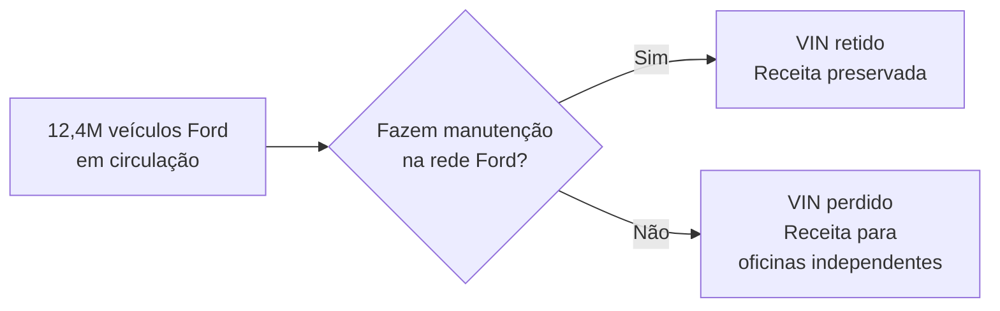

### 1.2 O que a pesquisa revelou

Dados que fundamentam a urgência:

| Descoberta | Dado | Fonte |
|---|---|---|
| Retenção desaba pós-garantia | 78-86% → **20-40%** | Cox Automotive 2025 |
| A crise está acelerando | 72% → **54%** em apenas 2 anos (2023→2025) | Cox Automotive 2025 |
| Percepção ≠ realidade de preço | Dealer $261 vs. independente $275 — dealer é **mais barato** | Cox Automotive 2025 |
| Serviço = metade do lucro | **49%** do lucro bruto vem do pós-venda | NADA 2025 |
| Retenção gera recompra | 74% dos retidos recompram vs. 44% dos perdidos | Cox Automotive 2025 |
| +5% retenção = muito mais lucro | **+25% a 95%** de aumento no lucro | Bain & Company |
| Ford é a única sem fidelidade | Todas as outras montadoras no Brasil têm programa pré-pago | Pesquisa de benchmark |
| Recalls são oportunidade perdida | Apenas **12-50%** de taxa de atendimento no Brasil | PROCON-SP / SENACON |

### 1.3 A Tese da Solução

> **ForwardService é uma estratégia de retenção pós-venda habilitada por tecnologia, desenhada para o contexto único da Ford Brasil pós-fechamento das fábricas.**

Reposiciona o serviço pós-venda de **centro de custo** para **produto gerenciável com ROI mensurável**.

```markmap
# ForwardService
## Proatividade
- Age antes do cliente sair
## Personalização
- Abordagem certa no momento certo
## Mensurabilidade
- Cada real tem retorno rastreável
## Especificidade
- Feita para Ford Brasil
## Flywheel
- Mais inteligente a cada ciclo
```

---

## Parte 2 — Os 4 Pilares

### Visão estrutural

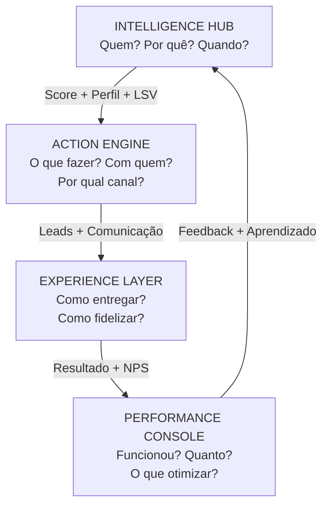

> O fluxo é cíclico: cada ciclo completo alimenta o próximo com dados melhores (Flywheel).

---

### Pilar 1 — Intelligence Hub


*"Quem estou perdendo, por quê, onde e quando?"*

Transforma dados brutos em inteligência acionável. É o cérebro da plataforma.

| Componente | O que faz | Entrega |
|---|---|---|
| **Customer Vista 360** | Consolida dados de cada cliente/veículo numa visão única | Perfil completo: histórico, garantia, score, LSV, segmento |
| **Radar de Churn** | ML que segmenta clientes e prevê risco de abandono | Score 0-100 + perfil (fiel, econômico, esquecido, abandono) |
| **Service Share Map** | Visualização granular do VIN Share + **mapeamento de desertos de serviço** | Dashboards por região, modelo, idade, dealer + zonas sem cobertura |
| **Fleet Segmentation** | Lógica específica para frota descontinuada | Sub-segmentos (recente/maduro/antigo) com estratégia própria |
| **Calculadora de LSV** | Lifetime Service Value de cada VIN | Valor em reais de cada cliente para priorização econômica |

**Validação pela pesquisa:**
- Técnica recomendada: RFM + K-Means, 4-6 clusters, Silhouette > 0.4 (P1.3)
- Algoritmo: XGBoost com SHAP para interpretabilidade, AUC 0.82-0.90 (P1.4)
- Km sem telemetria: regressão sobre leituras de odômetro nas OS (P1.5)
- VIO: dados internos Ford + FENABRAVE + curvas Sindipeças (P1.6)

---

### Pilar 2 — Action Engine


*"O que fazer com cada cliente, automaticamente?"*

Transforma inteligência em ação concreta e personalizada.

| Componente | O que faz | Entrega |
|---|---|---|
| **Pulse Leads** | Gera leads priorizados por risco + LSV | Lista diária: "quem contatar, por quê, com qual abordagem" |
| **CommEngine** | Orquestra comunicação personalizada multicanal | Mensagem certa, canal certo, momento certo, tom certo |
| **Curva da Morte** | Identifica a janela de vulnerabilidade de cada perfil | Disparo no momento crítico, não em intervalos fixos |
| **Recall Gateway** | Trata recalls como porta de reconexão | Workflow: recall → check-up → oferta de retorno → follow-up |
| **Estratégia Descontinuados** | Ações específicas por sub-segmento de frota | Tom adaptado por fase do ciclo de vida |

**Validação pela pesquisa:**
- Canal primário: WhatsApp (97% abertura, 45-60% conversão) — R$ 0,30-0,80/conversa (P2.1)
- Lembrete proativo via WhatsApp: ROI 300:1+ (P2.3)
- Recall como reconexão: 20-35% aceitam serviços adicionais, ROI virtualmente infinito (P2.3)
- CAV de cliente ativo: R$ 1-5 vs. perdido: R$ 25-150 vs. novo: R$ 80-300 (LN7.1)

---

### Pilar 3 — Experience Layer


*"Como garantir que o cliente QUEIRA voltar?"*

A melhor retenção é fazer com que a experiência seja tão boa que sair não faça sentido.

| Componente | O que faz | Entrega |
|---|---|---|
| **Journey Optimizer** | Otimiza agendamento → check-in → acompanhamento → NPS | Zero fricção, status em tempo real, aprovação digital |
| **Ford Care** | **Planos de manutenção com preço fixo/pré-pago** + benefícios progressivos | Previsibilidade de custo, retenção 3x maior, receita antecipada |
| **Fluxo Simplificado** | **Experiência digital para modelos sem conectividade** (Ka, Fiesta, EcoSport) | Cadastro manual de VIN, lembretes por km estimada, agendamento WhatsApp |
| **Transparência de Valor** | Mostra ao cliente por que a concessionária vale mais | Comparativo real: Ford com garantia vs. oficina sem garantia |

**Mudança pós-pesquisa — Ford Care (antes "FordRewards"):**
O benchmark mostrou que **nenhuma montadora no Brasil usa sistema de pontos** — todas usam preço fixo/pré-pago (Renault, Hyundai, Toyota, VW, Fiat, BMW, Mercedes). Planos pré-pagos elevam retenção de ~20% para **~60%** (3x). Ford Care adota o modelo comprovado do mercado: pacotes de revisão com preço fixo, adquiridos na compra ou antes da 1ª revisão.

**Mudança pós-pesquisa — Fluxo Simplificado:**
80% da frota Ford não tem telemetria. O App Ford só serve modelos importados recentes. Nenhum concorrente resolve isso. O Fluxo Simplificado preenche essa lacuna com uma experiência digital básica mas funcional para os 2,5M+ de Ka/EcoSport circulando.

---

### Pilar 4 — Performance Console


*"Funcionou? Quanto retornou? O que otimizar?"*

Fecha o ciclo. Mede tudo. Prova ROI. Otimiza continuamente.

| Componente | O que faz | Entrega |
|---|---|---|
| **Closed-Loop ROI** | Rastreia cada ação até o resultado financeiro | ROI por ação, perfil, concessionária, período, canal |
| **IHC** | Score composto de saúde de retenção por dealer (0-100) | Um número que resume a performance de cada concessionária |
| **Dealer Benchmark** | Compara concessionárias entre si com gamificação | Ranking + best practices + categorias (ouro/prata/bronze) |
| **Strategy Simulator** | Simulação "what-if" de estratégias | "Se investir R$ X em [ação] para [público], retorno: R$ Y" |
| **Flywheel Dashboard** | Evolução da inteligência da plataforma | Precisão do modelo ao longo do tempo, conversão crescente |

**Validação pela pesquisa:**
- NADA 20 Groups já opera no Brasil via Fenabrave (52 dealers, 3 grupos) (P4.2)
- Ford President's Award já combina NPS + CVP + Sales (LN5.1)
- Nissan usa 30 KPIs com gamificação (espadas samurai) — funciona (LN5.1)
- Margem de erro ±25% é aceitável para simulações iniciais (P4.3)
- +5% retenção = +25-95% lucro (Bain) — justifica investimento (P4.3)

---

## Parte 3 — Lógicas de Negócio Diferenciadoras

9 lógicas que tornam a ForwardService **impossível de replicar com um CRM genérico**.

```markmap
# Lógicas de Negócio
## Inteligência
### LN1 — Economia do VIN (LSV)
- Valor em reais de cada cliente
### LN2 — Curva da Morte
- Janela de vulnerabilidade por perfil
### LN6 — Frota Descontinuada
- 80% da frota, segmentação por fase
## Ação
### LN3 — Rede Invertida ⭐
- Serviço vai até o cliente
- Componente central pós-pesquisa
### LN4 — Recall Gateway
- 3,4M pendentes = oportunidade
### LN9 — Ponte Serviço-Venda
- 74% recompram vs. 44%
## Gestão
### LN5 — Índice de Saúde (IHC)
- Score 0-100 por dealer
### LN7 — Closed-Loop ROI
- Cada ação rastreada até o R$
### LN8 — Flywheel de Dados
- Mais inteligente a cada ciclo
```

**Dependências entre lógicas:**

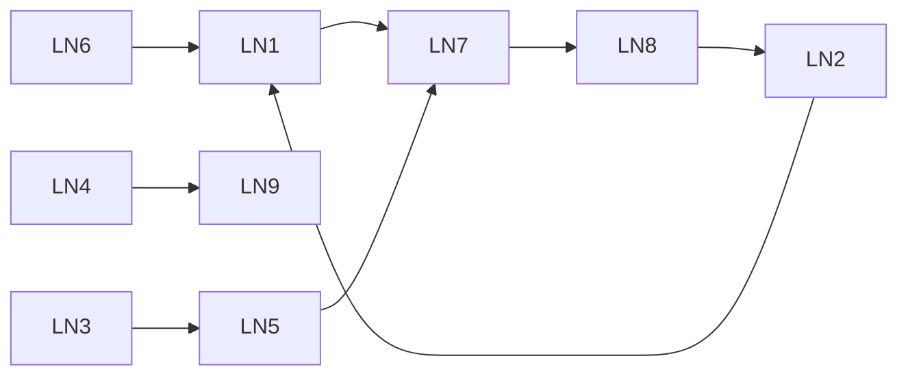

---

### LN1 — Economia do VIN (Lifetime Service Value)

Cada VIN tem valor econômico calculável ao longo da vida útil.

```
LSV = Σ (receita por serviço ao longo do ciclo)
    + (probabilidade de reparos × ticket médio)
    + (probabilidade de recompra × margem do veículo novo)
    − (custo de retenção)
```

**Dados da pesquisa:** Revisão Ranger: R$ 1.455-2.007/visita, total ~R$ 7.384 em 60K km. Ka: R$ 705-1.368/visita. LTV completo de um cliente (vendas + serviço + indicações): até $175.000 (Demand Local). Margem bruta de serviço: 50-55% combinada (NADA).

**Impacto:** Leads priorizados por LSV. Um Ranger com LSV de R$ 22.000 em risco moderado vale mais atenção que um Ka com LSV de R$ 3.000 em risco alto.

---

### LN2 — Curva da Morte (Janela de Vulnerabilidade)

**Confirmada pela pesquisa:** existe um ponto de inflexão onde a retenção desaba.

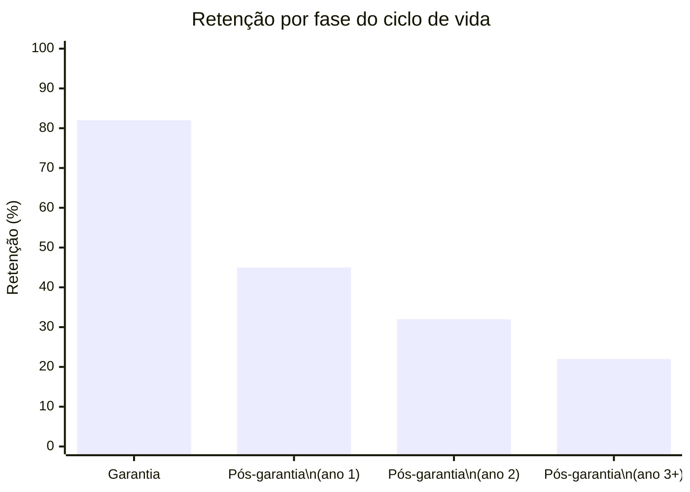

| Perfil | Janela provável | Gatilho |
|---|---|---|
| **Econômico** | Meses 25-30 | 1º orçamento pós-garantia |
| **Esquecido** | Meses 14-18 | Gap entre revisões |
| **Abandono** | Meses 0-12 | Nunca pretendeu voltar |
| **Fiel** | Meses 60-72 | Veículo envelhecendo |

**Dado-chave:** Contratos de serviço estendidos elevam satisfação para **86%** e são a principal ferramenta de mitigação (Cox Automotive).

---

### LN3 — Rede Invertida (Serviço vai até o Cliente)

**Elevada a componente central** após a pesquisa revelar o case Stellantis + DPaschoal.

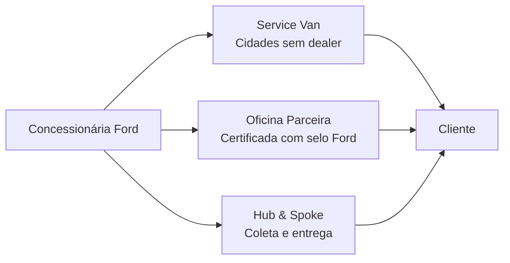

**Precedente de mercado:** A Stellantis comprou 70% da DPaschoal (R$ 2,6bi faturamento, 900 centros credenciados, 10.000 mecânicos treinados/ano) para expandir cobertura pós-garantia. Bosch Car Service: 1.430 oficinas no Brasil. O modelo é **comprovado e escalável**.

**145 dealers Ford vs. 521 Fiat + 900 centros DPaschoal.** A conta não fecha sem expansão alternativa.

**Nota de escopo:** Não implementamos vans. Identificamos desertos de serviço, simulamos impacto e recomendamos o modelo.

---

### LN4 — Recall como Porta de Entrada

**Validada com dados alarmantes:** apenas 12-50% de atendimento no Brasil. 3,4 milhões de recalls pendentes.

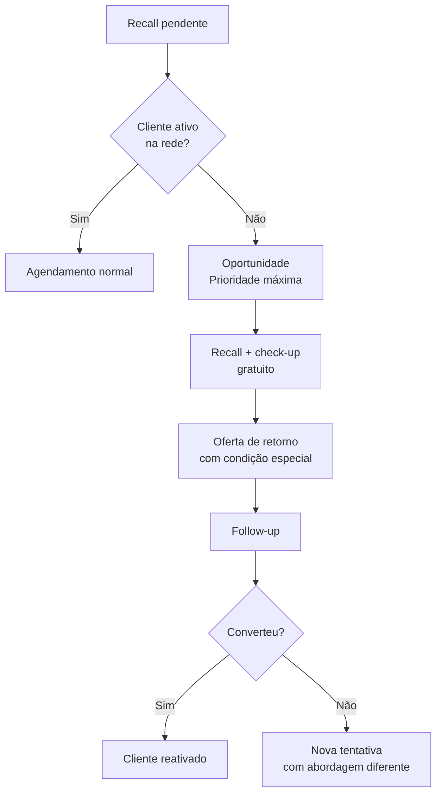

**Dado-chave:** 20-35% dos clientes que vêm para recall aceitam serviços adicionais, ticket médio adicional de R$ 750-1.500 (DealerSocket/Solera). Nova lei: recall pendente **bloqueia licenciamento** (CRLV).

---

### LN5 — Índice de Saúde da Concessionária (IHC)

Score composto (0-100) para cada dealer.

| Fator | Peso |
|---|---|
| VIN Share local | 25% |
| Tendência (momentum) | 15% |
| Conversão de leads | 20% |
| NPS médio | 15% |
| Tempo de resposta ao lead | 10% |
| Taxa de pré-agendamento | 10% |
| Diversidade de serviços | 5% |

**Referência:** Ford President's Award já combina NPS + CVP + Sales Effectiveness (~7% dos dealers recebem). Nissan Dealer Performance usa 30 KPIs com gamificação. NADA 20 Groups já opera no Brasil.

---

### LN6 — Segmentação da Frota Descontinuada

80% da frota Ford é de modelos descontinuados. Tratar como massa uniforme é desperdiçar recursos.

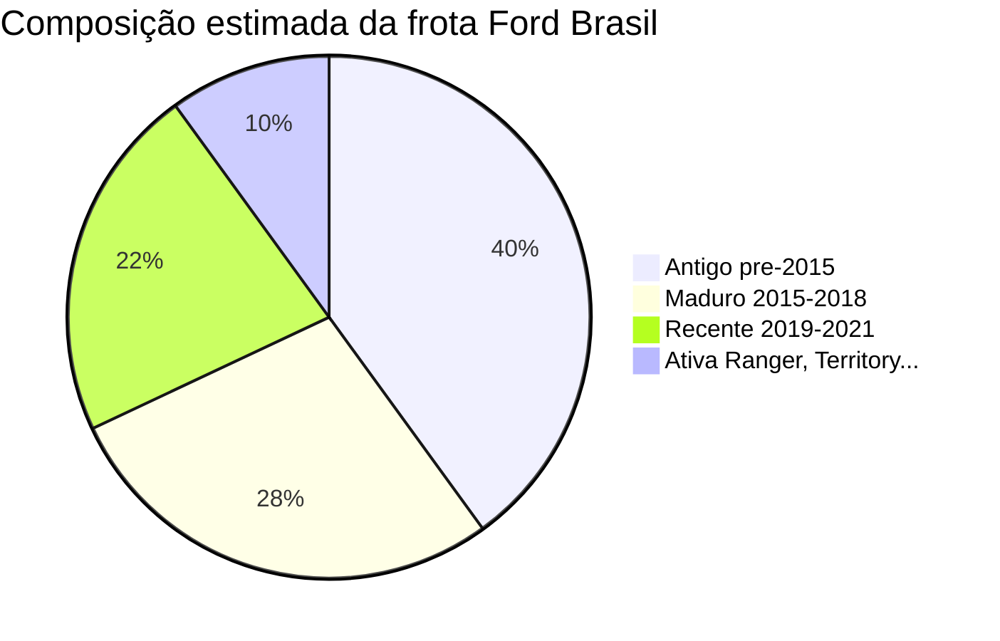

| Segmento | Estratégia | Comunicação |
|---|---|---|
| **Recente (2019-2021)** | RETER — Ford Care com preço fixo | "A Ford saiu da fábrica, não da sua vida" |
| **Maduro (2015-2018)** | RETER SELETIVAMENTE — foco em LSV positivo | "Cuidamos do seu [modelo] como ninguém" |
| **Antigo (pré-2015)** | MIGRAR — focar em recompra | "Hora de um upgrade. Avaliamos seu usado" |
| **Frota ativa** | BLINDAR — retenção máxima desde o dia 1 | "Experiência premium para quem escolheu Ford" |

**Dado da pesquisa:** 2,5M+ de Ka e EcoSport circulando. Donos se sentem abandonados. Peças com espera de semanas a meses e preço até 5x acima do paralelo (LN6.1, LN6.2). Frota brasileira envelhecendo: idade média **10 anos e 11 meses**, faixa 11-15 anos cresceu 131% em uma década (Sindipeças 2024).

---

### LN7 — Closed-Loop ROI

Cada ação rastreada do disparo ao resultado financeiro.

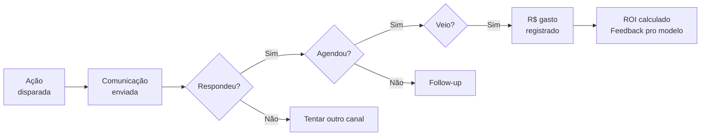

**Dado-chave:** WhatsApp lembrete (1.000 envios): custo R$ 300-800, gera ~300-450 agendamentos × R$ 800 ticket = R$ 250-400K receita. ROI **300:1+** (P2.3).

---

### LN8 — Flywheel de Dados

A plataforma fica mais inteligente a cada ciclo.

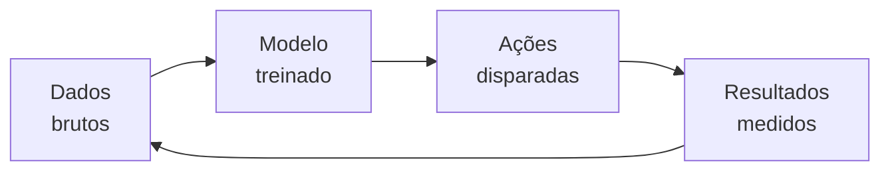

| Fase | Precisão estimada |
|---|---|
| Mês 1-3 (dados históricos) | ~70% |
| Mês 4-6 (dados reais de conversão) | ~78% |
| Mês 7-12 (sazonalidade, feedback) | ~85% |
| Ano 2+ (vantagem acumulativa) | ~90% |

**Viabilidade confirmada:** 47K veículos novos/ano + base de centenas de milhares de VINs = massa crítica suficiente. O segredo são feedback loops rápidos (mensais), não volume absoluto (LN8.1).

---

### LN9 — Ponte Serviço-Venda

Clientes que fazem manutenção na rede têm **74% de intenção de recompra** vs. 44% dos que não fazem (Cox Automotive 2025).

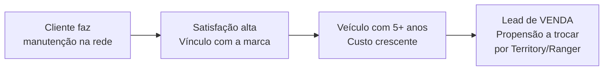

**Impacto:** Muda a conversa de "quanto custa reter" para "quanto a retenção gera em vendas futuras". LTV de um cliente: até $175.000. O pós-venda vira **gerador de receita**, não centro de custo.

---

## Parte 4 — Mapa de Personas

| Persona | Dor principal | O que usa | Plataforma |
|---|---|---|---|
| **Atendente** | "Não sei nada do cliente que ligou" | Vista 360, Leads, Journey | App mobile |
| **Gerente de serviço** | "Minha equipe age no escuro" | Leads do dia, Dashboard, NPS | App + Web |
| **Dono do dealer** | "Não sei como me comparo" | IHC, Benchmark, ROI | Web |
| **Gestor regional Ford** | "Não sei onde perco clientes" | Share Map, Benchmark, Simulador | Web |
| **Diretoria Ford** | "Não consigo justificar budget" | Dashboard nacional, ROI, Simulador | Web |
| **Dono de modelo recente** | "Manter na Ford é caro" | App: agendamento, Ford Care, status | App mobile |
| **Dono de modelo descontinuado** | "A Ford me abandonou" | Fluxo Simplificado: WhatsApp, lembretes, cadastro VIN | WhatsApp + Web |

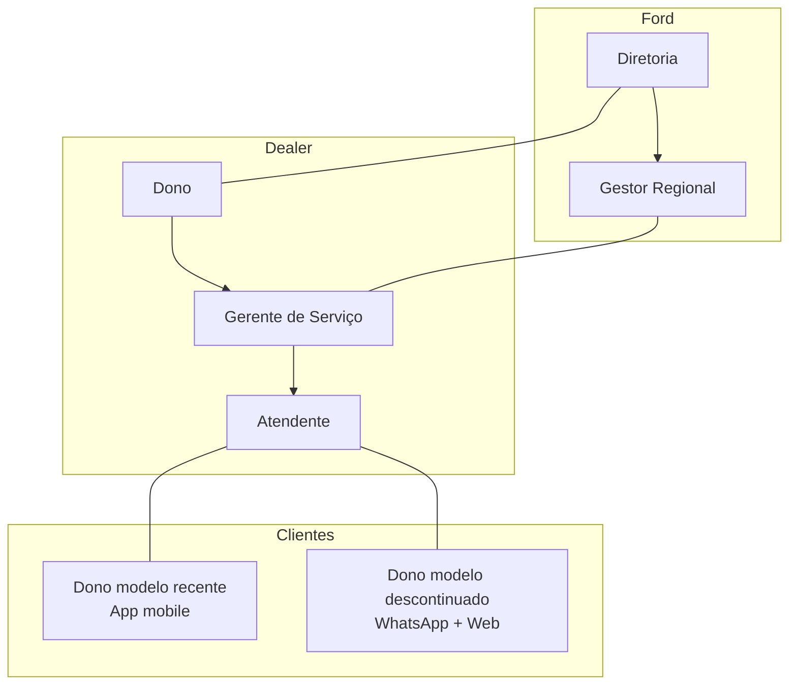

---

## Parte 5 — Limites de Escopo

**O que a ForwardService É:**
- Plataforma de inteligência e ação para retenção pós-venda
- Desenhada para o contexto específico da Ford Brasil
- Baseada em dados, ML e lógicas de negócio diferenciadoras
- Mensurável: cada ação tem ROI rastreável

**O que a ForwardService NÃO É:**
- Não é DMS — não substitui o sistema operacional da concessionária
- Não é ERP — não gerencia estoque, contabilidade, RH
- Não é sistema de vendas — a ponte serviço-venda gera leads, a venda acontece nos sistemas existentes
- Não implementa vans/oficinas — identifica onde seriam necessárias e simula impacto
- Não define políticas da Ford — fornece infraestrutura e recomendações baseadas em dados

**Premissas de dados:**
- Dados de IA/ML são sintéticos (fornecidos pelo professor)
- Plataforma projetada para dados reais, MVP usa dados sintéticos
- Arquitetura permite integração futura com DMS, CRM e sistemas Ford via APIs
- Qualidade de dados é um desafio real: 174 tipos de falhas documentados em integrações DMS (P1.2)

---

## Parte 6 — Avaliação de Maturidade

| Aspecto | Normal | Bom | Excepcional (nosso alvo) | Status |
|---|---|---|---|---|
| **Problema** | "Melhorar retenção" | "Melhorar VIN Share" | Problema único da Ford Brasil com lógica inexistente no mercado | ✅ |
| **Solução** | Dashboard + ML | Plataforma integrada | 4 pilares + 9 lógicas + flywheel + Ford Care + Fluxo Simplificado | ✅ |
| **Negócio** | "Pode ajudar" | Métricas definidas | Closed-loop ROI, LSV, IHC, simulação, dados de benchmark | ✅ |
| **Contexto** | Genérico | Menciona Ford | Desenhado para realidade única (frota descontinuada, 145 dealers) | ✅ |
| **Pesquisa** | Superficial | Dados de mercado | 30 pesquisas com fontes verificáveis, hipóteses validadas | ✅ |
| **Arquitetura** | Monolito | Microserviços | SOA justificada + TOGAF + integrabilidade demonstrada | ⏳ |
| **Implementação** | Protótipo | MVP funcional | Plataforma demonstrável, todas as disciplinas convergindo | ⏳ |
| **Apresentação** | Slides genéricos | Pitch estruturado | Narrativa que faz a Ford pensar "preciso disso" | ⏳ |

---

## Parte 7 — Processo de Trabalho

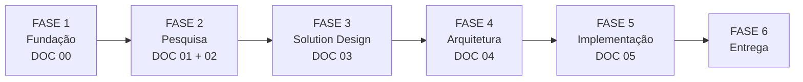

| Fase | Documento | O que produz | Status |
|---|---|---|---|
| **1. Fundação** | DOC 00 (este) | Tese, pilares, lógicas, escopo |  |
| **2. Pesquisa** | DOC 01 + 02 | 30 pesquisas, hipóteses validadas |  |
| **3. Solution Design** | DOC 03 | Features concretas, wireframes, MVP |  |
| **4. Arquitetura** | DOC 04 | Stack, APIs, modelo de dados, TOGAF |  |
| **5. Implementação** | DOC 05 | Backlog, tarefas, checklist disciplinas |  |
| **6. Entrega** | Artefatos finais | Código, app, notebook, apresentação |  |

**Regras:**
1. Nenhum documento posterior contradiz a Base Fundacional sem revisão explícita
2. Cada fase gera artefato que serve de input para a próxima
3. Decisões de escopo na Fase 3, não durante implementação
4. **Produto primeiro, disciplinas depois**

---

## Parte 8 — Próximos Passos

1. ~~Revisar Base Fundacional com o grupo~~ → v3.0 com adaptações pós-pesquisa
2. ~~Executar pesquisa~~ → 30 pesquisas concluídas, 6 blocos
3. **Consolidar DOC 02** — Resultados da Pesquisa (em andamento)
4. **Iniciar DOC 03** — Solution Design: features concretas, wireframes, definição de MVP
5. Alinhar com professores sobre orientações adicionais

---

## Registro de Adaptações Pós-Pesquisa (v3.0)

| Adaptação | Antes | Depois | Evidência |
|---|---|---|---|
| FordRewards → **Ford Care** | Programa de pontos e tiers | Planos pré-pagos com preço fixo | Nenhuma montadora no BR usa pontos. Pré-pago: retenção 3x |
| + **Fluxo Simplificado** | Experience Layer focado em app conectado | Adiciona fluxo para modelos sem conectividade | 80% da frota sem telemetria. 2,5M+ de Ka/EcoSport excluídos |
| LN3 elevada a **central** | Rede Invertida como recomendação | Componente central com mapeamento de desertos | Stellantis + DPaschoal prova viabilidade (R$ 2,6bi, 900 centros) |

---

> *Este documento é a âncora do projeto. Quando houver dúvida sobre escopo, prioridade ou direção, volte aqui.*
