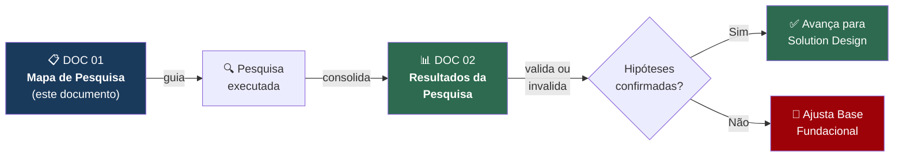
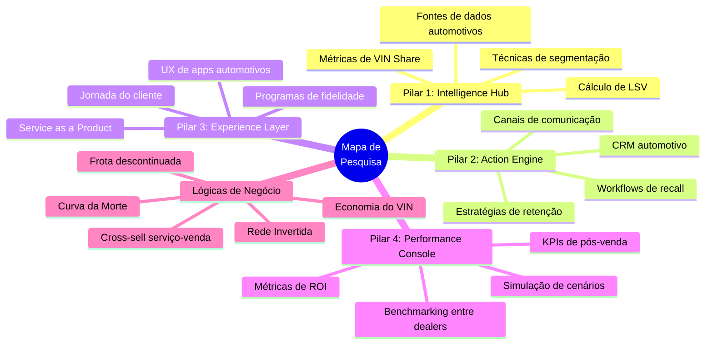
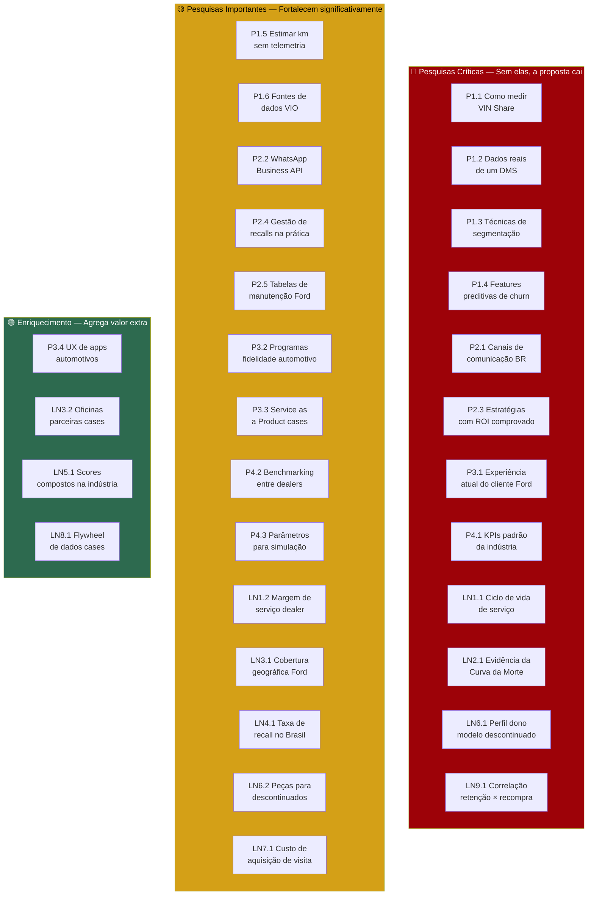

# Mapa de Pesquisa — ForwardService

> **DOC 01** — Lista tudo que precisamos pesquisar, validar e responder antes de avançar para o Solution Design.  
> Organizado por pilar e por lógica de negócio. Cada item tem: a pergunta, por que importa, onde buscar e o critério de sucesso.  
> Versão: 1.0 | Data: 09/04/2026

---

## Como usar este documento

### Legenda de prioridade

| Símbolo | Significado | Critério |
|---|---|---|
| 🔴 | **Crítica** | Se não responder, a proposta não se sustenta |
| 🟡 | **Importante** | Fortalece significativamente a proposta |
| 🟢 | **Enriquecimento** | Agrega valor, mas a proposta sobrevive sem |

### Legenda de status

| Status | Significado |
|---|---|
| ⬜ | Não iniciado |
| 🔄 | Em andamento |
| ✅ | Concluído |

---

## Visão geral — O que pesquisar por área

---

# Pilar 1 — Intelligence Hub

> Tudo que precisamos saber para transformar dados brutos em inteligência acionável.

---

## P1.1 — Como o VIN Share é medido na prática?

| Campo | Detalhe |
|---|---|
| **Prioridade** | 🔴 Crítica |
| **Status** | ✅ |
| **Hipótese** | VIN Share = VINs atendidos pela rede / VINs em circulação na área. A fórmula parece simples, mas a prática tem nuances |
| **O que precisamos descobrir** | Como montadoras realmente calculam VIN Share? Usam VINs únicos por ano? Por trimestre? Contam só visitas pagas ou incluem recall/garantia? Como estimam o denominador (VIO)? |
| **Por que importa** | Se definirmos VIN Share errado, toda a plataforma mede a coisa errada. É a métrica central |
| **Onde buscar** | Relatórios NADA, publicações J.D. Power, artigos de consultorias (McKinsey, Deloitte) sobre aftermarket KPIs, documentação de plataformas como CDK/Xtime |
| **Critério de sucesso** | Ter uma definição precisa com fórmula, periodicidade e tratamento de edge cases (ex: cliente que vai 2x no ano conta 1 ou 2?) |

---

## P1.2 — Quais dados um DMS de concessionária realmente armazena?

| Campo | Detalhe |
|---|---|
| **Prioridade** | 🔴 Crítica |
| **Status** | ✅ |
| **Hipótese** | DMS armazena: dados do cliente, veículo (VIN), histórico de OS (Ordem de Serviço), peças usadas, valores, datas. Mas não sabemos o nível de detalhe real |
| **O que precisamos descobrir** | Estrutura de dados típica de um DMS (CDK, Reynolds, Syonet). Quais campos existem? Quais são preenchidos consistentemente? Quais são lixo? Existe padronização entre marcas? |
| **Por que importa** | A plataforma precisa consumir dados do DMS. Se assumirmos campos que não existem ou que são mal preenchidos, a solução não funciona na prática |
| **Onde buscar** | Documentação de APIs do CDK Global, Syonet, DealerNet. Artigos sobre integração de DMS. Se possível, entrevistar alguém que trabalhou em concessionária |
| **Critério de sucesso** | Lista dos campos disponíveis num DMS típico brasileiro, com nível de confiabilidade de cada um |

---

## P1.3 — Quais técnicas de segmentação funcionam melhor para clientes automotivos?

| Campo | Detalhe |
|---|---|
| **Prioridade** | 🔴 Crítica |
| **Status** | ✅ |
| **Hipótese** | K-Means com RFM (Recência, Frequência, Valor Monetário) é o ponto de partida, complementado com variáveis comportamentais específicas do setor |
| **O que precisamos descobrir** | Papers acadêmicos ou cases de segmentação de clientes de pós-venda automotivo. Quais variáveis são mais discriminantes? K-Means vs. DBSCAN vs. GMM — qual performa melhor neste domínio? Qual o número típico de clusters? Como validar clusters (silhouette, Davies-Bouldin)? |
| **Por que importa** | A entrega de IA/ML depende disso. Se escolhermos a técnica errada, os perfis não fazem sentido de negócio |
| **Onde buscar** | Google Scholar ("automotive customer segmentation", "after-sales clustering"), Kaggle (datasets de serviço automotivo), papers de conferências IEEE/SAE |
| **Critério de sucesso** | Pelo menos 3 referências acadêmicas/industriais que validem a abordagem escolhida, com comparação de técnicas |

---

## P1.4 — Quais variáveis são mais preditivas de churn no pós-venda?

| Campo | Detalhe |
|---|---|
| **Prioridade** | 🔴 Crítica |
| **Status** | ✅ |
| **Hipótese** | Recência da última visita, idade do veículo e status de garantia são os 3 preditores mais fortes |
| **O que precisamos descobrir** | Feature importance em modelos reais de churn automotivo. Quais variáveis disponíveis no momento da compra (Base 2) realmente preveem comportamento futuro? Existe diferença entre mercados (Brasil vs. EUA vs. Europa)? |
| **Por que importa** | Define quais dados coletar e quais features usar no modelo. Se usarmos variáveis fracas, o modelo não presta |
| **Onde buscar** | Papers sobre "customer churn prediction automotive", "predictive analytics dealer service retention", estudos Cox Automotive, J.D. Power CSI |
| **Critério de sucesso** | Ranking de features por importância com pelo menos 2 fontes independentes |

---

## P1.5 — Como estimar quilometragem sem dado de telemetria?

| Campo | Detalhe |
|---|---|
| **Prioridade** | 🟡 Importante |
| **Status** | ✅ |
| **Hipótese** | Média brasileira é ~12.000-15.000 km/ano. Pode-se estimar por: último km registrado na OS, modelo de uso por perfil/região |
| **O que precisamos descobrir** | Distribuição real de km/ano no Brasil por tipo de veículo e região. Quais proxies funcionam quando não temos odômetro conectado? A última km registrada na OS é confiável? |
| **Por que importa** | Quilometragem é a base para prever necessidade de manutenção. Sem telemetria (80% da frota é antiga), precisamos de estimativas |
| **Onde buscar** | Dados da FENABRAVE, pesquisas de uso automotivo no Brasil, IBGE (mobilidade urbana), seguradoras (usam km para precificar) |
| **Critério de sucesso** | Tabela de km/ano médio por segmento de veículo e região, com fonte confiável |

---

## P1.6 — Quais fontes de dados de VIO (Vehicles in Operation) existem?

| Campo | Detalhe |
|---|---|
| **Prioridade** | 🟡 Importante |
| **Status** | ✅ |
| **Hipótese** | DENATRAN/SENATRAN publica dados de frota por marca/modelo. S&P Global Mobility (ex-IHS Markit) vende dados detalhados de VIO |
| **O que precisamos descobrir** | Quais fontes públicas de VIO existem no Brasil? Nível de granularidade (por modelo? por ano? por município?)? É possível saber quantos Fords existem numa região específica? |
| **Por que importa** | O denominador do VIN Share é o VIO. Sem saber quantos Fords existem numa região, não calculamos o VIN Share local |
| **Onde buscar** | SENATRAN/DENATRAN, FENABRAVE, Sindipeças (anuário da reposição), S&P Global Mobility, dados abertos do governo |
| **Critério de sucesso** | Pelo menos uma fonte que forneça VIO por marca/modelo/ano/estado |

---

# Pilar 2 — Action Engine

> Tudo que precisamos saber para transformar inteligência em ação eficaz.

---

## P2.1 — Quais canais de comunicação têm maior taxa de conversão no pós-venda brasileiro?

| Campo | Detalhe |
|---|---|
| **Prioridade** | 🔴 Crítica |
| **Status** | ✅ |
| **Hipótese** | WhatsApp é o canal dominante no Brasil para comunicação comercial. SMS e email têm taxas de abertura decrescentes. Ligação funciona para high-touch |
| **O que precisamos descobrir** | Taxas de abertura e conversão por canal (WhatsApp, SMS, email, push, ligação) no contexto de serviços automotivos ou B2C no Brasil. Custo por contato de cada canal. Regulamentação (LGPD, opt-in para WhatsApp Business) |
| **Por que importa** | O CommEngine precisa recomendar o melhor canal por perfil. Se não soubermos as taxas reais, a recomendação é chute |
| **Onde buscar** | Pesquisas de marketing digital no Brasil (RD Station, Resultados Digitais), dados de WhatsApp Business API, cases de CRM automotivo brasileiro, pesquisa CNDL/SPC sobre canais de comunicação |
| **Critério de sucesso** | Tabela comparativa de canais com: taxa de abertura, taxa de conversão, custo médio e restrições legais |

---

## P2.2 — Como funciona a API do WhatsApp Business para comunicação automatizada?

| Campo | Detalhe |
|---|---|
| **Prioridade** | 🟡 Importante |
| **Status** | ✅ |
| **Hipótese** | WhatsApp Business API permite envio de mensagens template com aprovação prévia do Meta, com custos por mensagem |
| **O que precisamos descobrir** | Modelo de preços (custo por conversa/mensagem), tipos de mensagem permitidos (template vs. sessão), processo de aprovação de templates, limites de envio, requisitos de opt-in, integradores disponíveis no Brasil (Twilio, Zenvia, Take Blip) |
| **Por que importa** | Se o CommEngine vai usar WhatsApp como canal principal, precisamos saber os limites técnicos e financeiros |
| **Onde buscar** | Documentação oficial Meta/WhatsApp Business API, sites de integradores (Zenvia, Take Blip), pricing pages |
| **Critério de sucesso** | Entendimento claro de: custo por mensagem, limites, templates necessários e integrador recomendado |

---

## P2.3 — Quais estratégias de retenção pós-venda têm ROI comprovado?

| Campo | Detalhe |
|---|---|
| **Prioridade** | 🔴 Crítica |
| **Status** | ✅ |
| **Hipótese** | Lembrete proativo de manutenção, desconto pós-garantia e recall como reconexão são as estratégias com melhor ROI documentado |
| **O que precisamos descobrir** | Cases com números reais: qual estratégia gerou quanto de ROI? Qual o custo de aquisição de uma visita de serviço via marketing proativo vs. walk-in? Existe diferença de eficácia por perfil de cliente? |
| **Por que importa** | O Strategy Simulator precisa de parâmetros realistas. Se estimarmos ROI errado, o simulador perde credibilidade |
| **Onde buscar** | Estudos Cox Automotive, NADA guides, McKinsey "Automotive aftermarket 2030", DealerSocket/Xtime case studies, Harvard Business Review (artigos sobre retenção) |
| **Critério de sucesso** | Pelo menos 5 estratégias documentadas com ROI estimado, custo médio e público-alvo ideal |

---

## P2.4 — Como concessionárias gerenciam recalls na prática?

| Campo | Detalhe |
|---|---|
| **Prioridade** | 🟡 Importante |
| **Status** | ✅ |
| **Hipótese** | A montadora publica recall, o dealer recebe lista de VINs afetados, e tenta contatar os clientes. Muitos não respondem e o recall fica pendente por meses/anos |
| **O que precisamos descobrir** | Taxa média de atendimento de recalls no Brasil. Quanto tempo leva para atingir cobertura significativa? Qual a taxa de no-show? O dealer tenta contatar quantas vezes? Dados públicos de recalls Ford recentes |
| **Por que importa** | Se a taxa de recall pendente for alta, valida a LN4 (Recall como Porta de Entrada). Se for baixa, a lógica perde relevância |
| **Onde buscar** | PROCON, Ministério da Justiça (sistema de recalls), SENACON, dados públicos de recalls automotivos no Brasil, notícias sobre taxas de atendimento |
| **Critério de sucesso** | Taxa média de atendimento de recall no Brasil + tempo médio para resolução |

---

## P2.5 — Quais são as tabelas de manutenção programada dos modelos Ford?

| Campo | Detalhe |
|---|---|
| **Prioridade** | 🟡 Importante |
| **Status** | ✅ |
| **Hipótese** | Ford publica plano de manutenção por modelo: a cada 10.000km ou 12 meses, com lista de itens por faixa de km |
| **O que precisamos descobrir** | Plano de manutenção oficial dos principais modelos Ford (Ranger, Ka, EcoSport, Territory). Quais serviços em cada faixa (10K, 20K, 30K, 40K...). Preço médio de cada revisão. Itens de desgaste com periodicidade conhecida |
| **Por que importa** | O Pulse Leads precisa saber QUANDO cada veículo precisa de serviço para gerar leads precisos |
| **Onde buscar** | Site oficial Ford Brasil, manuais do proprietário, tabelas de revisão publicadas por portais automotivos (iCarros, WebMotors), preços de revisão em concessionárias |
| **Critério de sucesso** | Tabela completa de manutenção programada dos 5 modelos mais relevantes (Ranger, Ka, EcoSport, Fiesta, Territory) com preço médio por revisão |

---

# Pilar 3 — Experience Layer

> Tudo que precisamos saber para criar uma experiência que faça o cliente querer voltar.

---

## P3.1 — Como é a experiência atual do cliente Ford no pós-venda?

| Campo | Detalhe |
|---|---|
| **Prioridade** | 🔴 Crítica |
| **Status** | ✅ |
| **Hipótese** | A experiência é fragmentada: agendamento por telefone, pouca transparência de preço, sem acompanhamento digital, follow-up inconsistente |
| **O que precisamos descobrir** | Jornada real de um cliente Ford ao fazer manutenção (desde agendar até pós-serviço). Pontos de dor reais. O que o FordPass oferece no Brasil vs. mercados maduros. Avaliações de concessionárias Ford no Google Maps (padrões de reclamação) |
| **Por que importa** | Não podemos melhorar uma jornada que não conhecemos. Precisamos saber onde está a fricção real |
| **Onde buscar** | Google Maps reviews de concessionárias Ford, Reclame Aqui (Ford), FordPass na App Store/Play Store (reviews), fóruns de proprietários Ford (ForumFord, Reddit), entrevista informal com donos de Ford |
| **Critério de sucesso** | Mapa de jornada do cliente com pontos de dor identificados e priorizados |

---

## P3.2 — Quais programas de fidelidade automotivos existem e funcionam?

| Campo | Detalhe |
|---|---|
| **Prioridade** | 🟡 Importante |
| **Status** | ✅ |
| **Hipótese** | Hyundai/Kia e Renault têm programas no Brasil. Planos de manutenção pré-pagos aumentam retenção em 2-3x |
| **O que precisamos descobrir** | Quais montadoras oferecem programas de fidelidade/manutenção pré-paga no Brasil? Como funcionam (pontos vs. assinatura vs. preço fechado)? Resultados mensuráveis? Por que alguns falham? Custo de operação para a montadora/dealer |
| **Por que importar** | Embasa a proposta do FordRewards com referências reais. Evita propor algo que já fracassou |
| **Onde buscar** | Sites de Renault (Plano de Revisões), Hyundai (HMB Care), Toyota (Plano Toyota), Chevrolet (Meu Chevrolet), BMW (Service Inclusive). Artigos Comarch, Antavo sobre loyalty automotivo |
| **Critério de sucesso** | Benchmark de pelo menos 4 programas com: mecânica, custo, resultado reportado |

---

## P3.3 — O que é "Service as a Product" e quem já faz isso?

| Campo | Detalhe |
|---|---|
| **Prioridade** | 🟡 Importante |
| **Status** | ✅ |
| **Hipótese** | Algumas montadoras tratam o serviço como produto com preço fixo, pacotes e planos — não como "o que custar, custou" |
| **O que precisamos descobrir** | Cases de montadoras ou redes que reposicionaram serviço como produto gerenciável. Modelos de precificação (preço fixo vs. variável). Impacto na percepção do cliente. Relação com retenção |
| **Por que importa** | É um dos diferenciais do Experience Layer. Se não tivermos embasamento, fica genérico |
| **Onde buscar** | BMW Service Inclusive, Volvo Service Plans, Mercedes ServiceCare, Renault "Revisão a Preço Certo", artigos McKinsey sobre servitização no automotivo |
| **Critério de sucesso** | Pelo menos 3 cases com modelo de precificação e impacto na retenção |

---

## P3.4 — Como é a UX dos melhores apps automotivos de pós-venda?

| Campo | Detalhe |
|---|---|
| **Prioridade** | 🟢 Enriquecimento |
| **Status** | ✅ |
| **Hipótese** | FordPass, myBMW, MyToyota e apps similares oferecem funcionalidades de referência para UX |
| **O que precisamos descobrir** | Funcionalidades de cada app. Fluxo de agendamento. Como mostram status do serviço. Programa de pontos/fidelidade no app. Ratings e reclamações comuns. O que funciona e o que não funciona |
| **Por que importa** | Nosso app mobile precisa ser melhor ou pelo menos comparável. Benchmark de UX evita reinventar a roda |
| **Onde buscar** | Download e análise dos apps: FordPass, myBMW, My Toyota, MyHyundai, Mercedes me. Reviews na App Store e Play Store |
| **Critério de sucesso** | Quadro comparativo de features com screenshots e análise de pontos fortes/fracos |

---

# Pilar 4 — Performance Console

> Tudo que precisamos saber para medir, comparar e otimizar.

---

## P4.1 — Quais KPIs de pós-venda são padrão na indústria?

| Campo | Detalhe |
|---|---|
| **Prioridade** | 🔴 Crítica |
| **Status** | ✅ |
| **Hipótese** | VIN Share, taxa de retenção, NPS, ticket médio, taxa de agendamento, tempo médio de reparo são os KPIs mais comuns |
| **O que precisamos descobrir** | Lista completa de KPIs de pós-venda usados pela indústria. Como são calculados. Benchmarks (valores de referência). Quais a Ford provavelmente já acompanha |
| **Por que importa** | O Performance Console precisa mostrar KPIs que a Ford reconheça e valorize. Inventar métricas novas sem contexto não convence |
| **Onde buscar** | NADA Performance Guide, Hicron (artigo de KPIs aftermarket), DealerSocket best practices, CDK Global metrics, J.D. Power CSI |
| **Critério de sucesso** | Lista de 10-15 KPIs com: definição, fórmula, benchmark e relevância para a ForwardService |

---

## P4.2 — Como funciona benchmarking entre concessionárias na prática?

| Campo | Detalhe |
|---|---|
| **Prioridade** | 🟡 Importante |
| **Status** | ✅ |
| **Hipótese** | Montadoras fazem ranking interno de dealers, mas poucas compartilham best practices de forma estruturada |
| **O que precisamos descobrir** | Como montadoras (Ford, Toyota, BMW) fazem benchmarking entre dealers hoje? É público ou fechado? Quais métricas usam? Existe gamificação? Premiação? Quais ferramentas usam? |
| **Por que importa** | Embasa o Dealer Benchmark. Se já existe algo que funciona, podemos referenciá-lo. Se não existe, é um diferencial |
| **Onde buscar** | Artigos sobre dealer performance management, NADA 20 Groups (modelo americano de benchmarking), publicações de OEMs sobre programas de excelência da rede |
| **Critério de sucesso** | Entendimento de pelo menos 2 modelos de benchmarking entre dealers com prós e contras |

---

## P4.3 — Quais parâmetros são necessários para simular ROI de ações de retenção?

| Campo | Detalhe |
|---|---|
| **Prioridade** | 🟡 Importante |
| **Status** | ✅ |
| **Hipótese** | Precisamos de: custo por contato por canal, taxa de conversão por tipo de ação, ticket médio por tipo de serviço, elasticidade-preço por perfil |
| **O que precisamos descobrir** | Quais variáveis são necessárias para um modelo de simulação crível? Existem modelos de referência de ROI de CRM/retenção? Qual a margem de erro aceitável numa simulação? |
| **Por que importa** | O Strategy Simulator precisa de parâmetros realistas para gerar projeções que a Ford leve a sério |
| **Onde buscar** | Modelos de ROI de CRM (Salesforce ROI calculator, HubSpot), estudos de elasticidade-preço no aftermarket, artigos de revenue management automotivo |
| **Critério de sucesso** | Lista de parâmetros necessários com valores de referência (mesmo que faixas aproximadas) |

---

# Lógicas de Negócio — Pesquisas Específicas

> Cada lógica tem hipóteses próprias que precisam de validação.

---

## LN1 — Economia do VIN (LSV)

### LN1.1 — Qual o ciclo de vida de serviço de um veículo no Brasil?

| Campo | Detalhe |
|---|---|
| **Prioridade** | 🔴 Crítica |
| **Status** | ✅ |
| **Hipótese** | Um veículo gera receita de serviço durante 10-15 anos. As revisões programadas concentram-se nos primeiros 5 anos, depois são reparos eventuais |
| **O que precisamos descobrir** | Gasto médio anual em manutenção por idade do veículo no Brasil. Curva: nos primeiros anos é revisão barata, depois reparos maiores, depois não vale mais a pena. Quando o custo de manutenção supera o valor do veículo? |
| **Onde buscar** | Sindipeças (anuário da reposição automotiva), CESVI Brasil, pesquisas de custo de propriedade (KBB Brasil, Webmotors), dados de seguradoras |
| **Critério de sucesso** | Curva de gasto médio anual em manutenção por idade do veículo, segmentado por tipo (popular, SUV, picape) |

---

### LN1.2 — Qual a margem de serviço de uma concessionária?

| Campo | Detalhe |
|---|---|
| **Prioridade** | 🟡 Importante |
| **Status** | ✅ |
| **Hipótese** | Margem bruta de serviço é ~40-50% (mão de obra) e ~30-40% (peças). Serviço é mais lucrativo que venda de carros |
| **O que precisamos descobrir** | Margem bruta de serviço e peças em concessionárias brasileiras. Comparação com margem de venda de veículos. Composição: mão de obra vs. peças vs. fluidos |
| **Onde buscar** | FENABRAVE (anuário), NADA (referência americana, adaptável), artigos sobre lucratividade de concessionárias, entrevistas com donos de dealer |
| **Critério de sucesso** | Números de margem bruta de serviço e peças com fonte confiável |

---

## LN2 — Curva da Morte

### LN2.1 — Existe evidência do "momento crítico" de abandono?

| Campo | Detalhe |
|---|---|
| **Prioridade** | 🔴 Crítica |
| **Status** | ✅ |
| **Hipótese** | A retenção cai drasticamente nos primeiros 3-6 meses após o fim da garantia (tipicamente 24-36 meses de vida do veículo) |
| **O que precisamos descobrir** | Estudos que documentem a curva de retenção por mês/ano de vida do veículo. O "ponto de inflexão" é consistente entre montadoras? É diferente no Brasil? Existem dados da Ford especificamente? |
| **Onde buscar** | Cox Automotive Service Industry Study, J.D. Power CSI, DealershipGuy (newsletter com dados), publicações TVI MarketPro3 |
| **Critério de sucesso** | Pelo menos 1 gráfico de curva de retenção real por idade do veículo, com ponto de inflexão identificado |

---

## LN3 — Rede Invertida

### LN3.1 — Qual a cobertura geográfica real da rede Ford no Brasil?

| Campo | Detalhe |
|---|---|
| **Prioridade** | 🟡 Importante |
| **Status** | ✅ |
| **Hipótese** | As 109 concessionárias concentram-se em capitais e grandes cidades. Há regiões inteiras sem cobertura |
| **O que precisamos descobrir** | Lista de concessionárias Ford com endereço/cidade. Mapa de distribuição geográfica. Cruzamento com dados de VIO por região para identificar desertos de serviço. Raio médio de cobertura de uma concessionária |
| **Onde buscar** | Site Ford Brasil (localizador de concessionárias), Google Maps, dados de VIO por estado (SENATRAN) |
| **Critério de sucesso** | Mapa com localização das 109 concessionárias + identificação de pelo menos 3 "desertos de serviço" |

---

### LN3.2 — Existem modelos de "oficina parceira certificada" em outras montadoras?

| Campo | Detalhe |
|---|---|
| **Prioridade** | 🟢 Enriquecimento |
| **Status** | ✅ |
| **Hipótese** | Algumas montadoras usam oficinas independentes certificadas para expandir cobertura (ex: Bosch Car Service, Mopar Express Lane) |
| **O que precisamos descobrir** | Quais modelos de oficina parceira existem? Como funcionam (certificação, treinamento, supply de peças)? Quais montadoras usam? Resultados reportados |
| **Onde buscar** | Bosch Car Service, Mopar Express Lane (Stellantis), programas de expansão de rede de montadoras, artigos sobre modelos de franquia de serviço automotivo |
| **Critério de sucesso** | Pelo menos 2 modelos documentados com mecânica de funcionamento |

---

## LN4 — Recall como Porta de Entrada

### LN4.1 — Qual a taxa de atendimento de recalls no Brasil?

| Campo | Detalhe |
|---|---|
| **Prioridade** | 🟡 Importante |
| **Status** | ✅ |
| **Hipótese** | A taxa de atendimento é baixa (estimamos 40-60%), especialmente para veículos mais antigos |
| **O que precisamos descobrir** | Taxa média de atendimento de recalls no Brasil. Diferença por marca, idade do veículo e gravidade. Quantos recalls a Ford teve nos últimos 3 anos no Brasil. Existe base pública de recalls com dados de atendimento? |
| **Onde buscar** | PROCON, SENACON (Sistema Nacional de Informações de Defesa do Consumidor), Ministério da Justiça, site de recalls do governo, dados da Ford |
| **Critério de sucesso** | Taxa de atendimento de recall com fonte confiável + dados de recalls Ford recentes |

---

## LN5 — IHC (Índice de Saúde da Concessionária)

### LN5.1 — Existem scores compostos similares na indústria?

| Campo | Detalhe |
|---|---|
| **Prioridade** | 🟢 Enriquecimento |
| **Status** | ✅ |
| **Hipótese** | Montadoras usam scorecards de dealer, mas são multidimensionais (vendas + serviço + satisfação). Não existe um score único de "saúde de retenção" |
| **O que precisamos descobrir** | Como montadoras avaliam a performance dos dealers hoje? Quais métricas compõem os scorecards existentes? Existe algo similar ao IHC que estamos propondo? |
| **Onde buscar** | NADA 20 Groups, programas de excelência de OEMs (Ford President's Award, Toyota President's Award), artigos sobre dealer performance metrics |
| **Critério de sucesso** | Entendimento de pelo menos 2 scorecards de dealer com composição e pesos |

---

## LN6 — Frota Descontinuada

### LN6.1 — Qual o perfil real dos donos de modelos descontinuados Ford?

| Campo | Detalhe |
|---|---|
| **Prioridade** | 🔴 Crítica |
| **Status** | ✅ |
| **Hipótese** | Donos de Ka/Fiesta são majoritariamente de classe B/C, sensíveis a preço, que compraram carro popular. Donos de EcoSport são classe B, compraram SUV de entrada. Perfis muito diferentes de donos de Ranger |
| **O que precisamos descobrir** | Perfil socioeconômico dos donos por modelo. Percepção sobre o fechamento das fábricas. Ainda consideram ir na concessionária? Quais as barreiras? Preço? Distância? Disponibilidade de peças? |
| **Onde buscar** | Fóruns de proprietários (ForumFord), grupos de Facebook de donos de Ka/Fiesta/EcoSport, Reclame Aqui (padrões de reclamação), pesquisas de satisfação J.D. Power Brasil, artigos sobre impacto do fechamento das fábricas Ford |
| **Critério de sucesso** | Perfil qualitativo de pelo menos 2 sub-segmentos (popular vs. SUV) com dores e percepções reais |

---

### LN6.2 — Qual a disponibilidade real de peças para modelos descontinuados?

| Campo | Detalhe |
|---|---|
| **Prioridade** | 🟡 Importante |
| **Status** | ✅ |
| **Hipótese** | A Ford manteve compromisso de fornecer peças por pelo menos 10 anos, mas a percepção do consumidor é de escassez |
| **O que precisamos descobrir** | A Ford cumpre o fornecimento de peças? Quais modelos/peças têm mais dificuldade? O preço subiu após o fechamento? A percepção do consumidor está alinhada com a realidade? |
| **Onde buscar** | Reclame Aqui (Ford - reclamações sobre peças), fóruns, artigos sobre pós-venda Ford após fechamento, depoimentos de donos |
| **Critério de sucesso** | Panorama real (disponibilidade + preço) vs. percepção do consumidor, com fontes |

---

## LN7 — Closed-Loop ROI

### LN7.1 — Existem referências de custo de aquisição de uma visita de serviço?

| Campo | Detalhe |
|---|---|
| **Prioridade** | 🟡 Importante |
| **Status** | ✅ |
| **Hipótese** | O custo de "trazer um cliente de volta" via marketing proativo é R$ 20-50 por visita convertida. O ticket médio da visita é R$ 500-1.500. Logo, o ROI é altamente positivo |
| **O que precisamos descobrir** | Custo de aquisição de visita de serviço (CAV) no Brasil ou benchmarks globais. Comparação: cliente que vem via lembrete vs. walk-in vs. campanha massiva. Ticket médio por tipo de visita |
| **Onde buscar** | Estudos de marketing automotivo, dados de plataformas de CRM (resultados de campanhas), benchmarks de custo de aquisição B2C no Brasil |
| **Critério de sucesso** | Faixa estimada de CAV com pelo menos 1 fonte, + ticket médio de referência |

---

## LN8 — Flywheel de Dados

### LN8.1 — Quais empresas implementaram flywheel de dados com sucesso?

| Campo | Detalhe |
|---|---|
| **Prioridade** | 🟢 Enriquecimento |
| **Status** | ✅ |
| **Hipótese** | Amazon (recomendações), Netflix (conteúdo), Spotify (Discover Weekly) são os cases clássicos. No automotivo, Tesla é a referência com dados de frota |
| **O que precisamos descobrir** | Cases de data flywheel no setor automotivo especificamente. Como Tesla usa dados de frota? Alguma montadora tradicional implementou algo similar? O conceito é viável numa escala menor (109 dealers)? |
| **Onde buscar** | Artigos sobre data flywheel / data network effects, casos Tesla, publicações sobre connected car data monetization |
| **Critério de sucesso** | Pelo menos 1 case automotivo + framework conceitual do flywheel aplicado à ForwardService |

---

## LN9 — Ponte Serviço-Venda

### LN9.1 — Qual a correlação real entre retenção pós-venda e recompra?

| Campo | Detalhe |
|---|---|
| **Prioridade** | 🔴 Crítica |
| **Status** | ✅ |
| **Hipótese** | Clientes que fazem manutenção na rede têm 74% mais chance de comprar da mesma marca. Fonte original: Cox Automotive |
| **O que precisamos descobrir** | Confirmar o dado de 74% e encontrar a fonte original. Existem outros estudos que corroborem? A correlação é causal ou há confounding factors? Qual a probabilidade de recompra de um cliente Ford que sai da rede vs. um que fica? |
| **Onde buscar** | Cox Automotive studies, J.D. Power Loyalty Studies, NADA dealer profitability studies, artigos acadêmicos sobre brand loyalty no automotivo |
| **Critério de sucesso** | Dado confirmado com fonte primária + pelo menos 1 estudo adicional |

---

# Quadro Resumo — Todas as Pesquisas

---

# Plano de Execução da Pesquisa

## Ordem sugerida

A pesquisa não precisa ser sequencial. Dividir entre os integrantes do grupo.

| Bloco | Pesquisas | Responsável | Prazo sugerido |
|---|---|---|---|
| **Bloco 1: Fundamentos** | P1.1, P1.2, P4.1, LN2.1 | - | Semana 1 |
| **Bloco 2: Dados e ML** | P1.3, P1.4, P1.5, P1.6 | - | Semana 1 |
| **Bloco 3: Ação e Comunicação** | P2.1, P2.2, P2.3, P2.4, P2.5 | - | Semana 1-2 |
| **Bloco 4: Experiência e Fidelidade** | P3.1, P3.2, P3.3, P3.4 | - | Semana 2 |
| **Bloco 5: Performance e Simulação** | P4.2, P4.3, LN7.1 | - | Semana 2 |
| **Bloco 6: Lógicas de Negócio** | LN1.1, LN1.2, LN3.1, LN3.2, LN4.1, LN5.1, LN6.1, LN6.2, LN8.1, LN9.1 | - | Semana 2-3 |

## Output esperado

Cada pesquisa concluída gera uma entrada no **DOC 02 — Resultados da Pesquisa** com:

1. **Pergunta original** (referência ao DOC 01)
2. **Resposta encontrada** (dados, fontes, evidências)
3. **Hipótese validada ou invalidada** (com justificativa)
4. **Impacto na Base Fundacional** (precisa ajustar algo no DOC 00?)
5. **Implicação para o Solution Design** (como isso afeta o que vamos construir?)

---

> *Este documento guia toda a fase de pesquisa. Quando a pesquisa estiver concluída, o DOC 02 consolida os resultados e alimenta o DOC 03 (Solution Design).*
