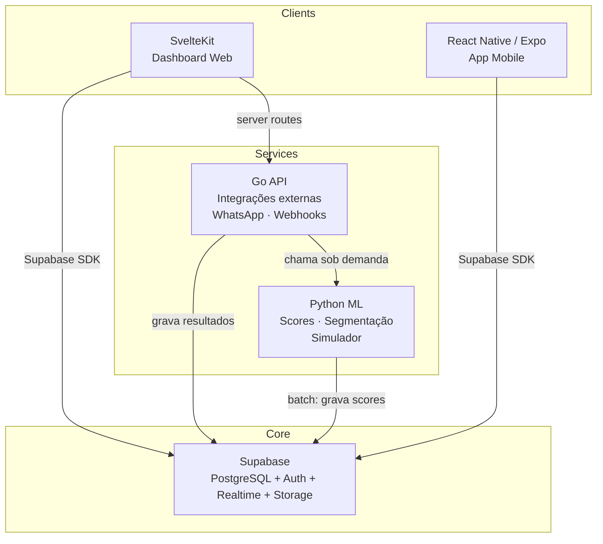
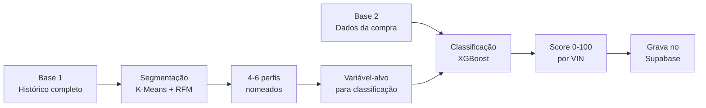
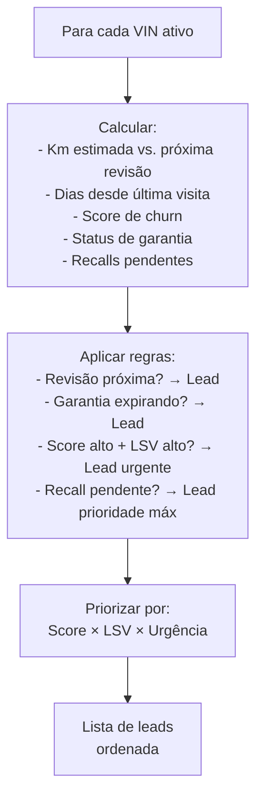
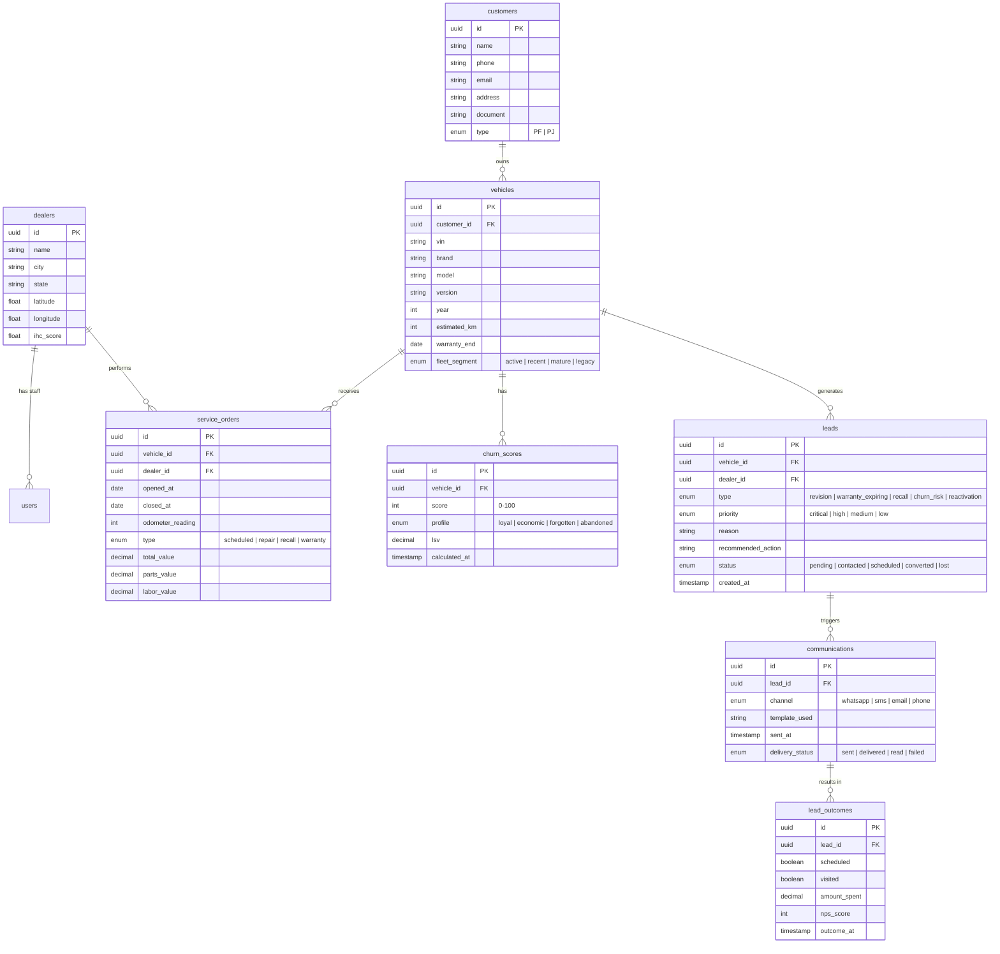

# Solution Design — ForwardService


> **DOC 03** — Traduz a Base Fundacional em features concretas, define o MVP, escolhe a stack e traça o cronograma.  
> Este documento responde: **o que exatamente vamos construir, em que ordem, e com que tecnologia.**  
> Data: 09/04/2026

---

## Sumário

1. [Decisão de arquitetura](#parte-1--decisão-de-arquitetura)
2. [Stack definitiva](#parte-2--stack-definitiva)
3. [Definição de MVP](#parte-3--definição-de-mvp)
4. [Features detalhadas](#parte-4--features-detalhadas)
5. [Modelo de dados](#parte-5--modelo-de-dados)
6. [Mapa de disciplinas](#parte-6--mapa-de-disciplinas)
7. [Cronograma](#parte-7--cronograma)
8. [Decisões de design](#parte-8--decisões-de-design)

---

# Parte 1 — Decisão de Arquitetura

## O insight central

Com Supabase como BaaS, **não precisamos de um backend API separado para o MVP**. Pensa no que cada camada faz:

| Necessidade | Quem resolve | Backend Go/TS necessário? |
|---|---|---|
| CRUD (clientes, veículos, OS, leads) | Supabase direto (client SDK) | Não |
| Auth + RBAC | Supabase Auth + RLS | Não |
| Realtime (status, notificações) | Supabase Realtime | Não |
| Lógica de negócio simples (gerar leads, calcular IHC) | SvelteKit server routes / Edge Functions | Não |
| Lógica complexa (WhatsApp, integrações externas) | **Go API** | Sim — mas só para isso |
| ML (scores, segmentação, simulação) | **Python service** | Não (serviço separado) |

## Arquitetura: Supabase-First



### Por que essa arquitetura e não um backend monolítico?

| Abordagem | Prós | Contras | Pra quem |
|---|---|---|---|
| **Supabase-first** (nossa escolha) | Menos código, mais velocidade, Jota domina Supabase, auth pronto, realtime grátis | Lógica complexa fica espalhada | Vibecoder solo construindo MVP |
| Backend monolítico (Go ou TS) | Tudo centralizado, controle total | Mais código, mais infra, mais tempo, reinventa auth | Time de 3+ devs |
| Microserviços puros | Escalável, desacoplado | Overkill para MVP, complexidade operacional | Empresa com infra team |

**A regra:** Supabase faz 80% do trabalho. Go API só existe para o que Supabase não faz (integrações externas). Python só existe para ML. Menos código = menos bugs = mais velocidade.

---

# Parte 2 — Stack Definitiva

## Decisão: Go para o API service

| Critério | Go | TypeScript (Node) |
|---|---|---|
| Jota domina no trabalho | ✅ Sim | Parcial |
| Performance | Melhor | Boa |
| Ecosystem para APIs | Muito bom (Gin, Fiber, Echo) | Muito bom (Express, Fastify, Hono) |
| Supabase SDK | SDK Go existe | SDK TS é first-class |
| Compartilha linguagem com SvelteKit | Não | Sim (JS/TS) |
| Tipagem forte | ✅ Nativa | ✅ Com TS |
| Deploy | Binário único | Node runtime |

**Decisão: Go.** Jota trabalha com Go diariamente. A familiaridade supera a conveniência de compartilhar linguagem com o frontend. O Go API service é pequeno (integrações externas apenas), então o overhead de linguagem diferente é mínimo.

## Stack final

```markmap
# ForwardService Stack
## Frontend Web
### SvelteKit
- Dashboard dealers
- Dashboard Ford
- Performance Console
- SSR + API routes
## Mobile
### React Native + Expo
- App do atendente
- App do cliente
- Expo Router
## Backend API
### Go
- Integração WhatsApp (Zenvia/Twilio)
- Webhooks externos
- Orquestração de comunicação
## ML Service
### Python
- XGBoost + SHAP
- Segmentação (K-Means)
- Simulador de ROI
- FastAPI (3-4 endpoints)
## Banco + Auth
### Supabase
- PostgreSQL
- Auth (JWT nativo)
- Row Level Security (RBAC)
- Realtime subscriptions
- Storage (documentos, imagens)
## Infra
### Deploy
- Vercel (SvelteKit)
- Railway (Go API + Python ML)
- Supabase Cloud (banco)
```

### Custo mensal estimado

| Serviço | Tier | Custo |
|---|---|---|
| Supabase | Free → Pro se precisar | R$ 0-140 |
| Vercel | Free (hobby) | R$ 0 |
| Railway | Starter (Go + Python) | R$ 0-30 |
| Zenvia/Twilio | Pay-as-you-go | R$ 20-50 |
| LLM API | Claude ou OpenAI | R$ 20-40 |
| **Total** | | **R$ 40-120/mês** |

Dentro do budget de R$ 60/mês + R$ 100 Azure.

---

# Parte 3 — Definição de MVP

## O princípio

MVP não é "tudo feio". É **a menor coisa que demonstra o valor central da proposta**. Para a ForwardService, o valor central é: transformar dados em ação que retém clientes.

## O que entra no MVP

```markmap
# MVP — ForwardService
## Intelligence Hub
### Customer Vista 360
- Perfil do cliente com dados básicos
- Score de churn (pré-calculado pelo Python)
- LSV estimado
- Perfil comportamental (cluster)
### Service Share Map
- Dashboard com VIN Share por região
- Visualização de desertos de serviço
## Action Engine
### Pulse Leads
- Lista de leads priorizados (risco × LSV)
- Motivo do lead + ação recomendada
### CommEngine (básico)
- Template de mensagem por perfil
- Integração WhatsApp (envio de lembrete)
## Experience Layer
### Journey Optimizer (básico)
- Agendamento online
- Status do serviço
### Ford Care (conceito)
- Tela de planos com preço fixo
- Simulação "quanto você economiza"
## Performance Console
### Dashboard de ROI
- Leads gerados vs. convertidos
- Receita estimada por ação
### IHC (básico)
- Score por dealer (cálculo simples)
- Ranking entre dealers
```

## O que NÃO entra no MVP

| Feature | Por que fica pra depois |
|---|---|
| Recall Gateway com workflow completo | Precisa de dados reais de recall |
| Flywheel Dashboard | Só faz sentido com dados acumulados |
| Strategy Simulator completo | Python service complexo, MVP foca em scores |
| Integração WhatsApp bidirecional (chatbot) | Unidirecional (envio) primeiro |
| Ford Care com pagamento real | Conceito visual + simulação de economia |
| Fluxo Simplificado para descontinuados | v2 — MVP foca nos dados disponíveis |
| Dealer Benchmark com gamificação | v2 — precisa de múltiplos dealers usando |

## Faseamento

| Fase | Quando | O que entrega |
|---|---|---|
| **MVP (v1)** | Até outubro 2026 (banca) | Dashboard + Leads + Score de churn + WhatsApp básico + App mobile |
| **v2** | Pós-banca se quiser | Recall Gateway, Simulator, Gamificação, Fluxo Simplificado |
| **Sprint 1 (24/05)** | Acadêmica | Esboço demonstrável: pitch + canvas + TOGAF + notebook ML + API docs + app telas básicas |

---

# Parte 4 — Features Detalhadas

## 4.1 — Customer Vista 360

**O que o usuário vê:** Tela com perfil completo de um cliente/veículo.

**Dados na tela:**

| Seção | Campos |
|---|---|
| Cliente | Nome, telefone, email, endereço, PF/PJ |
| Veículo | VIN, modelo, ano, versão, cor, km estimada |
| Status | Garantia (ativa/expirada + data), recalls pendentes |
| Inteligência | Score de churn (0-100 com cor), perfil (fiel/econômico/esquecido/abandono), LSV (R$) |
| Histórico | Lista de OS anteriores (data, tipo, valor, dealer) |
| Próxima ação | Recomendação do sistema ("lembrete de revisão 30K em 15 dias") |

**Quem usa:** Atendente da concessionária (app mobile) + Gerente (web).

**Fonte de dados:** Tabelas `customers`, `vehicles`, `service_orders`, `churn_scores` no Supabase.

---

## 4.2 — Radar de Churn (ML)

**O que faz:** Modelo que atribui score 0-100 a cada VIN e classifica em perfil.

**Pipeline:**



**Entregáveis técnicos:**
- Jupyter Notebook (.ipynb) com todo o processo (entrega IA/ML)
- Relatório PDF com achados (entrega IA/ML)
- Tabela `churn_scores` no Supabase (alimenta o dashboard)
- API endpoint no Python service para recalcular score de novo cliente

**Regra crítica:** Base 2 (classificação) NUNCA usa variáveis pós-compra. Zero data leakage.

---

## 4.3 — Service Share Map

**O que o usuário vê:** Dashboard interativo com mapa do Brasil.

**Visualizações:**

| Viz | Tipo | O que mostra |
|---|---|---|
| Mapa de calor | Mapa | VIN Share por estado/região + posição das 145 concessionárias |
| Desertos de serviço | Mapa overlay | Zonas com alta densidade de VINs Ford e nenhum dealer próximo |
| Curva de retenção | Line chart | VIN Share por idade do veículo (curva da morte visível) |
| Ranking dealers | Table sortable | IHC, VIN Share, NPS, conversão — por concessionária |
| Trend mensal | Line chart | Evolução do VIN Share ao longo do tempo |
| Decomposição da frota | Treemap/Pie | Composição por modelo/ano/segmento (descontinuado vs. ativa) |

**Quem usa:** Gestor regional Ford (web) + Dono do dealer (web).

**Dados:** Tabelas `dealers`, `vehicles`, `service_orders`, `regions`, dados de VIO.

---

## 4.4 — Pulse Leads

**O que o usuário vê:** Lista de leads priorizados — "quem contatar hoje".

**Campos por lead:**

| Campo | Exemplo |
|---|---|
| Cliente | João Silva |
| Veículo | Ranger XLS 2023 |
| Score de churn | 72 (alto) |
| LSV | R$ 18.400 |
| Motivo | "Revisão dos 30K em ~15 dias. Última visita há 9 meses." |
| Perfil | Econômico |
| Ação recomendada | "WhatsApp com oferta de 15% desconto na revisão" |
| Template sugerido | [Link para template] |
| Prioridade | Urgente |

**Lógica de geração de leads:**



**Quem usa:** Gerente de serviço + Atendente (app mobile + web).

---

## 4.5 — CommEngine (MVP)

**No MVP:** Envio unidirecional de mensagens via WhatsApp. Não é chatbot.

**Fluxo:**
1. Atendente vê o lead no Pulse Leads
2. Clica em "Enviar mensagem"
3. Sistema mostra template pré-preenchido com dados do cliente
4. Atendente confirma ou edita
5. Sistema envia via API WhatsApp (Zenvia/Twilio)
6. Registra envio no banco (para Closed-Loop ROI)

**Templates por perfil:**

| Perfil | Tom | Exemplo |
|---|---|---|
| Fiel | Premium | "Olá [nome], como cliente Ford há [X] anos, preparamos uma condição especial para a revisão dos [km]K do seu [modelo]." |
| Econômico | Economia | "Olá [nome], a revisão dos [km]K do seu [modelo] está com 20% de desconto esta semana. Agende pelo app ou responda aqui." |
| Esquecido | Gentil | "Olá [nome], faz tempo que não vemos seu [modelo]! Tudo bem com ele? Temos horário disponível para um check-up." |
| Abandono | Win-back | "Olá [nome], sentimos sua falta na Ford. Preparamos uma condição especial de retorno para você." |

---

## 4.6 — Journey Optimizer (MVP)

**No MVP:** Agendamento online + status do serviço.

**Telas do app mobile (cliente):**

| Tela | O que faz |
|---|---|
| Home | Resumo do veículo, próxima manutenção, alertas |
| Agendamento | Escolher concessionária, data, horário, tipo de serviço |
| Status | "Seu veículo está: em diagnóstico / em execução / pronto" |
| Histórico | Lista de serviços realizados |
| Ford Care | Planos disponíveis com simulação de economia |

**Telas do app mobile (atendente):**

| Tela | O que faz |
|---|---|
| Leads do dia | Lista Pulse Leads com ações |
| Vista 360 | Perfil completo do cliente |
| Enviar mensagem | CommEngine com templates |
| Agenda | Agendamentos do dia |

---

## 4.7 — Performance Console (MVP)

**Dashboard web com:**

| Componente | Dados |
|---|---|
| ROI por período | Leads gerados, mensagens enviadas, agendamentos, visitas, receita |
| IHC por dealer | Score 0-100, tendência, drill-down por fator |
| Ranking | Tabela comparativa entre dealers |
| Funnel | Leads → Contato → Agendamento → Visita → Receita |

---

# Parte 5 — Modelo de Dados

## Tabelas principais (Supabase/PostgreSQL)



## Row Level Security (RBAC)

| Role | Vê o quê | Altera o quê |
|---|---|---|
| `attendant` | Clientes e veículos do seu dealer | Leads (status), Communications |
| `manager` | Tudo do seu dealer + métricas | Leads, configurações do dealer |
| `dealer_owner` | Tudo do seu dealer + benchmark | Configurações |
| `ford_regional` | Todos os dealers da sua região | Nada (read-only) |
| `ford_admin` | Tudo | Configurações globais |

Implementado via Supabase RLS policies — cada query filtra automaticamente pelo dealer do usuário autenticado. Isso atende Cybersecurity (RBAC) sem código adicional.

---

# Parte 6 — Mapa de Disciplinas

Como o produto cobre as entregas acadêmicas (5 disciplinas com entrega confirmada + 3 pendentes).

## Disciplinas com entrega confirmada

| Disciplina | O que entregamos do produto | Entregável específico |
|---|---|---|
| **Arq. Serviços e Web Services** | Go API + Supabase + APIs documentadas | Swagger/OpenAPI, desenho de arquitetura SOA, banco com migrations |
| **Mobile Development e IoT** | App React Native/Expo (atendente + cliente) | App multiplataforma com Expo Router, consumo de API, notificações |
| **Testing, Compliance e QA** | Pitch + Canvas + TOGAF + vídeo | Apresentação 10-15 slides, vídeo 3min, arquivo .archimate |
| **Cybersecurity** | Supabase Auth (JWT) + RLS (RBAC) + validação + HTTPS | Implementação real de segurança nos 5 eixos do PDF |
| **IA e Machine Learning** | Radar de Churn (segmentação + classificação) | Jupyter Notebook + Relatório PDF |

## Disciplinas pendentes de confirmação

| Disciplina | O que provavelmente herda | Ação |
|---|---|---|
| **CS Software Development** | Pode exigir código/metodologia própria | Jota confirmar com Prof. Reinaldo Ramos |
| **Operating Systems** | Pode herdar nota ou exigir algo de Docker/infra | Jota confirmar com Prof. José Ricardo |
| **Physical Computing IoT e IOB** | Pode exigir componente IoT/hardware | Jota confirmar com Prof. Lucas Demetrius |

---

# Parte 7 — Cronograma

## Visão geral


## Sprint 1 (10/04 → 24/05) — Detalhamento semana a semana

O objetivo da Sprint 1 é **ter material suficiente para impressionar**, não o produto pronto.

| Semana | Datas | Foco | Entregáveis |
|---|---|---|---|
| **S1** | 10-16/04 | Setup | Criar org GitHub, repo, Supabase project, SvelteKit scaffold, Expo scaffold |
| **S2** | 17-23/04 | ML + Schema | Começar notebook de segmentação (Base 1), criar schema no Supabase, seed com dados sintéticos |
| **S3** | 24-30/04 | ML + API | Terminar segmentação, iniciar classificação (Base 2), documentar API no Swagger |
| **S4** | 01-07/05 | Mobile + Dashboard | Telas básicas no Expo (Vista 360, Leads), tela de dashboard no SvelteKit |
| **S5** | 08-14/05 | QA + Cyber | Pitch (slides), Canvas, baixar Archi e criar TOGAF, implementar auth Supabase |
| **S6** | 15-21/05 | Integração + Vídeo | Conectar tudo, gravar vídeo de pitch (3 min), ajustes finais |
| **S7** | 22-24/05 | Entrega | Revisar, empacotar, entregar via Teams |

**Horas estimadas:** ~12h/semana × 6.5 semanas = ~78h. Suficiente para o escopo da Sprint 1.

---

# Parte 8 — Decisões de Design

## UI/UX — Princípios

Como Jota é designer e vai direto pro código, os princípios em vez de mockups:

| Princípio | Regra |
|---|---|
| **Clean e funcional** | Sem decoração. Cada pixel serve um propósito |
| **Data-first** | Dashboard mostra dados, não ilustrações |
| **Mobile-first para o app** | Atendente usa no balcão, tela pequena |
| **Desktop-first para dashboard** | Gestor usa na mesa, tela grande |
| **Cores da Ford** | Azul Ford (#003478) como primária, tons neutros como base |
| **Tipografia** | System fonts (Inter, -apple-system) — sem webfonts pesadas |
| **i18n desde o dia 1** | Toda string via chave de tradução, nunca hardcoded |
| **Dark mode** | Não no MVP. Foco em light theme limpo |

## Referências visuais

| Produto | O que pegar de referência |
|---|---|
| Linear | Navegação lateral clean, densidade de informação |
| Vercel Dashboard | Cards com métricas, tipografia limpa |
| Stripe Dashboard | Tabelas com filtros, detalhamento progressivo |
| Apple Health | Cards de resumo no mobile, dados com cor semântica |

## Sistema de componentes

Como Jota faz UI direto no código com Svelte:

| Camada | Recomendação |
|---|---|
| **SvelteKit web** | shadcn-svelte (ports de shadcn/ui para Svelte) ou Skeleton UI |
| **React Native** | Tamagui ou NativeWind (Tailwind para RN) |
| **Charts** | Chart.js ou Recharts (web) / Victory Native (mobile) |
| **Mapas** | Leaflet ou Mapbox GL (web) / react-native-maps (mobile) |
| **Tabelas** | TanStack Table (funciona em Svelte e React) |

---

## Repositório — Estrutura Multi-Repo (Org GitHub)

**Org:** `ford-forward` (ou nome definitivo do projeto)

Cada serviço/produto em repo separado. Facilita delegação, CI/CD independente, e permissões granulares.

| Repo | Stack | Deploy | Responsabilidade |
|---|---|---|---|
| `forward-web` | SvelteKit | Vercel | Dashboard web (dealers, Ford, performance) |
| `forward-mobile` | React Native / Expo | EAS / Expo Go | App mobile (atendente + cliente) |
| `forward-api` | Go | Railway / Azure | Integrações externas (WhatsApp, webhooks) |
| `forward-ml` | Python | Railway | ML service + Notebooks (entrega IA/ML) |
| `forward-infra` | SQL / Docker | Supabase Cloud | Migrations, seed, config, IaC |
| `forward-docs` | Markdown | GitHub Pages (opcional) | Documentação, pesquisas, specs, entregas acadêmicas |

**Branch strategy:** Trunk-based com feature branches. `main` protegida, merge só via PR com approval do Jota.

**Delegação para o grupo:** Issues com descrição precisa → integrante cria `feat/xxx` → PR → Jota faz review → merge.

> Estrutura interna detalhada de cada repo disponível em [QA_CONTEXTO_ANALISADO.md](QA_CONTEXTO_ANALISADO.md) ou consultando o chat de Solution Design.

---

## Log de decisões técnicas

| # | Decisão | Alternativa descartada | Motivo |
|---|---|---|---|
| 1 | Supabase-first (sem backend separado para CRUD) | Backend Go/TS monolítico | Jota domina Supabase, menos código, auth pronto |
| 2 | Go para API service | TypeScript/Node | Jota usa Go profissionalmente, familiaridade > conveniência |
| 3 | SvelteKit para web | React/Next.js | Jota é frontend Svelte profissional |
| 4 | Python ML como serviço separado batch | ML no backend principal | Desacoplamento, sem lock de linguagem, deploy independente |
| 5 | Monorepo | Repos separados por serviço | 1 dev no início, facilita gestão |
| 6 | Supabase Auth (JWT nativo) | JWT manual | Atende Cybersecurity + Jota já conhece |
| 7 | i18n desde o dia 1 | Adicionar depois | Jota pediu explicitamente, profissionalismo |
| 8 | Sem Figma | Design system formal | Jota é designer, vai direto pro código |

---

> *Este documento é o blueprint de construção. O DOC 04 (Arquitetura) vai detalhar contratos de API, Swagger specs e o diagrama TOGAF. Este aqui define O QUE construir. O 04 define o contrato técnico de COMO.*
