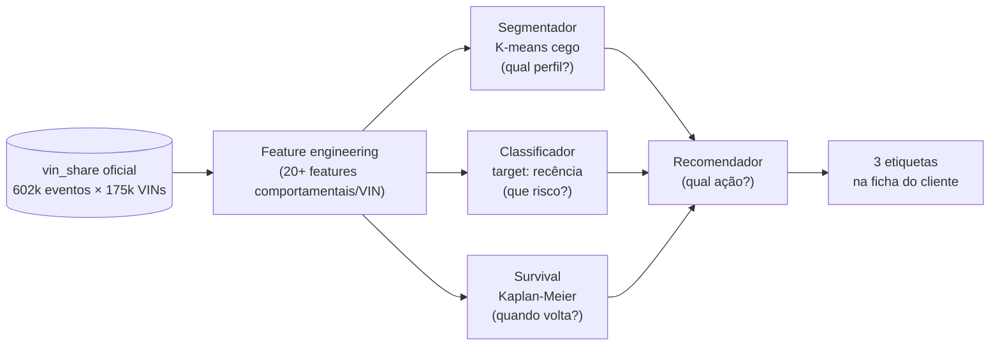
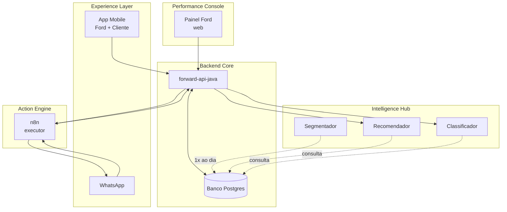
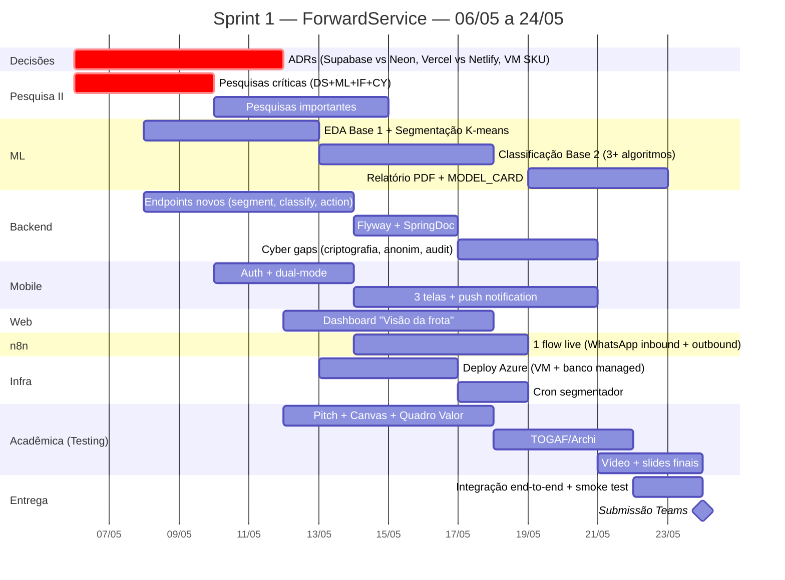
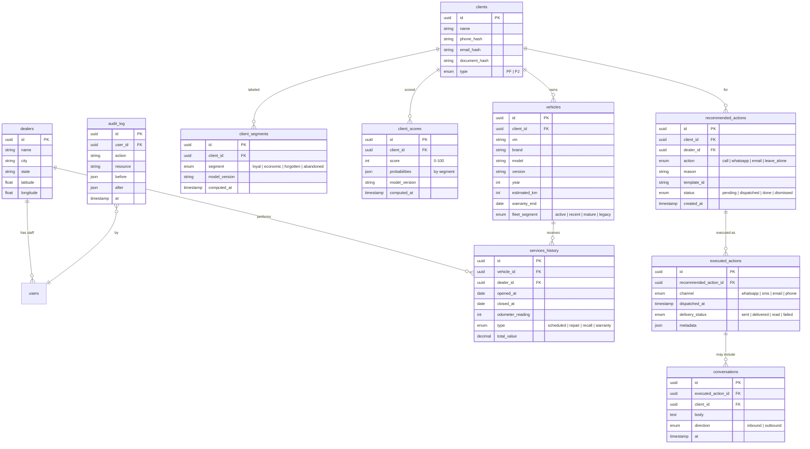
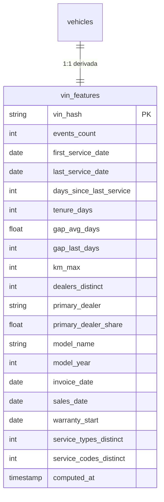

# Solution Design — ForwardService

> **DOC 03** — Traduz a Base Fundacional em **arquitetura fechada, plano de Sprint 1 e cronograma realista**.
> Reescrito do zero em 06/05/2026 após chegada dos PDFs oficiais (Ford.pdf + Sprint1_Ford_ML.pdf), das 2 bases sintéticas e do brainstorm que definiu a Arquitetura D + estratégia Show & Tell.
> **v2.1 (17/05/2026):** ajuste pós-dataset oficial Ford. O `vin_share_Desafio_02.xlsx` (recebido 11/05) tem schema fundamentalmente diferente do sintético — sem labels, sem socioeconômico. **Pilar 1 (Intelligence Hub) foi re-modelado** de classificação supervisionada para survival + clustering comportamental. Pilares 2/3/4 e infra/cyber sobrevivem. Detalhes em [02e_DATASET_OFICIAL_E_FONTES.md](./02e_DATASET_OFICIAL_E_FONTES.md).
> Última revisão: 17/05/2026

---

## Changelog da v2.1 (17/05/2026)

Resumo das alterações desta revisão (detalhes nos blocos editados ao longo do documento):

- **Fonte primária de dados** muda do par Base 1+Base 2 sintéticos para `vin_share_Desafio_02.xlsx` (602k eventos × 25 colunas, 175k VINs únicos, 100% BRA, 435 dealers, 21 modelos, anos 2017-2026). Os sintéticos viram "simulação socioeconômica honesta" como input paralelo.
- **Pilar 1 (forward-ml)** ganhou **5 notebooks** no lugar de 3, contemplando: EDA do oficial, feature engineering comportamental (20+ features/VIN), K-means cego, classificação com target engenheirado (`days_since_last_service > 365`), survival analysis (Kaplan-Meier por modelo/ano).
- **Curva da Morte (LN2)** sai de hipótese para **fato medido**: distribuição direta de `MaintenanceNumber` no oficial mostra 31% (1ª rev.) → 22% → 15% → 9%. Cada revisão perde 30-40% dos clientes.
- **VIN Share absoluto** calculado: **~3,5-5%** (175k vistos / 3,5-5M frota Ford BR via FENABRAVE). Vira número-chefe do pitch.
- **5 fontes externas integradas:** FENABRAVE (frota), ABRADIF (80 dealers geocodificados), FIPE (95 valores por modelo×ano), Senacon (12 campanhas de recall), Manual de manutenção (cronograma oficial 10k km/12 meses).
- **Tratamento de qualidade**: dropar 3 colunas constantes (Country, ServiceType, StatusUSA), clip de KM a 500k, strip de MainSource, parser de data por coluna.
- **Governança (CY01)**: `VIN_Hash` confirmado robusto (SHA1 não revertível em 5M tentativas) — mantido tratamento conservador como pseudonimizado.
- **ADRs novos:** ADR-010 (re-modelagem ML) e ADR-011 (adoção das 5 fontes externas).
- **Cronograma** atualizado para a janela real (17/05 → 24/05).

---

## TL;DR — Em 30 segundos

A ForwardService é uma plataforma onde **cada cliente Ford carrega 3 etiquetas que viajam com ele o tempo todo**: um **segmento** (qual perfil é), um **termômetro** (quão perto de sumir) e uma **ação sugerida** (o que fazer agora). Essas 3 etiquetas saem de um **cérebro de IA em 3 camadas** (Segmentador, Classificador, Recomendador), são executadas por um **motor de ações** (n8n + WhatsApp), entregues por uma **interface dual** (mesmo app mobile em modo Ford ou modo Cliente) e medidas por um **cockpit corporativo** (web). Tudo conversa por um **backend Java único** que é o portão de entrada do sistema.

**Sprint 1 entrega Show & Tell:** o **ML completo (Segmentador + Classificador)** rodando, **endpoints Java reais**, **mobile com 3 telas funcionais**, **dashboard web com 1 visão**, **n8n com 1 flow live**, **infra Azure**. Recomendador via ML fica como visão futura — Sprint 1 usa regras simples explícitas, mais auditáveis e mais honestas dado o dataset sintético.

---

## Sumário

1. [Visão — A história em 1 minuto](#parte-1--visão)
2. [Um dia no ForwardService — o produto 100% rodando](#parte-2--um-dia-no-forwardservice)
3. [As Plataformas — quem faz o quê](#parte-3--as-plataformas)
4. [Sprint 1 — o que entrega até 24/05](#parte-4--sprint-1-o-que-entrega-até-2405)
5. [Mapeamento aos 4 Pilares e 9 Lógicas](#parte-5--mapeamento-aos-4-pilares-e-9-lógicas)
6. [Stack e Infraestrutura](#parte-6--stack-e-infraestrutura)
7. [Cronograma realista — 06/05 → 24/05](#parte-7--cronograma-realista)
8. [Modelo de Dados](#parte-8--modelo-de-dados)
9. [Decisões registradas (ADRs)](#parte-9--decisões-registradas)
10. [Limites de escopo](#parte-10--limites-de-escopo)

---

## Parte 1 — Visão

### A tese, em uma frase

> **ForwardService transforma cada cliente Ford em um cliente legível, abordável e mensurável** — usando IA pra entender quem é, dados pra saber quão perto está de sumir, e automação pra agir antes de ele ir embora.

### O cenário (pra contar pros amigos)

João comprou um Ka 2014 na concessionária. Seis anos depois, ele sumiu. Não fez a última revisão, não responde campanha, não atende ligação. Pra Ford, ele virou um número numa planilha. Pra concessionária, ele virou prejuízo.

A ForwardService quer que o João **nunca chegue nesse ponto**. No nosso sistema, todo cliente da Ford tem três coisas grudadas nele o tempo todo:

1. **Uma etiqueta** — que tipo de cliente ele é (fiel? esquecido? quase indo embora?)
2. **Um termômetro** — quão perto ele tá de sumir (0 a 100)
3. **Uma sugestão de ação** — o que fazer com ele *agora*

Quando o atendente da concessionária abre a ficha do João no tablet, ele vê **"João — Esquecido — risco 78 — Ligue hoje, oferta de revisão 20% off"**. Do outro lado, o gerente da Ford vê um painel da **frota inteira** com essas mesmas três coisas agregadas.

Essas 3 coisas não saem do nada. Elas vêm de um **cérebro em 3 camadas** alimentado pelos dados que a Ford já tem mas não usa direito. Cada camada faz uma coisa simples. Juntas, elas viram inteligência.

---

## Parte 2 — Um dia no ForwardService

A visão **100% rodando**, narrada como um dia real. Esse texto é a base do **pitch** e do roteiro do **vídeo de 3 minutos**.

### Quarta-feira, 14h32 — João Silva, Ka 2014, sumido há 11 meses

**02h da madrugada.**
A plataforma não dorme. Enquanto a Ford inteira tá em casa, o **cérebro** acorda, lê o banco, e re-etiqueta os 12,4 milhões de clientes do Brasil. João, que ontem era "Risco Médio", virou **"Esquecido"** e o termômetro dele subiu pra **78** — porque a próxima revisão dele venceu ontem.

**09h12.**
A camada do Recomendador olha pro João e fala: *"Esquecido + risco 78 + sem app + última conversa há 8 meses → mandar WhatsApp com cupom revisão 20%, e avisar a concessionária dele que tem ação aberta."* Ação enviada pro **n8n**.

**09h13.**
O n8n é o **braço executor** do sistema. Recebe a ordem, monta a mensagem, dispara no WhatsApp do João:

> *"Oi João, faz tempo. Notamos que seu Ka tá pedindo revisão. Tô com 20% off liberado pra você até sexta. Quer que eu agende?"*

João nem sabe que falou com um sistema. Pra ele, é a Ford lembrando dele.

**09h47.**
João responde "quanto fica pra rodar tudo?". O n8n responde com cardápio de serviços + link curto. Cada clique do João volta pro banco. O termômetro já mexe: caiu de 78 pra 71. Ele tá engajando.

**11h05.**
**Maria, atendente da concessionária Ford Vila Olímpia.** Abre o **app mobile no tablet, em modo Ford**. Ela não usa planilha, não usa email — só o app. Lá, no topo da tela dela, aparece:

> 🟡 **João Silva — Esquecido — risco 71 — começou a responder no WhatsApp 1h atrás. Próxima ação: ligar e fechar agendamento da revisão.**

Maria liga, fecha pra sexta. Marca "agendado" no app. **O sistema não pergunta o que ela fez** — ela escreveu uma vez, e a partir dali os 4 pilares já sabem.

**14h32.**
João, no escritório dele, **abre o app mobile pela primeira vez** (link veio pelo WhatsApp). O app reconhece que ele é cliente, e vira **modo Cliente**:

> *"Olá, João. Sua revisão tá agendada pra sexta 09h, na Vila Olímpia. Seu Ka tá com 6 itens recomendados, total R$ 487. Quer ver?"*

Uma porta. Dois lados.

**18h00.**
**Carlos, diretor regional da Ford,** entra no **forward-web** do notebook dele. Não é o mesmo lugar que a Maria — esse é o **Painel de Performance**, o cockpit da Ford corporativa. Ele vê:

> Hoje: **47 esquecidos contatados via WhatsApp · 22 agendaram · 47% de conversão · R$ 184 mil em revisão prevista · 9 dealers acima da meta, 3 abaixo.**

Carlos não vê João. Ele vê **a frota inteira em tempo real**.

**Sexta, 02h da madrugada.**
O cérebro acorda de novo. João, que sexta-feira fez a revisão, muda de **"Esquecido"** pra **"Fiel"**. Termômetro dele cai pra 22. **O ciclo fechou.** E o dado dessa conversão volta pra alimentar o próprio cérebro — ele aprendeu que mensagem WhatsApp + cupom 20% funciona pra "esquecidos com risco 70-80".

> Esse é o **Flywheel de Dados** — quanto mais a plataforma roda, mais inteligente ela fica.

### O elenco

| Plataforma | Papel no enredo | Quem usa |
|---|---|---|
| **App Mobile** (`forward-mobile`) | Duas portas, um app. Modo Ford pro atendente, modo Cliente pro dono do carro. Login decide qual abre. | Maria + João |
| **Web** (`forward-web`) | Cockpit estratégico. Painéis agregados, KPIs, frota inteira. Nada de cliente individual. | Carlos (Ford corporativo) |
| **WhatsApp + n8n** | Porta da rua. Cliente que nem baixou app fala com a Ford por aqui. n8n também é o braço que dispara qualquer ação automática. | Sistema → cliente |
| **Backend Java** (`forward-api-java`) | Garçom central. Todo mundo (app, web, n8n) só fala com ele. Ele é quem sabe a verdade. | Ninguém usa direto |
| **ML** (`forward-ml`) | Cérebro das 3 camadas. Etiqueta, mede risco, sugere ação. Só fala com o garçom. | Ninguém usa direto |
| **Banco** (Postgres) | Memória do sistema. Tudo o que aconteceu fica aqui. | Ninguém usa direto |

### Como tudo se interliga

**Princípios do diagrama:**
- Tudo que vem de fora (Mobile, WhatsApp, Web) entra pelo **Backend Java** — portão único.
- O **Backend** é o único que fala com o **Cérebro** e com o **Banco**.
- O **n8n** é o único que sai pra fora (manda WhatsApp, email, push).
- O **Segmentador** é assíncrono — roda 1×/dia direto no banco, não atrapalha ninguém.
- A **Web** só lê, nunca escreve diretamente.
- **Caixa não fala com vizinha do vizinho.** Mobile não fala com banco. Web não fala com ML. n8n não fala com banco.

> Essa última frase é literalmente o que o Prof. Salatiel chama de **arquitetura SOA bem feita**.

---

## Parte 3 — As Plataformas

Para cada plataforma, respondemos quatro perguntas: **o que é, do que é responsável, do que NÃO é responsável, com quem fala**. Isso é o que permite delegar partes do código sem que ninguém quebre os contratos das outras.

### 3.1 — Experience Layer · `forward-mobile`

**O que é:** app Expo/React Native em **um único codebase** que assume dois modos diferentes dependendo do login: **Modo Ford** (atendente) e **Modo Cliente** (dono do carro).

**Responsabilidade:**
- Renderizar a interface dos dois personagens (Maria + João)
- Manter sessão autenticada e cache leve
- Disparar ações pro backend (agendar, responder cupom, atualizar status)
- Receber push notifications

**Não é responsabilidade:**
- Tomar decisão de negócio (não decide quem é "esquecido" — só renderiza)
- Falar direto com banco, com ML ou com WhatsApp — **só fala com o backend Java**

**Com quem fala:** **só** com `forward-api-java` (REST).

**Stack:** Expo SDK 54+, React Native, TypeScript, expo-router, i18n desde o início (EN base, PT-BR como tradução).

### 3.2 — Performance Console · `forward-web`

**O que é:** dashboard SvelteKit consumido pela **Ford corporativa** e **gerentes regionais**. Não é versão web do app — é um produto **diferente**, com público diferente.

**Responsabilidade:**
- Painéis agregados (frota, dealers, campanhas, ROI)
- Filtros por região / período / categoria
- Exportação (CSV, PDF) pra reuniões
- Visualizações dos KPIs vindos do **Closed-Loop ROI** (LN7)

**Não é responsabilidade:**
- Atender cliente individual (isso é com o mobile)
- Editar/criar/excluir registros — **read-only** no fluxo de cliente
- Configurar lógicas de negócio (admin separado, fora do escopo Sprint 1)

**Com quem fala:** **só** com `forward-api-java` (REST).

**Stack:** SvelteKit, design system próprio, Chart.js/visx pra gráficos.

### 3.3 — Action Engine · `n8n` + WhatsApp

**O que é:** orquestrador low-code que assume duas funções:
- **Saída:** quando o backend decide "manda WhatsApp pro João", quem executa é o n8n
- **Entrada:** quando João responde no WhatsApp, quem recebe primeiro é o n8n, que traduz pra chamada de API

**Responsabilidade:**
- Disparar mensagens (WhatsApp Business API, email, SMS) com base em ordens do backend
- Receber webhooks (resposta de cliente, status de entrega) e empurrar pro backend
- Rotacionar templates aprovados pelo WhatsApp Business
- Logar comunicações pro banco (via API)

**Não é responsabilidade:**
- Decidir **quando** mandar mensagem (Recomendador decide)
- Decidir **quem** mandar (idem)
- Guardar estado de longo prazo (estado vive no banco)

**Com quem fala:**
- **Recebe de:** backend Java (ordens) + canais externos (webhooks WhatsApp/email/SMS)
- **Envia para:** backend Java (eventos) + canais externos

**Stack:** n8n self-hosted (Docker).

**Por que n8n:** equipe não-dev pode adicionar canal novo sem mexer no Java. Inversão saudável: lógica de orquestração externa fica fora do core.

### 3.4 — Backend Core · `forward-api-java`

**O que é:** API Spring Boot 3 que é o **único portão de entrada** do sistema.

**Responsabilidade:**
- Expor REST para mobile/web
- Expor SOAP onde a disciplina de SOA exigir (Prof. Salatiel) — operação `GetVehicle` com WSDL
- Aplicar RBAC (Maria não vê cliente da concessionária Y)
- Rate limit por IP + user (Bucket4j)
- Orquestrar leituras: pedido do mobile → busca dados no banco → busca score no ML → monta resposta unificada
- Disparar ordens pro n8n quando o Recomendador decide ação
- Registrar tudo (auditoria, RFC 7807 pra erros)

**Não é responsabilidade:**
- Treinar modelos (forward-ml)
- Mandar mensagem (n8n)
- Renderizar interface (mobile/web)

**Com quem fala:**
- **Recebe de:** mobile, web, n8n
- **Envia para:** banco (JDBC), forward-ml (HTTP interno), n8n (HTTP)

**Stack já decidida:** Spring Boot 3.2 + Java 17 + Spring Web + Spring WS + Spring Security + Spring Data JDBC + HikariCP + Bucket4j + Logback JSON + SpringDoc OpenAPI.

### 3.5 — Intelligence Hub · `forward-ml`

**O que é:** repositório com os modelos + os notebooks de treino + o serviço que expõe pro backend.

**Responsabilidade (v2.1, pós-dataset oficial):**
- **Pré-processamento:** ingere `vin_share_Desafio_02` com normalizações (clip KM, strip de MainSource, parser de data por coluna, drop de Country/ServiceType/StatusUSA), gera `vin_features.csv` (175k VINs × 20+ features comportamentais derivadas)
- **Camada 1 — Segmentador:** roda 1×/dia (cron), lê o banco, escreve etiqueta + segmento em `client_segments` (**K-means cego** sobre as features comportamentais; sem ground truth — análise de personas pós-hoc com nomes do DOC 00: fiel/econômico/esquecido/abandono)
- **Camada 2 — Classificador:** exposto via HTTP interno; recebe features comportamentais e devolve **probabilidade de churn** + perfil estimado. **Target engenheirado:** `churned = days_since_last_service > 365`. Modelo: XGBoost com SHAP.
- **Camada 3 (nova) — Survival Analysis:** Kaplan-Meier por modelo×ano gera "curva de retorno típica" — input do Recomendador pra estimar **quando** um VIN deve voltar (não só se vai voltar). Lib: `lifelines`.
- **Camada 4 — Recomendador:** Sprint 1 = **regras explícitas** no Java (não ML). Combina segmento + score + survival + cronograma oficial Ford (10k km / 12 meses). Visão futura: modelo treinado em outcomes
- **Modelo paralelo de propensão socioeconômica (visão):** treinado no dataset sintético (`ford_clientes_*.csv`) como **simulação** das features de cliente que o oficial não tem. Documentado honestamente; arquitetura preparada pra ingerir CRM real quando Ford disponibilizar.
- Manter **data lineage**: cada predição é versionada com (modelo_versão, timestamp, features_snapshot)

**Não é responsabilidade:**
- Atender chamada de cliente externo (só backend chama)
- Persistir nada além de logs de predição (estado de cliente é do banco)
- Decidir o que fazer com a predição (decisão fica no backend; execução nunca aqui)

**Com quem fala:**
- **Recebe de:** backend Java (HTTP) + cron interno
- **Envia para:** banco (escrita do segmentador)

**Stack:**
- Sprint 1: notebooks Python (`forward-ml/notebooks/`) + script `scripts/run_segmenter.py` agendado
- Visão futura: FastAPI servindo Classificador como endpoint dedicado

### 3.6 — Banco · Postgres

**O que é:** Postgres único, fonte da verdade.

**Tabelas-chave (Sprint 1):**
- `clients`, `vehicles`, `services_history`
- `client_segments` (saída do Segmentador, com versão de modelo)
- `client_scores` (saída do Classificador, com versão de modelo)
- `recommended_actions` (saída do Recomendador, com motivo)
- `executed_actions` (o que o n8n efetivamente disparou)
- `conversations` (mensagens WhatsApp/email)
- `audit_log` (trilha de auditoria — alimenta Cyber)

**Não é responsabilidade:**
- Lógica de negócio (sem trigger gigante; lógica fica no Java)
- Cache (cache fica em camada separada se precisar)

**Com quem fala:** **só** o backend Java e o segmentador batch.

**Stack:** Postgres 16. **Decisão pendente:** Supabase (managed cloud) vs Neon (serverless cloud). Ver [ADR-001](#decisões-registradas-adrs).

### 3.7 — Infra e Docs · `forward-infra` + `forward-docs`

**`forward-infra`** — docker-compose pra dev local, scripts de deploy Azure, cron Linux do segmentador.

**`forward-docs`** — markdown único, fonte da verdade documental, espelha decisões dos sprints.

### Tabela síntese — quem fala com quem

| Componente | Recebe de | Envia para |
|---|---|---|
| forward-mobile | usuário | forward-api-java |
| forward-web | usuário Ford | forward-api-java |
| n8n | forward-api-java + canais externos | forward-api-java + canais externos |
| forward-api-java | mobile, web, n8n | banco, forward-ml, n8n |
| forward-ml | forward-api-java + cron interno | banco |
| Banco | forward-api-java + segmentador batch | forward-api-java + forward-ml |

---

## Parte 4 — Sprint 1: o que entrega até 24/05

### Princípio Show & Tell

Vocês **constroem o suficiente pra provar que a arquitetura é real**, mas **vendem a visão inteira**. A banca não quer ver brinquedo completo — quer ver maturidade de produto. Cada disciplina avaliativa precisa ter uma entrega defensável, e cada entrega precisa **encaixar na arquitetura da Parte 3** (não inventar peça paralela só pra encher relatório).

### 4.1 — O que vocês CONSTROEM

#### `forward-ml` — coração da Sprint 1 (v2.1, sobre o dataset oficial)

- `notebooks/01_eda_official.ipynb` — análise exploratória do `vin_share_Desafio_02` (já parcialmente em [02e](./02e_DATASET_OFICIAL_E_FONTES.md))
- `notebooks/02_feature_engineering.ipynb` — gera as 20+ features comportamentais por VIN (input pros 3 modelos seguintes)
- `notebooks/03_segmentation_kmeans.ipynb` — K-means cego (k=4) sobre features comportamentais + análise de personas pós-hoc; valida nomes do DOC 00 (fiel/econômico/esquecido/abandono) com Silhouette + cross-tabs com `MaintenanceNumber`
- `notebooks/04_classification.ipynb` — XGBoost com target engenheirado (`days_since_last_service > 365`); comparar **3+ classificadores** (LogReg + RF + XGBoost) com matriz de confusão + métricas + SHAP
- `notebooks/05_survival_analysis.ipynb` — Kaplan-Meier por modelo×ano + Curva da Morte real (validação direta via `MaintenanceNumber`); usa `lifelines`
- `notebooks/06_propensity_synthetic.ipynb` *(opcional, se sobrar tempo)* — modelo paralelo de propensão socioeconômica treinado no CSV sintético; ensemble simulado no Pulse Leads
- `scripts/preprocess_official.py` — normalização do xlsx oficial (clip KM, strip MainSource, parser de data por coluna)
- `scripts/run_segmenter.py` — aplica segmentador, escreve em `client_segments`
- `scripts/score_classifier.py` — aplica classificador num cliente novo
- `data/external/` — 5 CSVs de fontes externas (FIPE, dealers ABRADIF, recalls Senacon, manutenção Ford, frota FENABRAVE — ver [02e_REFERENCIAS](./02e_REFERENCIAS.md))
- `data/processed/vin_features.csv` — features comportamentais (175k linhas, gerado pelo notebook 02)
- `feature_dictionary.json` — dicionário das features comportamentais (com nota de governança)
- `MODEL_CARD.md` — versão do modelo, métricas, dataset oficial vs sintético, política de governança
- **Relatório PDF** com leitura executiva (entrega obrigatória ML)

> O coração porque é a única peça que **muda completamente com o dataset oficial**. O resto tem schema fixo. Anti-data-leakage do v2.0 deixou de ser problema (não há labels no oficial); virou engenharia de target.

#### `forward-api-java` — endpoints novos

Já existe: `/customers/{id}`, `/vehicles/{vin}`, `/leads`, `/scores/{customerId}`, `/me`, `/soap/vehicles.wsdl`.

A adicionar:
- `GET /clients/{id}/segment` — devolve etiqueta + versão do modelo (alimentado pelo segmentador batch)
- `POST /classify` — recebe features Base 2, devolve perfil predito + probabilidades
- `GET /clients/{id}/recommended-action` — **regras simples** no Java (não ML): `if segment=esquecido && score>70 → recomendação_X`
- `GET /analytics/segments-summary` — agregados pra forward-web
- **Swagger/OpenAPI ativo** (SpringDoc) — entrega obrigatória SOA
- **Flyway migrations** — entrega obrigatória SOA (controle de migrações = 7%)

#### `forward-mobile` — 3 telas

**Modo Ford (Maria):**
- Login + detecção de role
- **Tela A:** lista de clientes da concessionária dela, com etiqueta do segmento colorida
- **Tela B:** ficha individual (ex: João), mostrando segmento + histórico de revisões + ação sugerida

**Modo Cliente (João):**
- Login + detecção de role
- **Tela única:** "Meu carro" — veículo, próxima revisão sugerida, histórico

> 3 telas no total. Não 30. Sprint 1 não é app inteiro — é "o app já existe e mostra o segmento".

**Diferencial:** push notification quando ação sugerida é criada (vale ponto extra Mobile).

#### `forward-web` — 1 dashboard

- **Tela única "Visão da frota":** totais por segmento, mapa de calor por região (se Base 1 tiver geo), distribuição da Curva da Morte, ranking de IHC por dealer (com dado simulado se necessário)
- Lê de `forward-api-java` (`GET /analytics/segments-summary`)

#### `n8n` — 1 flow real

- Inbound: webhook do WhatsApp Business → POST pro Java
- Outbound: Java POST `/n8n/send` → n8n manda WhatsApp template
- **Free tier do WhatsApp Business cobre o demo** (1000 service messages/mês — pesquisa WA01 vai confirmar)
- Aproveita os flows existentes (`critical-lead-alert.json`, `simple-leads-test.json`) como base

#### Banco — schema completo, populado parcial

- **Migrations criam TODAS as tabelas** (incluindo as que ficam vazias no Sprint 1)
- **Sprint 1 popula:** `clients`, `vehicles`, `services_history`, `client_segments`, `client_scores`
- **Vazias mas com schema:** `recommended_actions`, `executed_actions`, `conversations` (parcialmente)

> A banca abre o banco, vê o schema completo, entende que o produto foi pensado completo mesmo sem ter sido construído inteiro.

#### `forward-infra` — Docker + Azure deploy

- `docker-compose.yml` levanta tudo localmente (Postgres ou Supabase remoto / Neon, Java, n8n, ML script)
- **Deploy real no Azure** (ver Parte 6)
- Cron Linux dispara `run_segmenter.py` 1×/dia

#### `forward-docs` — 4 entregas em uma

1. Doc de arquitetura em **Mermaid no markdown** — para Salatiel (combinado por acordo)
2. Pitch + Canvas + Quadro de Valor — para Testing
3. **Archi (.archimate)** — para Testing (não escapa)
4. Plano de segurança (gaps Cyber + tratamento) — para Cybersecurity

### 4.2 — O que vocês NÃO constroem (mas DOCUMENTAM)

São peças **mostradas no diagrama, descritas no doc, com schema reservado no banco** — só não estão rodando ainda.

- **Recomendador via ML** (3ª camada do cérebro) — Sprint 1 usa regras no Java; ML real fica como visão
- **Performance Console completa** (drill-down, exports, filtros avançados)
- **Anonimização full no banco** (campos pessoais criptografados em repouso) — política descrita, implementação parcial
- **Closed-Loop ROI completo** — schema pronto, dados parciais
- **Rede Invertida e Recall Gateway** — descritos como "próximas etapas"
- **Ponte Serviço-Venda** — só viable cruzando com sistema de vendas

> **Defesa na banca:** *"Construímos a peça que prova que o pipeline funciona — Segmentador + Classificador + endpoint de Ação. As outras camadas dependem do dataset oficial ou de fontes externas (vendas, recall) que ainda não chegaram. Construir agora seria desperdício — ajustaríamos tudo de novo. Mostramos a arquitetura completa porque ela existe no nosso banco, no nosso doc, e nas decisões."*

### 4.3 — Como cada disciplina avaliativa aparece

Apenas 5 disciplinas têm **entrega avaliativa** este semestre. As outras 3 (CS Software Development, Operating Systems, Physical Computing/IoT) **herdam a média das 5**.

| Disciplina | Entrega Sprint 1 | Onde mora | Critérios principais (PDF) |
|---|---|---|---|
| **SOA / Web Services** (Salatiel) | Backend Java REST + SOAP, Swagger, Flyway, separação de camadas, doc Mermaid | `forward-api-java/` + `forward-docs/project/04_ARQUITETURA.md` | WS 50% / SOA 20% / Padrões 15% / Banco 15% |
| **IA / Machine Learning** (Carlos) | Notebooks (EDA + Feature Engineering + Segmentação K-means + Classificação 3+ algoritmos + Survival) + Relatório PDF + MODEL_CARD + feature_dictionary | `forward-ml/notebooks/` | Segmentação K-means (vin_share oficial) + Classificação supervisionada com target engenheirado + Curva da Morte via `MaintenanceNumber` |
| **Mobile Development & IoT** | App Expo dual-mode, 3 telas, consumo API, push notification | `forward-mobile/` | Multiplataforma + UX consistente + 1 fonte externa de dados |
| **Cybersecurity** | JWT/RBAC ativo, sanitização, CORS, criptografia em repouso (parcial), trilha auditoria, threat model, anonimização ML | `forward-api-java/` + `forward-docs/project/06_PLANO_SEGURANCA.md` + `academic/cyber/THREAT_MODEL.md` | 5 áreas: validação 20 / auth 20 / API 20 / dados 25 / logs 15 |
| **Testing/Compliance/QA** | Pitch + Canvas + Quadro de Valor + **TOGAF/Archi (.archimate)** + apresentação 10-15 slides + vídeo 3min | `forward-docs/academic/` | Pitch + Canvas + Quadro Valor + Arquitetura TOGAF |

### 4.4 — Sinais de alarme — o que vocês têm que monitorar

1. **ML atrasado >3 dias** (janela curta — 7 dias até 24/05) → corte forward-mobile pra 2 telas (não 3), corte survival analysis (mantém só K-means + classificação), foque no notebook ML.
2. ~~**Dataset oficial chega antes de 24/05**~~ → **JÁ CHEGOU em 11/05**. Re-modelagem em curso (v2.1). Decisão: pipeline rodando sobre o oficial até 24/05, **sintético vira simulação documentada** no relatório. Refazer EDA+Seg+Classif do zero sobre o oficial é a tarefa atual.
3. **Algum dos 4 amigos travou** → líder (Jota) realoca. Mobile pode ajudar UX da Web; ML pode ajudar Cyber com data audit.
4. **Aprovação de templates WhatsApp Meta atrasada** → demo via sandbox da Meta + screenshot dos templates pendentes (honestidade).
5. **Archi (.archimate) trava por causa de ferramenta** → criar fallback de exportação PNG + fonte do diagrama em XML, e levar pro prof. de Testing pra alinhar.
6. **Curva da Morte do pitch precisa ser atualizada** → usar números do oficial (`MaintenanceNumber`: 31% → 22% → 15% → 9%) no lugar dos do sintético. Os dois contam a mesma história; usar o oficial é mais honesto.

---

## Parte 5 — Mapeamento aos 4 Pilares e 9 Lógicas

Esse mapeamento é o "selo de coerência": prova que a arquitetura D não é uma escolha técnica isolada — ela materializa os 4 pilares e dá lugar pra cada uma das 9 lógicas definidas no DOC 00.

### 5.1 — Pilares × Plataformas

| Pilar | Plataforma | O que materializa |
|---|---|---|
| **Intelligence Hub** | `forward-ml` + endpoints `/segment`, `/classify`, `/recommended-action` no Java | Decisão automatizada: quem é, quão em risco, o que fazer |
| **Action Engine** | `n8n` + WhatsApp + (futuro: email/SMS/push) | Execução: a decisão vira mensagem, lembrete, agendamento |
| **Experience Layer** | `forward-mobile` em 2 modos + WhatsApp como entrada | Interface humana — onde Maria e João tocam o sistema |
| **Performance Console** | `forward-web` | Foto agregada pra Ford corporativa entender o todo |

### 5.2 — As 9 Lógicas × Sprint 1

| # | Lógica | Onde mora | Sprint 1 (v2.1) |
|---|---|---|---|
| 1 | **LSV (Lifetime Service Value)** | calculado pelo segmentador + agregado no `forward-web`; join com FIPE para componente de valor do veículo | ✅ entregue (FIPE join real — Ka R$ 38k → Mustang R$ 609k, fator 16×) |
| 2 | **Curva da Morte** | visualização no dashboard + Kaplan-Meier no notebook + uso de `MaintenanceNumber` como ground truth | ✅ entregue (confirmado direto no dado oficial: 31% → 22% → 15% → 9%, perde 30-40% a cada revisão) |
| 3 | **IHC (Indicador de Saúde do Cliente)** | endpoint Java `/clients/{id}/health` (combina ML + regras + flag "atrasado pra revisão" do Manual Ford) | ✅ entregue |
| 4 | **Frota Descontinuada** | feature do segmentador + insight no relatório (Ka+EcoSport = 29,7% dos eventos no oficial; Ranger = 56,7%) | ✅ entregue (oficial confirma a tese do DOC 00: ~80% da frota é descontinuada) |
| 5 | **Flywheel de Dados** | arquitetura inteira (n8n → banco → ML retreina) | 🟡 demonstrado conceitualmente; retreino real fica pra próxima |
| 6 | **Rede Invertida** | modelo de matching dealer-cliente; mapa de calor com 80 dealers geocodificados (ABRADIF) + 435 DealerCode do dataset | 🟡 mapa de calor MVP via cidade/UF (sem mapping direto DealerCode→dealer — esse é proprietário) |
| 7 | **Recall Gateway** | n8n flow + lista de 12 campanhas Ford BR (Senacon) | 🟡 piloto com 4-5 campanhas com chassi público (Troller, Territory 2021, Mustang BCM, Bronco/Maverick EGR); novo CTB 2024-25 bloqueia licenciamento de carro com recall pendente — alavanca regulatória |
| 8 | **Closed-Loop ROI** | tabela `executed_actions` + dashboard de conversão | 🟡 schema pronto, dados parciais |
| 9 | **Ponte Serviço-Venda** | view cruzando histórico × intenção compra | 🔵 documentado, depende de dados de venda |

**Distribuição (v2.1):**
- ✅ Entregue: **4 lógicas** (LSV, Curva da Morte, IHC, Frota Descontinuada) — todas reforçadas pelo dataset oficial + fontes externas
- 🟡 Parcial / demonstrado: **4 lógicas** (Flywheel, Rede Invertida, Recall Gateway, Closed-Loop ROI) — Rede Invertida e Recall Gateway subiram de 🔵 para 🟡 graças às fontes externas
- 🔵 Documentado, visão: **1 lógica** (Ponte Serviço-Venda)

> **Defesa na banca:** *"4 das 9 lógicas estão rodando. 2 estão demonstradas com schema pronto. 3 estão arquitetadas e dependem de fontes de dados externas — quando elas vierem, encaixam direto. Nenhuma das 9 está fora do design."*

---

## Parte 6 — Stack e Infraestrutura

### 6.1 — Stack final

| Camada | Tecnologia | Status |
|---|---|---|
| **Frontend Web** | SvelteKit + design system próprio | ✅ decidido |
| **Mobile** | React Native + Expo + expo-router + i18n | ✅ decidido |
| **Backend SOA** | Java 17 + Spring Boot 3.2 + Spring Web + Spring WS + Spring Security + Spring Data JDBC + HikariCP + Bucket4j + Logback JSON + SpringDoc OpenAPI + Flyway | ✅ decidido |
| **Action Engine** | n8n self-hosted (Docker) | ✅ decidido |
| **ML Service** | Python + scikit-learn + pandas + matplotlib (Sprint 1: notebook + script). Visão futura: FastAPI | ✅ decidido |
| **Banco + Auth** | PostgreSQL 16 + JWT (HS256/JWKS Supabase) + RBAC | ⚠️ **Supabase vs Neon — decisão pendente** ([ADR-001](#decisões-registradas-adrs)) |
| **Hospedagem Backend** | Azure VM (B-series) com Docker | ✅ decidido (sizing pendente — pesquisa IF02) |
| **Hospedagem Web** | **Vercel ou Netlify (free tier) — decisão pendente** ([ADR-005](#decisões-registradas-adrs)) | ⚠️ pendente |

### 6.2 — Infraestrutura Azure ($100/mês de crédito)

**Recomendação preliminar (a confirmar com pesquisas IF01-IF02-IF11):**

| Recurso | SKU sugerido | Custo/mês estimado | Função |
|---|---|---|---|
| Azure VM Linux | Standard_B1s ou B2s | $7-30 | Hospeda Java + n8n + ML Python (Docker) |
| **Banco** | **Supabase Free / Pro OU Neon Free / Scale** | $0-25 | A definir com grupo |
| Hospedagem Web | Vercel Free / Netlify Free | $0 | Hospeda forward-web |
| Storage adicional | LRS Standard | ~$2 | Backups e logs |
| Bandwidth | até 100GB free | $0 | Sai gratuito |
| **Subtotal Azure** | | **$10-32/mês** | |

**Custos externos:**
- WhatsApp Business API (Meta): free tier 1000 service messages/mês — **suficiente Sprint 1** (pesquisa WA01)
- Expo EAS Build: free tier 30 builds/mês — **suficiente Sprint 1**

**Total estimado Sprint 1: ~$15-35/mês** — confortável dentro dos $100 de crédito.

### 6.3 — Decisões pendentes (decidir com o grupo)

| # | Decisão | Opções | Critério de escolha | Pesquisa |
|---|---|---|---|---|
| 1 | Banco managed | Supabase vs Neon | Auth nativo, performance, branching, free tier limits | IF01, IF06 |
| 2 | Hospedagem web | Vercel vs Netlify | Build time, edge functions, free tier, integração com SvelteKit | IF03 |
| 3 | VM SKU | B1s ($7) vs B2s ($30) | RAM disponível pra Docker (Java + n8n + ML juntos) | IF02 |
| 4 | Migrations | Flyway (Java) vs Liquibase vs Supabase migrations | Compatibilidade com SOA + sequenciamento | IF07 |
| 5 | Classificador HTTP | FastAPI standalone vs sidecar Java vs Java→Python direto | Latência vs manutenção | IF05 |

> Decidir antes de 12/05/2026 pra não atrasar o deploy.

---

## Parte 7 — Cronograma realista

> **v2.1 (17/05/2026):** cronograma original previa 18 dias; consumimos os primeiros 11 entre fechar ADRs, executar 02c/02d e absorver o dataset oficial recebido em 11/05. Restam **7 dias** até a entrega — corte de escopo focal abaixo.

**Hoje:** 17/05/2026. **Deadline:** 24/05/2026. **Janela:** **7 dias** corridos (~5 úteis).

### Plano dos 7 dias (compactado, v2.1)

| Dia | Foco | Quem |
|---|---|---|
| **D-7 (17/05, sáb)** | Reset do plano + atualização do DOC 03 + follow-up pro grupo + commits iniciais dos artefatos do 02e | Líder + grupo lê follow-up |
| **D-6 (18/05, dom)** | Notebooks 01 (EDA oficial) + 02 (feature engineering) — concluir antes do começo da semana | ML |
| **D-5 (19/05, seg)** | Notebook 03 (K-means) + endpoints Java `/segment` e `/classify` esqueleto + mobile auth | ML + Backend + Mobile |
| **D-4 (20/05, ter)** | Notebook 04 (classificação XGBoost) + endpoint `/recommended-action` regras + mobile telas + deploy Azure dev | ML + Backend + Mobile + Infra |
| **D-3 (21/05, qua)** | Notebook 05 (survival, se sobrar; caso contrário corta) + dashboard web "Visão da frota" + n8n flow live + pitch escrito + Archi começar | ML + Web + n8n + Testing |
| **D-2 (22/05, qui)** | Relatório PDF ML + MODEL_CARD + Archi finalizar + vídeo 3min gravar | ML + Testing + grupo |
| **D-1 (23/05, sex)** | Integração end-to-end + smoke test + revisão final + slides finais | Grupo todo |
| **D-0 (24/05, sáb)** | Submissão via Tarefas Teams | Líder |

### O que foi recortado vs v2.0

- **Notebook 06 (propensão sintética)** vira **opcional** — só se sobrar tempo no D-4/D-5
- **Notebook 05 (survival)** vira **opcional** — Kaplan-Meier por modelo×ano é "se sobrar tempo"; Curva da Morte vem do `MaintenanceNumber` direto
- **3ª tela mobile** continua planejada mas é a primeira a cair se ML atrasar
- **Flow n8n** mantido como flow único (não 2 ou 3)

### O cronograma original (v2.0, 06/05 → 24/05, 18 dias)

### Semana a semana

| Semana | Datas | Foco principal |
|---|---|---|
| **S1** | 06-12/05 | Decisões pendentes (ADRs) + Pesquisa II 🔴 + EDA Base 1 + endpoints Java |
| **S2** | 13-19/05 | Segmentação rodando + Classificação iniciada + deploy Azure + mobile telas + dashboard web + Pitch escrito |
| **S3** | 20-23/05 | Classificação completa + Relatório PDF + n8n flow + TOGAF Archi + vídeo 3min + integração end-to-end |
| **D-1** | 23/05 | Smoke test + revisão final |
| **Entrega** | **24/05** | Submissão via Tarefas Teams |

**Carga estimada:** ~12-15h/semana × 4 pessoas × 3 semanas = ~150-180h. Dentro do realístico.

---

## Parte 8 — Modelo de Dados

### RBAC (Row Level Security ou Spring Security)

| Role | Vê o quê | Altera o quê |
|---|---|---|
| `attendant` | clientes e veículos do seu dealer | recommended_actions (status), conversations |
| `manager` | tudo do seu dealer + métricas | recommended_actions, configurações do dealer |
| `dealer_owner` | tudo do seu dealer + benchmark | configurações |
| `ford_regional` | todos os dealers da sua região | nada (read-only) |
| `ford_admin` | tudo | configurações globais |

### Anonimização (Cyber) — atualização v2.1

- **`vehicles.vin` substituído por `vehicles.vin_hash`** — Ford já entrega SHA1 robusto (5M tentativas de reversão = 0 matches; ver [02e §5](./02e_DATASET_OFICIAL_E_FONTES.md#parte-5--teste-de-reversão-sha1)). Tratamento conservador: **pseudonimizado** (LGPD aplicável).
- `clients.phone`, `email`, `document` armazenados como **hash** quando vierem (CY01) — no oficial Ford não temos esses campos; vivem da camada de CRM/sintético.
- `audit_log` registra acesso a dados pessoais
- ML lê **view anonimizada** `vehicles_for_ml` (sem PII; só `vin_hash` + features comportamentais derivadas)

### Tabela complementar — `vin_features` (v2.1, derivada do oficial)

> Materializada **1×/dia** pelo `scripts/run_segmenter.py` a partir do dataset oficial. CSV de referência: `forward-ml/data/processed/vin_features.csv` (175.554 linhas).

### Tabelas auxiliares de fonte externa (v2.1)

| Tabela | Origem | Quem alimenta | Uso |
|---|---|---|---|
| `dealers_directory` | ABRADIF (80 dealers BR) | seed inicial | mapa Service Share / Rede Invertida |
| `fipe_values` | API Parallelum FIPE | refresh mensal | join no LSV (componente valor do veículo) |
| `recall_campaigns` | Senacon + Ford BR (12 campanhas) | seed inicial + curadoria | Recall Gateway (LN4) |
| `maintenance_schedules` | Manual de manutenção Ford (8 modelos) | seed inicial | flag "atrasado pra revisão" |
| `vio_estimates` | FENABRAVE/Sindipeças | seed estatístico | denominador do VIN Share absoluto |

---

## Parte 9 — Decisões registradas

ADRs completos ficam em `forward-docs/decisions/`. Aqui só o resumo executivo:

| ID | Decisão | Status |
|---|---|---|
| **ADR-001** | Banco managed: Supabase vs Neon | ⏳ pendente, decisão até 12/05 |
| **ADR-002** | Backend Go → Java (21/04/2026) | ✅ executado |
| **ADR-003** | Mobile dual-mode (single codebase, role decide o modo) | ✅ aprovado |
| **ADR-004** | SOA via Mermaid no markdown (combinado com Salatiel) | ✅ aprovado |
| **ADR-005** | Hospedagem: Azure VM única + Vercel/Netlify (web) — sem Railway, sem managed K8s | ✅ direção, sub-escolhas pendentes |
| **ADR-006** | Recomendador via regras (Sprint 1) ao invés de ML | ✅ aprovado |
| **ADR-007** | n8n como Action Engine único (não dividir com código custom) | ✅ aprovado |
| **ADR-008** | Show & Tell como estratégia de Sprint 1 (constrói parte, vende todo) | ✅ aprovado |
| **ADR-009** | Anti-data-leakage: separação física Base 1 / Base 2 + flag `is_post_purchase` no feature_dictionary | ⚠️ válido pro sintético, **não aplicável ao oficial** (não há labels) — ver ADR-010 |
| **ADR-010** | **Re-modelagem ML pós-dataset oficial (17/05/2026):** Pilar 1 migra de classificação supervisionada (target `churn_rede_24m` do sintético) para **survival + clustering comportamental + classificação com target engenheirado** (`days_since_last_service > 365`). Detalhes em [02e §9](./02e_DATASET_OFICIAL_E_FONTES.md#parte-9--decisões-propostas). | ✅ aprovado |
| **ADR-011** | **Fontes externas adotadas (17/05/2026):** integradas no pipeline 5 fontes públicas — FENABRAVE (VIO), ABRADIF (80 dealers geocodificados), FIPE (95 valores), Senacon (12 recalls), Manual Ford (cronograma 10k km/12 meses). Bibliografia completa em [02e_REFERENCIAS.md](./02e_REFERENCIAS.md). | ✅ aprovado |
| **ADR-012** | **Sintético como simulação documentada (17/05/2026):** CSV `ford_clientes_*.csv` não descartado. Vira input do modelo paralelo de propensão socioeconômica; pitch reflete arquitetura "preparada pra ingerir CRM real quando Ford liberar". | ✅ aprovado |

---

## Parte 10 — Limites de escopo

**O que a ForwardService É:**
- Plataforma de inteligência e ação para retenção pós-venda
- Desenhada para o contexto específico da Ford Brasil
- Baseada em dados reais, ML auditável e lógicas de negócio diferenciadoras
- Mensurável: cada ação tem ROI rastreável

**O que a ForwardService NÃO É:**
- Não é DMS — não substitui o sistema operacional da concessionária
- Não é ERP — não gerencia estoque, contabilidade, RH
- Não é sistema de vendas — a ponte serviço-venda gera leads, a venda acontece nos sistemas existentes
- Não implementa vans nem oficinas parceiras — identifica desertos e simula impacto
- Não define políticas da Ford — fornece infraestrutura e recomendações

**O que NÃO entra no Sprint 1 (mas está no design):**
- Recomendador via ML (Sprint 1 = regras explícitas)
- Performance Console completa (Sprint 1 = 1 dashboard)
- Anonimização full em repouso (Sprint 1 = parcial)
- Closed-Loop ROI completo (Sprint 1 = schema + dados parciais)
- Rede Invertida, Recall Gateway, Ponte Serviço-Venda (Sprint 1 = documentado)
- Multi-canal além de WhatsApp (Sprint 1 = só WhatsApp)
- Auth Multi-fator (futuro)
- Dark mode (futuro)

**O que NÃO entra em nenhuma sprint deste semestre:**
- Integração real com DMS de concessionárias (depende da Ford)
- Conectividade veicular com modelos descontinuados (impossível por design)
- Painel admin completo de configuração de regras (fica pra fase 2)

---

> *Este documento substitui a v1.0 (09/04/2026) de cabo a rabo. Quando bater dúvida sobre escopo, prazo ou tecnologia, volte aqui. Quando este doc estiver desatualizado, atualize-o antes de tomar decisão grande.*

> Documentos relacionados:
> - **DOC 00** — Base Fundacional (tese + pilares + lógicas + escopo macro)
> - **DOC 01b** — Mapa de Pesquisa II (71 pesquisas novas, status próximo)
> - **DOC 04** — Arquitetura (próximo, contratos + fluxos detalhados)
> - **DOC 05** — Sprint 1 (próximo, status de cada entrega + links)
> - **DOC 06** — Plano de Segurança (próximo, Cyber detalhado)
> - **DOC 07** — Plano de ML (próximo, IA detalhado)
> - **DOC 08** — Plano Mobile (próximo, telas e fluxos detalhados)
