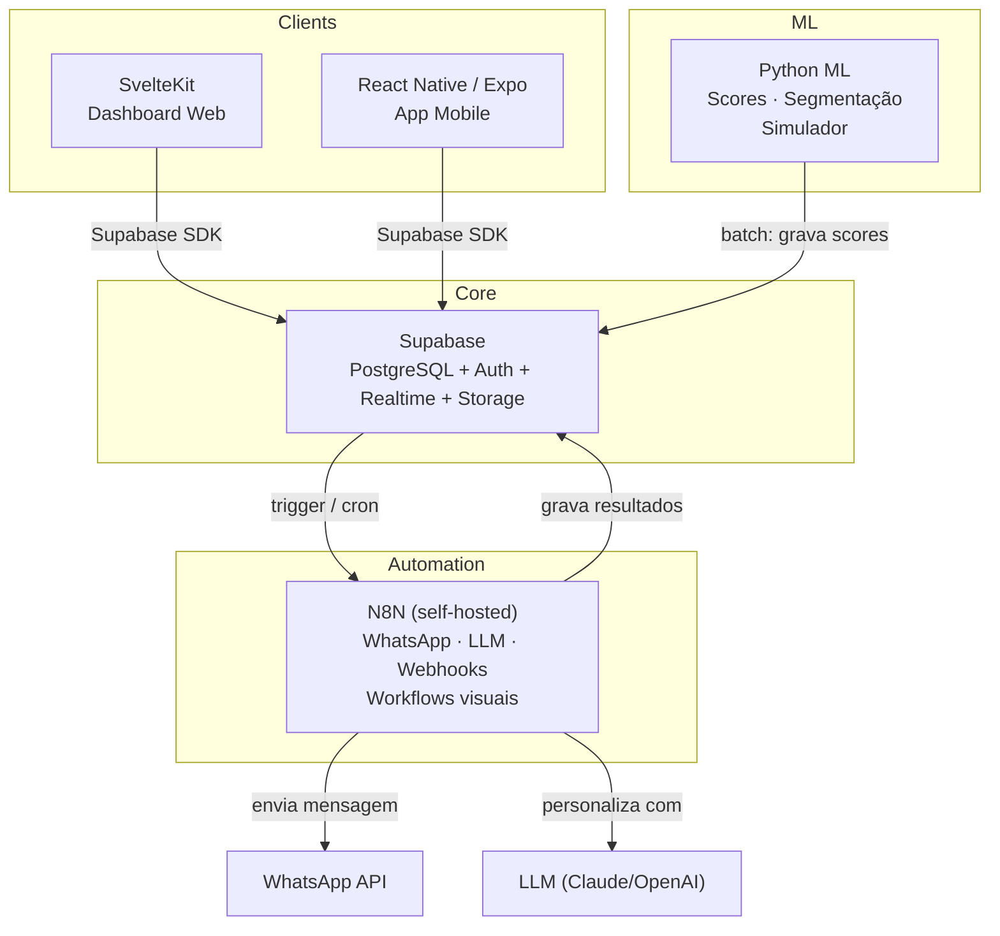
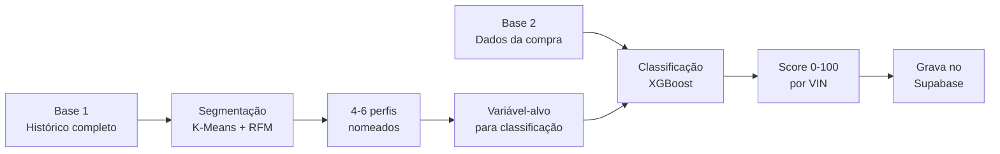
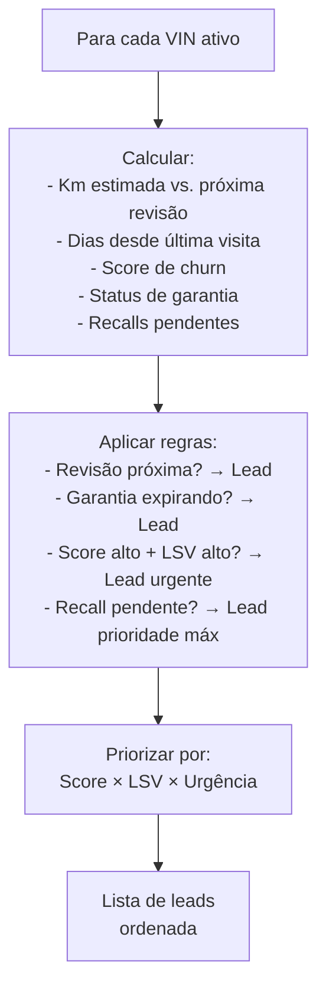
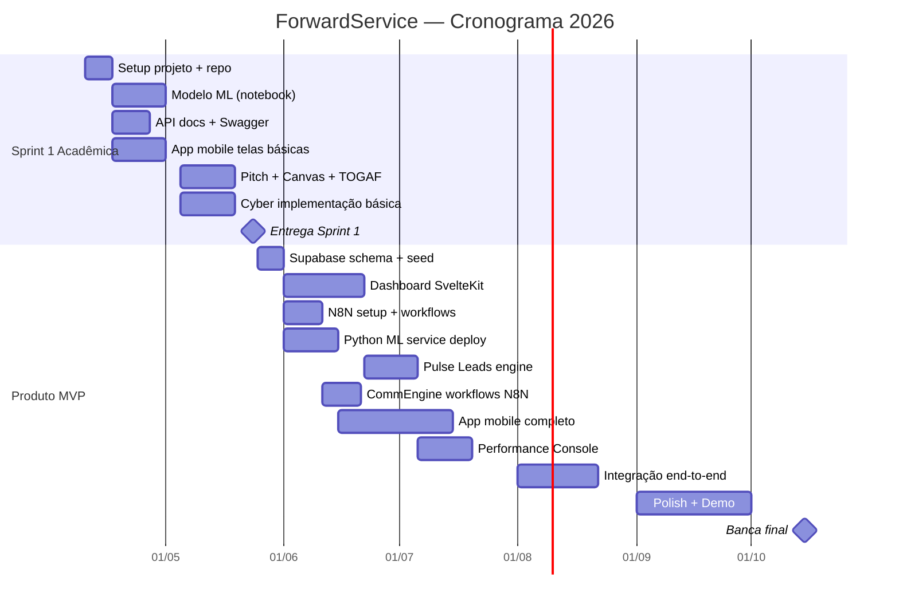

# Solution Design — ForwardService

> **DOC 03** — Traduz a Base Fundacional em features concretas, define o MVP, escolhe a stack e traça o cronograma.  
> Este documento responde: **o que exatamente vamos construir, em que ordem, e com que tecnologia.**  
> Data: 09/04/2026

---

## O que vamos construir — Visão geral

A ForwardService é composta por **4 produtos que funcionam juntos**:

1. **Dashboard Web** (SvelteKit) — Painel para gerentes e diretoria verem métricas, leads, mapas de cobertura e ROI. É onde a concessionária e a Ford acompanham tudo.
2. **App Mobile** (React Native/Expo) — Duas versões: uma para o **atendente** da concessionária (ver perfil do cliente, enviar mensagem, gerenciar leads) e uma para o **cliente** (agendar serviço, ver status, consultar planos Ford Care).
3. **Motor de automação** (N8N) — Orquestra toda a comunicação com o cliente: envio de WhatsApp, personalização de mensagens com LLM, follow-ups automáticos e webhooks. Substitui a necessidade de um backend API separado para integrações externas, com workflows visuais e editáveis sem código.
4. **Serviço de ML** (Python) — Roda os modelos de segmentação e predição de churn. Calcula os scores e grava no banco. Entrega o Jupyter Notebook para a disciplina de IA/ML.

Tudo se conecta via **Supabase** — um banco PostgreSQL na nuvem que já vem com autenticação, permissões por cargo (RLS) e atualizações em tempo real. O N8N se conecta ao Supabase via triggers de banco ou chamadas agendadas (cron), sem necessidade de intermediário.

---

## Sumário

1. [Decisão de arquitetura](#parte-1--decisão-de-arquitetura)
2. [Stack definitiva](#parte-2--stack-definitiva)
3. [Definição de MVP](#parte-3--definição-de-mvp)
4. [Features detalhadas](#parte-4--features-detalhadas)
5. [Modelo de dados](#parte-5--modelo-de-dados)
6. [Mapa de disciplinas](#parte-6--mapa-de-disciplinas)
7. [Cronograma](#parte-7--cronograma)
8. [Decisões de design](#parte-8--decisões-de-design)

---

# Parte 1 — Decisão de Arquitetura

## O insight central

Com Supabase como BaaS (Backend as a Service — banco de dados, autenticação e APIs prontos na nuvem), **não precisamos de um backend API separado para o MVP**. Veja o que cada camada da aplicação precisa e quem resolve:

| Necessidade | Quem resolve | Código custom necessário? |
|---|---|---|
| CRUD (clientes, veículos, OS, leads) | Supabase direto (client SDK) | Não |
| Auth + RBAC | Supabase Auth + RLS | Não |
| Realtime (status, notificações) | Supabase Realtime | Não |
| Lógica de negócio simples (gerar leads, calcular IHC) | SvelteKit server routes / Edge Functions | Não |
| WhatsApp, LLM, integrações externas | **N8N** (workflows visuais, self-hosted) | Não — configuração visual |
| ML (scores, segmentação, simulação) | **Python service** | Sim (serviço separado) |

## Arquitetura: Supabase-First

### Por que essa arquitetura e não um backend monolítico?

| Abordagem | Prós | Contras | Pra quem |
|---|---|---|---|
| **Supabase + N8N** (nossa escolha) | Menos código, mais velocidade, auth pronto, realtime grátis, automação visual, equipe já tem experiência | Dependência de ferramentas externas | Grupo pequeno (1 dev principal) construindo MVP |
| Backend monolítico (Go ou TS) | Tudo centralizado, controle total | Mais código, mais infra, mais tempo, reinventa auth | Time de 3+ devs |
| Microserviços puros | Escalável, desacoplado | Overkill para MVP, complexidade operacional | Empresa com infra team |

**A regra:** Supabase faz o CRUD, auth e realtime. N8N faz toda a orquestração de comunicação (WhatsApp, LLM, webhooks) com workflows visuais. Python faz o ML. O código custom fica em dois lugares: SvelteKit (frontend) e Python (ML). Menos código = menos bugs = mais velocidade.

---

# Parte 2 — Stack Definitiva

## Decisão: N8N para automação (em vez de backend Go)

| Critério | N8N (self-hosted) | Go API custom | Backend TS/Node |
|---|---|---|---|
| Tempo de implementação | Horas (visual) | Dias/semanas | Dias/semanas |
| Integração WhatsApp | Node nativo | Código manual (Zenvia/Twilio SDK) | Código manual |
| Integração LLM | Node nativo (Claude, OpenAI) | Código manual | Código manual |
| Manutenção | Editar workflow visual | Alterar código, rebuild, deploy | Alterar código, rebuild, deploy |
| Acessível ao grupo | ✅ Qualquer um edita | Só devs Go | Só devs TS |
| Demonstrabilidade na banca | ✅ Workflow visual impressiona | Código é abstrato | Código é abstrato |
| Custo | Grátis (self-hosted) | Grátis (código) | Grátis (código) |
| Deploy | Container Docker | Binário ou container | Node runtime |

**Decisão: N8N.** O Go API service existia apenas para orquestrar WhatsApp e webhooks — exatamente o que o N8N faz nativamente com nodes visuais. A troca elimina centenas de linhas de código sem perder funcionalidade, e ganha demonstrabilidade (workflow visual na banca). O N8N roda self-hosted no Railway ou Azure, custo zero.

## Stack final

| Camada | Tecnologia | Responsabilidades |
|---|---|---|
| **Frontend Web** | SvelteKit | Dashboard dealers, Dashboard Ford, Performance Console, SSR + API routes |
| **Mobile** | React Native + Expo | App do atendente, App do cliente, Expo Router |
| **Automação** | N8N (self-hosted) | WhatsApp (envio/recebimento), LLM (personalização de mensagens), webhooks, cron jobs, follow-ups automáticos |
| **ML Service** | Python + FastAPI | XGBoost + SHAP, Segmentação (K-Means), Simulador de ROI (3-4 endpoints) |
| **Banco + Auth** | Supabase | PostgreSQL, Auth (JWT nativo), Row Level Security (RBAC), Realtime subscriptions, Storage |
| **Infra / Deploy** | Vercel + Railway + Supabase Cloud | Vercel (SvelteKit), Railway (N8N + Python ML), Supabase Cloud (banco) |

### Custo mensal estimado

| Serviço | Tier | Custo |
|---|---|---|
| Supabase | Free → Pro se precisar | R$ 0-140 |
| Vercel | Free (hobby) | R$ 0 |
| Railway | Starter (N8N + Python ML) | R$ 0-30 |
| WhatsApp API (via N8N) | Pay-as-you-go (Meta pricing) | R$ 10-30 |
| LLM API (via N8N) | Claude ou OpenAI | R$ 20-40 |
| **Total** | | **R$ 30-100/mês** |

Dentro do orçamento disponível do grupo para infraestrutura do projeto acadêmico (R$ 60/mês de bolso + R$ 100 de créditos Azure educacionais).

---

# Parte 3 — Definição de MVP

## O princípio

MVP não é "tudo feio". É **a menor coisa que demonstra o valor central da proposta**. Para a ForwardService, o valor central é: transformar dados em ação que retém clientes.

## O que entra no MVP

| Pilar | Feature no MVP | O que entrega |
|---|---|---|
| **Intelligence Hub** | Customer Vista 360 | Perfil do cliente com dados básicos, score de churn (pré-calculado pelo Python), LSV estimado, perfil comportamental (cluster) |
| | Service Share Map | Dashboard com VIN Share por região, visualização de desertos de serviço |
| **Action Engine** | Pulse Leads | Lista de leads priorizados (risco × LSV), motivo do lead + ação recomendada |
| | CommEngine (básico) | Template de mensagem por perfil, integração WhatsApp (envio de lembrete) |
| **Experience Layer** | Journey Optimizer (básico) | Agendamento online, status do serviço |
| | Ford Care (conceito) | Tela de planos com preço fixo, simulação "quanto você economiza" |
| **Performance Console** | Dashboard de ROI | Leads gerados vs. convertidos, receita estimada por ação |
| | IHC (básico) | Score por dealer (cálculo simples), ranking entre dealers |

## O que NÃO entra no MVP

| Feature | Por que fica pra depois |
|---|---|
| Recall Gateway com workflow completo | Precisa de dados reais de recall |
| Flywheel Dashboard | Só faz sentido com dados acumulados |
| Strategy Simulator completo | Python service complexo, MVP foca em scores |
| Integração WhatsApp bidirecional (chatbot) | Unidirecional (envio) primeiro |
| Ford Care com pagamento real | Conceito visual + simulação de economia |
| Fluxo Simplificado para descontinuados | v2 — MVP foca nos dados disponíveis |
| Dealer Benchmark com gamificação | v2 — precisa de múltiplos dealers usando |

## Faseamento

| Fase | Quando | O que entrega |
|---|---|---|
| **MVP (v1)** | Até outubro 2026 (banca) | Dashboard + Leads + Score de churn + WhatsApp básico + App mobile |
| **v2** | Pós-banca se quiser | Recall Gateway, Simulator, Gamificação, Fluxo Simplificado |
| **Sprint 1 (24/05)** | Acadêmica | Esboço demonstrável: pitch + canvas + TOGAF + notebook ML + API docs + app telas básicas |

---

# Parte 4 — Features Detalhadas

## 4.1 — Customer Vista 360

**O que o usuário vê:** Tela com perfil completo de um cliente/veículo.

**Dados na tela:**

| Seção | Campos |
|---|---|
| Cliente | Nome, telefone, email, endereço, PF/PJ |
| Veículo | VIN, modelo, ano, versão, cor, km estimada |
| Status | Garantia (ativa/expirada + data), recalls pendentes |
| Inteligência | Score de churn (0-100 com cor), perfil (fiel/econômico/esquecido/abandono), LSV (R$) |
| Histórico | Lista de OS anteriores (data, tipo, valor, dealer) |
| Próxima ação | Recomendação do sistema ("lembrete de revisão 30K em 15 dias") |

**Quem usa:** Atendente da concessionária (app mobile) + Gerente (web).

**Fonte de dados:** Tabelas `customers`, `vehicles`, `service_orders`, `churn_scores` no Supabase.

---

## 4.2 — Radar de Churn (ML)

**O que faz:** Modelo que atribui score 0-100 a cada VIN e classifica em perfil.

**Pipeline:**

**Entregáveis técnicos:**
- Jupyter Notebook (.ipynb) com todo o processo (entrega IA/ML)
- Relatório PDF com achados (entrega IA/ML)
- Tabela `churn_scores` no Supabase (alimenta o dashboard)
- API endpoint no Python service para recalcular score de novo cliente

**Regra crítica:** Base 2 (classificação) NUNCA usa variáveis pós-compra. Zero data leakage.

---

## 4.3 — Service Share Map

**O que o usuário vê:** Dashboard interativo com mapa do Brasil.

**Visualizações:**

| Viz | Tipo | O que mostra |
|---|---|---|
| Mapa de calor | Mapa | VIN Share por estado/região + posição das 145 concessionárias |
| Desertos de serviço | Mapa overlay | Zonas com alta densidade de VINs Ford e nenhum dealer próximo |
| Curva de retenção | Line chart | VIN Share por idade do veículo (curva da morte visível) |
| Ranking dealers | Table sortable | IHC, VIN Share, NPS, conversão — por concessionária |
| Trend mensal | Line chart | Evolução do VIN Share ao longo do tempo |
| Decomposição da frota | Treemap/Pie | Composição por modelo/ano/segmento (descontinuado vs. ativa) |

**Quem usa:** Gestor regional Ford (web) + Dono do dealer (web).

**Dados:** Tabelas `dealers`, `vehicles`, `service_orders`, `regions`, dados de VIO.

---

## 4.4 — Pulse Leads

**O que o usuário vê:** Lista de leads priorizados — "quem contatar hoje".

**Campos por lead:**

| Campo | Exemplo |
|---|---|
| Cliente | João Silva |
| Veículo | Ranger XLS 2023 |
| Score de churn | 72 (alto) |
| LSV | R$ 18.400 |
| Motivo | "Revisão dos 30K em ~15 dias. Última visita há 9 meses." |
| Perfil | Econômico |
| Ação recomendada | "WhatsApp com oferta de 15% desconto na revisão" |
| Template sugerido | [Link para template] |
| Prioridade | Urgente |

**Lógica de geração de leads:**

**Quem usa:** Gerente de serviço + Atendente (app mobile + web).

---

## 4.5 — CommEngine (MVP) — via N8N

**No MVP:** Envio de mensagens via WhatsApp orquestrado pelo N8N. Não é chatbot — é comunicação proativa e personalizada.

**Fluxo (workflow N8N):**
1. **Trigger:** Supabase database trigger (novo lead criado) ou cron agendado (batch diário)
2. **Enriquecimento:** N8N busca dados do cliente e veículo no Supabase
3. **Personalização:** Node LLM (Claude/OpenAI) gera mensagem personalizada com base no perfil, tom e template
4. **Aprovação (opcional):** Atendente vê o lead no Pulse Leads, clica em "Enviar mensagem", confirma ou edita
5. **Envio:** Node WhatsApp envia via API oficial do Meta (sem intermediário BSP para MVP)
6. **Registro:** N8N grava o envio no Supabase (tabela `communications`) para Closed-Loop ROI

**Vantagem do N8N:** O workflow inteiro é visual e editável. Qualquer integrante do grupo pode ajustar tom, adicionar canais ou mudar regras sem escrever código.

**Templates por perfil:**

| Perfil | Tom | Exemplo |
|---|---|---|
| Fiel | Premium | "Olá [nome], como cliente Ford há [X] anos, preparamos uma condição especial para a revisão dos [km]K do seu [modelo]." |
| Econômico | Economia | "Olá [nome], a revisão dos [km]K do seu [modelo] está com 20% de desconto esta semana. Agende pelo app ou responda aqui." |
| Esquecido | Gentil | "Olá [nome], faz tempo que não vemos seu [modelo]! Tudo bem com ele? Temos horário disponível para um check-up." |
| Abandono | Win-back | "Olá [nome], sentimos sua falta na Ford. Preparamos uma condição especial de retorno para você." |

---

## 4.6 — Journey Optimizer (MVP)

**No MVP:** Agendamento online + status do serviço.

**Telas do app mobile (cliente):**

| Tela | O que faz |
|---|---|
| Home | Resumo do veículo, próxima manutenção, alertas |
| Agendamento | Escolher concessionária, data, horário, tipo de serviço |
| Status | "Seu veículo está: em diagnóstico / em execução / pronto" |
| Histórico | Lista de serviços realizados |
| Ford Care | Planos disponíveis com simulação de economia |

**Telas do app mobile (atendente):**

| Tela | O que faz |
|---|---|
| Leads do dia | Lista Pulse Leads com ações |
| Vista 360 | Perfil completo do cliente |
| Enviar mensagem | CommEngine com templates |
| Agenda | Agendamentos do dia |

---

## 4.7 — Performance Console (MVP)

**Dashboard web com:**

| Componente | Dados |
|---|---|
| ROI por período | Leads gerados, mensagens enviadas, agendamentos, visitas, receita |
| IHC por dealer | Score 0-100, tendência, drill-down por fator |
| Ranking | Tabela comparativa entre dealers |
| Funnel | Leads → Contato → Agendamento → Visita → Receita |

---

# Parte 5 — Modelo de Dados

## Tabelas principais (Supabase/PostgreSQL)

## Row Level Security (RBAC)

| Role | Vê o quê | Altera o quê |
|---|---|---|
| `attendant` | Clientes e veículos do seu dealer | Leads (status), Communications |
| `manager` | Tudo do seu dealer + métricas | Leads, configurações do dealer |
| `dealer_owner` | Tudo do seu dealer + benchmark | Configurações |
| `ford_regional` | Todos os dealers da sua região | Nada (read-only) |
| `ford_admin` | Tudo | Configurações globais |

Implementado via Supabase RLS policies — cada query filtra automaticamente pelo dealer do usuário autenticado. Isso atende Cybersecurity (RBAC) sem código adicional.

---

# Parte 6 — Mapa de Disciplinas

Como o produto cobre as entregas acadêmicas (5 disciplinas com entrega confirmada + 3 pendentes).

## Disciplinas com entrega confirmada

| Disciplina | O que entregamos do produto | Entregável específico |
|---|---|---|
| **Arq. Serviços e Web Services** | Supabase (APIs REST/GraphQL automáticas) + N8N (webhooks) + Python ML (FastAPI) | Swagger/OpenAPI dos endpoints FastAPI, desenho de arquitetura SOA, banco com migrations, documentação dos workflows N8N |
| **Mobile Development e IoT** | App React Native/Expo (atendente + cliente) | App multiplataforma com Expo Router, consumo de API, notificações |
| **Testing, Compliance e QA** | Pitch + Canvas + TOGAF + vídeo | Apresentação 10-15 slides, vídeo 3min, arquivo .archimate |
| **Cybersecurity** | Supabase Auth (JWT) + RLS (RBAC) + validação + HTTPS | Implementação real de segurança nos 5 eixos do PDF |
| **IA e Machine Learning** | Radar de Churn (segmentação + classificação) | Jupyter Notebook + Relatório PDF |

## Disciplinas pendentes de confirmação

| Disciplina | O que provavelmente herda | Ação |
|---|---|---|
| **CS Software Development** | Pode exigir código/metodologia própria | Confirmar com Prof. Reinaldo Ramos |
| **Operating Systems** | Pode herdar nota ou exigir algo de Docker/infra | Confirmar com Prof. José Ricardo |
| **Physical Computing IoT e IOB** | Pode exigir componente IoT/hardware | Confirmar com Prof. Lucas Demetrius |

---

# Parte 7 — Cronograma

## Visão geral

## Sprint 1 (10/04 → 24/05) — Detalhamento semana a semana

O objetivo da Sprint 1 é **ter material suficiente para impressionar**, não o produto pronto.

| Semana | Datas | Foco | Entregáveis |
|---|---|---|---|
| **S1** | 10-16/04 | Setup | Criar org GitHub, repo, Supabase project, SvelteKit scaffold, Expo scaffold |
| **S2** | 17-23/04 | ML + Schema | Começar notebook de segmentação (Base 1), criar schema no Supabase, seed com dados sintéticos |
| **S3** | 24-30/04 | ML + N8N | Terminar segmentação, iniciar classificação (Base 2), setup N8N + primeiro workflow (lembrete WhatsApp) |
| **S4** | 01-07/05 | Mobile + Dashboard | Telas básicas no Expo (Vista 360, Leads), tela de dashboard no SvelteKit |
| **S5** | 08-14/05 | QA + Cyber | Pitch (slides), Canvas, baixar Archi e criar TOGAF, implementar auth Supabase |
| **S6** | 15-21/05 | Integração + Vídeo | Conectar tudo, gravar vídeo de pitch (3 min), ajustes finais |
| **S7** | 22-24/05 | Entrega | Revisar, empacotar, entregar via Teams |

**Horas estimadas:** ~12h/semana × 6.5 semanas = ~78h. Suficiente para o escopo da Sprint 1.

---

# Parte 8 — Decisões de Design

## UI/UX — Princípios

O tech lead do grupo acumula a função de designer, então o processo é direto do conceito ao código — sem etapa separada de mockups. Os princípios que guiam as decisões visuais:

| Princípio | Regra |
|---|---|
| **Clean e funcional** | Sem decoração. Cada pixel serve um propósito |
| **Data-first** | Dashboard mostra dados, não ilustrações |
| **Mobile-first para o app** | Atendente usa no balcão, tela pequena |
| **Desktop-first para dashboard** | Gestor usa na mesa, tela grande |
| **Cores da Ford** | Azul Ford (#003478) como primária, tons neutros como base |
| **Tipografia** | System fonts (Inter, -apple-system) — sem webfonts pesadas |
| **i18n desde o dia 1** | Toda string via chave de tradução, nunca hardcoded |
| **Dark mode** | Não no MVP. Foco em light theme limpo |

## Referências visuais

| Produto | O que pegar de referência |
|---|---|
| Linear | Navegação lateral clean, densidade de informação |
| Vercel Dashboard | Cards com métricas, tipografia limpa |
| Stripe Dashboard | Tabelas com filtros, detalhamento progressivo |
| Apple Health | Cards de resumo no mobile, dados com cor semântica |

## Sistema de componentes

Bibliotecas de componentes escolhidas por stack:

| Camada | Recomendação |
|---|---|
| **SvelteKit web** | shadcn-svelte (ports de shadcn/ui para Svelte) ou Skeleton UI |
| **React Native** | Tamagui ou NativeWind (Tailwind para RN) |
| **Charts** | Chart.js ou Recharts (web) / Victory Native (mobile) |
| **Mapas** | Leaflet ou Mapbox GL (web) / react-native-maps (mobile) |
| **Tabelas** | TanStack Table (funciona em Svelte e React) |

---

## Repositório — Estrutura Multi-Repo (Org GitHub)

**Org:** `ford-forward` (ou nome definitivo do projeto)

Cada serviço/produto em repo separado. Facilita delegação, CI/CD independente, e permissões granulares.

| Repo | Stack | Deploy | Responsabilidade |
|---|---|---|---|
| `forward-web` | SvelteKit | Vercel | Dashboard web (dealers, Ford, performance) |
| `forward-mobile` | React Native / Expo | EAS / Expo Go | App mobile (atendente + cliente) |
| `forward-n8n` | N8N (Docker) | Railway / Azure | Workflows de automação: WhatsApp, LLM, webhooks, cron jobs |
| `forward-ml` | Python | Railway | ML service + Notebooks (entrega IA/ML) |
| `forward-infra` | SQL / Docker | Supabase Cloud | Migrations, seed, config, IaC |
| `forward-docs` | Markdown | GitHub Pages (opcional) | Documentação, pesquisas, specs, entregas acadêmicas |

**Branch strategy:** Trunk-based com feature branches. `main` protegida, merge só via PR com approval do tech lead.

**Delegação para o grupo:** Issues com descrição precisa no GitHub → integrante cria branch `feat/xxx` → abre Pull Request → tech lead faz code review → merge na main.

> A estrutura interna de pastas de cada repo será definida durante a implementação (DOC 04 — Arquitetura).

---

## Log de decisões técnicas

| # | Decisão | Alternativa descartada | Motivo |
|---|---|---|---|
| 1 | Supabase-first (sem backend separado para CRUD) | Backend Go/TS monolítico | Menos código, auth pronto, equipe já tem experiência com Supabase |
| 2 | ~~Go para API service~~ → **N8N para automação** | Go API custom / TypeScript/Node | N8N faz nativamente o que o Go API faria (WhatsApp, LLM, webhooks), sem código, com UI visual demonstrável na banca |
| 3 | SvelteKit para web | React/Next.js | Equipe trabalha com Svelte profissionalmente |
| 4 | Python ML como serviço separado batch | ML no backend principal | Desacoplamento, sem lock de linguagem, deploy independente |
| 5 | Multi-repo (um repo por serviço) | Monorepo único | CI/CD independente por serviço, facilita delegação de tarefas ao grupo |
| 6 | Supabase Auth (JWT nativo) | JWT manual | Atende requisitos de Cybersecurity sem código adicional |
| 7 | i18n desde o dia 1 | Adicionar depois | Profissionalismo e preparação para possível expansão |
| 8 | Sem Figma | Design system formal | Tech lead é designer, vai direto do conceito ao código |
| 9 | N8N para orquestração de comunicação | Código custom (Go/TS) | Workflow visual, sem código, integrantes do grupo conseguem editar, demonstrável na banca, deploy via Docker |

---

> *Este documento é o blueprint de construção. O DOC 04 (Arquitetura) vai detalhar contratos de API, Swagger specs e o diagrama TOGAF. Este aqui define O QUE construir. O 04 define o contrato técnico de COMO.*
